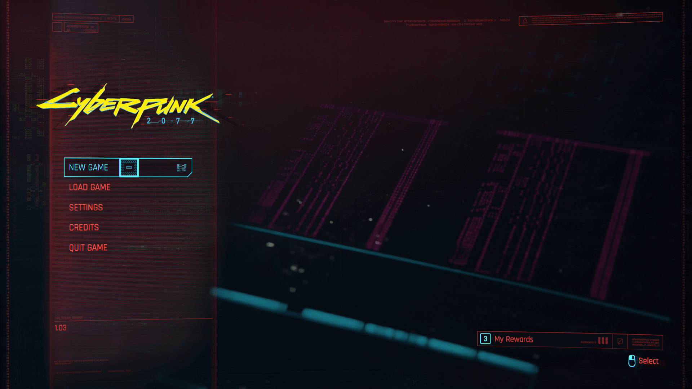
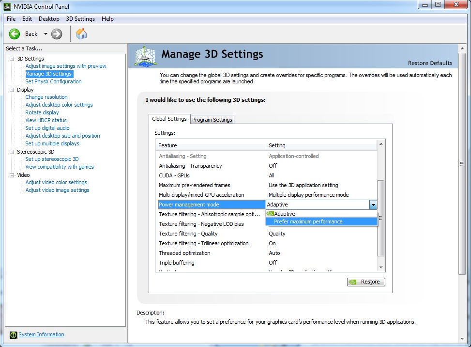
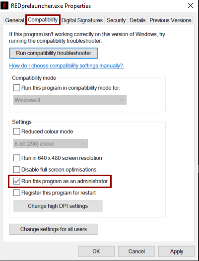
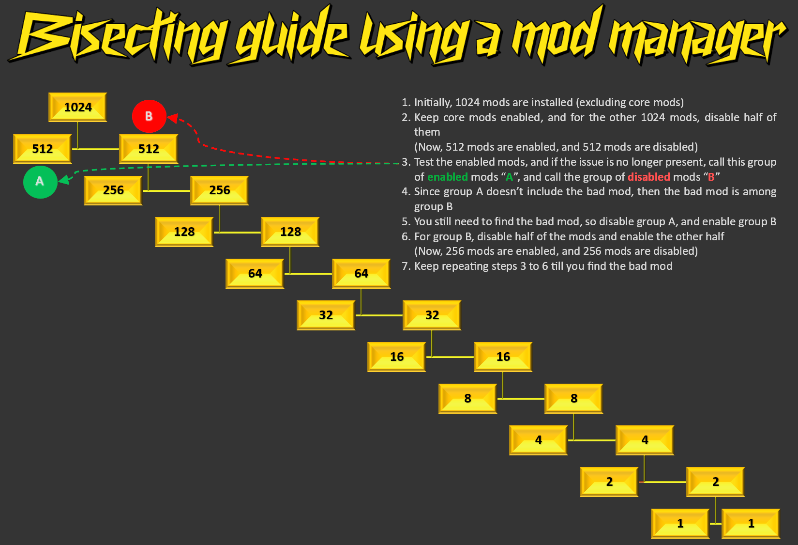
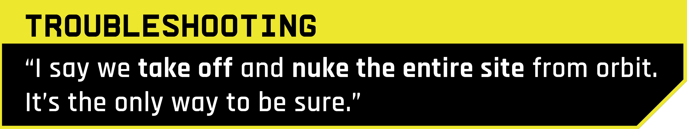
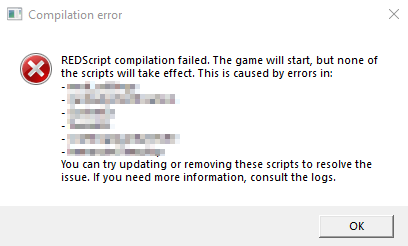

# Troubleshooting

## Troubleshooting

### Summary

Last documented update: 27th August 2025 by [icxrus](https://app.gitbook.com/u/R7jBoGTs0NQ60YSE39s5jrdLiei2 "mention")

This page contains troubleshooting information for people who are **using** mods rather than making mods. You will find step-by-step guides, grouped by different problems.


Did you know? You can use your browser's search function (Ctrl+F) to quickly find your problem on the page – simply type a word from your error message.


### Interactive guide

[Open it in a new window](https://wolvenkit.github.io/gitbook-debug-guide/)



### Navigation


Before you start debugging, make sure that

* your **graphics driver** is up-to-date
* your [**Windows**](https://support.microsoft.com/en-us/windows/get-the-latest-windows-update-7d20e88c-0568-483a-37bc-c3885390d212) is up-to-date (no, _really_) and that you are at least on Windows 10
* you have the most recent version of [.NET Desktop Runtime](https://dotnet.microsoft.com/en-us/download/dotnet/thank-you/runtime-desktop-7.0.3-windows-x64-installer) installed
* you have [Visual C++ Redistributable 2022](https://learn.microsoft.com/en-us/cpp/windows/latest-supported-vc-redist?view=msvc-170) installed ([direct download](https://aka.ms/vs/17/release/vc_redist.x64.exe), Microsoft)
* your game is running from an SSD (Solid State Disk) rather than a HDD



Before you start debugging, **update your mods** and make sure that **all dependencies** have the latest version, in particular the [core mods](../../for-mod-creators-theory/core-mods-explained/) ([Redscript](https://github.com/jac3km4/redscript/releases/), [Red4ext](https://github.com/WopsS/RED4ext/releases), [Cyber Engine Tweaks](https://github.com/yamashi/CyberEngineTweaks/releases), [ArchiveXL](https://github.com/psiberx/cp2077-archive-xl/releases/) and [TweakXL](https://github.com/psiberx/cp2077-tweak-xl/releases/)).

If you are on RED4Ext >= 1.13, make sure to **uninstall** cybercmd!

\
Find a download-ready collection for Vortex [here](https://next.nexusmods.com/cyberpunk2077/collections/r1flnc?tab=Mods).


This section aims to give you a quick overview. If your exact problem isn't listed here, please **look through the different sections** below and try anything that looks promising.

* [I don't wanna debug, I just want mods!](./#i-really-just-want-to-get-this-working-what-do-i-do)
* [There was a game update and now your mods aren't working](users-troubleshooting-after-a-game-update.md)
* [Your game is crashing](./#your-game-is-crashing)
  * [During a quest in a car chase](./#during-car-chases)
  * [it's not even starting](./#crash-on-startup)
    * [Corrupt or missing script files](./#corrupt-or-missing-script-files)
    * [Corrupted archives](./#corrupted-archives)
    * [before the menu](./#crash-before-menu)
    * [when loading a save / starting a game](./#crash-on-loading-a-save)
    * [randomly during gameplay](./#crash-during-the-game)
* [Redscript Compilation Failed (Popup message)](./#redscript-compilation-failed)
* [Your quests are broken or you get LocKey# messages](./#your-quests-are-not-working-you-get-lockey-messages)
* [You're on Linux](../users-modding-cyberpunk-2077/modding-on-linux.md)
* [You have trouble with your pirated game](./#you-pirated-the-game)
* [Photomode screenshots are borked](./#photomode-screenshots-are-blank)
* [Press \[none\] to continue / can't skip loading screen](./#press-none-to-continue-cant-skip-loading-screen)
* [You have audio issues](./#audio-problems)
* [You have trouble with CET (Cyber Engine Tweaks)](https://app.gitbook.com/s/-MP5jWcLZLbbbzO-_ua1-887967055/getting-started/installing/troubleshooting)
  * [CET is not starting](./#cet-isnt-starting)
  * [You forgot your CET keybind](./#you-forgot-your-cet-keybind)
* [XML Document parsed with errors](./#xml-document-parsed-with-errors)
* [You're naked](./#im-naked)
* [Your eyes are black](./#v-has-black-eyes)
* [You installed a mod, but it's not doing anything](./#mod-s-arent-loading-triggering)
* A mod is causing problems, and you have no idea which:
  * [Known problem children](./#finding-the-broken-mod-known-problem-children)
  * [Well-known outdated mods](./#well-known-outdated-mods)
  * Searching: [Bisect](./#finding-the-broken-mod-bisecting)
  * Searching: [Log files](finding-and-reading-log-files.md)
* [Something with files or ACCESS\_VIOLATION](./#something-something-files)
* [Deleting user settings](./#deleting-user-settings)
* [This is a waste of time, I'm reinstalling](./#the-nuclear-option-a-clean-install)
  * [Modding a clean install](./#a-fresh-install-starting-from-scratch)


To enable REDmods, check [#activating-mods](../users-modding-cyberpunk-2077/redmod/usage.md#activating-mods "mention") (you need to [install REDMod](../users-modding-cyberpunk-2077/redmod/#installation) first)


### Your game is crashing

#### Randomly, and you have an Intel i7 or i9

Check [this forum post](https://forums.cdprojektred.com/index.php?threads/possible-reasons-for-crashing-on-intel-i7-i9-z790-motherboard-set-ups.11129974/). If that doesn't help, read on.

#### During car chases

If your game is crashing during certain car chase missions, try removing [Eye Exposure Adaption](https://www.nexusmods.com/cyberpunk2077/mods/2375).

<figure><figcaption></figcaption></figure>

If you can't play because the game is crashing, this section will help you find the right troubleshooting steps in the rest of the guide.

* If you're done with this shit and would rather reinstall, see [#the-nuclear-option-a-clean-install](./#the-nuclear-option-a-clean-install "mention")

#### Crash on startup

If you're trying to start your game, but it never even launches, this is the right section for you. Otherwise:

* If the game crashes before you make it to the menu, see [#crash-before-menu](./#crash-before-menu "mention")
* If the game crashes when you're trying to load a save, see [#crash-on-loading-a-save](./#crash-on-loading-a-save "mention")

**Cyberpunk has flatlined**

Check the section [#cyberpunk-has-flatlined](./#cyberpunk-has-flatlined "mention") below.

**ValidateScripts.cpp:42**

Empty your cache, check the info box under[#redscript-red4ext](./#redscript-red4ext "mention").

**Red4ext.SDK: Failed to resolve address for hash 0x1817231d**

You need to **update the game** and RED4ext

**Red4ext: A dynamic link library (DLL) initialization routine failed**

You need to install the **VisualC Redistributables**. Check the red box under [#navigation](./#navigation "mention") for a download link.

**Something about files or permissions**

If you think that your error is file-related, you can check the section "[Something something files](./#something-something-files)" or use your browser's search function (`Ctrl+F`) to search this page for your error.

**Some other error**

Your problem lies with either red4ext or redscript. You can find what to do under [#redscript-red4ext](./#redscript-red4ext "mention")

#### Crash before menu

If you're starting the game, but never make it to the in-game menu, this is the right section for you.\
Otherwise:

* If the game never even starts, see [#crash-on-startup](./#crash-on-startup "mention")
* If the game crashes when you're trying to load a save, see [#crash-on-loading-a-save](./#crash-on-loading-a-save "mention")

**Something with Watchdog**

Check [#watchdog-timeout](./#watchdog-timeout "mention")

**2.0 / PL: Missing tweakdb.bin or inaccessible memory**

```
Cyberpunk 2077 encountered an error caused by a corrupted or missing TweakDB file and will now be forced to close
```

If you run into the error above, or if the game complains about attempting to read inaccessible memory, do this:

1. Go to your [Cyberpunk game directory](../users-modding-cyberpunk-2077/the-cyberpunk-2077-game-directory/) and find the folder`r6\cache`.
2. Find the file`tweakDB.bin` and copy it (`Ctrl+C`)
3. `In r6\cache`, browse to the folder `modded` (create it if it doesn't exist)
4. paste `tweakDB.bin` here (`Ctrl+V`)
5. If asked to overwrite, select `Yes`
6. If you have Phantom Liberty, repeat the process with `tweakdb_ep1.bin`

**If that doesn't fix it**

Your problem most likely related to **Cyber Engine Tweaks**. To find out how to troubleshoot it, check the "[disable CET](./#step-2-disable-cet)" section.

#### Cyberpunk has flatlined

See [#crash-before-menu](./#crash-before-menu "mention")

#### Crash on loading a save

If you can make it to the menu but crash out when you're loading a save or starting a new game, this is the right section for you.\
Otherwise:

* If the game never even starts, see [commands](../users-modding-cyberpunk-2077/redmod/commands/ "mention")
* If the game crashes before you make it to the menu, see [#crash-before-menu](./#crash-before-menu "mention")
* If you can start a new game without crashing, see [#corrupt-ish-saves](./#corrupt-ish-saves "mention")

Most likely, you have an issue with an .archive mod. Here's what you can do:

1. To rule out that it's a save game problem (those are extremely rare), start a new game.
2. Go to the [bisect](./#go-bisect) section and start with the first two entries on the list

If that doesn't solve your problem, or if the issue is save-game related, feel free to browse around some more.

#### Corrupt(ish) saves


You only need to read this if you can start a new game without mods, but crash on loading a previous save game. For any other problem, please see the corresponding section(s).


Some mods store data in save files. Removing those mods **may** (but doesn't have to) lead to your save game crashing **until you install them again**.

At the current time (05/2025, before PL), that has been confirmed to affect mods that add new weather states, and [Immersive Rippers](https://www.nexusmods.com/cyberpunk2077/mods/7064?tab=posts).

* Weather mods: If the mod adds new weathers, and one of those is active in your save game, the game will try to set the weather to `{this does not exist}` . Trying to access things that don't exist will cause a crash.\
  Known offenders (this is not a complete list):
  * [Enhanced Weather](https://www.nexusmods.com/cyberpunk2077/mods/3901)
  * [Nova City 2](https://www.nexusmods.com/cyberpunk2077/mods/12490)
* [Immersive Rippers](https://www.nexusmods.com/cyberpunk2077/mods/7064?tab=posts) - see the expandable list below for uninstall instructions, or check the mod's pinned post on Nexus

<details>

<summary>Uninstalling Immersive Rippers</summary>

`Error reason: Unhandled exception Expression: EXCEPTION_ACCESS_VIOLATION (0xC0000005) Message: The thread attempted to read inaccessible data at 0x10. File: <Unknown>(0)`

1. Run [mod remover](https://www.nexusmods.com/cyberpunk2077/mods/8597?tab=description) (Usage instructions are on the modpage itself)
2. Downgrade your game to [1.63\_hotfix\_1](../users-modding-cyberpunk-2077/users-downgrading-preventing-auto-updates.md)
3. Install [Immersive Rippers](https://www.nexusmods.com/cyberpunk2077/mods/7064?tab=files\&file_id=47612) and all of its dependencies and all of **their** dependencies
4. Load into your previously-crashing save
5. Move at least 100m away from the closest ripper
6. Copy the following commands and run them in the CET-Console:

```
Game.GetQuestsSystem():SetFactStr("bls_ina_se1_ripperdoc_01_default_on", 0);
Game.GetQuestsSystem():SetFactStr("cct_dtn_ripdoc_01_default_on", 0);
Game.GetQuestsSystem():SetFactStr("hey_spr_ripperdoc_01_default_on", 0);
Game.GetQuestsSystem():SetFactStr("pac_wwd_ripdoc_01_default_on", 0);
Game.GetQuestsSystem():SetFactStr("std_arr_ripperdoc_01_default_on", 0);
Game.GetQuestsSystem():SetFactStr("std_rcr_ripperdoc_01_default_on", 0);
Game.GetQuestsSystem():SetFactStr("wat_kab_ripperdoc_01_default_on", 0);
Game.GetQuestsSystem():SetFactStr("wat_kab_ripperdoc_03_default_on", 0);
Game.GetQuestsSystem():SetFactStr("wat_nid_ripperdoc_01_default_on", 0);
Game.GetQuestsSystem():SetFactStr("wbr_hil_ripdoc_01_default_on", 0);
Game.GetQuestsSystem():SetFactStr("wbr_jpn_ripdoc_01_default_on", 0);
Game.GetQuestsSystem():SetFactStr("wbr_jpn_ripdoc_02_default_on", 0);
```

7. Save your game in a new slot and close it
8. Remove Immersive Rippers .archive file("Cyberpunk 2077\archive\pc\mod\ImmersiveRippers.archive")
9. Load into your new save and and run the following CET-Commands to restore the rippers' default behaviour:

```
Game.GetQuestsSystem():SetFactStr("bls_ina_se1_ripperdoc_01_default_on", 1);
Game.GetQuestsSystem():SetFactStr("cct_dtn_ripdoc_01_default_on", 1);
Game.GetQuestsSystem():SetFactStr("hey_spr_ripperdoc_01_default_on", 1);
Game.GetQuestsSystem():SetFactStr("pac_wwd_ripdoc_01_default_on", 1);
Game.GetQuestsSystem():SetFactStr("std_arr_ripperdoc_01_default_on", 1);
Game.GetQuestsSystem():SetFactStr("std_rcr_ripperdoc_01_default_on", 1);
Game.GetQuestsSystem():SetFactStr("wat_kab_ripperdoc_01_default_on", 1);
Game.GetQuestsSystem():SetFactStr("wat_kab_ripperdoc_03_default_on", 1);
Game.GetQuestsSystem():SetFactStr("wat_nid_ripperdoc_01_default_on", 1);
Game.GetQuestsSystem():SetFactStr("wbr_hil_ripdoc_01_default_on", 1);
Game.GetQuestsSystem():SetFactStr("wbr_jpn_ripdoc_01_default_on", 1);
Game.GetQuestsSystem():SetFactStr("wbr_jpn_ripdoc_02_default_on", 1);
```

10. Save your game again and remove all mods used in version 1.63
11. OPTIONAL: Load the save in vanilla 1.63, it should work there too.
12. Download the newest version of Cyberpunk2077!\
    The clean created save should work for vanilla and modded instances of the game.

</details>


If you are experiencing this issue with a mod that is not on this list, please check [Broken mods: How to help](broken-mods-how-to-help.md)


#### Crash during the game

This section tells you how to deal with crashes during gameplay.

**When editing the inventory**

Kiroshi Crowd Scanner and Tooltip Fixer do not play together ([source](https://discord.com/channels/717692382849663036/788213273530335233/1152601434299301989), discord). Uninstall one of them.

**Somewhere in Japantown**

Somewhere in Japantown is a mesh with a broken material. [Material and Texture Override](https://www.nexusmods.com/cyberpunk2077/mods/5266) removes the cache, and thus forces the game to re-create this material, and causes the game to crash.

Many mods list MTO as a dependency, but it's usually optional and you only need it to force-apply changes to original game materials.

**If you can make it crash reliably**

You're lucky, because it means that you can systematically troubleshoot. Go to the [bisect](./#finding-the-broken-mod-bisecting) section; start with .archive mods, but if that doesn't fix it, do the other folders as well.

**If you can't**

… that puts you in the same boat as the rest of us: most veteran players live with occasional crashes, especially while tabbing out and back in under certain circumstances.

That being said, if the crashes exceed what you're willing to live with, you'll have to find out a way to improve it, but your options are thin on the ground. Depending on how long it takes for the crash to occur, you might try

* resetting your game [to a clean state](./#is-there-a-shortcut) (if the error persists, it's not mods)
* [temporarily disabling](./#step-1-temporarily-disable-all-your-mods) certain types of mod to home in on the cause (see the [bisect section](./#go-bisect) for an overviev)

Best of luck!

### Watchdog Timeout

Your red4ext.log has an error message like this:

```
[error] File: E:\R6.Release\dev\src\common\engine\src\engineWatchdog.cpp
[error] Message: Watchdog timeout! (120 seconds)
```

This can happen [#in-photo-mode](./#in-photo-mode "mention") or [#on-game-start](./#on-game-start "mention")

<details>

<summary>What is the watchdog?</summary>

A **watchdog** is a background process (daemon!) to keep an eye up for crashes. If the application it's watching hasn't responded after time interval X, the watchdog will assume that it died, and cause a crash. This prevents quiet crashes in the background.

</details>

#### In photo mode

Sorry to tell you, but your GPU just isn't up to the screenshot. Try scaling things down.

**Increase the timeout**

If you are dead-set on that photo, you can try increasing the watchdog timeout to give the game more time to render. Open the following file with a text editor (create it if it doesn't exist):

```
Cyberpunk 2077\engine\config\platform\pc\user.ini
```

... and add the following lines ([original source](https://forums.cdprojektred.com/index.php?threads/cyberpunk-2077-pc-crash-issues.11040656/page-99#post-12377786)):

```ini
[Engine/Watchdog]
ActiveIfDebuggerPresent = true
ActiveIfDialogBlocking = false
ActiveIfScriptBreakpointBlocking = false
DumpJobExecutionContext = true
Enabled = false
KillProcess = false
ThreadFrequencyHz = 15
TimeoutSeconds = 604800
```

This will set the timeout to something over 2 hours, and should hopefully be long enough to render that screenshot for you.

#### On game start

First, **check your antivirus**. Make sure that you have an exception for the [Cyberpunk 2077 game directory](../users-modding-cyberpunk-2077/the-cyberpunk-2077-game-directory/) (guide on [rackspace](https://docs.rackspace.com/docs/set-windows-defender-folder-exclusions)).

If that's not it, **check the last loaded plugin**.

Scroll up and check the last line saying `Loading plugin from` .

* [ ] Is that mod up-to-date?
* [ ] Try disabling it - does that make the error go away?

### Corrupt or missing script files

> Cyberpunk 2077 encountered an error caused by a corrupt or missing script file and will now be forced to close. Please verify...

You have an error with [#redscript-red4ext](./#redscript-red4ext "mention"). Please see the next section.

### redscript / RED4ext

<figure><figcaption></figcaption></figure>

When your game doesn't even start up, either of these frameworks isn't working properly.


The first step whenever you run into this error is deleting the folder `r6/cache` and verifying your game files. If that doesn't help, keep reading.


Below, you can find a list of the most common error messages with steps to resolve them.


If you are using RED4ext, uninstall cybercmd.


If you're sure that you don't have cybercmd, it's time for more detailed troubleshooting:

1. If you are on Linux, make sure to double-check the [launch options](../users-modding-cyberpunk-2077/modding-on-linux.md), as Steam sometimes resets these between updates
2. If your game stops crashing when you disable red4ext, that points to an error with a [dependent mod](#user-content-fn-1)[^1]. Make sure that your error is related to red4ext before you proceed!
3. Find the folder `Cyberpunk 2077/red4ext/log` and check for a file named `red4ext.log`.\
   Does it exist?
   * No: RED4Ext is not installed correctly. Make sure that you fix this before troubleshooting further.
   * Yes: look inside, it will tell you which mods aren't compatible with the current game patch and may be the cause of this issue
4. if that doesn't help, go to [#3.-reset-redscript](./#3.-reset-redscript "mention") in the corresponding section (you will need to verify your game files).

If that doesn't solve your problem, you can

* [troubleshoot](./#0.-make-sure-that-you-dont-have-multiple-versions-of-codeware-installed) or [reset](./#3.-reset-redscript) redscript
* the faster variant: [temporarily disable all mods](./#step-1-temporarily-disable-all-your-mods) and reinstall the core frameworks

#### Corrupted archives

> Cyberpunk 2077 encountered an error caused by corrupted or missing archives and and will now be forced to close. Please verify...

One of the .archive files in your folder is broken. To find out which one, try the [bisect](./#finding-the-broken-mod-bisecting) approach, starting with the first two folders.

***

### Help! 2.3 broke everything!


Patch 2.3 changed a lot with the new Autodrive feature, as well as changing audio files. This section may not list _every_ mo&#x64;_,_ but it'll help by listing similar ones.


#### **My menu doesn’t work properly! It’s all blank!**

When you first load into your game after updating to 2.3, you will be asked to agree to the new EULA. If this pop-up and/or your main menu have no text on them, don't worry. It's a known issue. You can fix it by doing the following:

1. Uninstall _any_ mods that alter the main menu or HUD.
2. Open your game and accept the EULA
3. Close your game
4. Now what?
   * If your issue was a main menu mod, you should be safe to reinstall your mod. Lucky you!
   * If your issue was a HUD mod, you _should_ also be safe to reinstall your mod.


Some users have reported further issues when loading a save after reinstalling HUD mods. Hey, at least you know a potential culprit!


<figure><figcaption><p>Your main menu should look something like this now!</p></figcaption></figure>

#### **My sound cuts out in the main menu and doesn't come back!**

Any audio mod you may have will be effected by some of the changes made in 2.3. The damage ranges from no audio after a few seconds, all the way to CTD.


Until your audio mod(s) are updated, you should remove them from your game and patiently wait for your beloved modders to update them.


#### **My game crashes when I get into my vehicle**

There have been a few different types of mods reported to cause this, so unfortunately there isn't an easy mod to point to this time. Here's some that are confirmed to cause issues:

1. Anything related to the **camera**, such as Third Person Perspective or Immersive First Person.
2. **Animation mods.** Unfortunately that's as specific as we can really get. If you have a mod that alters V's animations in game (and not in PhotoMode), this could be your answer.
3. Gore mods. Strange, but it happens. Update them all.
4. Specifically the _**Tempus BR-12 Gauge**_ mod has confirmed to cause crashes upon entering a vehicle, but this seems to be the only weapon mod.

**I don't have any of these mods!**\
First, double check. It may be a mod that isn't obviously named after what it does. If it has a chance of altering animations, the camera during gameplay, or anything adjacent to this, chances are it will need an update.\
\
If you're 100% sure you don't have any of these, it's [bisecting time](./#finding-the-broken-mod-bisecting). Aren't you lucky! When you manage to find the culprit, consider letting us know on the [modding discord](https://discord.gg/redmodding) in `#mod-troubleshooting` so we can look out for it as more people update their games.

<figure><figcaption><p>Now you can get back to real driving.</p></figcaption></figure>

### The game isn't starting: other reasons

<figure><figcaption></figcaption></figure>

There are various non-mod-related reasons why the game couldn't be starting. If you have followed these steps and they haven't gotten you anywhere, check the errors in this section:

* [Too many mods](./#too-many-mods)
* [Message: Failed to initialize scripts data!](./#failed-to-initialize-script-data)
* [Steam file verification loop](./#steam-verify-file-integrity-loop)

Other than that, there are general troubleshooting steps, because **missing Windows stuff can make Cyberpunk go brr**. Make sure that

* your graphics driver is up-to-date
* you have the most recent version of [.NET Desktop Runtime](https://dotnet.microsoft.com/en-us/download/dotnet/thank-you/runtime-desktop-7.0.3-windows-x64-installer) installed
* you have [Visual C++ Redistributable 2022](https://learn.microsoft.com/en-us/cpp/windows/latest-supported-vc-redist?view=msvc-170) installed ([direct download](https://aka.ms/vs/17/release/vc_redist.x64.exe), Microsoft)

Also, try starting the game **without Reshade** to rule it out as a source of crashes (this happened after the DLSS patch) and **temporarily disable your antivirus**.

If none of that helps, find us on [Discord](https://discord.gg/redmodding) in #mod-troubleshooting.

#### Too many mods

There is such a thing as too many mods which are making the game crash. This number seems pretty random, but generally doesn't start below \~460.

To fix this, you need to disable analysis in the settings:

<figure><figcaption></figcaption></figure>

#### Failed to initialize script data

This is not a Cyberpunk error!

```
Message: Failed to initialize scripts data!
File: E:\R6.Release\dev\src\common\engine\src\baseEngineInit.cpp(1019)
```

Check your NVidia Control Panel panel. If power saving options are enabled, turn them off:

<figure><figcaption></figcaption></figure>

If you don't, check for other power config options in your operating system.

#### Steam: verify file integrity loop

The error below is partial to Steam:

```
Cyberpunk 2077 encountered an error caused by corrupted or incomplete game data
```

There are three potential fixes:

* [Run as admin](./#run-as-admin)
* [Run without antivirus](./#run-without-antivirus)

Workaround suggested by CDPR:

* Set Power Limit (TJ max) for CPU to 150W
* Reduce Long and Short Duration Package Power Limit to 150 W (Intel default is 253)
* Set the maximum CPU Core Temperature to 98°
* Reduce the P-Core ratio of the processor
* Deactivate Turbo Boost of the CPU
* Disable CPU Hyper-Threading

Or check Reddit:

* [Downclock your processor](https://www.reddit.com/r/cyberpunkgame/comments/16pluqw/comment/k2f1wwh/?utm_source=share\&utm_medium=web2x\&context=3) (via reddit, do so **at own risk**)

**Run as admin**

Before trying to implement any of the other solutions, configure the `REDprelauncher.exe` in the [Cyberpunk root directory](#user-content-fn-2)[^2] to always run as administrator.

* Right-click on the file and select `Properties`
* Switch to the `Compatibility` tab
* Check the box `Run this program as an administrator`

<figure><figcaption></figcaption></figure>

**Run without antivirus**

The second reason might be that your antivirus fucks with your game files in a way that the game can't cope with.

Try the following steps:

* Turn off your antivirus and your firewall - anything that counts as "System Protection".
  * Yes, that includes Windows Defender
  * Yes, all of it. That includes your computer's bodyguard if it has one.
* Now, start the game.
* If the error persists, verify game files through your client (you won't catch any viruses doing that)
* Start the game again

If it works now, you need to find out how to keep your antivirus away from your game directory. If it doesn't, then you can turn the stuff back on now.

### You pirated the game

<figure><figcaption><p>Creative Commons, Credit: <a href="https://unsplash.com/photos/WV9yGVpEAz8">Tom Briskey</a></p></figcaption></figure>

There's a chance of >95% that we have already found the source of your problems — **pirated copies just don't mod well**. That's the first reason why things won't work.

The second reason is that CDPR needs to earn money to pay people to make games for us. If you can at all afford it, **please buy the game**. It's a good deal: how much are you willing to spend for a movie ticket? How long does a movie keep you entertained?

You are, of course, welcome to peruse the troubleshooting guide. It might even help you. But know that pirated copies will never be explicitly supported.

### Finding the broken mod: known problem children

<figure><figcaption></figcaption></figure>

#### Stuff that isn't mods

It doesn't **have** to be either of these. But if it is, you'll never find it with the rest of the list. Rule it out by deactivating them while you're debugging.

* **Antivirus**
* **ReShade**


If you can start a new game without mods, but can't load an existing save, see[#corrupt-ish-saves](./#corrupt-ish-saves "mention").


#### Frameworks / Core Mods

These mods are not problem children – quite the opposite. But if they are outdated, either your game or your mods won't work. Make sure that you [have them all up-to-date](./#step-7-install-the-core-frameworks) with the most recent game version.

#### Script mods

Some mods go far beyond the ordinary, adding whole new features to the game (why no flying cars, CDPR?). Unfortunately, that means they're more prone to breaking than others. Here's a non-comprehensive list.


Being on this list does not mean that a mod is "bad" or that you shouldn't use it – they break much for the same reason as the frameworks do, and are fixed in the same way (the modder has to update). Until that happens, you will have to **disable** them.


[**In-World Navigation**](https://www.nexusmods.com/cyberpunk2077/mods/4583)

Displays in-world holographic arrows that direct you towards your quest objectives. Is very likely to break upon patches.

[**Vehicle Combat**](https://www.nexusmods.com/cyberpunk2077/mods/3815)

Adds car chases and a bunch of related features. While CP2077 needs more car chases and explosions, this usually breaks and will require an update.

[**Mod Settings**](https://www.nexusmods.com/cyberpunk2077/mods/4885)

Adds mod settings to the in-game menu – Redscript version. This needs to be updated after **every** game patch.

[**Native Settings UI**](https://www.nexusmods.com/cyberpunk2077/mods/3518)

Adds mod settings to the in-game menu – CET version. The mod itself will be fine, but it's dependent on [Cyber Engine Tweaks](https://www.nexusmods.com/cyberpunk2077/mods/107) being up-to-date.

#### Well-known outdated mods

The below mods will no longer work on versions beyond 2.0/2.1 and in some cases can completely break your save. If you have any of these, _remove them_.

[Let There Be Flight](https://www.nexusmods.com/cyberpunk2077/mods/5208)

Adds flying cars to Cyberpunk. While this is awesome, it will **absolutely** break whenever CDPR changes anything, and requires updating. It has been broken for a long time as of patch 2.02 and later and will not work.

[**CTD Helper**](https://www.nexusmods.com/cyberpunk2077/mods/5205)

Replaces the default crash logs with actual usable logs instead. This needs to be updated after **every** game patch. It has been broken for a long time as of patch 2.02 and later and will not work.

[**Respector**](https://www.nexusmods.com/cyberpunk2077/mods/1263)

Effectively an in-game save editor that can give you a lot of items and even create a new game plus method. This mod has stopped working since 2.0 and while it will be updated in the future, in the mean time mods like [Simple Menu (CET)](https://www.nexusmods.com/cyberpunk2077/mods/818) and [Pseudo New Game Plus](https://www.nexusmods.com/cyberpunk2077/mods/5144) can be used.

[**NPCs Gone Wild**](https://www.nexusmods.com/cyberpunk2077/mods/1436) **(NSFW)**

Makes multiple NPCs nude. In all versions since 2.0, this causes missing characters, missing body parts, exploding limbs, and other issues. Do not use the mod, there is a [Naked NPCs collection ](https://next.nexusmods.com/cyberpunk2077/collections/sao1yq)by modder marnhorn that does the same thing and will work on current game versions.

<mark style="color:blue;">**Phone Messages Overhaul**</mark>**&#x20;(PMO) and&#x20;**<mark style="color:blue;">**8ug8ear Romance**</mark>**&#x20;(standalone)**

These mods change the game journal that controls all quests to add more romance options. This method only works on the patch it's made for and therefore they will not work on version 2.1 and later.\
Other mods that do the same thing, but in a compatible way, are [Panam Romance Enhanced](https://www.nexusmods.com/cyberpunk2077/mods/4626) and Judy Romance Enhanced, which use ArchiveXL (the safe method).

[**Biosculpted Exotics**](https://www.nexusmods.com/cyberpunk2077/mods/9797)

This mod adds furry, animal-like NPCs to the game and optionally replaces main characters. While lore accurate to a point, the mod is made in the same way as PMO and therefore breaks quests in 2.1 and later.

[**Eye Adaptation Auto Exposure Fix - Vanilla Native Weather Option - Complete Overhaul - No More Blinding Lighting and Slower Bloom Gamma Changes - Optional SHARPENING OFF and VIGNETTE OFF**](https://www.nexusmods.com/cyberpunk2077/mods/2375)

This mod hasn't been updated since v1.63, and the game has made significant breaking changes that cause this mod to crash to desktop (CTD).

#### spawn0

Most famous for edits of the female body that defy gravity and wreak havoc on V's spinal disks, this modder has been around since the early days, and the same is true for their mods.

However, modding has come a long way since then, and spawn0 never followed. For that reason, their mods are known to have compatibility issues with pretty much everything in the general vicinity.

On the bright side, their mods ~~won't crash your game and~~ are downwards compatible until the dawn of time. With Phantom Liberty, sp0 mods have been known to cause crashes to desktop near the dam.

### Finding the broken mod (log files)

<figure><figcaption></figcaption></figure>


Bad news: The game's logs are usually less helpful than the Swiss navy.\
Good news: Mods are doing a far better job.\
Bad news again: You have to find the right log file in the game directory.\
Good news again: There's intel how (see below)

jackhumbert's mod [ctdhelper](https://www.nexusmods.com/cyberpunk2077/mods/5205) will give you additional information. There is a chance that it shows you something helpful. Make sure the ctdhelper is updated before using it, though.


If you don't want to download and run script files from the internet, you can go and [#step-1-temporarily-disable-all-your-mods](./#step-1-temporarily-disable-all-your-mods "mention") by hand. Otherwise:

1. Download [this script](https://raw.githubusercontent.com/DoctorPresto/Cyberpunk-Helper-Scripts/main/FindAllErrors.bat) (**right-click -> save as**)\
   \&#xNAN;_Link goes to Presto's_ [_github repository_](https://github.com/DoctorPresto/Cyberpunk-Helper-Scripts/blob/main/FindAllErrors.bat)
2. Now, do either of the following things:
   1. Move it to your Cyberpunk install folder and double-click it
   2. Drag-and drop your Cyberpunk folder on the file that you downloaded
3. After running, the script will have created a folder `_LOGS` in your [Cyberpunk game directory](../users-modding-cyberpunk-2077/the-cyberpunk-2077-game-directory/), which contains a file listing all the log files for you.

The list will give you useful information along with a list of files to check. Once you've found the broken mod, you can go [here](./#dealing-with-a-broken-mod) for instructions on how to troubleshoot further – they also tell you when you should ask for help!

### Finding the broken mod (bisecting)

<figure><figcaption></figcaption></figure>

You have hundreds of mods, and one of them is broken. How do you find out which one it is without wasting the entire day?


Don't worry! As long as you have less than 2048 mods, bisection lets you find the problem child with only 10 rounds. (Otherwise, it's 11)


Some mods install themselves to multiple directories, but **that doesn't matter**. Due to the fact how mod loading works, you can find the error like this.


**Mod managers**

If you are using Vortex, you should enable and disable mods through Vortex rather than directly on disk. The principle below still works, you're just selecting the halves inside Vortex instead of moving them between directories. For more clarification, check out the [Bisect with a mod manager](./#bisect-with-a-mod-manager) section. MO2 also follows the same process.\
\
If you do opt to work directly on disk, **do not save changes to files if Vortex prompts for it**.


#### Which kind of mod is it?


If you already know which folder contains the broken mod, [skip to the next section](./#go-bisect).

You can find a video of the process [below](./#bisect-video-demonstration).


To find out the **type** of broken mod, take each `Directory` from the following list and complete the steps in the next paragraph after the table.

<table><thead><tr><th width="249">Kind of mod</th><th width="202">Directory</th><th>explanation</th></tr></thead><tbody><tr><td>.archive</td><td>\<code>mods</code></td><td>Redmod directory: contains .archive mods (in subfolders)</td></tr><tr><td>.archive</td><td>\<code>archive\pc\mod</code></td><td>Legacy directory: contains .archive mods</td></tr><tr><td>.lua (cyber engine tweaks)</td><td>\<code>bin\x64\plugins</code></td><td>Cyber Engine Tweaks</td></tr><tr><td>redscript</td><td><code>\r6\scripts</code></td><td>redscript mods</td></tr><tr><td>red4ext</td><td><code>\r6\tweaks</code></td><td>red4ext tweaks</td></tr></tbody></table>

1. Rename the game data folder ([**game folder**](#user-content-fn-3)[^3] for short – e.g. `archive/pc/mod`) to a [**backup folder**](#user-content-fn-4)[^4] by appending an underscore (e.g. /`mod_`).\
   \&#xNAN;_Only do this with the last subfolder in the path, the result should be `\archive\pc\mod_`, not `archive_\pc_\mod_\.`_
2. The folder is now hidden from the game. Since it doesn't know, it will try to look inside anyway - create a new empty folder with the original name for that (e.g. `/archive/pc/mod).`
3. Start the game. You will now run into one of these two scenarios:
   * **Your problem is gone:** Jackpot. This is the correct folder for [the next section](./#go-bisect): [#go-bisect](./#go-bisect "mention")\
     Before you go there, you can restore all the other folders you moved, deleting the empty directories.
   * **Your problem is still there**: This folder is innocent. Proceed with the next `directory` from the table above.


You can put the innocent folders back if you want: due to the way mods are loading, there won't be side-effects.


#### Go bisect

Congratulations, you have found which folder causes the problem — you're more than halfway there. All that's left is to find the broken mod. Here's how.


The process is the same every time, no matter if you are moving files or folders.



If you don't vibe with text, there's a [#bisect-video-demonstration](./#bisect-video-demonstration "mention") below.


1. Switch on **half** of the mods from your [**backup folder**](#user-content-fn-4)[^4] by moving them back to the [**game folder**](#user-content-fn-3)[^3].
2. Remember (roughly) which batch you moved (e.g. "everything after `E"` or "the first half")
3. Start the game. You will now run into one of two scenarios:
   * **The error is still there:** Progress! Go to Step 5.
   * **The error is gone:** Progress too! Go to step 4
4. **The error is gone:** You have identified which mods **aren't** the problem! Good! Do the following:
   1. In your [**backup folder**](#user-content-fn-4)[^4], find the last batch of mods that you touched
   2. **Half** of these go into the [**game folder**](#user-content-fn-3)[^3]
   3. Go back to step 2 – you should now definitely see the problem again.
5. **The error is still there:** You have narrowed it down, let's narrow it down further.\
   Do the following:
   1. In your [**game folder**](#user-content-fn-3)[^3]**,** find the last batch of mods that you touched
   2. **Half** of these go back into the [**backup folder**](#user-content-fn-4)[^4]
   3. Go back to step 2 for the next round – the problem might be there or not.
6. Repeat this process until you know which mod is causing the crash. Then, you can either try to update it, or do a full uninstall

**Bisect: Video demonstration**



**Bisect with a mod manager**

<figure><figcaption></figcaption></figure>

### Audio problems

If your CPU is too busy, the game will try to save resources by dropping audio, starting with dialogue audio. Disabling spatial audio from the main menu might help:

<figure><figcaption></figcaption></figure>

#### It's not connected to CPU load

Missing footsteps had in the past been connected to a bug in Let [There Be Flight](./#let-there-be-flight), so it is worth debugging your script mods. However, if you're on the most recent version (check the github for previews), you might just have to [bisect](./#finding-the-broken-mod-bisecting) your mods at random.

### Mod(s) aren't loading/triggering

<figure><figcaption></figcaption></figure>


If the mod in question is Cyber Engine Tweaks (CET), check the [corresponding troubleshooting page](https://wiki.redmodding.org/cyber-engine-tweaks/getting-started/installing/troubleshooting).


Normally, a mod should **just work**, as long as all of their requirements are working. If you aren't certain what that means, you can check [requirements-explained.md](requirements-explained.md "mention") for detes, or follow the checklist below ( [#getting-a-mod-to-work](./#getting-a-mod-to-work "mention")).

* Make sure that you have [enabled mods](../users-modding-cyberpunk-2077/redmod/#installation) in your launcher.
* If items or hairs aren't changing, you need to install [cookedapps nulled](https://www.nexusmods.com/cyberpunk2077/mods/8127) (why?)
* If materials aren't updating, you need to install [material override](https://www.nexusmods.com/cyberpunk2077/mods/5266) (why?)
* If you already have all of that, [check the next section](./#only-parts-of-my-mods-are-working).


If you've been using Mod Organizer 2 to install your mods, chances are high that it's been doing it incorrectly, at least for some of the more important mods. You'll need to do additional steps detailed [here](https://github.com/JustThatKing/MO2077/blob/main/readme.md) in order to get MO2 working with Cyberpunk.


#### Getting a mod to work

1. Check that you've **enabled mods** (see [Deploying Mods and Starting Game](../users-modding-cyberpunk-2077/redmod/#installation)).
2. Check the [requirements](requirements-explained.md) on the mod's nexus page. Make sure that you have installed them all and that they are up-to-date.
   * If the requirements list Cyber Engine Tweaks, check its log file under `Cyberpunk 2077\bin\x64\plugins\cyber_engine_tweaks\cyber_engine_tweaks.log`
   * For a more detailed guide, see [requirements-explained.md](requirements-explained.md "mention")
3. Make sure that all of your [core frameworks](./#step-7-install-the-core-frameworks) are up-to-date and starting up correctly (here's how you can [check their log files](finding-and-reading-log-files.md#a-list-of-framework-logfiles))
4. Check the other log files in the game directory ([here's a guide how](finding-and-reading-log-files.md))
5. **Optional**: reach out to us on [Discord](https://discord.gg/redmodding) in #mod-troubleshooting

### Deleting user settings


You almost never need to do this.


However, if you want to remove anything that Cyberpunk might have stored on your disk, you need to find and delete the following folders (as per [CDPR's own troubleshooting guide](https://support.cdprojektred.com/en/cyberpunk/pc/sp-technical/issue/2233/how-do-i-clean-install-my-game):

* `%userprofile%\Saved Games\CD Projekt Red\Cyberpunk 2077`
* `%userprofile%\AppData\Local\REDEngine`
* `%userprofile%\AppData\Local\CD Projekt Red`

You can quickly navigate to the folders by pasting the path into your Windows Explorer's path bar, or pressing Windows+R, pasting the path there, and

### The nuclear option: a clean install

<figure><figcaption></figcaption></figure>


This is the last resort and you do **not** need to do this — run [Mod Remover](https://www.nexusmods.com/cyberpunk2077/mods/8597/) for the same result in less time. However, if you're still set on reinstalling, the instructions below will help you completing that in minimal time.


#### Back it up, baby!


Unless you back them up, your mods will be **lost**. If you don't want that, make backups of the following folders:

* [`/mods`](#user-content-fn-5)[^5]
* [`/archive/pc/mod`](#user-content-fn-6)[^6]
* [`/bin/x64/plugins/cyber_engine_tweaks`](#user-content-fn-7)[^7]
* [`/r6/scripts`](#user-content-fn-8)[^8]
* [`/r6/tweaks`](#user-content-fn-9)[^9]

The [script](./#is-there-a-shortcut) linked above will do that for you.


#### Quick (download <4GB)


Unless you [back up your mods and scripts](./#back-it-up-baby), all your settings and manually installed mods will be lost.



The instructions below tell you which folders **not** to delete. Delete everything else.


1. Go to the Cyberpunk 2077 install directory
2. Delete everything **except for** the folder `archive`
3. Inside `archive`, delete everything **but** the folders `pc`
4. Inside `pc`, delete everything but the folders `content` and `ep1`
5. Verify your files

#### Modular / minimal download (download <1GB


Unless you [back up your mods and scripts](./#back-it-up-baby), all your settings and manually installed mods will be lost.



Will download < 1GB.


Rename or remove the following folders. If you do not have them, you don't need to do anything.

<pre><code>/<a data-footnote-ref href="#user-content-fn-5">mods</a>
/<a data-footnote-ref href="#user-content-fn-10">plugins</a>
<a data-footnote-ref href="#user-content-fn-11">/engine</a>
/r6
<a data-footnote-ref href="#user-content-fn-12">/red4ext</a>
<a data-footnote-ref href="#user-content-fn-13">/archive/pc/mod</a>
<a data-footnote-ref href="#user-content-fn-14">/bin/x64/plugins</a>
</code></pre>

Afterwards, verify your files.

#### Nuke it from the orbit: The thorough version

In case neither of these options is good enough for you, you can find a full reinstall guide on [CDPR's support page](https://support.cdprojektred.com/en/cyberpunk/pc/sp-technical/issue/2233/how-do-i-clean-install-my-game).

### A fresh install: Starting from scratch

<figure><figcaption></figcaption></figure>

You have completed either of the previous steps. Your game should start now. **If it does not**, you either have leftover files (check [here](./#the-nuclear-option-a-clean-install) for how to get rid of them), or you have a problem that is not related to Cyberpunk. Make sure to follow the hints in the red box [at the very beginning of this guide](./#navigation).

Now it's time to **systematically** install mods. We'll start by [installing the frameworks](./#installing-the-frameworks) and making sure that the game starts up without any framework-dependent mods. Afterwards, you can add back all of your mods, and if the game stops working, find the offender via [bisect](./#finding-the-broken-mod-bisecting).


Don't worry about your savegames — those are fine, even if they won't load right now. We're just laying the foundation here that you can later build upon.


Let's go about it step-by-step.

#### Installing the frameworks


This step will tell you how to set up your Cyberpunk install with the necessary dependencies so that you can start modding.


Check the [framework page](../../for-mod-creators-theory/core-mods-explained/). For each of the frameworks, complete the following steps:

* If you didn't have it in your previous install, skip it.
* Install it (manually or via Vortex, your choice)
* Install **all of its** [**dependencies**](requirements-explained.md)
* Start the game and load a savegame (you can also do this after installing all of them, but if you run into issues, that will make isolating the point of failure more difficult).
* Optional (for CET): Start the game and make sure that it asks you to bind a key. If not, check the [corresponding section of this guide.](./#cet)


If you are using redmod (have any folders inside of `/mods`), you probably have [cybercmd](https://www.nexusmods.com/cyberpunk2077/mods/5176) installed. That is no longer necessary with RED4ext >= 1.13 and can lead to false positives. Uninstall it!


Once you are done, start up your game and load a savegame. If you don't have one or the game still crashes, start a new game.

**This should now work**. If it doesn't, you need to check your [log files](./#check-the-log-files) to see which framework is causing trouble, or find us on [Discord](https://discord.gg/redmodding) in #mod-troubleshooting.


You **need** to complete this step before proceeding: if the core frameworks aren't working **without** mods, they won't work **with** mods – adding anything now will just make debugging more difficult.

Fortunately, this is not rocket science. Be methodical and install them one by one. If you need help, you can find us on [Discord](https://discord.gg/redmodding) (`#mod-troubleshooting`)


#### Adding (back) your mods


If you don't (yet) have any mods, you can head over to Nexus and start installing. Make sure that you include all necessary [dependencies](requirements-explained.md)!



This section assumes that

* you installed all required [core mods](./#frameworks-core-mods)
* your game is starting
* you can (without crashing) do either of these things:
  * load a savegame
  * start a new game

If you didn't make it that far, the steps below won't help you and will only obscure your problem. Please head back to [#step-1-temporarily-disable-all-your-mods](./#step-1-temporarily-disable-all-your-mods "mention")and complete the process.

\
If you need help, find us on [Discord](https://discord.gg/redmodding) in `#mod-troubleshooting!`


**If you're using Vortex**

Head directly to the [bisecting](./#finding-the-broken-mod-bisecting) section and pretend you have just removed all your mods.

**If you made a manual backup:**

For each folder that you have [backed up](./#back-it-up-baby) (check link for a list), repeat the following steps:

1. Put it back into its original place in your new/fresh install
2. Start up the game
3. Load a non-modded savegame **or** start a new game

If your crash(es) are back, you can now go to the [bisect](./#go-bisect) section and follow the steps for your folder.

### Something something files

<figure><figcaption></figcaption></figure>

Your error goes something like this:

* ```
  Access is denied
  ```
* ```
  Can't access file 'some/file'
  ```
* ```
  could not move file from 'Path\to\blabla.tmp' to 'Path\to\Cyberpunk 2077\subdir\some.file'
  ```
* ```
  Expression: EXCEPTION_ACCESS_VIOLATION
  ```
* ```
  The thread attempted to read inaccessible data at 0xsomething
  ```
* ```
  An exception occured while creating the logger
  ```
* Cyberpunk is trying to write to a file that doesn't exist

These are caused by **access errors** – Cyberpunk is trying to read or write a file, and for some reason, it can't.

Follow the steps in this section one by one, or find us on [Discord ](https://discord.gg/redmodding)in #mod-troubleshooting.

#### Make sure that the file path exists


Ignore this if you can't spot any file paths in the error message


If Cyberpunk is trying to move files to a subdirectory that it can't access, make sure that the directory actually exists (if it doesn't, create it). The most frequent candidate for this is /`r6/cache/modded`.

#### Make sure that no previous game instance is running

Sometimes, the game instance doesn't shut down properly and is still running in the background, althoguh you can't see a window. This problem goes away after rebooting.

* Open your task manager (Ctrl+Shift+Esc)
* Switch to the **Details** tab
* Sort by Name and scroll to C
* Check if you can see anything **Cyberpunk** in the list.
* If yes, right-click on it and select **End Task**


It is possible that your antivirus is causing this problem. Before you lose your mind, try temporarily disabling it.


#### Reboot your PC

Always a good idea to do that from time to time – in this case, it could make the error go away.

If it doesn't, check the next steps on the list.

#### Make sure that all files in the game directory are writable

Sometimes, files in your [Cyberpunk game directory](#user-content-fn-2)[^2] are set to read-only.

**What kind of monster would do something like that???**

We've had confirmed reports of the following culprits:

* Steam
* mo2 mod manager
* various flavours of antivirus


You can fix this either via [Windows Explorer](./#via-windows-explorer) or via [system console](./#via-system-console), the results will be the same.


**Via system console:**

* Press Windows+R
* type `cmd` and press Return to open the command line
*   run the following command (replace the path with your actual game dir):

    <pre><code>attrib -r "<a data-footnote-ref href="#user-content-fn-2">C:\Path\To\Cyberpunk</a>\*.*" /s
    </code></pre>

**Via Windows Explorer:**

* Navigate to the Cyberpunk game directory and right-click on it
* Select **Properties** (the last entry in the drop-down menu)
* Uncheck the "Read-only" box:


After unchecking and applying changes, the box will jump back to maybe-checked. That's because Windows can't tell if the folder contains read-only files. However, since you just made sure that it doesn't, you can ignore this.


<figure><figcaption></figcaption></figure>

#### File Ownership

Sometimes, file ownership got messed up, and not all files in the folder are accessible by your current Windows account. It is a mystery how this comes to be.

You can fix it via [system console](./#via-commandline) or via [Windows Explorer](./#via-windows-explorer-1); either of those will do. If in doubt, the commandline one is more thorough.

**Via commandline**


In any of the commands below, you need to substitute `C:/Path/to/Cyberpunk2077` with the path to your [game directory](#user-content-fn-2)[^2].


* Press Windows+R
* Type cmd and press return
* Run the following command (make sure to insert your real Cyberpunk path):
* ```
  takeown /R /A /F "C:/Path/to/Cyberpunk2077" /D N
  ```
* If that didn't help, run the command `whoami` to see your current user name. You will need it for the next step.\
  \&#xNAN;_It should be identical to your Windows username, but if you have spaces or special characters, Windows might get funny about the spelling._
* Run the following command (putting your actual game dir and the username from `whoami`):\\
* ```
  icacls "C:/Path/to/Cyberpunk2077" /grant YourUserName:F /T /C
  ```

**Via Windows Explorer**

We haven't included the full instructions here, but you can check [this guide](../users-modding-cyberpunk-2077/users-downgrading-preventing-auto-updates.md).

#### Reboot your PC again

If none of these things has helped, reboot your computer.

**The error should be gone now.**

Not to say that your game will work now – but if you still have an error, it's hopefully a different one. Go back to the start of the guide and let's fix that one too!

### Your quests are not working / You get LocKey# messages

This section tells you how to deal with

* quests that are not starting
* broken text messages
* broken journal entries

#### Quests not starting although you meet all prerequisites

When two mods hook into the same quest to do their thing, this can break the quest.

**Known problem children:**

* Phone Messages Overhaul
* Judy/Panam Romance Messages Extended


These mods can not be used together. PIck either of the entries below!


If it wasn't that, check any other mod that hooks into basegame quests, such as romance mods or "quest fixes".


You can't 'fix' a quest by changing quest facts. Setting a quest fact after you've passed the sequence where it is checked will do nothing — worst case is you will brick your save.


#### Shards, text messages or journal quest just say `LocKey#`

**If you are playing in a language other than English**

This can be caused by mods not including translation files for your language. Check if there is a translated version, or change the game language to English.

**If you are playing in English**

Most likely caused by a mod conflict: two mods are trying to change the same text archive or journal entry. You can use the [Archive Conflict Checker Tool](https://www.nexusmods.com/cyberpunk2077/mods/11126) to find conflicting mods, or check the list below.

**Known problem children:**

* Phone Messages Overhaul (you can resolve this by setting this mod to [load first](../users-modding-cyberpunk-2077/load-order.md))
* Hot Fuzz
* Biosculpted Exotics
* Database Fixes

If none of the mods have suggestions about load order, swap them around and see if it fixes the issue.

### Redscript Compilation Failed

<figure><figcaption></figcaption></figure>

You're running into the following error:

```log
REDScript compilation failed. The game will start, but none of 
the scripts will take effect. This is caused by errors in:
```

<figure><figcaption><p>Your error message</p></figcaption></figure>


This workflow is geared at the exact error above. If you have a different one, it's still worth checking this, but you can also head back [to the start of the guide](./#navigation) and find the right section.


#### 0. Make sure that you don't have multiple versions of [Codeware](https://www.nexusmods.com/cyberpunk2077/mods/7780) installed

In the past, Codeware wasn't a standalone mod, but was instead [**bundled**](#user-content-fn-15)[^15] inside of other mods. Since that is different now, the leftover versions can cause errors.

1. Search your [Cyberpunk game directory](../users-modding-cyberpunk-2077/the-cyberpunk-2077-game-directory/) for `Codeware`.
2. If you have exactly one folder, this is not your problem — proceed to [the next step](./#1.-make-sure-that-you-have-the-latest-versions).
3. Delete everything you have found.
4. Reinstall the latest version of [Codeware](https://www.nexusmods.com/cyberpunk2077/mods/7780) from Nexus.
5. Delete the folder `r6/cache`
6. Verify your game

#### 1. Make sure that you have the latest versions


Actually check this. Do not rely on memory or common sense – if in doubt, re-download. ~~(This is totally not something that the guide's author learned the hard way)~~


1. Check Redscript ([github](https://github.com/jac3km4/redscript/releases/) | [Nexus](https://www.nexusmods.com/cyberpunk2077/mods/1511)) and update it
2. Uninstall cybercmd ([github ](https://github.com/jac3km4/cybercmd/releases)| [Nexus](https://www.nexusmods.com/cyberpunk2077/mods/5176)), if you have it.

**Optional, but recommended:**

Check that you have the latest versions of all troublesome Redmods.

#### 2. Check redscript.log

It is in `r6/log/redscript.log`.

See if you can find any errors – warnings may or may not be a problem, see [here](finding-and-reading-log-files.md#warning) for context.

#### 3. Reset Redscript


If you rename or delete any directories, make sure to create a new, empty directory.


**Redscript: Disable dependent mods**

Vortex: Disable them

Manual: Remove the contents of `r6/scripts/`.


You can zip the directory from the windows context menu, then delete its contents.


**Resetting the redscript cache**

* delete [`r6/cache`](#user-content-fn-16)[^16]
* verify game files
* **Optional:** create a new directory `r6/cache/modded` (this will prevent errors)
* Make sure that `r6/scripts` [is empty](#user-content-fn-17)[^17]
* Make sure that `red4ext/plugins` [is empty](#user-content-fn-18)[^18] (that the red4ext core frameworks aren't getting loaded)


Make sure your game starts up without error.


#### 4. Reinstall your mods

**Hopefully, your problem should be gone now.**

It's time to put your mods back and see if you can start the game - see [Starting from Scratch](./#starting-from-scratch).

### XML Document parsed with errors

`XML document parsed with errors: C:\Path\toCyberpunk 2077\r6/config/inputUserMappings.xml`\
`Error description: Error parsing element attribute`

According to InputLoader's [documentation](https://www.nexusmods.com/cyberpunk2077/mods/4575), you can ignore this. Keep searching!\
(You can also try reinstalling InputLoader and hope that the error goes away)

<figure><figcaption></figcaption></figure>

### CET isn't starting

CET needs **at least** VisualC 14.40.33810.0 . You can download it from the official Microsoft website\
([direct link](https://aka.ms/vs/17/release/vc_redist.x64.exe))

### You forgot your CET keybind

Delete the file `Cyberpunk 2077\bin\x64\plugins\cyber_engine_tweaks\bindings.json.` The game should let you bind a new key at the next startup.


You can find more troubleshooting help for Cyber Engine Tweaks in the [corresponding wiki](https://app.gitbook.com/s/-MP5jWcLZLbbbzO-_ua1-887967055/getting-started/installing/troubleshooting):\
[Cyber Engine Tweaks](https://app.gitbook.com/o/-MP5ijqI11FeeX7c8-N8/s/-MP5jWcLZLbbbzO-_ua1-887967055/ "mention") -> [Troubleshooting](https://app.gitbook.com/s/-MP5jWcLZLbbbzO-_ua1-887967055/getting-started/installing/troubleshooting "mention")


### Photomode screenshots are blank

With 1.62, screenshots are now saved to `Documents\CDPR\Cyberpunk\Screenshots` , and the previous location will receive an empty file.

With 1.63, screenshots have now been moved _back_ to `\Pictures\Cyberpunk 2077`

### Press \[none] to continue / can't skip loading screen

That is due to [Input Loader](https://www.nexusmods.com/cyberpunk2077/mods/4575) requiring an update.

### I'm not getting a metro ticket!

If you have passed the start of Act 2 and you aren't getting a text with a metro ticket because of an outdated mod, there is nothing you can do. Even removing the mod won't fix it. Remove the mod, then play from an earlier save.

### \[Kerry/Judy/Panam/River] isn't talking to me!

This is a new one with 2.1 — a reciprocal effect of CDPR's romance interactions with previous romance or phone message overhauls. The bad news is that the broken state is baked into your savegame and you can't get rid of it by removing your mods. The good news is that modders are already on top of the problem, and simply **updating** should fix your issue.


Make sure to check the instructions and pinned comments on the Nexus for any romance or phone message overhaul mods before running the command below. There's a good chance that you can only use it once for any given save, and you don't want to waste your shot.


You can try running the following command (which has solved the issue for some people):

```
 Game.GetQuestsSystem():SetFactStr("judy_default_on",1)
```

Switch "judy" for the affected NPC's name. Then, save and reload.

Alternatively, you can use [this mod](https://www.nexusmods.com/cyberpunk2077/mods/4508) for Judy (which is supposed to have helped as well).


If that didn't solve your problem, there is a good chance that you're stuck. You can check the Nexus pages and -comments of everything that looks as if it interacted with romance partners or phone messages, but there is a good chance that you missed the point where the interactions should trigger. Check [#im-not-getting-a-metro-ticket](./#im-not-getting-a-metro-ticket "mention") for details.


### I'm naked!

Here's how to fix your sudden indecent exposure.

1. Go to the vanilla wardrobe in your apartment
2. Create an outfit (anything will do)
3. Equip the outfit
4. Un-equip the outfit
5. Save and reload
6. If that doesn't work, check the next section:

### I'm naked in first person perspective! (EquipmentEx)

There is a high change that you're using Equipment-EX, if this applies then try the steps below:

1. Remove all Equipment-EX outfits by typing `EquipmentEx.DeleteAllOutfits()` in CET's console.
2. Save and quit the game
3. Uninstall all files related to Equipment-EX, this can be done by searching for "EquipmentEx" in the game's main directory, then launch the game.
4. You should now no longer be naked.
5. Reinstall EquipmentEx and start creating outfits again.

#### V has black eyes!

You have an **outdated** or **two different** versions of [Kala's Unique Eyes](https://www.nexusmods.com/cyberpunk2077/mods/1937) installed.

Make sure to uninstall all your eye mods, then open your [Cyberpunk game directory](../users-modding-cyberpunk-2077/the-cyberpunk-2077-game-directory/)[ ](../users-modding-cyberpunk-2077/the-cyberpunk-2077-game-directory/)and use the Windows Search for e.g. `kala`. Make sure to delete all leftover files!

### I have another problem that isn't on this list

Here's the catch-all solution. After this, your game _will_ work (or the problem you have is not Cyberpunk related).

1. (optional, as this might solve it): [Reset the Redscript cache](./#3.-reset-redscript).
2. If your problem doesn't go away, follow the instructions [in the next section](./#i-really-just-want-to-get-this-working-what-do-i-do).

### I really just want to get this working, what do I do?

<figure><figcaption></figcaption></figure>


You might want to **deactivate ReShade** before you start debugging. Especially after DLSS, it has been known to cause crashes.


**The bad news** is, at this point you have little choice but to reset your Cyberpunk install and re-mod it from scratch. **The good news** is that the process is really streamlined. If you don't run into any hitches, you're <30 minutes away from a working game.

Now, how do we go about this?

#### Is there a shortcut?

**Yes!** There is a batch script that will automate steps 1-4 of the list below for you.

If you don't want to download and run script files from the internet, you can go [here](./#step-1-temporarily-disable-all-your-mods) and complete the steps by hand. Otherwise:

1. Download the mod remover script by either
   * downloading it from [Nexus](https://www.nexusmods.com/cyberpunk2077/mods/8597/) and following the install instructions
   * grabbing it from [github](https://raw.githubusercontent.com/manavortex/cyberpunk2077/master/batch/cyberpunk2077_disable_all_mods.bat) (**right-click -> save as**) and moving it to your [Cyberpunk game directory](../users-modding-cyberpunk-2077/the-cyberpunk-2077-game-directory/)\
     \&#xNAN;_Link goes to the_ [_github repository_](https://github.com/manavortex/cyberpunk2077/blob/master/batch/cyberpunk2077_disable_all_mods.bat) _of the person who wrote most of this guide_.
2.  **Optional**: If you don't want the script to delete modded files for you (because you just want to disable mods), right-click on the file and select **Edit**, then find and delete line 6:

    ```
    set DELETE_FILES=1
    ```
3. Make sure that the file is in your [Cyberpunk game directory](../users-modding-cyberpunk-2077/the-cyberpunk-2077-game-directory/). If you downloaded from Nexus, you should have a `cyberpunk2077_disable_all_mods.bat.`
4. Double-click it
5. Follow the instructions and prompts
6. Verify your game files
7. **Optional:** You can now proceed to [Step 5](./#step-5-repair-game-files) and start modding your game again.


Instead of following these instructions, you can also [reinstall the game](./#the-nuclear-option-a-clean-install). Do yourself a favour and check the instructions, as you might be left with residual files otherwise.


#### Step 1: Temporarily disable all your mods

**Vortex**

* Follow the instructions and prompts

Press the **purge** button — this will remove any and all installed mods.


Do **not** press deploy.


**If all your mods were managed via Vortex:**

Start Cyberpunk however you want, as long as it's not via Vortex. If it starts now, you're done here and can proceed with [bisecting](./#finding-the-broken-mod-bisecting) – otherwise, go to [Remove RedScript](./#step-4-remove-redscript).

**If you had a mixed install:**

Complete the instructions in the section [manual](./#manual) now.

**Manual**

Find the following folders:

```
Cyberpunk 2077\archive\pc\mod
Cyberpunk 2077\mods
```

and rename them to

```
Cyberpunk 2077\archive\pc\mod_
Cyberpunk 2077\mods_
```


The purpose of renaming them is that the game won't find them anymore, but you still have a back-up of the files inside. Feel free to achieve this goal however.


You can optionally create a new, empty folder with the same name.


Check if the problem is gone.

If it is, put the folders back one after the other and apply the [bisection method](./#finding-the-broken-mod-bisecting).


#### Step 2: disable CET

Find the folder

```
Cyberpunk 2077\bin\x64\plugins\cyber_engine_tweaks
```

and move it out of `plugins` (e.g. put it on your desktop).


If you'd rather delete it, make sure that you retain a copy of your `mods` and `plugins` directories, as they contain your mod settings (AMM decorations etc.)



Check if the problem is gone.

If it is, put the folder back and apply the [bisection method](./#finding-the-broken-mod-bisecting) to `cyber_engine_tweaks\mods` and `cyber_engine_tweaks\scripts` until you have found the culprit.


#### Step 3: Remove scripts and tweaks

First, remove (or rename) the cache:

```
 r6/cache/modded
```


Verify game files. Check if the problem is gone.


If that didn't do the trick, find the following folders:

```
Cyberpunk 2077\red4ext
Cyberpunk 2077\r6\scripts
Cyberpunk 2077\r6\tweaks
Cyberpunk 2077\engine\tools
```

and rename them, you know the drill.


Check if the problem is gone.

If it is, put them back one by one until you find the one that breaks it. If that is one of `r6\scripts` or `r6\tweaks`, apply the [bisection method](./#finding-the-broken-mod-bisecting).


#### Step 4: Remove RedScript


You can try [resetting RedScript](./#3.-reset-redscript) first, but at this point, you'll going to have to verify your files anyway.


**Delete** the following files and folders. You don't need a backup, as you can reinstall RedScript from [Nexus](https://www.nexusmods.com/cyberpunk2077/mods/1511). If any of them don't exist, that's okay — just means you don't have to delete them.

```
Cyberpunk 2077\bin\x64\d3d11.dll
Cyberpunk 2077\bin\x64\global.ini
Cyberpunk 2077\bin\x64\powrprof.dll
Cyberpunk 2077\bin\x64\winmm.dll
Cyberpunk 2077\bin\x64\version.dll
Cyberpunk 2077\engine\config
Cyberpunk 2077\engine\tools
Cyberpunk 2077\r6\cache
Cyberpunk 2077\r6\config
Cyberpunk 2077\r6\inputs
Cyberpunk 2077\V2077
```


@Auska has compiled a handy script for unix people:


```
rm ./bin/x64/d3d11.dll
rm ./bin/x64/global.ini
rm ./bin/x64/powrprof.dll
rm ./bin/x64/winmm.dll
rm ./bin/x64/version.dll
rm ./engine/config
rm ./engine/tools/*
rm ./red4ext
rm ./r6/cache
rm ./r6/config
rm ./r6/inputs
rm ./V2077

mv ./r6/cache/final.redscripts.bk ./r6/cache/final.redscripts
```

#### Step 5: Repair game files

_Exact procedure as documented by @ArsenicTouch_

**GOG**

Go to Games -> Installed, right-click on your game and select the following menu entry:

.png>)

**Steam**

1. Open your library
2. Right-click on "Cyberpunk 2077" and select "Properties"
3. Select "Local Files"
4. Click "Verify integrity of game files…"

**Epic**

1. Open your "Library"
2. On the "Cyberpunk 2077" tile, find the "…"
3. Select "Manage"
4. Click "Verify"

#### Step 6: Launch the game

All files you deleted have been re-acquired. **If there are no left-over files from earlier modding attempts,** your game should work now.


If it does not and you have exhausted the reset options as specified in this guide ([troubleshooting](./#i-really-just-want-to-get-this-working-what-do-i-do) and [nuclear](./#the-nuclear-option-a-clean-install) both) and your game **still** does not start, then your problem exists outside of Cyberpunk. In this case, you can

* check your [file permissions](./#something-something-files) (separately for [REDprelauncher.exe](./#steam-verify-file-integrity-loop))
* [update the Windows stuff](./#navigation)
* google your error message and try solutions at random


#### Step 7: Install the core frameworks

Now that your un-modded game is starting, it's time to [install the core frameworks](./#a-fresh-install-starting-from-scratch). Do this **before** you enable your other mods, as they won't work without their dependencies and can only add problems at this stage.


You can now re-enable your mods. Do it in chunks and check that the game keeps working so that you can narrow down where the problem is, in case it isn't gone for good.


### Dealing with a broken mod

<figure><figcaption></figcaption></figure>

You have followed all the steps and your game is launching, but you now have a mod on your hands that just doesn't work, and you want it to. What do you do now?


If you join a [modding discord](https://discord.gg/redmodding) to ask for help, people will walk you through this list, so you might as well do it first. **Nobody will unbundle someone else's mod and just fix it for free unless they want to use it themselves.**


#### 1. Make sure you have the correct dependencies

Many mods require frameworks or other mods to work. Check the mod's page and description for those, and install them.

Repeat the process by installing the dependencies' dependencies, until you have everything necessary.

#### 2. Check the mod's description

Often, the description contains detailed installation instructions, known incompatibilities and/or workarounds. Sometimes, mods worked on past versions of Cyberpunk, but the author stopped updating. In that case, proceed to [point 5](./#5.-hands-on-troubleshooting) of this list.


Before you get upset, please keep in mind that modders don't do this for a living (these are called "game developers" and they get paid for it). Somebody made this **in their spare time, for their own use,** and then decided to **share it with you for free**. Do you know the easiest way to avoid toxic users? It's **not publishing your mods**. No reward system, credit points or reputation will ever make up for online abuse.

As a mod author, I can tell you that I will ignore assholes, but gladly spend an extra hour after work to help out someone who politely asks me for help.


#### 3. Check the mod's comment section

You're unlikely to be the first person to run into this problem. There is a good chance that the comment section on the download page has helpful information. Look for either a pinned post by the mod's author or a user discussion about your problem — these often contain a solution.

#### 4. If you are using a mod manager: Try installing it manually

While mod managers are very reliable and get better with every new release, you should rule out that they are the cause of the problem by installing the mod from hand.

If everything else works and installing the mod by hand still breaks compilation, then it is broken. See "[Dealing with a broken mod](./#dealing-with-a-broken-mod)" below. start your game client's file verification.

#### 5. Contact the mod's author

Describe your problem as clearly as you can, and add all useful data.

**Bad bug report:** "Your mod doesn't work lol pls help"

**Good bug report (example)**: "Hi, installing your mod (manually and Vortex) causes a Redscript compilation error on startup (possible screenshot of error popup). xxx.log says \<citation of error message>. All my dependencies are up-to-date, and I've ruled out that it's any other mod. Can you help me out?"

**Good bug report (example 2)**: "Hi, when I try to equip Item \<item name and colour>, it doesn't show up and I only get glitches. I'm using Hyst's boob mod and \<specific version and variant> of your mod. I hope you can help me? Thank you for making this."


As per the last red box, do keep in mind that you're asking a **favour**. The modder doesn't have your problem, and if they do, they know **exactly** how to fix it. The most time-efficient response for them is to ghost you, so any kind of response is either them being nice or getting mad when you or someone involved ignores visible information.


#### 5. Hands-on troubleshooting

At this point, you have exhausted all easily accessible solutions. If you still want the mod to work, you will have to get involved yourself. A commendable attitude! (Not sarcasm, it really is.)


This is the point where you might want to join a [modding discord](https://discord.gg/redmodding), because now you're entering the territory where other modders can actually help you.


[**Check the log files**](./#finding-the-broken-mod-log-files)

Usually, there will be a [log file](./#finding-the-broken-mod-log-files) that will point you towards the source of your problem. If there isn't (the game loads and the mod just fails silently), that means that the error is inside the archive and you have to become a modder.

**Fixing scripts**

But sometimes, you're lucky. Sometimes, the error is in a script file. You can tell this by a log entry pointing towards a file in your Cyberpunk folder (e.g. `r6\scripts\my_broken_script.reds`).

Open up that file in a text editor like [Notepad++](https://notepad-plus-plus.org/downloads/) and try to find and fix the problem. Sometimes, the log file has more information. Sometimes, an online syntax check can help you — there isn't one for redscript, but it's fairly close to lua.

Sometimes, such mistakes are trivial — a forgotten **,** or incorrect file encoding. Often, they are not.


A tip for [nil access error in lua](../../for-mod-creators-theory/references-lists-and-overviews/scripting/scripting-best-practices-pitfalls.md#fixing-preventing-nil-access)


**Ascending from user to modder**

If the error isn't in any script files, you will have to **unbundle the .archive**, load it in [WolvenKit](https://github.com/WolvenKit/Wolvenkit/releases), and get your hands dirty. We'll be seeing each other, choomba!

###

[^1]: A mod that won't even load without red4ext - .dll files in the subfolders of red4ext/plugins. Disable those first to isolate red4ext as the root of the problem before you proceed.

[^2]: The directory where your game is installed. It's most likely called Cyberpunk 2077. Contains the folders archive, bin, engine… and the REDprelauncher.exe

[^3]: `archive/pc/mod`

[^4]: e.g. _`\archive\pc\mod_`_

[^5]: .archive mods in the redmod format

[^6]: .archive mods in the legacy format

[^7]: CET settings, radioExt files, Appearance Menu Mod settings _and user presets_

[^8]: Redscript directory

[^9]: TweakXL directory

[^10]: an ancient plugin directory that hasn't been used for several game updates, but that can still cause trouble

[^11]: config and shader caches

[^12]: red4ext frameworks and associated data

[^13]: .archive mods in the legacy format, not redmod

[^14]: LUA plugins such as cyber engine tweaks

[^15]: as in, "a subfolder in the folder of"

[^16]: The script directory for non-Redmods

[^17]: If it isn't, rename the entire directory to scripts\_ and create a new empty folder in its place

[^18]: If it isn't, rename the entire directory to plugins\_ and create a new empty folder in its place
