# Troubleshooting

## Summary

Last documented update: January 20th, 2026 by [minnierylands](https://app.gitbook.com/u/VSIYzNHUyRPaBCk2ExHhQzpPfo82 "mention")

This page contains troubleshooting information for people who are **using** mods. You will find step-by-step guides, grouped by different problems.


Before you get lost in error messages and log files, you should check [#troubleshooting-first-steps](./#troubleshooting-first-steps "mention") - you might get lucky with an easy fix!


To save you from scrolling through the entire page, **check the list on the right side of the page** to find the section you need!


Did you know? You can press `Ctrl` + `F` on your keyboard to quickly find your problem on the page – simply type a word from your error message or related to your issue.


<table data-card-size="large" data-view="cards" data-full-width="false"><thead><tr><th align="center"></th><th data-hidden data-card-cover data-type="image">Cover image</th><th data-hidden data-card-target data-type="content-ref"></th></tr></thead><tbody><tr><td align="center"><p>Need a hand? </p><p><a href="https://discord.gg/redmodding">Join us on Discord in #mod-troubleshooting!</a></p></td><td><a href="../../.gitbook/assets/join_discord.png">join_discord.png</a></td><td><a href="https://discord.gg/redmodding">https://discord.gg/redmodding</a></td></tr></tbody></table>

***

## Interactive Guide

Use the interactive guide below to quickly figure out your problems. Can't guarantee that it'll give an immediate fix, but it'll point you in the right direction!


Need the guide to be bigger? [Open it in a new window](https://wolvenkit.github.io/gitbook-debug-guide/)!




***

## Troubleshooting - First Steps


Before you start debugging, make sure that

* Your **graphics driver** is up-to-date
* Your [**Windows**](https://support.microsoft.com/en-us/windows/get-the-latest-windows-update-7d20e88c-0568-483a-37bc-c3885390d212) is up-to-date (no, _really_) and that you are at least on Windows 10
* You have the most recent version of [.NET Desktop Runtime](https://dotnet.microsoft.com/en-us/download/dotnet/thank-you/runtime-desktop-7.0.3-windows-x64-installer) installed
* You have [Visual C++ Redistributable 2022](https://learn.microsoft.com/en-us/cpp/windows/latest-supported-vc-redist?view=msvc-170) installed ([direct download](https://aka.ms/vs/17/release/vc_redist.x64.exe), Microsoft)
* Your game is running from an SSD (Solid State Disk) rather than a HDD
* If you have an Intel i7 or i9, and your game is randomly crashing, check [this forum post](https://forums.cdprojektred.com/index.php?threads/possible-reasons-for-crashing-on-intel-i7-i9-z790-motherboard-set-ups.11129974/). If that doesn't help, read on.




#### Update All Your Mods <a href="#update-all-your-mods" id="update-all-your-mods"></a>

Mods receive updates regularly. The easiest way to keep on top of potential errors is keeping them all updated. Even if you're sure you have the latest version, **re-download them**.


If a mod hasn't been updated in a _**long**_ time and keeps throwing errors, you may just have to live without it, or _**politely**_ drop the mod author a comment on Nexus. Modding is a hobby, and sometimes mod authors move on from modding games.&#x20;

Also keep in mind that many mods, especially **core mods** and **script mods**, are prone to **breaking with every update**, or are waiting for its **dependencies** to be updated first.


The most important ones are the **core mods**. Not sure what they are? Here's a list:

* [ArchiveXL](https://www.nexusmods.com/cyberpunk2077/mods/4198)
* [Codeware](https://www.nexusmods.com/cyberpunk2077/mods/7780)
* [Cyber Engine Tweaks](https://www.nexusmods.com/cyberpunk2077/mods/107)
* [RED4ext](https://www.nexusmods.com/cyberpunk2077/mods/2380)
* [redscript](https://www.nexusmods.com/cyberpunk2077/mods/1511)
* [TweakXL](https://www.nexusmods.com/cyberpunk2077/mods/4197)


You can click the "Track" button on Nexus to get a notification when a mod gets updated. If you [use a mod manager](../users-modding-cyberpunk-2077/#mod-manager-options) (which you should), you can click "check for updates". Even easier!




#### Update Your Game

Core mod makers update their mods to work with the latest game version, and do not offer support for the old versions.


If you previously [downgraded your game or prevented auto-updates](https://wiki.redmodding.org/cyberpunk-2077-modding/for-mod-users/users-modding-cyberpunk-2077/users-downgrading-preventing-auto-updates#downgrading), you need to reverse this.




#### Don't Use Collections

Collections require constant upkeep, and most collection makers just don't do that.&#x20;

You **can** use collections as a reference list, though. Just download the mods you want individually; that way you definitely have the latest versions of them all.&#x20;


Collections will download the **version of a mod that the collection author added**. That may have been the latest version of the mods one year ago, but if they aren't constantly updating the collection every time a mod updates, they very quickly become outdated.




#### Read Mod Descriptions

Most mods will tell you exactly what a mod does, how to use it, how to install, uninstall, and use them. A lot of them will even tell you exactly which other mods you can or cannot use at the same time.&#x20;

90% of the time, you can save yourself some time (and potentially some embarrassing Nexus comments) by just **reading the mod descriptions.**


It's also worth checking a mod's comments section. Chances are, if it's an issue with the mod itself, users have already reported issues!




#### Download Mod Requirements

[Most mods will rely on other mods to work](../users-modding-cyberpunk-2077/#what-are-requirements). If you're unsure why a mod isn't working, check that you have the mods it requires first.&#x20;


On each mod page, make sure you **actually look** in the `Requirements` tab; don't just rely on mods giving you a pop-up before you download it.&#x20;

Not only do mod authors have the option to **disable this pop-up**, but sometimes you might be **downloading a load of mods you don't actually need**.&#x20;


<figure>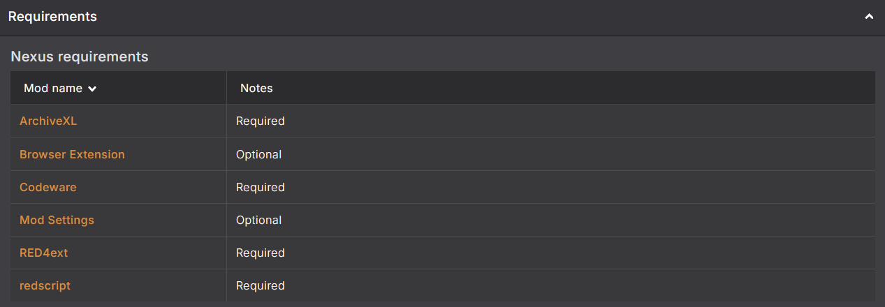<figcaption><p>These are the mods for Virtual Atelier.</p></figcaption></figure>

To learn more about requirements, [have a look at this page](../users-modding-cyberpunk-2077/#what-are-requirements).



#### Remove Cybercmd

If you're using any REDmods, you've probably been told to download [cybercmd](https://www.nexusmods.com/cyberpunk2077/mods/5176). Likelihood is, you've also downloaded [RED4ext](https://www.nexusmods.com/cyberpunk2077/mods/2380?tab=files).&#x20;

**These two cannot be used together, and cybercmd should be removed.**

**E**ver since RED4ext version `1.13` _(which was uploaded in May 2023!)_, you do not need cybercmd, as the functionality was added to RED4ext.&#x20;


Even the cybercmd mod page says "_recent versions of RED4ext provide the same functionality as cybercmd_". Just remove it, I promise you don't need it.




#### Disable All Your Mods


If your game is crashing during gameplay, you'll need to check [Game Crashes During Gameplay](./#game-crashes-during-gameplay) or [Bisecting](./#bisecting)


Tried all of the above and still run into issues? Disabling all mods and launching your game can establish if the issue is caused by mods. If the issue still persists without any mods enabled, **it's an issue with your game**.

If your game crashes on startup, disable **all** your mods.&#x20;


But how do I do that?

**If you're using Vortex**: Press `CTRL` + `A` on your keyboard, then click `Disable` at the bottom of Vortex. You can also press the `Purge` button at the top. _If you want to be extra sure, do both_.

**If you're using MO2:** Press `CTRL` + `A` on your keyboard, right mouse click, and then click `Disable Selected`

**If you're manually installing** (_or want to be extra sure after disabling in your mod manager_): Check out the [Mod Remover](https://www.nexusmods.com/cyberpunk2077/mods/8597)


If you're dealing with a **glitch or bug**, and you're pretty sure it's caused by mods, disable everything apart from **core mods**.&#x20;


If you're loading a save that was created with [New Game Plus - Native](https://www.nexusmods.com/cyberpunk2077/mods/15043), **keep it enabled**.

If you're loading a save that had a weather mod active such as [Nova City 2](https://www.nexusmods.com/cyberpunk2077/mods/12490) or [Enhanced Weather](https://www.nexusmods.com/cyberpunk2077/mods/3901), you should **reset the weather state to vanilla** before disabling them.&#x20;




#### You Pirated The Game

There's a >95% chance we already found the source of your problems — **pirated copies just don't mod well**.

CDPR needs to earn money to pay people to make games. If you can afford it, **please buy the game**.

You're welcome to read through the troubleshooting guide - it might even help you. But know that pirated copies will never be explicitly supported.



***

### Specific Troubleshooting Tips

**I'm On Linux/Steam Deck**

* Double check [you've followed this guide](https://wiki.redmodding.org/cyberpunk-2077-modding/for-mod-users/users-modding-cyberpunk-2077/modding-on-linux) to the letter before proceeding with any other troubleshooting.

**I'm playing the game on macOS**

* If you're playing on macOS native, [you need to check this guide first](../users-modding-cyberpunk-2077/modding-on-macos.md).&#x20;


TL;DR: modding on Mac natively is in the very early stages, and there are very few mods available to use.


* If you're playing on macOS but are playing the Windows version, you need to [follow the Linux guide to the letter](https://wiki.redmodding.org/cyberpunk-2077-modding/for-mod-users/users-modding-cyberpunk-2077/modding-on-linux).

**I'm Using Vortex**

* You need to make sure the "`Automatically convert legacy-style ".archive" mods to REDmods on install (NOT recommended)`" toggle is off. This is under `V2077` in `Settings`. If it was enabled, [check here for what to do](../users-modding-cyberpunk-2077/getting-started/vortex-mod-manager.md#v2077-settings).

**I'm Using MO2**

* You need to make sure you **always run the game through MO2.**
* You also need to make sure you have **Cyber Engine Tweaks and RED4ext manually installed**, or follow [this guide](../users-modding-cyberpunk-2077/getting-started/mo2-mod-organizer-2.md#script-extenders-plugin-installation-guide) to properly set up the script extender plugin.

***

## Whoa! Cyberpunk 2077 Has Flatlined.

<figure>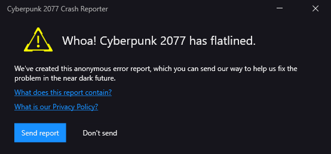<figcaption><p>By far the most common way your game will crash.</p></figcaption></figure>

This popup looks useful, but it's not great for figuring out what caused your game to crash.&#x20;

That doesn't mean we can't get _anything_ out of it. You can click "`What does this report contain?`", which will bring you to a folder.&#x20;

This is where the game's crash logs live. Open the `stacktrace.txt` in this folder. It might seem like nonsense, but it can sometimes be a good starting point.

<details>

<summary><strong>But what do they all mean?!</strong></summary>


Below you'll see "meanings" listed for each error. Some of these are just the most common causes for the error, and not necessarily the inner workings of what they mean!&#x20;


**EXCEPTION\_ACCESS\_VIOLATION**

* The game tried to access information that it can't read. Usually signifies a broken mod file.

**Detected integer overflow**

* Something is causing the game to allocate a larger memory buffer than it actually can.

**Gpu Crash**

* Your GPU is struggling to run the game.

**Watchdog Timeout!**

* The game took to long to load something, and timed out.&#x20;


A **watchdog** is a background process (daemon!) to keep an eye up for crashes. If the application it's watching hasn't responded after time interval X, the watchdog will assume that it died, and cause a crash. This prevents quiet crashes in the background.


</details>

<table><thead><tr><th width="290">Error Listed</th><th>Solution</th></tr></thead><tbody><tr><td><p><strong>EXCEPTION_ACCESS_VIOLATION</strong></p><p>(This may also say <code>'The thread attempted to read inaccessible data at 0x000000'</code>)</p></td><td><a href="./#bisecting">Bisect your mods</a></td></tr><tr><td><strong>Detected integer overflow</strong></td><td><a href="./#bisecting">Bisect your mods</a></td></tr><tr><td><strong>Gpu Crash</strong></td><td><p>Make sure your PC meets the minimum specs to run Cyberpunk 2077 (yes, <em><strong>really</strong></em>).</p><p></p><p>Try <strong>disabling any graphics mods</strong> you have, as well as external programs such as <strong>ReShade</strong>.</p><p><br>If the game opens but <strong>cannot load a save</strong>, try lowering graphics settings in the main menu.</p><p></p><p>If you still get this crash, <a href="./#disable-all-your-mods"><strong>disable all your mods</strong></a>. </p><p>If this fixes the issue, try again with just <a href="./#update-all-your-mods">core mods</a> enabled. </p><p>If it's <em>still</em> launching fine, re-enable your mods in batches until the game cries. </p><p></p><p>If it <strong>still</strong> crashes in an unmodded state, you may need to update your graphics drivers. You can find more information on that here.</p></td></tr><tr><td><strong>Watchdog Timeout!</strong></td><td><p><a href="./#bisecting">Bisect your mods.</a></p><p><br>If you still get the error, keep reading:</p><p>If the game doesn't even launch, <strong>check your antivirus</strong>. Make sure that you have an exception for the <a href="https://wiki.redmodding.org/cyberpunk-2077-modding/for-mod-users/users-modding-cyberpunk-2077/the-cyberpunk-2077-game-directory">Cyberpunk 2077 game directory</a> (guide on <a href="https://docs.rackspace.com/docs/set-windows-defender-folder-exclusions">rackspace</a>) </p><p></p><p>If it happens in photomode, turn down your graphics settings, or try disabling your photo mode mods.</p><p></p><p>If the error is absolutely persistent and you're sure you've tried everything, you can try <a href="./#increasing-the-watchdog-timeout">increasing the Watchdog Timeout.</a></p></td></tr></tbody></table>

<details>

<summary>Increasing the Watchdog Timeout</summary>


The below should be a last resort, and is geared towards people who have crashes while trying to render screenshots taken in photo mode.&#x20;

There may be an easier fix before you reach this point!


If you are dead-set on that photo, you can try increasing the watchdog timeout to give the game more time. Open the following file with a text editor (create it if it doesn't exist):

```
Cyberpunk 2077\engine\config\platform\pc\user.ini
```

... and add the following lines ([original source](https://forums.cdprojektred.com/index.php?threads/cyberpunk-2077-pc-crash-issues.11040656/page-99#post-12377786)):

```
[Engine/Watchdog]
ActiveIfDebuggerPresent = true
ActiveIfDialogBlocking = false
ActiveIfScriptBreakpointBlocking = false
DumpJobExecutionContext = true
Enabled = false
KillProcess = false
ThreadFrequencyHz = 15
TimeoutSeconds = 604800
```

This will set the timeout to something over 2 hours, and should hopefully be long enough to render that screenshot for you.

</details>

***

## The Game Doesn't Launch

<figure><figcaption></figcaption></figure>

### ... And You Get a Pop-up

#### **ValidateScripts.cpp:44 /** codeware.global.reds

<div align="center"><figure>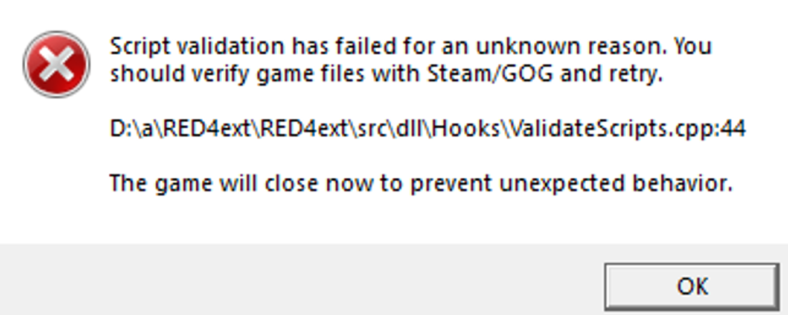<figcaption><p>It might look a little different, but it will always have this error somewhere.</p></figcaption></figure></div>

To fix this:

1. Navigate to `Cyberpunk 2077\r6\` and **delete the entire `cache` folder** (Yes, the whole folder)
2. **Verify your game** in the store you bought it from (GOG/Steam/Epic)&#x20;
3. To be extra safe, [**reinstall redscript**](https://www.nexusmods.com/cyberpunk2077/mods/1511)

***

#### RED4ext Error 1114 - A dynamic link library (DLL) initialization routine failed

<figure>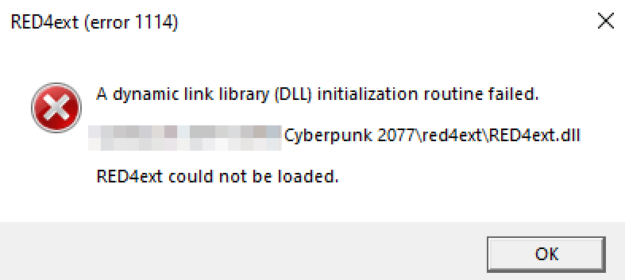<figcaption><p>The first part of the file path will be the drive you have Cyberpunk 2077 installed on</p></figcaption></figure>

To fix this, you need to download [Visual C++ Redistributable 2022](https://learn.microsoft.com/en-us/cpp/windows/latest-supported-vc-redist?view=msvc-170) ([direct download](https://aka.ms/vs/17/release/vc_redist.x64.exe), Microsoft)

Download and run the executable file linked above, then **restart your computer**. \
If you already have it downloaded, or it doesn't work the first time, you need to open the file again, click `Repair`, then **restart your computer**.


You **have to restart your computer** after installing/repairing. It can take several repairs for it to work. Blame Microsoft!


***

#### Redscript Compilation Error

<figure><figcaption></figcaption></figure>

Redscript is quite good at telling you where to look for issues, but the mods it lists may not actually be the problem. Confused? Don't worry! We're going to get through this together.

<figure><figcaption><p>You may only have one mod listed here, or an even longer list</p></figcaption></figure>

***

**Redscript Log**

The pop-up mentions consulting the logs for more information. It can be helpful to double check if you have duplicate files, making sure you have script files for specific mods, or just for reference.&#x20;


You can find the redscript log here: `r6/log/redscript_rCURRENT.log`



#### **Common Errors and Quick Fixes**

**All of the mods listed are atelier stores**

* You don't have [Virtual Atelier](https://www.nexusmods.com/cyberpunk2077/mods/2987) installed. Install it, and all of its requirements too.
* You _did_ install Virtual Atelier, but it's missing script files. **Reinstall it**_._ \
  If you're not sure, **reinstall it anyway.**
* You have an old version of Virtual Atelier installed. \
  If there's log entries for `virtual-atelier` _**and**_ `virtual-atelier-full`, remove **all** Virtual Atelier files and redownload the newest version.&#x20;

**There's only one mod listed**

* Check your log to make sure it's not installed twice. Sometimes mod authors change their folder structure, causing a duplicate file.\
  Remove **both** versions and **redownload the latest version**.&#x20;

**You have** [**cybercmd**](https://www.nexusmods.com/cyberpunk2077/mods/5176) **installed**

* Uninstall it


***

**Clearing the Redscript Cache**

Sometimes, the cache goes stale. Thankfully, it's an easy fix. If you're really at a loss for your redscript compilation error, try this first.

<figure>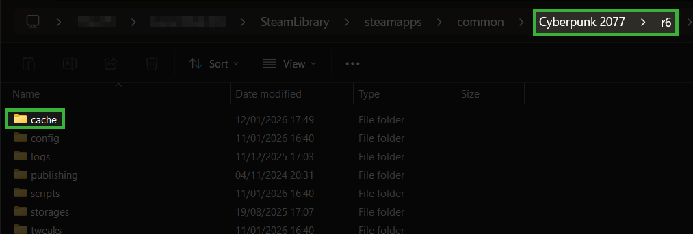<figcaption><p>This is where your redscript cache lives!</p></figcaption></figure>

* &#x20;Navigate to `Cyberpunk 2077\r6\` and delete the entire `cache` folder (Yes, the whole folder)
* Verify your game in the store you bought it from (GOG/Steam/Epic)&#x20;
* [**Reinstall redscript**](https://www.nexusmods.com/cyberpunk2077/mods/1511)

***

**Still Getting Compilation Errors?**

One of your redscript-dependent mods might be causing issues. This could mean you're using two mods that are not compatible with each other, or you're using an old mod that needs an update.&#x20;

But how do you figure out which one it is?&#x20;

* [Bisect your mods](./#bisecting)


If you're using a mod manager, you can pull up your `redscript_rCURRENT.log` to check which of your mods rely on redscript and just bisect those.

If you're manually installing, you'll find all your redscript mods in `Cyberpunk 2077/r6/scripts`


***

**It Still Doesn't Compile**

Launch the game with [only the core mods](./#update-all-your-mods).&#x20;

If the game launches, the issue definitely lies with one of your other mods. You need to [bisect your mods.](./#bisecting)

***

**Still. Doesn't. Compile.**

It might be time to start afresh. Try running [Mod Remover](https://www.nexusmods.com/cyberpunk2077/mods/8597) and start re-modding your game from scratch. \
If you're using a mod manager, **disable/purge** your mods there first before running the [Mod Remover](https://www.nexusmods.com/cyberpunk2077/mods/8597).&#x20;


If you've been manually installing your mods, [please consider using a mod manager](../users-modding-cyberpunk-2077/#mod-manager-options) going forward. It's far less error prone, and makes troubleshooting your mods way easier.


***

#### Failed to resolve address for hash

<figure>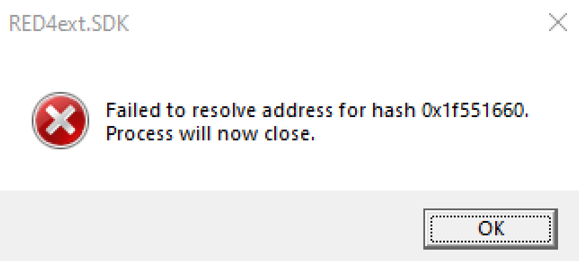<figcaption><p>The numbers after <code>0x</code> may be different, but the advice below applies to them all</p></figcaption></figure>

To fix this:

1. **Update/Buy the game**


Core mods will not work on outdated/pirated copies of the game.&#x20;


2. **Update your core mods -** [you can find links to all of them here](./#update-all-your-mods)
3. If you are a mod dev, **update** [**RedHotTools**](https://github.com/psiberx/cp2077-red-hot-tools/releases)

***

#### Corrupted Or Missing Archives

<figure>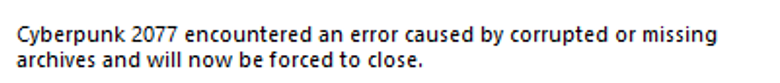<figcaption><p>This error means "bisect your mods"</p></figcaption></figure>

If you get an error message that says `Cyberpunk 2077 encountered an error caused by corrupted or missing archives and and will now be forced to close`, you have a broken `.archive` file and need to [bisect your mods.](./#bisecting)

***

#### Corrupted Or Missing Scripts

<figure>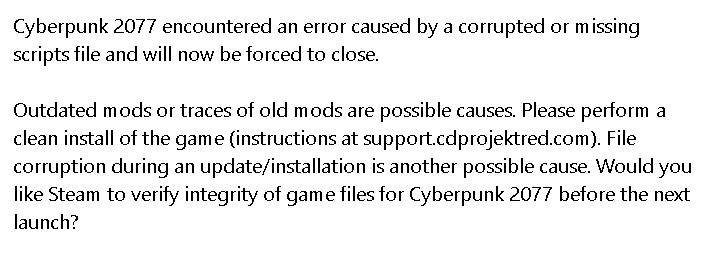<figcaption><p>If you're here because you used Mod Remover and didn't verify your game, you need to read the instructions thoroughly</p></figcaption></figure>

If you get an error message that says `Cyberpunk 2077 encountered an error caused by a corrupted or missing scripts file and and will now be forced to close`, you need to verify your game in your launcher (GOG/Steam/Epic).&#x20;


[Not sure how to verify your game files? Click here!](./#verify-repair-game-files)


To make sure it's really verifying, you can try running the [Mod Remover](https://www.nexusmods.com/cyberpunk2077/mods/8597) (don't worry, it creates a backup of all your files!)

<details>

<summary>If you don't want to do that, here's a more hands-on method</summary>


Unless you [back up your mods and scripts](https://wiki.redmodding.org/cyberpunk-2077-modding/for-mod-users/user-guide-troubleshooting#back-it-up-baby), all your settings and manually installed mods will be lost.


Rename or remove the following folders, then verify your game:&#x20;

```
/mods
/plugins
/engine
/r6
/red4ext
/archive/pc/mod
/bin/x64/plugins
```

If you do not have them, you don't need to do anything.

</details>

<details>

<summary>If you just want to reinstall the game</summary>

Consider just using [Mod Remover](https://www.nexusmods.com/cyberpunk2077/mods/8597). It will reset your game to an unmodded state.

If you're set on reinstalling completely, you can find a full reinstall guide on [CDPR's support page](https://support.cdprojektred.com/en/cyberpunk/pc/sp-technical/issue/2233/how-do-i-clean-install-my-game).

</details>

***

#### Corrupted Or Incomplete Game Data

<figure>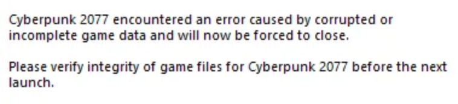<figcaption><p>This error has a few possible fixes</p></figcaption></figure>

If you get an error message that says `Cyberpunk 2077 encountered an error caused by corrupted or incomplete game data`, check below for some potential solutions:

<details>

<summary><strong>Workaround Suggested By CDPR</strong></summary>

* Set Power Limit (TJ max) for CPU to 150W
* Reduce Long and Short Duration Package Power Limit to 150 W (Intel default is 253)
* Set the maximum CPU Core Temperature to 98°
* Reduce the P-Core ratio of the processor
* Deactivate Turbo Boost of the CPU
* Disable CPU Hyper-Threading

Or check Reddit:

* [Downclock your processor](https://www.reddit.com/r/cyberpunkgame/comments/16pluqw/comment/k2f1wwh/?utm_source=share\&utm_medium=web2x\&context=3) (via reddit, do so **at own risk**)

</details>

<details>

<summary><strong>Run Without Antivirus</strong></summary>

* Turn off your antivirus and your firewall - anything that counts as "System Protection".
  * Yes, that includes Windows Defender


**Yes, all of it**. That includes your computer's bodyguard if it has one.


* Now, start the game.
* If the error persists, verify game files through your launcher (GOG/Steam/Epic)
* Start the game again

If it works now, you need to find out how to keep your antivirus away from your game directory. If it doesn't, then you can turn the stuff back on now.

</details>

<details>

<summary><strong>Run As Admin</strong></summary>


Generally, you'll be told not to run the game as admin! Only try this if nothing else works!


Configure the `REDprelauncher.exe` in the Cyberpunk root directory to always run as administrator.

* Right-click on the file and select `Properties`
* Switch to the `Compatibility` tab
* Check the box `Run this program as an administrator`

<figure><figcaption><p>It should look a little like this!</p></figcaption></figure>

</details>

***

#### Files / Permissions Errors

There's a few different pop-ups relating to file errors. These are caused by **access errors** – Cyberpunk is trying to read or write a file, and for some reason, it can't. Check below for some potential solutions.


These errors may look like the following:

* Access is denied
* Can't access file `'FILENAME'`
* Could not move file from `'file\path\file\path.tmp'` to `'path\Cyberpunk 2077\subdir\name.file'`
* An exception occurred while creating the logger

You may also see `'EXCEPTION_ACCESS_VIOLATION'` or `'The thread attempted to read inaccessible data at 0x000000'` (numbers may differ). If you have already tried [the fixes listed above for these errors](./#whoa-cyberpunk-2077-has-flatlined), keep reading.


***

**Make sure that the file path exists**

* If Cyberpunk is trying to move files to a subdirectory that it can't access, make sure the directory actually exists. If it doesn't, create it.&#x20;
* The most frequent candidate for this is /`r6/cache/modded`


You can ignore this if there's no file path in your error.


***

**Make sure that no previous game instance is running**

* Sometimes, the game doesn't shut down properly and still runs in the background. You can check this - and also actually close the game process - through the task manager.&#x20;

<details>

<summary>How to end the game's process in task manager</summary>

* Press `CTRL` + `SHIFT` + `ESC` on your keyboard to open your task manager
* Switch to the **`Details`** tab
* Sort by `Name` and scroll to C
* Check if you can see anything **`Cyberpunk`** in the list.
* If yes, right-click on it and select **`End Task`**

</details>

***

**Reboot your PC**

* If in doubt, you can just reboot your computer. It's a good idea to do this sometimes – in this case, it could make the error go away.

***

**Make sure that all files in the game directory are writable**

* Sometimes, files in your [game directory](../users-modding-cyberpunk-2077/the-cyberpunk-2077-game-directory/#what-is-the-game-directory) are set to read-only. You can fix this either via Windows Explorer or via system console, the results will be the same. Check below to see how.

<details>

<summary>Windows Explorer</summary>

* Navigate to the Cyberpunk 2077 game directory and right-click on it
* Select `Properties` (the last entry in the drop-down menu)
* Uncheck the "`Read-only`" box


After unchecking and applying changes, the box will jump back to maybe-checked. That's because Windows can't tell if the folder contains read-only files. However, since you just made sure that it doesn't, you can ignore this.


</details>

<details>

<summary>System Console</summary>

* Press `Windows + R` on your keyboard
* type `cmd` and press `Return` to open the command line
* run the following command (_replace the path with your actual game directory_):

```
attrib -r "C:\Path\To\Cyberpunk\*.*" /s
```

</details>

***

#### Failed To Initialize Script Data

If you get this error check your NVidia Control Panel. If power saving options are enabled, turn them off.


If you don't have them enabled, check for other power config options in your operating system.


<figure><figcaption><p>This is where the setting will be in the NVidia Control Panel</p></figcaption></figure>

***

### ... And You Don't Get Pop-up

<figure><figcaption></figcaption></figure>

The game isn't launching and doesn't even give you an error. How are you supposed to troubleshoot that?! Thankfully, there's a few things to try before diving into the deep end.


**Stop! Check the following first:**

* **Make sure all your mods are updated**. Yes, all of them.
* If you're using [RED4ext](https://www.nexusmods.com/cyberpunk2077/mods/2380), uninstall [cybercmd](https://www.nexusmods.com/cyberpunk2077/mods/5176)
* If you're using any FrameGen/DLSS/FSR mods, like OptiScaler, remove them
* If you're using any external programs like ReShade, remove them
* If you're on Linux, **double-check the** [**launch options**](../users-modding-cyberpunk-2077/modding-on-linux.md). Steam sometimes resets these between updates.


***

**Check Your RED4ext Log**


[To find out more about log files, take a look here!](./#log-files)


Find the folder `Cyberpunk 2077/red4ext/log`. Check for a file named `red4ext-0000-00-00-00-00-00.log` - the numbers will look different for every log. Sort your files by `Date Modified` and open the most recent one.&#x20;


If you don't have a log here, RED4Ext is not installed correctly. You need to fix this before troubleshooting further.&#x20;

**If you're manually installing:**

* [Consider using a mod manager](../users-modding-cyberpunk-2077/#mod-manager-options).

**If you're using MO2:**

* And **aren't** using the script extender plugin, make sure [**RED4ext is installed manually**](../users-modding-cyberpunk-2077/getting-started/mo2-mod-organizer-2.md#script-extenders-manual-install)
* And **are** using the script extender plugin,make sure [**your plugin is set up correctly**](../users-modding-cyberpunk-2077/getting-started/mo2-mod-organizer-2.md#script-extenders-plugin-installation-guide)


**What Am I Looking At?**


If you get one of these errors, [check here to see what to do](./#whoa-cyberpunk-2077-has-flatlined)!&#x20;

* `Message: Watchdog timeout! (120 seconds)`
* `Message: Gpu Crash for unknown reasons!`


Press `CTRL` + `F` on your keyboard and search for `error`. Sometimes, there will be an error that tells you what's wrong. Some tell you the exact issue, such as:

> `[error] To use this version of RED4ext, ensure your game is updated to patch __ or newer`

This means you need to **update/buy the game!**

Sometimes, the error is a little less specific. If you see the following error, [you need to go back to the start of the troubleshooting guide and start from step 1](./#update-all-your-mods):

> `[error] Could not attach the hook for the main function. Detour error code: 6`

***

**I Don't Have Errors, I Have Warnings**

If your log has no errors, but you have lines that say `warning`, it's usually warning you about a specific mod. You can try reinstalling the mod it's complaining about, but if it still throws the same warning, it may not be compatible with the current version of the game.&#x20;

If your warning says `scc invocation failed with an error: REDScript compilation has failed`, [you need to check here instead](./#redscript-compilation-error).

***

**My Log Doesn't Have Either**

If your RED4ext log has no errors or warnings, it's worth checking where your log ends.&#x20;


The bottom of your RED4ext log should always look something like this:

`[RED4ext] [info] _ plugin(s) loaded`\
`[RED4ext] [info] RED4ext has been started`\
`[RED4ext] [info] Scripts BLOB is set to 'Your:\Drive\Cyberpunk 2077\r6\cache\modded\final.redscripts'`\
`[RED4ext] [info] scc invoked successfully, 22077 source refs were registered`\
`[RED4ext] [info] Scripts blob path was updated to 'Your:\Drive\Cyberpunk 2077\r6\cache\modded\final.redscripts.modded'`


**If your log doesn't have this, but the last line says something like**:

> `Loading plugin from 'Your:\Drive\Cyberpunk 2077\red4ext\plugins\ModFolder\ModName.dll'...`

Your game is dying before it's able to load that mod. **Make sure you have the latest version of that mod.** \
If it's not a core mod, remove it. If your game now launches, you may have to wait for it to be updated, or live without it.

**If your log doesn't have this line**:

> `scc invoked successfully`

Redscript is not being called. To fix:


* &#x20;Navigate to `Cyberpunk 2077\r6\` and delete the entire `cache` folder (_Yes, the whole folder_)
* Verify your game in the store you bought it from (GOG/Steam/Epic)&#x20;
* [**Reinstall redscript**](https://www.nexusmods.com/cyberpunk2077/mods/1511)


***

**Disable Your Mods**

This is an easy way to check if the issue is mod-related or not. Disable all your mods and try launching the game. If it launches, the problem lies within your mods somewhere. If not, the problem is **with your game itself**.

* If you're using a mod manager, disable/purge your mods there. If you want to be extra cautious, you can also try the below
* If you're manually installing, run the [Mod Remover](https://www.nexusmods.com/cyberpunk2077/mods/8597)


If your game launches now, we know the issue is mod-related.

If it still doesn't launch, you should try this next (VERIFYING FILES LINK)


***

**I Disabled My Mods, Now What?**

Do a fresh reinstall of all the [core mods](./#troubleshooting-first-steps), then run the game. Hopefully, your game now launches. Now, you can either start modding the game again from scratch, or reinstall them and [bisect your mods.](./#bisecting)&#x20;


This is a lot easier to do with a mod manager.


***

## The Game Crashes Before the Menu

<figure><figcaption></figcaption></figure>

Your game launches, but crashes before you make it to the menu. Sometimes you'll get an error for this, sometimes you won't. Don't worry, there's a few things you can do in either case!


[If you get a "Whoa! Cyberpunk 2077 has flatlined" pop-up, check here first!](./#whoa-cyberpunk-2077-has-flatlined)


***

### ... And Doesn't Give An Error!


If you haven't already, [try these steps first before doing anything else](./#troubleshooting-first-steps). They're there for a reason.


Most likely culprit is a mod. Unfortunately, there's no magic way to tell which one it is. You're going to have to [bisect your mods to find the issue.](./#bisecting)&#x20;

To make sure, you can disable every mod you have installed **apart from the following**:

* [ArchiveXL](https://www.nexusmods.com/cyberpunk2077/mods/4198)
* [Codeware](https://www.nexusmods.com/cyberpunk2077/mods/7780)
* [Cyber Engine Tweaks](https://www.nexusmods.com/cyberpunk2077/mods/107)
* [RED4ext](https://www.nexusmods.com/cyberpunk2077/mods/2380)
* [redscript](https://www.nexusmods.com/cyberpunk2077/mods/1511)
* [TweakXL](https://www.nexusmods.com/cyberpunk2077/mods/4197)


You can disable these mods one by one to narrow down what type of mod is causing your game to crash.

Example: If you disable ArchiveXL and the game launches fine, a mod that relies on ArchiveXL is broken.&#x20;

[You can check here to see where each type of mods are kept on your computer](../users-modding-cyberpunk-2077/#overview-of-mod-folders)


If your game launches, the problem lies in your mods somewhere.&#x20;

If it still doesn't launch, it's [Mod Remover](https://www.nexusmods.com/cyberpunk2077/mods/8597) time.

***

### **... And Says Missing TweakDB File / Inaccessible Memory**

<figure>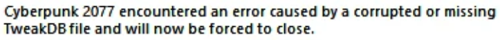<figcaption><p>This error was common when 2.0 and Phantom Liberty launched</p></figcaption></figure>

If you run into this error:

```
Cyberpunk 2077 encountered an error caused by a corrupted or missing TweakDB file and will now be forced to close
```

&#x20;Or if the game complains about attempting to read inaccessible memory, do this:

1. Navigate to your [game directory](../users-modding-cyberpunk-2077/the-cyberpunk-2077-game-directory/#how-can-i-find-the-game-folder) and find the folder`r6\cache`
2. Find the file `tweakDB.bin` and copy it (Press `Ctrl` + `C` on your keyboard)
3. `In r6\cache`, find the folder `modded`&#x20;
   * If it doesn't exist, create it!
4. Paste `tweakDB.bin` here (Press `Ctrl` + `V` on your keyboard)
5. If asked to overwrite, select `Yes`
6. **If you have Phantom Liberty**, repeat the process with `tweakdb_ep1.bin`

<details>

<summary><strong>That didn't fix anything!</strong></summary>

If that doesn't fix it, your problem most likely related to **Cyber Engine Tweaks**. Try disabling it.&#x20;

**If you have it installed with a mod manager**

* Disable it in your mod manager

**If you have it installed manually**&#x20;

* Find the folder `Cyberpunk 2077\bin\x64\plugins\cyber_engine_tweaks` and move it out of `plugins` (e.g. put it on your desktop)


If you'd rather delete it, make a copy of your `mods` and `plugins` directories. They contain your mod settings.



Check if the problem is gone.

If it is, put the folder back and bisect your CET mods. You can find these in:

* `cyber_engine_tweaks\mods`&#x20;
* `cyber_engine_tweaks\scripts`

**If you're using a mod manager**, bisect through your mod manager and use the folders to check which mods you should be looking for


</details>

***

## Game Crashes Loading a Save

<figure><figcaption></figcaption></figure>

Your game launches fine, the menu loads, but you can't load your save. Don't panic! It _probably_ isn't lost forever.


If you're reinstalling your mods, or you're in the process of bisecting, check below. It's always good to keep in mind that:

If you're loading a save that was created with [New Game Plus - Native](https://www.nexusmods.com/cyberpunk2077/mods/15043), **you need to keep it enabled**.

If you're loading a save that had a weather mod active such as [Nova City 2](https://www.nexusmods.com/cyberpunk2077/mods/12490) or [Enhanced Weather](https://www.nexusmods.com/cyberpunk2077/mods/3901), you should **reset the weather state to vanilla** before disabling them. If you can't do that because you can't load the save regardless, **re-enable it until you can**.


***

### Where To Start?

It's frustrating to diagnose a crash with no information. If you're sure none of the above applies to your game, try these steps next:

1. Try starting a new save


If this works, there's one more thing we can do to see if your save is truly lost


2. Go back to the main menu and try loading an **older save from the same playthrough**


If that doesn't work, you can also try loading a different playthrough if you have one, just to be really sure


***

#### It's a Broken Mod

Vague, right? Unfortunately, that's the most likely reason for your crash. It's time to [bisect your mods.](./#bisecting)

If you want the nucelar option, run the [Mod Remover](https://www.nexusmods.com/cyberpunk2077/mods/8597). If you had any of the following mods enabled on your save, reinstall them and their requirements to see if you can now load the save:

* [New Game Plus - Native](https://www.nexusmods.com/cyberpunk2077/mods/15043)
* Weather mods that have custom weather states such as [Nova City 2](https://www.nexusmods.com/cyberpunk2077/mods/12490) or [Enhanced Weather](https://www.nexusmods.com/cyberpunk2077/mods/3901)
* [Immersive Rippers](https://www.nexusmods.com/cyberpunk2077/mods/7064)


If you've done all this and still can't load your save, check the next section for a potential reason.


***

#### Corrupt-ish Saves


You only need to read this if you can start a new game without mods, but crash on loading a previous save game.


Some mods store data in save files. Removing those mods **may** lead to your save game crashing **until you install them again**.


If you messed with any quest flags, or played around too much with the [Save Editor](https://www.nexusmods.com/cyberpunk2077/mods/718), let this be a lesson in never doing that again. Quest flags can and will break your game if you mess with them, and the Save Editor is no longer supported.


This is commonly seen with the following mods:

* [New Game Plus - Native](https://www.nexusmods.com/cyberpunk2077/mods/15043)
  * You cannot load a save that was made with this mod without this mod enabled
* Weather mods that have custom weather states such as [Nova City 2](https://www.nexusmods.com/cyberpunk2077/mods/12490) or [Enhanced Weather](https://www.nexusmods.com/cyberpunk2077/mods/3901)
  * These mods allow for custom weather states. If you saved while one of these custom states was active, the game is trying to load something that doesn't exist. The weather needs to be one **available in the vanilla game** before it can load without these mods.
* [Immersive Rippers](https://www.nexusmods.com/cyberpunk2077/mods/7064)
  * If you remove Immersive Rippers, you need to save more than 100m away from a Ripperdoc before uninstalling the mod. From the mod page itself:

> Make sure you save away from a Ripper (+100m should be plenty)\
> And then delete the ImmersiveRippers.archive file from the "Cyberpunk 2077\archive\pc\mod" folder.


If your save won't load no matter what you try, I'm sorry. It might just be time to start a new save.


***

## Game Crashes During Gameplay

<figure><figcaption></figcaption></figure>

You were just about to wipe out a bunch of Scavs, or you were just driving around the city, and your game crashed out of nowhere. Keep reading to find out what to do.


[If you get a "Whoa! Cyberpunk 2077 has flatlined" pop-up, check here first!](./#whoa-cyberpunk-2077-has-flatlined)


***

### Known Issues

**Material and Texture Override (MTO)**

<figure><figcaption><p>This is the old version of MTO</p></figcaption></figure>


TL;DR: There is a new version of this mod. If you _actually need_ this mod, [you can download the updated version here](https://www.nexusmods.com/cyberpunk2077/mods/25246).


This tends to make the game crash **somewhere in Japantown** because of a mesh with a broken material. [Material and Texture Override](https://www.nexusmods.com/cyberpunk2077/mods/5266) removes the cache and forces the game to re-create this material, making the game crash.


MTO is a well made mod, and the crashing issue is an edge case. This is not a guaranteed fix to any crashing you might have, but removing it is something worth trying if this sounds like your issue.


Many mods list MTO as a dependency, but it's usually optional. You only need it to force changes to original game materials.&#x20;

As of 24 October 2025, a separate updated version has been uploaded. If a mod lists MTO has a hard requirement (not an optional one!), [try this one instead](https://www.nexusmods.com/cyberpunk2077/mods/25246).

<figure>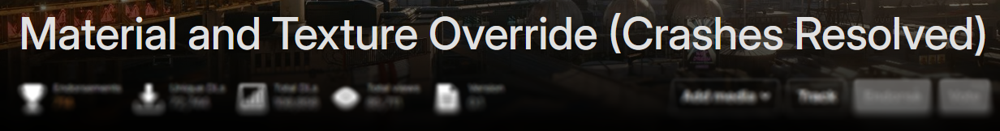<figcaption><p>This is the new version of MTO</p></figcaption></figure>

**Too Many Mods!**

Yes, seriously, too many mods. This number seems pretty random, but generally doesn't start below 460.

The solution? Toggle off `Enable Analytics` in settings:

<figure><figcaption></figcaption></figure>

***

### ... And The Crash Is Easily Replicated

You're lucky - you can easily troubleshoot this. You need to [bisect your mods](./#bisecting), and see if it crashes at the same point with each set of mods. You'll know when you've found the issue because it won't crash anymore, yippee!


If you're manually installing your mods, start with your `.archive` mods. If that doesn't fix it, continue bisecting the rest.&#x20;

Keep in mind that bisecting is a lot easier when [using a mod manager](../users-modding-cyberpunk-2077/#mod-manager-options), and it's never too late to start!


***

### ... And The Crash Is Completely Random

The most annoying type of crash, and unfortunately much harder to diagnose. A lot of long-time players just deal with the game crashing sometimes, like when tabbing in and out of the game occasionally.

If you can't deal with the crashes, you'll have to put in some work. There's a few options:

* Use [Mod Remover](https://www.nexusmods.com/cyberpunk2077/mods/8597) to make sure the issue is caused by mods, or just to [start over](./#removing-all-your-mods)
* [Bisect your mods](./#bisecting)

***

## Game Starts, Mods Are Broken

<figure><figcaption></figcaption></figure>


If you've tried solutions from this page and still no luck, find us on [Discord](https://discord.gg/redmodding) in #mod-troubleshooting.


Your game starts, but something is broken. Maybe a menu doesn't look right, maybe all the game sound is missing, maybe something else entirely.&#x20;

While it's difficult to write troubleshooting for every possible thing that can go wrong with your mods, there will be a few common issues below.


**External programs can cause issues. Rule it out by deactivating them while you're debugging.**

These include things like:

* Antivirus
* ReShade
* Hotsampling programs

FrameGen/DLSS/FSR files can also cause issues. **Remove them before continuing**.


If your issue is not listed here, or any of the above sections, [**you need to bisect your mods.**](./#bisecting)

***

### Common Issues

Have a look below to see if your issue is listed here. If not, you'll need to head on to the next section.

If you try a fix for your issue below and it doesn't make a difference, [**you need to bisect your mods**.](./#bisecting)

Above all else, **please make sure to read the descriptions of mods**. They usually have install instructions and tell you exactly what you need to do to make everything work.&#x20;


Did you know? You can press `Ctrl` + `F` on your keyboard to quickly find your problem on the page – simply type a word from your error message or related to your issue.


<details>

<summary><strong>Cyber Engine Tweaks Isn't Working</strong></summary>

Cyber Engine Tweaks needs **at least** VisualC 14.40.33810.0 - you can download it from the official Microsoft website ([direct link](https://aka.ms/vs/17/release/vc_redist.x64.exe))

To check if it's working, navigate to `Cyberpunk 2077\bin\x64\plugins\cyber_engine_tweaks`

* If there's a file called `cyber_engine_tweaks.log` in this folder, CET is running
* If there isn't, you may need to redownload VisualC from the link above and click `Repair` when you run the file.&#x20;


You need to restart your PC whenever you download/repair VisualC!&#x20;

Some users may find they need to repair it multiple times before it works. Blame Microsoft!


</details>

<details>

<summary><strong>I Forgot My Cyber Engine Tweaks Keybind</strong></summary>

Delete the file `Cyberpunk 2077\bin\x64\plugins\cyber_engine_tweaks\bindings.json.`&#x20;

The game should let you bind a new key at the next startup.


You can find more troubleshooting help for Cyber Engine Tweaks in the [corresponding wiki](https://wiki.redmodding.org/cyber-engine-tweaks/getting-started/installing/troubleshooting): [Cyber Engine Tweaks](https://wiki.redmodding.org/cyber-engine-tweaks/) -> [Troubleshooting](https://wiki.redmodding.org/cyber-engine-tweaks/getting-started/installing/troubleshooting)


</details>

<details>

<summary><strong>Your Icons Are A Jumbled Mess</strong></summary>

<div><figure>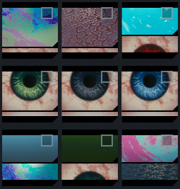<figcaption></figcaption></figure> <figure>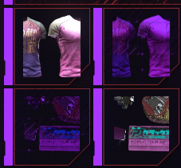<figcaption></figcaption></figure> <figure>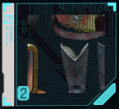<figcaption></figcaption></figure></div>

You have an old version of a mod that interacts with icons in some way. If you have any of the following mods, you need to update them:

* [Always Best Quality](https://www.nexusmods.com/cyberpunk2077/mods/12700)
* [Blade Runner 2077 Proxima](https://www.nexusmods.com/cyberpunk2077/mods/2155)
* [Ultra Texture Remaster Repack](https://www.nexusmods.com/cyberpunk2077/mods/13822) (You need to [download this version instead](https://www.nexusmods.com/cyberpunk2077/mods/22748))


If you don't have any of the mods listed above, [you need to bisect your mods to find the issue.](./#bisecting)&#x20;

If you manually installed your mods, start in `archive\pc\mod`. Your issue likely lies there.


</details>

<details>

<summary><strong>Your Icons Are Missing / Blank</strong></summary>

* Reinstall ArchiveXL
* Reinstall the mod that is missing icons

</details>

<details>

<summary><strong>V's Skin Texture Is Broken / Shiny / Striped / Messed Up</strong></summary>

* Exit out to the **main menu.**&#x20;
* Open the settings and set your `Textures` to `High`

</details>

<details>

<summary><strong>V Is All Grey</strong></summary>

* If you are a VTK user, tattoos 6 and 7 are not available for your V and show as grey-ish blue. Sorry!
* Make sure you only have [KSUV](https://www.nexusmods.com/cyberpunk2077/mods/3783) _**or**_ [VTK](https://www.nexusmods.com/cyberpunk2077/mods/7054), not both!
* Make sure you only have one tattoo mod
  * If you do, make sure it's compatible with the body mod you have
* Make sure you don't have multiple skin texture mods

</details>

<details>

<summary><strong>V's Eyes Are Grey / Black /</strong> <strong>Missing / Sunken In</strong></summary>

* If you're using an eye replacer mod and you're using [Unique Eyes - Core](https://www.nexusmods.com/cyberpunk2077/mods/1937), try using [this updated version instead](https://www.nexusmods.com/cyberpunk2077/mods/18594)


There is a newer mod called [Unique Eyes to CCXL](https://www.nexusmods.com/cyberpunk2077/mods/23263), which adds the eye colours to the bottom of the eye colours instead of replacing any of them. Try this one instead!


* If you have **both versions** of Unique Eyes, **remove the older one**.
* If you have multiple eye replacer mods, **choose one**. You can't have multiple.
* If you have [Unique Eyes - Core - 2.2 - Temporary Update Mod](https://www.nexusmods.com/cyberpunk2077/mods/18594) but no compatible eye mods, you need to download one. **Unique Eyes Core does not add any eye textures**.
* If you just uninstalled an eye mod, try **redownloading it** and then **swapping to a vanilla eye colour** before uninstalling again.

</details>

<details>

<summary><strong>V Clips Through All Their Clothes</strong></summary>

You need to check that you:

* Are not using a Spawn0 mod
* Only have **one** body framework installed ([VTK](https://www.nexusmods.com/cyberpunk2077/mods/7054) _**or**_ [KSUV](https://www.nexusmods.com/cyberpunk2077/mods/3783), **not both**)
* Only have **one** body mod installed


If you are using a VTK-based body, chances are you **only need the VTK head file**


* Only have **one** rig installed
* Have the correct **clothing refits** for the body you're using


If the clipping is minimal, it may just be the mod itself. Mod authors need to manually fix Garment Support on their clothing mods.\
If it tends to happen when you're posing V in Photo Mode, that's just something that happens. Try a clever camera angle, or a different piece of clothing.&#x20;


</details>

<details>

<summary><strong>V Is Missing A Body Part</strong></summary>

* Try a different piece of clothing - if the issue goes away, the clothing may not be compatible with the player body/your body mod.
* Try installing [JB - FPP Nude Patch](https://www.nexusmods.com/cyberpunk2077/mods/3620) (yep, seriously)
* Check you don't have multiple mods affecting the same part of your V (two tattoo mods, two cyberarms mods). If you do, remove one.
* If it's V's face, make sure you have the correct [EKT](https://www.nexusmods.com/cyberpunk2077/mods/12807) / [EKT Asian](https://www.nexusmods.com/cyberpunk2077/mods/16930) to work with other mods you have downloaded

</details>

<details>

<summary><strong>V Has A Neck Seam / Different Coloured Head</strong></summary>

You need to make sure you

* Have the correct files and requirements for your body mod
  * If you are using a VTK body, you usually only need the **VTK head file** from the [framework page](https://www.nexusmods.com/cyberpunk2077/mods/7054)
* If you're using a skin tone mod like [Universal Skin Texture](https://www.nexusmods.com/cyberpunk2077/mods/15426), make sure you have the corresponding head file


Sometimes, this is just a part of using a body mod. Players have reported this happening with [Solo Body 2.0](https://www.nexusmods.com/cyberpunk2077/mods/15869), and the "Max Muscle Normal Texture (No Veins)" file has a similar neck seam


</details>

<details>

<summary><strong>V's Wearing Clothes But Still Naked</strong></summary>

1. Go to the vanilla wardrobe in your apartment
2. Create an outfit (anything will do)
3. Equip the outfit
4. Un-equip the outfit
5. Save and reload

**If this happens in first person perspective (and you're using Equipment-Ex):**

1. Remove all Equipment-EX outfits by typing `EquipmentEx.DeleteAllOutfits()` in CET's console.
2. Save and quit the game
3. Uninstall all files related to Equipment-EX


If you're installing mods manually, this can be done by searching for `EquipmentEx` in the game's main directory, then launch the game.


4. You should now no longer be naked.
5. Reinstall EquipmentEx and start creating outfits again.

</details>

<details>

<summary><strong>The Clothes I Just Downloaded Are All Purple</strong></summary>

You are missing a dependency for the mod. Check again, and make sure to download it.

</details>

<details>

<summary><strong>One Of Your Mods Isn't Loading / Triggering</strong></summary>

Double check the mod description. Many of them have conditions to activate the mod, with the most common one being entering V's H10 apartment.

</details>

<details>

<summary><strong>You're Trying To Get Biosculpted Exotics To Work</strong></summary>

If you want to use [Biosculpted Exotics](https://www.nexusmods.com/cyberpunk2077/mods/9797), you should try using [Biosculpted Exotics Expanded](https://www.nexusmods.com/cyberpunk2077/mods/15485) instead. Be aware that the updated version may still have its own quirks, but it is actively maintained.

</details>

<details>

<summary><strong>You're Having Audio Issues</strong></summary>


Make sure **all** your mods that could mess with audio have been updated since the 2.3 update. This update messed with a lot of audio mods, and they **all** needed to be updated.


If your CPU is too busy, the game will try to save resources by dropping audio, starting with dialogue audio. Disabling spatial audio from the main menu might help

<figure><figcaption><p>The setting you need to disable!</p></figcaption></figure>

</details>

<details>

<summary><strong>You Get LocKey# Messages</strong></summary>


If this is happening to an [ArchiveXL](https://www.nexusmods.com/cyberpunk2077/mods/4198) item addition, such as clothing or weapons, try reinstalling [ArchiveXL](https://www.nexusmods.com/cyberpunk2077/mods/4198), and also the affected mod.


#### If it's happening to the journal, quests, text messages, or shards

**And you're playing in a language other than English**

* The mod may not include translation files for your language. Check if there is a translated version, or change the game language to English.

**And you're playing in English**

* Most likely, two mods are trying to change the same text archive or journal entry. You can [bisect your mods](./#bisecting), and once you've found the issue, you can try the below:


Sometimes, adding `#` or `!` to the beginning of the `.archive` file name can fix this.&#x20;

Double check the mod page first to see if the author has any suggestions or workarounds!


</details>

<details>

<summary><strong>Press [none] To Continue / Can't Skip Loading Screen</strong></summary>

That is due to [Input Loader](https://www.nexusmods.com/cyberpunk2077/mods/4575) requiring an update. Double check you have the latest version.

</details>

***

### Outdated Mods

There are probably hundreds, if not thousands of outdated mods, but these ones still get downloaded to this day. If you have any of these, _remove them_.

* [**CTD Helper**](https://www.nexusmods.com/cyberpunk2077/mods/5205)
  * This mod has been broken for a long time and will not work.
* [**NPCs Gone Wild**](https://www.nexusmods.com/cyberpunk2077/mods/1436) **(NSFW)**
  * In all versions since 2.0, this causes missing characters, missing body parts, exploding limbs, and other issues. Do not use the mod.&#x20;


There are some mods that still cause issues **despite not being available for download anymore**. If you have these mods, they are **seriously outdated and you need to delete them.**

* System-Ex (replaced by [Cyberware-Ex](https://www.nexusmods.com/cyberpunk2077/mods/9429), download this instead)
* Respector


***

### You Have Spawn0 Mods Installed

<figure><figcaption></figcaption></figure>

Most famous for physics-defying, back-breaking edits of the female body, Spawn0 has been around since the early days, and so have their mods.

Modding has come a long way since then, and Spawn0 never followed. Their mods are known to have compatibility issues with pretty much everything, including their own other mods.

With Phantom Liberty, Sp0 mods have been known to cause crashes to desktop near the dam.

***

## Bisecting

<figure><figcaption></figcaption></figure>


#### <mark style="color:red;">**Mod Managers**</mark>

If you are using a mod manager, you should enable and disable mods through it rather than manually bisecting your game folders. Go to the [<mark style="color:red;">**Bisect with a mod manager**</mark>](./#bisect-with-a-mod-manager) section for instructions.\
\
If you do work directly through folders, **do not save changes to files if Vortex prompts for it**.


You have hundreds of mods, and one of them is broken. How do you find out which one it is without wasting the entire day?


Don't worry! As long as you have less than 2048 mods, bisecting can finds the problem child in 10 rounds. Even if you have more, it's still quicker than disabling them all one by one.


***

### Bisecting With A Mod Manager

This is the easiest way to bisect your mods. Keep reading for a step by step guide on how to find that pesky mod breaking your game.

If you prefer a visual guide, check the bottom of this section!


You need to keep the core mods enabled while you bisect, otherwise none of your mods will work, and finding the issue will be impossible. Here's a list, to make it easier for you:

* [ArchiveXL](https://www.nexusmods.com/cyberpunk2077/mods/4198)
* [Codeware](https://www.nexusmods.com/cyberpunk2077/mods/7780)
* [Cyber Engine Tweaks](https://www.nexusmods.com/cyberpunk2077/mods/107)
* [RED4ext](https://www.nexusmods.com/cyberpunk2077/mods/2380)
* [redscript](https://www.nexusmods.com/cyberpunk2077/mods/1511)
* [TweakXL](https://www.nexusmods.com/cyberpunk2077/mods/4197)
* [Virtual Atelier](https://www.nexusmods.com/cyberpunk2077/mods/2987)&#x20;
  * (VA isn't _technically_ a core mod, but disabling it will cause a redscript error for all of your atelier stores)


<details>

<summary>Tips For Vortex Users</summary>

If you're using Vortex, you can highlight mods so it's easier to remember which mods you've already tested.

You can also rename mods by double clicking them to open the side panel, so adding "CORE" to the start of the mods listed above might be helpful.

<div><figure>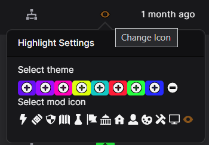<figcaption><p>You can highlight mods here!</p></figcaption></figure> <figure>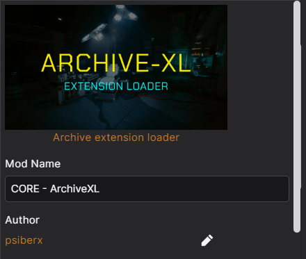<figcaption><p>Double click a mod to bring this menu up!</p></figcaption></figure></div>

</details>



#### Disable Half Your Mods

Not including the mods listed above, select half of your enabled mods and **disable them**.&#x20;


This can be done easily by clicking on the mod at the top of the list, then scrolling down and pressing `SHIFT` on your keyboard when you select another mod.&#x20;




#### Launch The Game

You need to launch the game to see what your next step is.

**If the issue is gone**

* The problem mod exists in the mods you disabled. You need to continue to Step 3.

**If the issue still occurs**

* The problem mod is in the mods you kept enabled. You need to repeat Steps 1 and 2 **with these mods** until you've found the problem mod.&#x20;



#### Swap Halves <a href="#swap-halves" id="swap-halves"></a>

If your game launched with no issues in the previous step, disable the mods you just launched the game with and re-enable the other half. The problem mod should be in this set.

Now that you've narrowed it down slightly, you need to repeat Steps 1 and 2 **with these mods** until you've found the problem mod.&#x20;



#### Remove The Problem Mod

Once you've bisected all the way down to enabling a single mod, you've found the one causing trouble. Remove the mod and launch your game again.


You can also check to see if it's recently been updated, but if it hasn't, you'll need to remove it


The issue should now be gone. Happy game!



<figure><figcaption><p>A visual guide for bisecting with a mod manager!</p></figcaption></figure>

***

### Bisecting Manually

If you've manually installed your mods, you'll need to bisect them manually too. Even if it seems like a lot of work, it's the quickest way to find the problem mod.&#x20;


If you already know which folder contains the broken mod, skip to Step 2.

You can find a video of the process [below](./#bisect-video-demonstration).


The table below shows which folders contain mod files. All of these can be found in [your game directory](../users-modding-cyberpunk-2077/the-cyberpunk-2077-game-directory/#what-is-the-game-directory). You'll need to reference this table to find where the broken mod is.

| File Path                                   | Explanation                                                           |
| ------------------------------------------- | --------------------------------------------------------------------- |
| `\mods`                                     | Contains REDmods, can contain many file types in their own subfolders |
| `\archive\pc\mod`                           | Contains `.archive` and `.xl` files, for Archive-XL-based mods        |
| `\bin\x64\plugins\cyber_engine_tweaks\mods` | Contains Cyber Engine Tweaks-based mods                               |
| `\r6\scripts`                               | Contains Redscript-based mods                                         |
| `\r6\tweaks`                                | Contains RED4ext-based tweaks                                         |

#### Where Do I Even Start?



#### Find The Problem Folder

* Navigate to `Cyberpunk 2077\mods`
  * Rename it by adding an underscore to the end. It should now be called `mods_`
  * Create a new folder called `mods` in [your game directory](../users-modding-cyberpunk-2077/the-cyberpunk-2077-game-directory/#what-is-the-game-directory)
* If this folder is empty, navigate to `Cyberpunk 2077\archive\pc\mod`
  * Rename the `\mod` folder by adding an underscore to the end. It should now be called `mod_`
  * Create a new folder called `mod` inside the `\pc` folder


You only ever need to rename the last subfolder in any file path, such as the `plugins` folder, `scripts` folder, or `tweaks` folder.


* You now need to launch the game. You will now run into one of these two scenarios:
  * The problem is gone, which means you've already found where the problem mod is, and you can move on to Step 2
  * The problem persists, which means you need to **repeat the above process with the rest of the folders in the table** until you find the folder it's in.


You can put the innocent folders back, if you want. Due to the way mods are loading, there won't be side-effects.




#### Re-enable Half Your Mods


The process is the same if you are moving files or folders!


When you've found the folder with the problem mod, you're ready to actually bisect.&#x20;

Open up the folder you added an underscore to. This is your **backup folder.**

Move half of the mods from your **backup folder** into the folder you created - the one that doesn't have an underscore. This is your **game folder.**

<figure><figcaption><p>For all the visual learners out there</p></figcaption></figure>


You'll need to remember (roughly) which batch you moved (e.g. "everything after `E`" or "the first 100 mods")




#### Launch The Game

You need to launch the game to see what your next step is.

**If the issue is gone**

* The problem mod exists in the mods in your backup folder.&#x20;


You now need swap the mods you have installed.

* The mods you most recently put into your [**backup folder**](#user-content-fn-1)[^1] need to go into your [**game folder**](#user-content-fn-2)[^2]
* Any mods currently in your [**game folder**](#user-content-fn-2)[^2] need to go into your [**backup folder**](#user-content-fn-3)[^3]

You can now proceed to Step 4!&#x20;

If you've bisected to the point of only having one mod left to test, you can move on to Step 5!


**If the issue still occurs**

* The problem mod is in the mods you re-enabled. You need to proceed to Step 4.



#### Disable Half Your Mods

Now, you need to take half of the mods in your [**game folder**](#user-content-fn-2)[^2] and place them into your [**backup folder**](#user-content-fn-1)[^1]**.**&#x20;

**Repeat Steps 4 and 5 until you find the problem mod!**



#### Remove The Problem Mod

Now that you've found the problem mod, it's time to remove it from your game.


You can also check to see if it's recently been updated, but if it hasn't, you'll need to remove it


The issue should now be gone. Happy game!



#### **Bisect: Video Guide**



***

## Log Files

<figure><figcaption></figcaption></figure>

The game's log files tend to be a bit unhelpful, but log files from mods tend to be more useful.&#x20;


If you get a "Whoa! Cyberpunk 2077 has flatlined" error, [click here to see more information.](./#whoa-cyberpunk-2077-has-flatlined)


#### Where Can I Find Mod Logs?

Quite a lot of mods will create a log file, but only a few of them are useful when it comes to troubleshooting. Check the table below to see where to find them!

<table><thead><tr><th width="251.5999755859375">Log File Name</th><th>File Path</th></tr></thead><tbody><tr><td>redscript_rCURRENT.log</td><td><code>\Cyberpunk 2077\r6\logs</code></td></tr><tr><td>red4ext-[NUMBERS].log</td><td><code>\Cyberpunk 2077\red4ext\logs</code></td></tr><tr><td>cyber_engine_tweaks.log</td><td><code>Cyberpunk 2077\bin\x64\plugins\cyber_engine_tweaks</code></td></tr></tbody></table>


ArchiveXL and TweakXL also have log files, but they're not as useful for troubleshooting as the ones listed above.

You can find these log files here:

ArchiveXL-\[NUMBERS].log  - `\Cyberpunk 2077\red4ext\plugins\ArchiveXL`

TweakXL-\[NUMBERS].log - `\Cyberpunk 2077\red4ext\plugins\TweakXL`


#### Isn't There An Easier Way?

If you don't want to find logs individually, and just want a script that finds them for you, you're in luck!

Download [Doctor Presto's FindAllErrors script](https://github.com/DoctorPresto/Cyberpunk-Helper-Scripts/blob/main/FindAllErrors.bat)&#x20;

<div align="center" data-full-width="false"><figure><figcaption><p>Click this button at the top!</p></figcaption></figure></div>

Now, you can either:

1. Move it to your Cyberpunk install folder and double-click it
2. Drag-and drop your Cyberpunk folder on the file that you downloaded


After running, the script will have created a folder `_LOGS` in your [Cyberpunk game directory](../users-modding-cyberpunk-2077/the-cyberpunk-2077-game-directory/), which contains a file listing all the log files for you.


The list will give you useful information along with a list of files to check. Once you've found the broken mod, you can go [here](./#dealing-with-a-broken-mod) for instructions on how to troubleshoot further – they also tell you when you should ask for help!

***

## Removing All Your Mods

<figure><figcaption></figcaption></figure>

You've been troubleshooting for too long and just want to start over again. Lucky for you, we have instructions for that too.&#x20;

By far, the easiest way to reset your install to an unmodded state is by using [Mod Remover](https://www.nexusmods.com/cyberpunk2077/mods/8597) <sup>(also on</sup> [<sup>GitHub</sup>](https://github.com/manavortex/cyberpunk2077/blob/master/batch/cyberpunk2077_disable_all_mods.bat)<sup>)</sup>. Thanks to our very own [Manavortex](https://www.nexusmods.com/profile/manavortex?gameId=3333), manually removing all your game folders is entirely unnecessary.&#x20;

You can also use this to temporarily disable your mods, as it creates a full backup for you.


If you're using a mod manager, **you need to purge/disable your mods there first.**


Make sure to read the mod description, it has very thorough instructions. The mod remover itself also has instructions at every step of the way.


This is **much, much quicker** than manually removing all of your game folders. Promise.


<figure>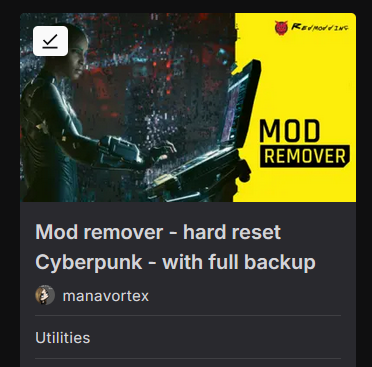<figcaption><p>Removing mods? We have a mod for that!</p></figcaption></figure>

If you're absolutely set on doing it manually, you can follow the steps in the dropdown below.


Just reinstalling the game through GOG/Steam/Epic does not remove mods, and is a waste of time.


<details>

<summary><strong>Manually Resetting Your Game Install</strong></summary>


Unless you back them up, your mods and settings will be **lost**. If you don't want that, make backups of the following folders:

* `/mods`
* `/archive/pc/mod`
* `/bin/x64/plugins/cyber_engine_tweaks`
* `/r6/scripts`
* `/r6/tweaks`

[Mod Remover will do all of this for you! It's not too late to use that instead!](https://www.nexusmods.com/cyberpunk2077/mods/8597)


#### Option 1: Minimal (Re-download less than 1GB)


Unless you [back up your mods and scripts](./#back-it-up-baby), all your settings and manually installed mods will be lost.


Rename or remove the following folders. If you do not have them, you don't need to do anything.

<pre><code>/<a data-footnote-ref href="#user-content-fn-4">mods</a>
/<a data-footnote-ref href="#user-content-fn-5">plugins</a>
<a data-footnote-ref href="#user-content-fn-6">/engine</a>
/r6
<a data-footnote-ref href="#user-content-fn-7">/red4ext</a>
<a data-footnote-ref href="#user-content-fn-8">/archive/pc/mod</a>
<a data-footnote-ref href="#user-content-fn-9">/bin/x64/plugins</a>
</code></pre>

Afterwards, **verify your files**.

#### Option 2: Quick (Re-download less than 4GB)


Unless you [back up your mods and scripts](./#back-it-up-baby), all your settings and manually installed mods will be lost.



The instructions below tell you which folders **not** to delete. Delete everything else.


1. Go to the `Cyberpunk 2077` [directory](../users-modding-cyberpunk-2077/the-cyberpunk-2077-game-directory/#what-is-the-game-directory)
2. **Keep** the `archive` folder. Delete everything **else**.
3. Inside `archive`, **keep** the `pc` folder. Delete everything **else**.
4. Inside `pc`, **keep** the `content` and `ep1` folders. Delete everything **else**.
5. **Verify your files.**

#### Option 3: Thorough (Re-download everything)

In case neither of the above options are good enough for you, you can find a full reinstall guide on [CDPR's support page](https://support.cdprojektred.com/en/cyberpunk/pc/sp-technical/issue/2233/how-do-i-clean-install-my-game).

</details>

<details>

<summary><strong>Deleting User Settings</strong></summary>


You almost never need to do this.


If you want to remove anything that Cyberpunk might have stored on your disk, you need to find and delete the following folders (as per [CDPR's own troubleshooting guide](https://support.cdprojektred.com/en/cyberpunk/pc/sp-technical/issue/2233/how-do-i-clean-install-my-game):

* `%userprofile%\Saved Games\CD Projekt Red\Cyberpunk 2077`
* `%userprofile%\AppData\Local\REDEngine`
* `%userprofile%\AppData\Local\CD Projekt Red`

You can quickly navigate to the folders by pasting the path into your Windows Explorer's path bar, or pressing `Windows` + `R`, pasting the path there.

</details>

<details>

<summary><strong>Doing Mod Remover's Steps Yourself</strong></summary>

If you're curious to see (more-or-less) what Mod Remover does, don't want to download scripts from the internet, or just want to see what resetting your game was like before it was created, you can read below!


You can still follow these steps yourself, but rest assured that Mod Remover does the exact same thing far quicker!


#### **Step 1: Disable REDmods And Archive Mods**

Find The Following Folders:

```
Cyberpunk 2077\archive\pc\mod
Cyberpunk 2077\mods
```

Rename them to

```
Cyberpunk 2077\archive\pc\mod_
Cyberpunk 2077\mods_
```


The purpose of renaming them is that the game won't find them anymore, but you still have a back-up of the files inside. Feel free to achieve this goal however.


You can optionally create a new, empty folder with the same name.


Check if the problem is gone.

If it is, put the folders back one after the other and apply the [bisection method](./#bisecting-manually).


#### **Step 2: Disable CET**

Find the folder:

```
Cyberpunk 2077\bin\x64\plugins\cyber_engine_tweaks
```

Move it out of `plugins` (e.g. put it on your desktop).


If you'd rather delete it, make sure that you retain a copy of your `mods` and `plugins` directories, as they contain your mod settings (AMM decorations etc.)



Check if the problem is gone.

If it is, put the folder back and apply the [bisection method](./#bisecting-manually) to `cyber_engine_tweaks\mods` and `cyber_engine_tweaks\scripts` until you have found the culprit.


#### **Step 3: Remove Scripts And Tweaks**

First, remove (or rename) the cache:

```
 r6/cache/modded
```


[Verify game files.](./#verify-repair-game-files) Check if the problem is gone.


If that didn't do the trick, find the following folders:

```
Cyberpunk 2077\red4ext
Cyberpunk 2077\r6\scripts
Cyberpunk 2077\r6\tweaks
Cyberpunk 2077\engine\tools
```

Rename them. You know the drill.


Check if the problem is gone.

If it is, put them back one by one until you find the one that breaks it. If that is one of `r6\scripts` or `r6\tweaks`, apply the [bisection method](./#bisecting-manually).


#### Step 4: Remove RedScript

**Delete** the following files and folders. You don't need a backup, as you can reinstall RedScript from [Nexus](https://www.nexusmods.com/cyberpunk2077/mods/1511). If any of them don't exist, that's okay — just means you don't have to delete them.

```
Cyberpunk 2077\bin\x64\d3d11.dll
Cyberpunk 2077\bin\x64\global.ini
Cyberpunk 2077\bin\x64\powrprof.dll
Cyberpunk 2077\bin\x64\winmm.dll
Cyberpunk 2077\bin\x64\version.dll
Cyberpunk 2077\engine\config
Cyberpunk 2077\engine\tools
Cyberpunk 2077\r6\cache
Cyberpunk 2077\r6\config
Cyberpunk 2077\r6\inputs
Cyberpunk 2077\V2077
```


@Auska has compiled a handy script for unix people:


```
rm ./bin/x64/d3d11.dll
rm ./bin/x64/global.ini
rm ./bin/x64/powrprof.dll
rm ./bin/x64/winmm.dll
rm ./bin/x64/version.dll
rm ./engine/config
rm ./engine/tools/*
rm ./red4ext
rm ./r6/cache
rm ./r6/config
rm ./r6/inputs
rm ./V2077

mv ./r6/cache/final.redscripts.bk ./r6/cache/final.redscripts
```

#### Step 5: Repair/Verify Game Files

You need to verify your game files through your launcher (GOG/Steam/Epic). [If you're not sure how to do that, check here!](./#verify-repair-game-files)

#### Step 6: Launch The Game

All files you deleted have been re-acquired. **If there are no left-over files from earlier modding attempts,** your game should work now.


If it does not and you have exhausted the reset options as specified in this guide and your game **still** does not start, then your problem exists outside of Cyberpunk. In this case, you can

* Check your [file permissions](./#files-permissions-errors) (separately for REDprelauncher.exe)
* [Check you've done every step in this red box!](./#troubleshooting-first-steps)
* [Join the discord](https://discord.gg/redmodding)
* Google your error message and try solutions at random (truly a last resort, and you'll probably just end up back here)


#### Step 7: Install The Core Frameworks

Now that your un-modded game is starting, it's time to [install the core frameworks, which you can find listed in Step 1 here](./#troubleshooting-first-steps).&#x20;

Do this **before** you enable your other mods, as they won't work without their dependencies and can only add problems at this stage.


You can now re-enable your mods. Do it in chunks and check that the game keeps working so that you can narrow down where the problem is, in case it isn't gone for good.


</details>

***

### Verify / Repair Game Files

If you're not sure how to verify your game files, click below to find the instructions for your game launcher.

Thanks to @ArsenicTouch for the guides!



1. Go to `Games` -> `Installed`&#x20;
2. Right-click on your game&#x20;
3. Mouse over `Manage installation`
4. Select the following menu entry:

.png>)



1. Open your library
2. Right-click on `Cyberpunk 2077`
3. Select `Properties...`

<figure>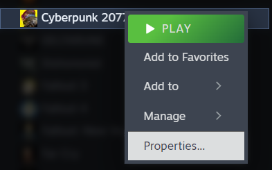<figcaption></figcaption></figure>

4. Select `Installed Files`
5. Click `Verify integrity of game files`

<figure>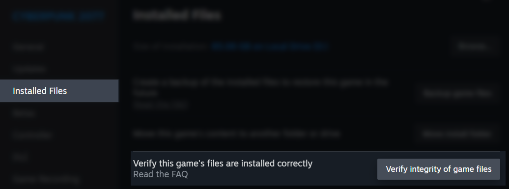<figcaption></figcaption></figure>



1. Open your `Library`
2. On the Cyberpunk 2077 tile, find the `…`
3. Select `Manage`
4. Click `Verify`



***

## Mods Removed. Now What?

<figure><figcaption></figcaption></figure>


If you were manually installing before, [please consider using a mod manager going forward!](../users-modding-cyberpunk-2077/#mod-manager-options)


Try launching the game completely unmodded to make sure you've done everything right. If you have, the game should launch without any issues!

**If it doesn't launch**, you either have leftover files and need to re-do your previous step, or you have a problem that is not related to Cyberpunk.&#x20;


If you're sure all your files have been removed, double check everything below:

* You have verified your game files
* Your **graphics driver** is up-to-date
* Your [**Windows**](https://support.microsoft.com/en-us/windows/get-the-latest-windows-update-7d20e88c-0568-483a-37bc-c3885390d212) is up-to-date (no, _really_) and that you are at least on Windows 10
* You have the most recent version of [.NET Desktop Runtime](https://dotnet.microsoft.com/en-us/download/dotnet/thank-you/runtime-desktop-7.0.3-windows-x64-installer) installed
* You have [Visual C++ Redistributable 2022](https://learn.microsoft.com/en-us/cpp/windows/latest-supported-vc-redist?view=msvc-170) installed ([direct download](https://aka.ms/vs/17/release/vc_redist.x64.exe), Microsoft)
* Your game is running from an SSD (Solid State Disk) rather than a HDD


**If your game does launch,** and you want to mod the game again, re-install the core mods.&#x20;


If you're using a mod manager, you can simply re-enable these mods through that, although you can remove and re-install them to be extra cautious.


Not sure what they are? Here's a list:

* [ArchiveXL](https://www.nexusmods.com/cyberpunk2077/mods/4198)
* [Codeware](https://www.nexusmods.com/cyberpunk2077/mods/7780)
* [Cyber Engine Tweaks](https://www.nexusmods.com/cyberpunk2077/mods/107)
* [RED4ext](https://www.nexusmods.com/cyberpunk2077/mods/2380)
* [redscript](https://www.nexusmods.com/cyberpunk2077/mods/1511)
* [TweakXL](https://www.nexusmods.com/cyberpunk2077/mods/4197)

Once they're re-installed, **launch the game.**&#x20;


Don't worry about your save games — they're fine, even if they don't load right now.

If you need to check in-game but can't load a save, try opening a non-modded one, or create a new one!


**If your game launches without issue**, you can re-install your mods through your mod manager or from your backup folders. If you want to be extra cautious, you can try a fresh download of them all. If you start getting errors when re-installing mods, [you'll need to bisect your mods.](./#bisecting)&#x20;

[If you're unsure on how to mod your game, or just want a refresher, you can follow this page.](../users-modding-cyberpunk-2077/#installing-mods)

**If your game does not launch**, double check the red box above.


You **need** to complete this step before proceeding: if the core mods aren't working **on their own**, they won't work **with other mods on top** – adding anything else will make troubleshooting more difficult.

Install them one by one. If you need help, you can find us on [Discord](https://discord.gg/redmodding) (`#mod-troubleshooting`)


***

***

## Dealing With Broken Mods

<figure><figcaption></figcaption></figure>

You followed all the steps and your game launches, but you now have a mod on your hands that doesn't work, and you want it to. What do you do now?


Before you do anything listed below, [go back to the very top of this page](./#troubleshooting-first-steps) and double check you've done all the troubleshooting first steps.&#x20;

Everyone messes up downloading mods sometimes, and it's never a bad idea to double check if it's user error first.


***

#### Contact The Mod's Author

Describe your problem as clearly as you can, and add any useful information.


Keep in mind that you're asking a **favour**. The modder doesn't know the issue, and if they do, they know **exactly** how to fix it. A lot of mod users will leave non-descript "mod broke" comments, and some leave abuse because of it.&#x20;

A mod author is much more likely to respond if you're civil and give relevant information.


**Example - Bad Bug Report**

<figure><figcaption><p>"Your mod doesn't work lol pls help" isn't useful to anyone!</p></figcaption></figure>

**Example: Good Bug Report:**

<figure>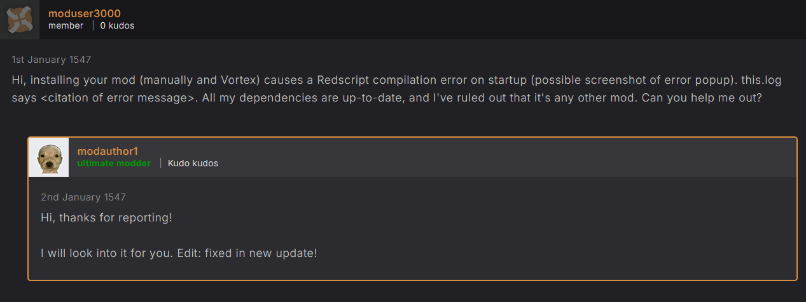. All my dependencies are up-to-date, and I&#x27;ve ruled out that it&#x27;s any other mod. Can you help me out?&#x22;. The author replies &#x22;Hi, thanks for reporting! I will look into it for you. Edit: fixed in new update!&#x22;"><figcaption><p>This is much more useful to a mod author because they actually have information to work with</p></figcaption></figure>

***

#### Fix It Yourself

At this point, you have exhausted all easily accessible solutions. If you want the mod to work, you'll have to get your hands dirty. That's the kind of passion the modding community thrives on.


This is the point where you might want to join the [modding discord](https://discord.gg/redmodding), because now you're entering the territory where other modders can actually help you. Head over to `#mod-dev-chat` first!


<details>

<summary><strong>Checking Log Files</strong></summary>


[Not sure where to find log files? Click here!](./#log-files)


Usually, there's a log file that points you to the source of the problem. If there isn't one, and the mod just fails silently, that means the error is **inside the archive** and you have to become a modder.

</details>

<details>

<summary><strong>Fixing scripts</strong></summary>

Sometimes, the error is in a script file. You can tell this by a log entry pointing to a file in your Cyberpunk folder (e.g. `r6\scripts\mod_name.reds`).

Open the file in a text editor like [Notepad++](https://notepad-plus-plus.org/downloads/) and try to fix the problem. Check to see if the [log file](./#log-files) has more information.&#x20;

See if an online syntax check can help you — there isn't one for redscript, but it's fairly close to [lua](https://www.lua.org/pil/1.html).


Occasionally, mistakes are simple — a forgotten `,` or incorrect file encoding. Often, they are not that simple.



A tip for [nil access error in lua](../../for-mod-creators-theory/references-lists-and-overviews/scripting/scripting-best-practices-pitfalls.md#fixing-preventing-nil-access)


</details>

<details>

<summary><strong>Ascending From User To Modder</strong></summary>

If the error isn't in any script files, you'll have to **unbundle the `.archive`**, load it in [WolvenKit](https://github.com/WolvenKit/Wolvenkit/releases), and get your hands dirty. We'll be seeing each other, choomba!

</details>

[^1]: This one has an underscore, e.g \archive\pc\mod\_

[^2]: This one doesn't have an underscore, e.g. \archive\pc\mod

[^3]: This one has an underscore, e.g. \archive\pc\mod\_

[^4]: .archive mods in the redmod format

[^5]: an ancient plugin directory that hasn't been used for several game updates, but that can still cause trouble

[^6]: config and shader caches

[^7]: red4ext frameworks and associated data

[^8]: .archive mods in the legacy format, not redmod

[^9]: LUA plugins such as cyber engine tweaks
