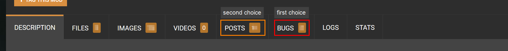

# Broken mods: How to help


This page assumes that you have made use of the [troubleshooting guide](./), have identified a broken mod and want to help fixing it.

It will help you **rule out side effects** and **collect** [**th**](#user-content-fn-1)[^1]**e necessary information** for a bug report. Of course you can always [reach out](broken-mods-how-to-help.md#step-3-reaching-out), but there's a good chance that you'll be asked to do the stuff on this list, so you might as well do it first.&#x20;

If you can't or won't do that, please [check at least Step 0](broken-mods-how-to-help.md#step-0-check-the-nexus-page)!


## Thank you!

Without people like you, many bugs would never be discovered and fixed, and modding would be even more frustrating than it already is. So **thank you** for taking the time!

## Step 0: Check the Nexus page

### Are you on the most recent version?

> "Crashes when you equip your strap-on? I fixed that a month ago. Just update! :)"

Make sure that you're on the most recent version of both the mod. You probably are, but — better double-check.


This recommendation comes from a professional software developer, who has "fixed" more than one software problem by _just updating the software_.


### Is there a "known issues" section or a pinned comment?

Maybe the mod author knows about this problem and hasn't been able to fix it. If they do, then either the **description** will mention it, or there will be a pinned post in the comments section.&#x20;

If there isn't either, then you have found something new. Exciting!&#x20;

## Step 1: Isolate

The first step is to **isolate** the problem. Make sure that it is exactly this mod and no other. It works like this:

1. Temporarily [remove all mods](./#step-1-temporarily-disable-all-your-mods) from your game.
2. Install **only** the problem child together with **all** [**dependencies**](../users-modding-cyberpunk-2077/requirements-explained.md). Make sure that they're all on the most recent version. Does the problem still happen? \
   _(If not, then it's something else)_
3. Now, disable **only** the problem child. Does the problem go away?\
   _(If not, then it's one of the dependencies)_


If the problematic mod is a core framework, please read [the next section](broken-mods-how-to-help.md#for-a-core-framework) as well.


If you can **reliably reproduce** the problem (that's Netrunner speech for "it happens every time without fault"), then you have everything you need for a bug report.

### For a core framework

If your problem child isn't one of [these mods](../../for-mod-creators/core-mods-explained/), you don't need to read this.

The core frameworks are generally **extremely stable**. That's not to say that they don't have bugs, but such bugs are generally found and fixed quickly.&#x20;

If you suspect that one of them is the cause of your crash, make **very sure** that you have no **dependent mods** installed, since those will be inactive as long as the dependency isn't there (think of it like a fuse box: without electricity, the fridge can't keep making that noise).

## Step 2: Gather the necessary data

Since your problem could be anything, we'll go about it the other way. I'll list everything that you **could** include, and tell you when it's needed.&#x20;

### Reproduction steps

**When: Always**

Any information you collect is helpful, but fixing a bug is easiest if you can watch it with your own eyes. For that reason, we need a list of the exact steps needed to make the problem happen.

Write the steps they need to **do**, not the ones they don't.&#x20;

<details>

<summary>A lengthy example in case you're unclear about why you'd need a list</summary>

Imagine the following (hypothetical) bug report:

OK, so the game crashes with only your mod and its dependencies (ArchiveXL, TweakXL, Red4ext) installed! I'm on the most recent version. Here's what I did:\
I created a new character. Has to be a nomad, female body gender and male brain gender, doesn't work if it's anything else (I made a hot blonde, here's a screenshot, aren't they cute?) Then I added the pink unicorn hat and the Sword of Truth via cheat. Has to be the sword, the Mace of Maybe works! Then hit the car mechanic and the game crashes. Oh yeah, it only does that if you do the hat before the sword! And also only on the pink version, the green variant works fine! Cheers!

Do you know what to do? I lost track halfway through, and I _wrote_ that. Also, did they equip the items, or is it enough to have them in your inventory?

This here is much clearer:

1. Have a clean install (ArchiveXL, TweakXL, Red4Ext, version 1.2.3. of This Mod Doesn't Exist)
2. Create a new character (female body gender, male brain gender, Nomad lifepath)
3. Add the pink unicorn helmet via CET command `Game.AddToInventory("Items.this_is_just_an_example")`
4. Add the Sword of Truth via CET command `Game.AddToInventory("Items.this_is_also_just_an_example")`
5. _Optional: you can create a save here_
6. Equip the helmet
7. Equip the sword
8. Hit the car mechanic
9. the game crashes

</details>

### Save game

**When:** If the problem happens

* at a certain location or a certain quest phase
* when loading into exactly this save (if it happens for all of your saves, then it's probably not needed)

Your save games can be found in the following folder:

```
%USERPROFILE%\Saved Games\CD Projekt Red\Cyberpunk 2077
```

which is the same as

```
C:\Users\<yourusername>\Saved Games\CD Projekt Red\Cyberpunk 2077
```

Find your individual save game folder (e.g. `AutoSave-0`) and [create a zip](https://support.microsoft.com/en-us/windows/zip-and-unzip-files-f6dde0a7-0fec-8294-e1d3-703ed85e7ebc).

### Log files

**When:** If the problem child

* adds an error in any log files that doesn't happen without it (use the [error checker tool](finding-and-reading-log-files.md#finding-the-log-files))
* Is a plugin (lives in `Cyberpunk 2077/bin/x64/plugins)`
* Is **dependent on a plugin** (like above, but with more subfolders)

**What:**&#x20;

* The log file with the error
* If it's a plugin mod, then add the plugin's log. Most common here is Cyber Engine Tweaks; the log file is `Cyberpunk 2077/bin/x64/plugins/cyber_engine_tweaks/cyber_engine_tweaks.log`

### Crash report

**When:** If the problem child is one of the [core frameworks](../../for-mod-creators/core-mods-explained/).


These mods are the foundation that everything else builds on, and the people who develop and maintain them are incredibly competent. Please don't waste their time — make **very sure** that you have [isolated](broken-mods-how-to-help.md#step-1-isolate) the problem. You don't call your internet provider before checking your network cable and restarting your router!


You can find the crash reports in this folder:

```
%USERPROFILE%\AppData\Local\REDEngine\ReportQueue
```

which is the same as

```
C:\Users\<yourusername>\AppData\Local\REDEngine\ReportQueue
```

Find the most recent one (e.g. `Cyberpunk2077-20230816-225038-11372-16140`) and [create a zip](https://support.microsoft.com/en-us/windows/zip-and-unzip-files-f6dde0a7-0fec-8294-e1d3-703ed85e7ebc).

## Step 3: Reaching out

You're 100% sure that the mod is the cause of the problem, and you have collected the necessary information, so now you can reach out and provide a helpful bug report.&#x20;

The first place to go is the mod's **Nexus page**.

1. If there is a `Bugs` tab, you can create a new bug report
2. If there is a `Posts` tab, you can leave a post&#x20;
3. If there is a `Comments` tab, you can drop a comment
4. If there is neither, you can try and message the author (click on their Nexus profile name)

<figure><figcaption></figcaption></figure>

## Step 4 (optional): Discord

If you can't reach the mod author, you're welcome to hit up the [redModding Discord](https://discord.gg/hUdjp4JP), for example in `#mod-troubleshooting`. Someone there might be able to get the word out.

### Corrupt(ish) saves

If you have found a mod that [corrupts save games](./#corrupt-ish-saves) until it is installed again, **please let us know** so that we can update the troubleshooting guide!&#x20;

[^1]: 
