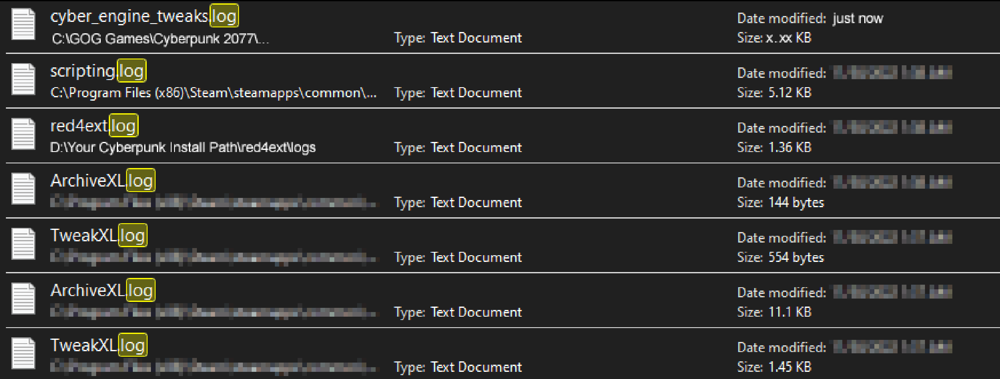

# Finding and reading log files

## A list of framework logfiles

This section has a list of log files by framework. If you've arrived here from one of the troubleshooting channels on [Discord](https://discord.gg/redmodding), the file you're supposed to find is most likely in this list.

If you aren't looking for a particular log file, please proceed to [the next section](finding-and-reading-log-files.md#finding-the-log-files).


The paths below are given **relative** to your Cyberpunk 2077 install directory.


<table><thead><tr><th width="294">Name of framework</th><th>Path to log file</th></tr></thead><tbody><tr><td>redscript</td><td><code>r6\logs\redscript_rCURRENT.log</code></td></tr><tr><td>red4ext</td><td><code>red4ext\logs\red4ext.log</code></td></tr><tr><td>ArchiveXL</td><td><code>red4ext\plugins\ArchiveXL\ArchiveXL.log</code></td></tr><tr><td>TweakXL</td><td><code>red4ext\plugins\TweakXL\TweakXL.log</code></td></tr><tr><td>Cyber Engine Tweaks</td><td><code>bin\x64\plugins\cyber_engine_tweaks\cyber_engine_tweaks.log</code></td></tr></tbody></table>


## Finding the log files

If you don't want to download and run script files from the internet, you can go [here](finding-and-reading-log-files.md#alternatively-by-hand) and complete the steps by hand. Otherwise:

1. Download [this script](https://raw.githubusercontent.com/DoctorPresto/Cyberpunk-Helper-Scripts/main/FindAllErrors.bat) (**right-click -> save as**)\
   _Link goes to Presto's_ [_github repository_](https://github.com/DoctorPresto/Cyberpunk-Helper-Scripts/blob/main/FindAllErrors.bat)
2. Now, do either of the following things:&#x20;
   1. Move it to your Cyberpunk install folder and double-click it
   2. Drag-and drop your Cyberpunk folder on the file that you downloaded
3. The script will have created a folder `_LOGS` in your Cyberpunk directory, which contains a file listing all the things for you.

### Alternatively: By hand

Browse to your [**Cyberpunk game folder**](#user-content-fn-1)[^1] and use the windows search to search for `*.log.`


Make sure to include the asterisk and the dot: \*`.log`, as you will otherwise see files that you don't care about.



Make sure to run this [**in the game's root folder**](#user-content-fn-2)[^2], unless you have already narrowed down the problem (e.g. if it's a CET mod, you can run this search in `bin\x64\plugins\cyber_engine_tweaks`).


The list of results should look like this:

<figure><figcaption><p>This will give you a long list of log files</p></figcaption></figure>


You can sort this list by `file size`, `name`, or `date modified` by clicking on the corresponding header.


With a few exceptions, log files **have the name of their mod**. If they don't, check what folder they're in.

## There's too many of them!

If you're drowning in log files and have no idea how to filter them, you can **delete** **or remove** them. Don't worry, they will be re-created on next launch.


Don't delete anything that isn't Type: `Text Document` ending in `.log`! Doing that will break other mods or even your entire install.


Now, restart your game and do whatever you did to make the error appear. Then, search the Cyberpunk directory for `*.log` again.

## Finding the relevant log file


You can ignore files that&#x20;

* have a `date modified` older than your last game launch: they won't have any information about your problem
* have a size of 0: they're empty, the mod in question never initialized.


1. Sort the files by `size` (if you just deleted them) or by `date modified` (if you didn't)
2. Open each of the files in a text editor (such as Notepad, it's installed with Windows). The relevant information will be at the very bottom.
3. You are looking for lines with `error` or `warning`. If you want to see what they look like, scroll down to the [next section](finding-and-reading-log-files.md#making-sense-of-them).
   1. If the log file doesn't have any, ignore it. Close it and proceed to the next file.
   2. You found errors: Congratulations, you've  found at least silver. Check [here](finding-and-reading-log-files.md#error) for how to proceed.
   3. You found warnings: These _might_ indicate that you're on to something, but don't let them panic you. If the mod is doing what it should, just ignore them. You can [start troubleshooting](finding-and-reading-log-files.md#warning) already, or keep looking for errors.

## Making sense of them

### Error


There's definitely something going on here, you're on the right track!


Errors look like this:

```
[2023-04-15 12:04:18.956] [error] |Something| Some Explanation
[2023-04-14 20:28:18 UTC+01:00] [1234] [ErrorSource]  DoSomething(): Error ! Some Explanation: Some Details
```

An error in the log files almost always means that something exploded in a way that nobody has planned for.&#x20;

* If the file is **directly** in `bin\x64\plugins\cyber_engine_tweaks`, that means CET is broken and you need to [troubleshoot it](./#dealing-with-a-broken-mod).&#x20;
* If the file is **in a subfolder** of `bin\x64\plugins\cyber_engine_tweaks`, you have found a broken mod, but CET mods won't break the game. In this case, treat it like a [warning](finding-and-reading-log-files.md#warning).
* If the log is anywhere else, you have found [something to troubleshoot](./#dealing-with-a-broken-mod).

### Warning


If the mod with the warnings is working, you can ignore them.\
If the game is crashing or if you can't find any errors, you can try the [bisect method](./#finding-the-broken-mod-bisecting) or [troubleshoot it](./#dealing-with-a-broken-mod) and hope that you're lucky.


If your warning isn't listed below, use your own best judgement.

#### Field with this name is already defined

```
[WARN - Thu, 13 Apr 2023 21:54:13 +0200] At Path\to\Cyberpunk 2077\r6\scripts\something.reds:1234:1:
@addField(inkScrollArea)
^^^
field with this name is already defined in the class, this will have no effect
```

This **might** indicate that a Redscript mod is loaded twice. Search the Cyberpunk root folder the mod name and make sure that you have no duplicates. If you're uncertain about this, try the [bisect method](./#finding-the-broken-mod-bisecting) on your `r6` folder.

[^1]: The directory where your game is installed. It's most likely called Cyberpunk 2077. Contains the folders archive, bin, engine… and the REDprelauncher.exe

[^2]: The directory where your game is installed. It's most likely called Cyberpunk 2077. Contains the folders archive, bin, engine… and the REDprelauncher.exe
