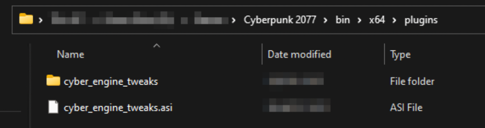

# Users: Troubleshooting CET

This is the troubleshooting page for [Cyber Engine Tweaks](https://www.nexusmods.com/cyberpunk2077/mods/107) (CET). For general troubleshooting, go [here](./). For an explanation of how CET works, see [CET (English)](http://127.0.0.1:5000/o/-MP5ijqI11FeeX7c8-N8/s/-MP5jWcLZLbbbzO-\_ua1-887967055/ "mention").


If you are on **Linux/SteamDeck**, make sure to follow [this guide](../users-modding-cyberpunk-2077/modding-on-linux.md) to install the right .dll overrides before reading on.&#x20;

If your game is pirated, [go here](./#you-pirated-the-game).

If you can't open your overlay, check [#reset-your-keybind](users-troubleshooting-cet.md#reset-your-keybind "mention")&#x20;

If your CET just stopped working (without a game update) or if you've been sent here to do a clean install, see below how to [#reinstall-cet](users-troubleshooting-cet.md#reinstall-cet "mention")

Otherwise, read on for the full troubleshooting instructions.


## Step 0: Go to your install directory

Go to your[ Cyberpunk 2077 game directory](#user-content-fn-1)[^1], since all paths given in this guide will be relative to that folder.&#x20;


TL;DR:

CET is installed to `bin\x64\plugins\cyber_engine_tweaks`

The log file is `bin\x64\plugins\cyber_engine_tweaks\cyber_engine_tweaks.log`

Your keybind is stored in `bin\x64\plugins\cyber_engine_tweaks\cyber_engine_tweaks.log`


#### Example:

<table data-header-hidden><thead><tr><th width="225"></th><th></th></tr></thead><tbody><tr><td>Your <a data-footnote-ref href="#user-content-fn-2">install directory</a></td><td><code>C:\GOG Games\Cyberpunk 2077\</code></td></tr><tr><td>Path from the guide</td><td><code>bin\x64\plugins\cyber_engine_tweaks</code></td></tr><tr><td>Folder you go to </td><td><code>C:\GOG Games\Cyberpunk 2077\bin\x64\plugins\cyber_engine_tweaks</code></td></tr></tbody></table>

## Step 0.5: Update your game and the mod


Each version of CET is compatible with exactly one game version. Nobody keeps track of those other than "the most recent ones work together".


For that reason, the Redmodding Discord can only support you the most recent version.

If there's a mismatch, then you can find a warning in the following file:

```
bin\x64\plugins\cyber_engine_tweaks\cyber_engine_tweaks.log
```

If you don't have that file, proceed to Step 2.

## Step 1: Check the install folder

Go to your[ Cyberpunk 2077 game directory](#user-content-fn-3)[^3] and check the following subfolder:

```
bin\x64\plugins
```

It should have **at least** the following files:

<figure><figcaption></figcaption></figure>

If you do not have these folders, then CET isn't installed correctly. Head to [#reinstall-cet](users-troubleshooting-cet.md#reinstall-cet "mention")and start with step 3.&#x20;

## Step 2: Check for a log file

If everything looks okay in step 1, check if you have a file `cyber_engine_tweaks.log` inside the `cyber_engine_tweaks` folder from the previous screenshot.

* If you **don't** have it, that means CET isn't starting up correctly. The fastest option in this case is to [#reinstall-cet](users-troubleshooting-cet.md#reinstall-cet "mention").
* If you **do** have it, you can open it and try to make sense of the error message. You can find more information on that [here](finding-and-reading-log-files.md#making-sense-of-them), or find help in the #cet-suppport channel on our [Discord](https://discord.gg/redmodding).

## Reinstall CET

1. If you are using Vortex, turn it off (it will get angry otherwise)
2. Complete either of the following steps:
   * rename `bin/x6/plugins` to `plugins_`\
     or
   * delete the file `bin/x6/plugins/cyber_engine_tweaks.asi`
   * move the folder `bin/x6/plugins/cyber_engine_tweaks` out of plugins `(`e.g. your Desktop). Do not delete it yet.
3. Download the most recent CET from [Nexus](https://www.nexusmods.com/cyberpunk2077/mods/107)
4. Extract the downloaded archive to your [game directory](#user-content-fn-4)[^4] (the bin folder will merge with the one that is already there)
5. Start the game: **CET should now ask you to bind a key.** If it doesn't:
   1. [Update both the game and the mod](users-troubleshooting-cet.md#step-1-update-both-the-game-and-the-mod) (double-check if you're sure)
   2. Head to the [troubleshooting guide](./) and follow the steps in the red box at the top
6. **Optional:** Restore your mods and/or settings\
   Now that CET works, find the old directory from step 2. Move the following files/folders:
   1. Mods: the directory `mods` from the old `cyber_engine_tweaks` folder
   2. Settings: The .json files directly inside `cyber_engine_tweaks`
7. **Optional:** delete the old folder (or leave it, it's your diskspace)&#x20;
8. That's it! You're good to go!

## Reset your keybind

1. Find the file `\bin\x64\plugins\cyber_engine_tweaks\bindings.json` and delete it.
2. Start the game.
3. You should now see a popup asking you to bind a key. Otherwise, read on.

### I can't bind a key


If you do not see the popup at all, [check your CET install](users-troubleshooting-cet.md#step-2-check-the-install-folder) or do a [clean reinstall of CET](users-troubleshooting-cet.md#reinstall-cet).


Cick into the "Binding..." field.&#x20;

<figure><figcaption></figcaption></figure>

If that doesn't help, make sure to turn off all your **overlays** (Discord, Steam, Microsoft Game Bar, Random Useless Bloatware) or start Cyberpunk in the **Windowed Borderless** mode.

[^1]: The folder where you installed your game. Steam/Epic/GOG will take you there if you browse game files

[^2]: The folder where you installed your game. Steam/Epic/GOG will take you there if you browse game files

[^3]: The folder where you installed your game. Steam/Epic/GOG will take you there if you browse game files

[^4]: The folder where you installed your game. Steam/Epic/GOG will take you there if you browse game files
