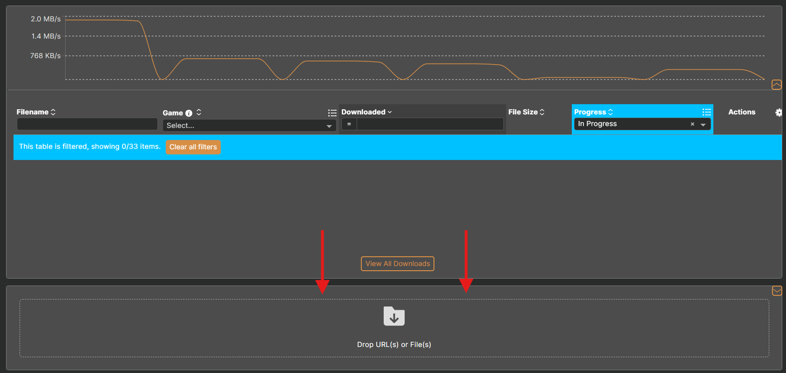

# Using Mods


[user-guide-troubleshooting](../user-guide-troubleshooting/)


## Summary

**Published:** Jun 15, 2023 by [mana vortex](https://app.gitbook.com/u/NfZBoxGegfUqB33J9HXuCs6PVaC3 "mention")\
**Last documented update:** January 18, 2026 by [minnierylands](https://app.gitbook.com/u/VSIYzNHUyRPaBCk2ExHhQzpPfo82 "mention")&#x20;

This page will give you a brief introduction of **how** mods work and how to install them.

***

### Wait, this is not what I want!

<table data-view="cards"><thead><tr><th></th><th data-hidden data-card-target data-type="content-ref"></th><th data-hidden data-card-cover data-type="image">Cover image</th></tr></thead><tbody><tr><td>I need help installing Cyberpunk!</td><td><a href="getting-started/">getting-started</a></td><td><a href="../../.gitbook/assets/installing_cyberpunk.png">installing_cyberpunk.png</a></td></tr><tr><td>I need to troubleshoot my mods!</td><td><a href="../user-guide-troubleshooting/">user-guide-troubleshooting</a></td><td><a href="../../.gitbook/assets/troubleshoot_mods.png">troubleshoot_mods.png</a></td></tr><tr><td>I want to create mods!</td><td><a href="../../modding-guides/getting-started-making-mods.md">getting-started-making-mods.md</a></td><td><a href="../../.gitbook/assets/creating_mods.png">creating_mods.png</a></td></tr></tbody></table>

***

## Installing Mods


We **strongly recommend** using a mod manager. Manual modding is only recommended for **advanced users**.


You mod **Cyberpunk 2077** by adding files to your [**game directory**](the-cyberpunk-2077-game-directory/). The game doesn't need any complicated workarounds to mod, and the core mods will do all the heavy lifting.

You can install mods via [mod manager](./#mod-manager-options) or [manually](./#manual-install). There are upsides and downsides to each — however, **for beginners,** [**we recommend using Vortex**](getting-started/vortex-mod-manager.md).

Overall, your mods will not work unless you

* Put all the files **exactly** into the [correct place](./#mod-folders-by-file-extension)
* Make sure to install **all** [requirements](./#what-are-dependencies-requirements) <sub>_(and_</sub><sub>_&#x20;_</sub><sub>_**their**_</sub><sub>_&#x20;_</sub><sub>_requirements, too)_</sub>
* Have REDmod **enabled** <sub>_(_</sub>[<sub>_REDmod_</sub>](redmod/) <sub>_exclusive)_</sub>


If you're on Linux/Steam Deck, you need to follow [this guide](modding-on-linux.md) to the letter


## Mod Manager Options

Below you can find links to guides for all three supported mod managers for Cyberpunk 2077.&#x20;


If you had terrible experiences with Vortex for other games, be assured: Cyberpunk integration is working extremely well. Maybe give it another chance?


<table data-card-size="large" data-view="cards"><thead><tr><th align="center"></th><th align="center"></th><th data-hidden data-card-cover data-type="image">Cover image</th><th data-hidden data-card-target data-type="content-ref"></th></tr></thead><tbody><tr><td align="center"><h4><strong>Vortex</strong></h4></td><td align="center">Recommended for most mod users. Easy to use.</td><td data-object-fit="contain"><a href="../../.gitbook/assets/vortex-logomark.png">vortex-logomark.png</a></td><td><a href="getting-started/vortex-mod-manager.md">vortex-mod-manager.md</a></td></tr><tr><td align="center"><h4><strong>Mod Organizer 2</strong></h4></td><td align="center">Recommended for anyone already used to MO2. More complicated to use.</td><td data-object-fit="cover"><a href="../../.gitbook/assets/37225415.png">37225415.png</a></td><td><a href="getting-started/mo2-mod-organizer-2.md">mo2-mod-organizer-2.md</a></td></tr></tbody></table>

***

### Manual Install

"Manual install" is a glorified term for "extracting the downloaded archive into your game directory".


**You have to make sure that the right files end up in the correct folders.** \
This method is very error prone, which is why we recommend using a mod manager.&#x20;


You can check the file structure by opening the downloaded file, or by using this feature on Nexus:

<figure><figcaption><p>Some mod authors have this disabled, meaning you won't see this option on the mod page.</p></figcaption></figure>


The file structure is different for REDmods and non-REDmods (often referred to as "`legacy`" mods). Mod authors usually tell you which type their mod is. To lean what the difference is, [read here](./#whats-the-difference).


***

### What Are Requirements?

A requirement (sometimes called "dependencies"), are mods that other mods rely on.&#x20;

This means the mod you want to download **will not work** if you don't **download the listed requirements first**.&#x20;

For more detailed information, see [requirements-explained.md](../user-guide-troubleshooting/requirements-explained.md "mention").


TL;DR:

Unless a requirement is marked as optional, **your mod will not work** if it is not installed.

Some requirements have requirements of their own. Make sure to check.


<figure><figcaption><p>You should be checking for the requirements of the requirements, too. You gotta catch 'em all!</p></figcaption></figure>

***

## The Core Mods


To learn more about this, check [core-mods-explained](../../for-mod-creators-theory/core-mods-explained/ "mention").


Cyberpunk 2077 offers limited out-of-the-box support via REDmod. To allow greater freedom, a number of **core mods** have been created — without them, we couldn't add items, influence the weather, or have flying cars.


Since this kind of mod interacts with the game's executable (`.exe`), they will break every time CDPR updates.

This is the reason why game updates break mods — although you can [**turn off auto-update**](users-downgrading-preventing-auto-updates.md) and only update your game once mods have updated.&#x20;

\
After each patch, you can find a post on our [Discord](https://discord.gg/redmodding) that is kept up-to-date as the modders update their tools.&#x20;

Be aware that **once all the core mods have updated**, you will _not_ recieve support until you have **updated your game and all your core mods**.


### Overview of Mod Folders


TL;DR: you can ignore this unless you want to understand how things work, or want to install mods manually.


This is supposed to give you an overview of which files go where. It is **not** a bucket list of things you have to install.



<table><thead><tr><th width="256">Directory</th><th>explanation</th></tr></thead><tbody><tr><td>\<code>mods</code></td><td><a data-mention href="redmod/">redmod</a> directory: contains .archive mods (in subfolders).<br>Contains only a .stub file if empty.</td></tr><tr><td>\<code>archive\pc\mod</code></td><td>Default mod directory: contains .archive mods and .xl files in <code>legacy</code> (non-REDmod) format. Most of your mods should be here.</td></tr><tr><td>\<code>bin\x64\plugins</code></td><td>Plugins like <a href="https://app.gitbook.com/o/-MP5ijqI11FeeX7c8-N8/s/-MP5jWcLZLbbbzO-_ua1-887967055/"><strong>Cyber Engine Tweaks</strong></a> and RadioExt</td></tr><tr><td><code>\r6\scripts</code></td><td>Redscript mods (<strong>not</strong> the same as REDmod)</td></tr><tr><td><code>\r6\tweaks</code></td><td>red4ext tweaks</td></tr><tr><td>\<code>archive\pc\patch</code></td><td>Mod directory from before 1.3. Use <code>\archive\pc\mod</code> instead.</td></tr></tbody></table>



As a rule of thumb, here's which files go where (unless the mod's instructions tell you otherwise):

<table><thead><tr><th width="200">File type</th><th>Folder path</th></tr></thead><tbody><tr><td><code>.archive</code></td><td><code>/archive/pc/mod/</code></td></tr><tr><td><code>.xl</code><br><code>.archive.xl</code></td><td><code>/archive/pc/mod/</code></td></tr><tr><td><code>.reds</code></td><td><code>/r6/scripts/</code></td></tr><tr><td><code>.tweak</code><br><code>.yaml</code></td><td><code>/r6/tweaks/</code></td></tr><tr><td><code>.lua</code></td><td>a subfolder of <code>/bin/x64/plugins/cyber_engine_tweaks/</code></td></tr><tr><td><code>.ini</code></td><td><code>engine/config/platform/pc</code></td></tr><tr><td><code>.script</code></td><td>part of a REDmod, can't be installed standalone</td></tr></tbody></table>



```markup
- archive
  - pc
    - mod          << .archive files from non-REDmods go here
- bin
  - x64
    - plugins      << Cyber Engine Tweaks goes here
- mods             << REDmods go here
- r6               << redscript folder
  - scripts        << redscript mods (not the same as REDmod)
  - tweaks         << RED4ext tweaks (TweakXL / ArchiveXL)
- tools            << REDmod DLC lives here — only needed for making mods.
```



***

## REDmod


#### Generally, you'll be told to avoid REDmod when possible. But why?

**Compatibility issues**\
REDmod was CDPR's attempt to standardize mod loading, but there were various compatibility issues with it, and it never quite took off. Most mod authors stick to "`legacy`" versions of mods.

**Load order**\
REDmods are loaded after everything else, so that format is simply not an option for mods that rely on being loaded at a certain point, like body mods.

**Vortex autoconvert**\
In theory, Vortex can automatically convert legacy mods to REDmod. In practice, that didn't help with any of the compatibility issues mentioned before, and even caused some of them.


#### **If you'd still like to know the difference, or there's a mod that only offers REDmod format and you cannot live without it, read on.**


If REDmod is not installed and activated, your mods in `/mods` will not load.

Loading a mod as REDmod means that Cyberpunk will precompile it to optimize load times — integrating it into the game's other files by adding it to the files under `r6/cache`.


If your `/mods` folder is empty, you don't need this. For more information, see [#whats-the-difference](./#whats-the-difference "mention") below.


By contrast, vanilla mods (from `/archive/pc/mod`) will be loaded individually and might add to your load times.

* For instructions on how to install, see [here](getting-started/).
* For documentation on the Vortex installation toggle, see [here](getting-started/vortex-mod-manager.md#v2077-settings).
* For instructions on how to activate it, see [here for GOG](getting-started/) and here for [Steam and Epic](redmod/usage.md#steam-and-epic).

REDmods are installed in `Cyberpunk 2077\mods`, where every mod has a subfolder with an `info.json`.


If the mod contains only files inside the folder `archives`, you can un-REDmod-ify it by moving all of those files to `archive/pc/mod`.&#x20;

For a guide on the correct folder structure, [click here](./#fixing-broken-mod-file-paths).&#x20;


***

### Mod format: REDmod or Legacy?


#### If in doubt, install the non-REDmod (`"legacy"`) format. To learn why, read below.


#### What's the difference?

All REDmods mods will be **preloaded** by `redMod.exe` before the game starts up. After a short delay, the mods will then be loaded as if they were part of the game itself — you're saving the startup delay on every savegame load.

<details>

<summary>REDmod when using Vortex</summary>


#### As of 2026, the Vortex "autoconvert" option **will break your mods**.&#x20;

In the 0.12.0 version of the Cyberpunk 2077 Vortex Extension, a bug was introduced that would **enable this toggle without warning**.&#x20;

Thankfully, version 0.12.1 of the extension has squashed that bug, but Vortex will not automatically acknowledge the new version. [You can get version 0.12.1 here](https://www.nexusmods.com/site/mods/196).

#### **How can I check my extension version?**

In Vortex, there's an "`Extensions`" tab on the left hand side. Click it.

Check what it says under "`Version`" for the "`Cyberpunk2077`" extension.

<p align="center"></p>

If it says `0.12.1`, you're good to go!

If not, you'll need to click "`Remove`" on the extension.

[Click "Manual Download" on the top file from the extension's download page.](https://www.nexusmods.com/site/mods/196?tab=files)

Go back to your Vortex "`Extensions`" page

Drop the zip you just downloaded into the box that says "`Drop File(s)`"

<p align="center"></p>

You need to go back into your "`V2077`" settings and **turn the toggle off**!

Go to your "`Mods`" page in Vortex, press `CTRL + A` on your keyboard (you may need to click on one of your enabled mods first)

A bar should pop up at the bottom. Click "`Reinstall`". It shouldn't take too long!

<p align="center"></p>

You should now be free of the autoconvert bug.


Vortex will let you define load order for REDmods. To support compatibility, it offers you automatic conversion.


</details>

Here is how you can tell the two apart:

| REDmod                                                                                                                                | Legacy mod (packed correctly)                                                                                                                                                                                                                                                                                                              |
| ------------------------------------------------------------------------------------------------------------------------------------- | ------------------------------------------------------------------------------------------------------------------------------------------------------------------------------------------------------------------------------------------------------------------------------------------------------------------------------------------ |
|                                            |                                                                                                                                                                                                                                                  |
| is in a folder named after the mod                                                                                                    | may be in an extra folder if packed incorrectly                                                                                                                                                                                                                                                                                            |
| has an `info.json`                                                                                                                    | does **not** have an `info.json`                                                                                                                                                                                                                                                                                                           |
| <p>contains a folder with any of</p><p>- <code>archives</code></p><p>- <code>tweaks</code></p>                                        | <p>contains any of the folders<br>- <code>archive</code><br>- <code>bin</code><br>- <code>r6</code><br>with files nested under them</p>                                                                                                                                                                                                    |
| Is packed with **one** level of nesting (`info.json` is in top level folder)                                                          | Has **multiple** levels of nesting                                                                                                                                                                                                                                                                                                         |
| <p><strong>Manual install instructions:</strong><br>Extract the folder <code>ModName</code> into <code>Cyberpunk 2077/mods</code></p> | <p><strong>Manual install instructions:</strong><br><strong>T</strong>he folders <code>archive</code>, <code>bin</code>, <code>r6</code> from the download must <strong>merge</strong> with the same folders in your <a href="the-cyberpunk-2077-game-directory/">game directory</a> (do <strong>not</strong> put the bin in the bin).</p> |

***

## Fixing broken mod file paths


TL;DR:

Mod makers sometimes pack files incorrectly, causing mods to end up in the wrong places, which makes them not work

To fix it, you need to correctly path the contents of the zip file:

* `.archive` and `.xl` files go to `archive/pc/mod` folder structure.
  * For other files see [#mod-folders-by-file-extension](./#mod-folders-by-file-extension "mention").

For detailed instructions on how to create the new zip, see below.

* You can drop the fixed zip you made into your mod manager to have it install properly.


Sometimes, mod makers create strange paths for their mods. Sometimes, they delete the paths altogether _(even when Wolvenkit creates those paths for them)_. This can cause issues, especially when installing mods with a mod manager as the manager doesn't know where this mod is supposed to go.


Don't know which method you need to follow?

[I'm manually installing mods!](./#manually-fixing-folder-paths-1)

[I'm installing mods through Vortex!](./#fixing-folder-paths-in-vortex-1)

[I'm installing mods through MO2!](./#fixing-folder-paths-in-mo2-1)


<p align="center"><strong>Always check the file contents before downloading a mod!</strong></p>

<figure><figcaption><p>Go to a mod's "FILES" tab on Nexus, then click "Preview File Contents".</p></figcaption></figure>

<div><figure><figcaption><p>This is how mods <em>should</em> be packaged</p></figcaption></figure> <figure><figcaption><p>This mod is badly packaged, and needs our help!</p></figcaption></figure></div>


If the mod you've downloaded looks like the picture on the left. Great! You don't need to do anything. Enjoy your game!\
\
If not, keep reading... we've got work to do!


**You'll usually see a few types of mismatches of pathing:**

<div><figure><figcaption><p>Scenario 1: Files without any folders</p></figcaption></figure> <figure><figcaption><p>Scenario 2: Files inside non-game sub folders</p></figcaption></figure> <figure><figcaption><p>Scenario 3: Unnecessary first subfolder</p></figcaption></figure></div>


To find out how to install the mod properly, you have to read the **mod's install instructions**. If that isn't clear enough, the following might help you.


All of these can cause a mod manager to get mixed up, or for you to manually install it wrong, so let's go through fixing these!

You can do these fixes in the file explorer or through Vortex/MO2 if you're using them.


If you get stuck at all along the way, come ask us in [#mod-troubleshooting on the discord](https://discord.com/channels/717692382849663036/788213273530335233). We wrote these guides, so we can help, I promise!




<h4 align="center">Manually Fixing Folder Paths</h4>

1. Extract the `.zip`/`.rar`/`.7z` to your `Downloads` folder (or whichever folder you're working in).&#x20;


You might get an extra unnecessary folder depending on where you extracted the folder to. If you want it to extract straight into the Downloads folder, remove the extra folder at the end of the path so it looks something like this:


<figure><figcaption></figcaption></figure>


In the case of Scenario 3 (pictured above), you can just move the folders out of the first unnecessary folder and continue from step 8 or 9.


***

2. You should now have the mod files inside your Downloads folder. \
   Locate the files you want to move and check their file extensions.


If you don't have file extensions turned on, you can check this part of the file to know what file it is:


<figure><figcaption></figcaption></figure>

***

3. We need to create the correct file path. This is an `.archive` file, so it needs to go into `archive/pc/mod`&#x20;


If you aren't sure where your file should go, check out [#mod-folders-by-file-extension](./#mod-folders-by-file-extension "mention").


***

4. Create a folder by right clicking. Name it `archive`&#x20;

***

5. Double click the `archive` folder to open it.

***

6. Right click to create a new folder. Name it `pc`

***

7. Double click the `pc` folder to open it.

***

8. Right click to create a new folder. Name it `mod`


For our .archive you should have a folder path like this now:


<figure><figcaption></figcaption></figure>

***

10. Repeat this process for the [correct folder paths](./#mod-folders-by-file-extension) for other file types if you have any.

***


11. Go back to the Downloads folder (or any subfolder that holds the files we need to move)

***

12. Select the files you want to move, then press CTRL + X (this cuts the files)

***

13. Navigate back to the mod folder we created in step 8, then press CTRL + V (this pastes the files)


Your file and folder structure should now look like this:&#x20;


<figure><figcaption></figcaption></figure>

***


If you're using a mod manager, skip this step and continue from the next one!


14. If you're manually installing, you can now copy paste the archive folder into the `Cyberpunk 2077` folder of your game installation. It will automatically merge with the existing folders.

***

15. If you're using a mod manager, right click the archive folder and turn it into a `.zip`/`.rar`/`.7z`. If you're just using Windows' own zipping system, the option might be hidden under `Send to -> Compressed (zipped) folder`.

<figure><figcaption><p>Send to -> Compressed (zipped) folder, a visual guide.</p></figcaption></figure>


You can name the newly created .zip to whatever you want, but it is **recommended** you name it something identifying, like the **original mod name**, so you can easily find the mod on Nexus. \
\
&#xNAN;_&#x41;dding the mod to your mod manager this way means it won't be able to locate the mod on Nexus by itself, so naming it the same makes it easier for you in the future._


***

16. You can now add it to your mod manager!


For Vortex, drag the `.zip` to the bottom of the `downloads` page and drop it there.


<figure><figcaption><p>The section of the Vortex Downloads page where you can drop .zip files!</p></figcaption></figure>



<h4 align="center">Fixing Folder Paths in Vortex</h4>

1. Press _"Mod Manager Download"_ as you normally would.

<figure><figcaption></figcaption></figure>

***

2. Navigate to "Never Installed" in Vortex (on the "Mods" tab). You should see the mod you just downloaded here.

<figure><figcaption></figcaption></figure>

***

3. Click "Install"

<figure><figcaption><p>We don't want to enable this mod yet! It will make it more difficult in the future if we do!</p></figcaption></figure>

***

4. You should get a popup that says "You have reached the fallback installer!". \
   Click "Yes, Install to staging anyway".

<figure><figcaption></figcaption></figure>

***

5. Right click on the mod name

***

6. You should then get another pop-up that says "Mod installed but may need manual adjustment!". Click "Understood!"


**You should read this pop-up!** It explains **where** the files are expected to go and **why**!


<figure><figcaption><p>Just read the dang pop-up, I promise!</p></figcaption></figure>

***

7. The mod should now be under "Disabled." \
   Right click the mod name again to bring up the menu.

***

8. Click "Open in File Manager".

<figure><figcaption></figcaption></figure>

***

9. To make life easier, we'll set up our folder structure **the first folder it takes us to**.\
   Right click to create a new folder. Name it `archive`

<figure><figcaption></figcaption></figure>

***

10. Double click the `archive` folder to open it

***

11. Right click to create a new folder. Name it `pc`

***

12. Double click the `pc` folder to open it.

***

13. Right click to create a new folder. Name it `mod`


You should now have a structure that looks like this in the top bar:


<figure><figcaption></figcaption></figure>

***

14. Click back through the folders until we find the exact files you want.


In this example, I want to use the "COOL VERSION", so I would click through the folders until I find the "COOL VERSION" files.


<figure><figcaption></figcaption></figure>

***

15. Select the files you need and cut them!

<figure><figcaption></figcaption></figure>

***

16. Go to the `mod` folder we made in step 13 and paste the files (CTRL + V)

<figure><figcaption></figcaption></figure>

***

17. Repeat this process for any other folders that contains files you **need** to make sure your mod works.&#x20;


Don't worry, there's a table on this page <sub>(</sub>[<sub>here!</sub>](./#mod-folders-by-file-extension)<sub>)</sub> which shows the paths you need to create for each file type!


***

18. Now to deal with the folders that _**you did not make**_. Select them and press delete!

<figure><figcaption></figcaption></figure>

***

19. Go back into Vortex and enable that mod!

<figure><figcaption><p>Yippee!!! You did it!</p></figcaption></figure>

***

20. Now you can get back to your regularly scheduled mod downloading session. Hooray!



<h4 align="center">Fixing Folder Paths in MO2</h4>

It's recommend to set up your MO2 Installer to default to the **manual installer** instead of using the Simple Installer plugin.\
MO2 already checks for a correct path and will warn you if the mod you are trying to install deviates from the expected structure, but removing the Simple Installer plugin helpful for both new users as well as MO2 veterans regardless. \
It might seem like overkill, but it's a valuable tool to make sure the user checks for a working file structure - so the mod ends up where it's supposed to be!


If you are unsure where files should go, refer back to the "[Overview of mod folders](./#overview-of-mod-folders)" section of this page.


***

<h4 align="center">Setting up your MO2 installer</h4>

1. Open your MO2 settings and click the `plugins` tab.

<figure><figcaption></figcaption></figure>

2. In the left pane scroll down to the Installer section.\
   Make sure Simple Installer is `disabled`.

<figure><figcaption></figcaption></figure>

Now you can go to Nexus and download mods using the `Download with Manager` button as per usual! \
\
Often times mod authors set a correct file structure, but due to how packaging works they end up with an additional folder that MO2 doesn't know how to handle. \
\
In these instances, you have to manually change the Cyberpunk 2077 directory in the installer. \
This is explained in [Example #1](./#example-1-adjusting-the-cyberpunk-2077-directory) (below). \
\
To see how to create new folders from scratch, for mods that have no folder structure or are only partially correct, see [Example #2](./#example-2-creating-your-own-folders) (further down).


If you make a mistake you can cancel out of the installation process during any given step and start again! Even if you somehow falsely install something you can right click your mod in MO2 and select the "reinstall" option to restart the manual adjustment.


***

<h4 align="center">Example #1: Adjusting the Cyberpunk 2077 directory</h4>

1. MO2 is unhappy because it doesn't recognize a correct file path, due to an additional folder inside the mod.

<figure><figcaption></figcaption></figure>

***

2. This is easily fixed by making MO2 recognise the additional folder as the Cyberpunk 2077 directory itself. \
   \
   Right click the folder and select "`Set as <cyberpunk 2077> directory`"

<figure><figcaption></figcaption></figure>

***

3. Now we are left with the `.archive` file going into `Cyberpunk 2077/archive/pc/mod/` \
   \
   MO2 gives us the green light for the installation.\
   \
   You can finalise the process by clicking `OK`

<figure><figcaption></figcaption></figure>


You should now be good to go! If MO2 isn't giving you the green light, or the folder structure looks different to this, check the below example for how to fix!


***

<h4 align="center">Example #2: Creating your own folders</h4>

1. MO2 doesn't recognize the file path due to the `.archive` having the incorrect folder structure.


All `.archive` files should be inside `archive/pc/mod/`. \
For more info on where each file type should go, [you can check here](./#mod-folders-by-file-extension).


<figure><figcaption></figcaption></figure>

***

2. Right click the `Cyberpunk 2077` directory. \
   Select "`Create directory`".&#x20;

<figure><figcaption></figcaption></figure>

***

3. Name the new folder "`archive`" \
   Press `OK`

<figure><figcaption></figcaption></figure>


You should now see something that looks like this:


<figure><figcaption></figcaption></figure>

***

4. Right click the `archive` directory. \
   Select "`Create directory`"

***

5. Name the new folder "`pc`" \
   Press `OK`

***

6. Right click the `pc` directory. \
   Select "`Create directory`"

***

7. Name the new folder "`mod`" \
   Press `OK`


Your screen should now look like this:


<figure><figcaption></figcaption></figure>

***

8. Drag the .archive file into the mod folder.&#x20;


MO2 should then give you the green light for installation.

You can finalise the process by clicking `OK` to install your mod!


<figure><figcaption></figcaption></figure>


For bigger and more complicated mods - like those that come with multiple `.archive` files to choose between - you can use the checkmarks to enable/disable files and folders.

You can also drag multiple files to the correct location.\
Create your own structure (pictured above) and drag the files you need into the correct places while disabling unnecessary files.&#x20;

MO2 will ignore and ultimately not install them.


***

9. You can now enable your mods like any other. Happy gaming!

<figure><figcaption></figcaption></figure>



## Troubleshooting

If you have problems with Vortex, check the [corresponding section](getting-started/vortex-mod-manager.md) of the guide.

For everything else, this wiki has a dedicated [troubleshooting page](../user-guide-troubleshooting/) with step-by-step instructions for pretty much every common problem. If that doesn't cut it, you're welcome to find us on [Discord](https://discord.gg/redmodding) in the **#mod-troubleshooting** channel (but your first answer will be a link to that guide).
