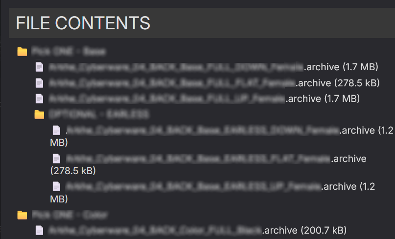
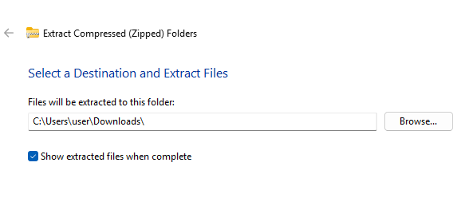
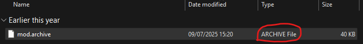
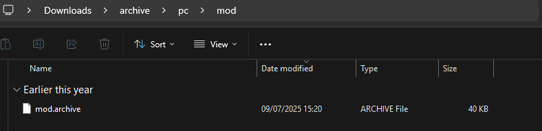
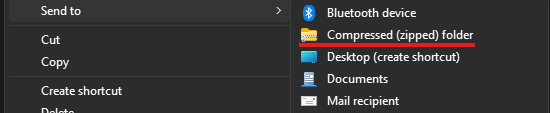

# Using Mods


[user-guide-troubleshooting](../user-guide-troubleshooting/)


## Summary

**Published:** Jun 15, 2023 by [mana vortex](https://app.gitbook.com/u/NfZBoxGegfUqB33J9HXuCs6PVaC3 "mention")\
**Last documented update:** January 3, 2026 by [icxrus](https://app.gitbook.com/u/R7jBoGTs0NQ60YSE39s5jrdLiei2 "mention")&#x20;

This page will give you a brief introduction of **how** mods work and how to install them by hand.


We **strongly recommend** using a mod manager, as manual modding is only recommended for **advanced users**.

Here are your options (wiki links):

* [vortex-mod-manager.md](getting-started/vortex-mod-manager.md "mention")
* [mo2-mod-organizer-2.md](getting-started/mo2-mod-organizer-2.md "mention")


### Wait, this is not what I want!

* If you want to create mods instead, check [getting-started-making-mods.md](../../modding-guides/getting-started-making-mods.md "mention")
* If you need help installing Cyberpunk, check [getting-started](getting-started/ "mention")
* If your modded install is acting up, please check [user-guide-troubleshooting](../user-guide-troubleshooting/ "mention")

## How to install mods


**TL;DR:** Your mods will not work unless you

* put all files **exactly** into the right place
* make sure to install all [requirements](../user-guide-troubleshooting/requirements-explained.md) (and **their** requirements)
* [enable REDmod](./#installing-and-activating-redmod)
* If you are on Linux/Steam Deck: follow [this guide](modding-on-linux.md) to the letter

When you fuck things up, hit up [#troubleshooting](./#troubleshooting "mention") or run [mod remover](https://www.nexusmods.com/cyberpunk2077/mods/8597/) and start over.

To see an [#overview-of-mod-folders](./#overview-of-mod-folders "mention"), scroll down.


## How do I mod?

You mod **Cyberpunk 2077** by adding files to your [**game directory**](the-cyberpunk-2077-game-directory/). The game natively supports modding, and the core mods will take care of everything else.

You can install mods by using [Vortex](https://www.nexusmods.com/about/vortex/)/[Mod Organizer 2](getting-started/mo2-mod-organizer-2.md), or by hand[.](https://github.com/JustThatKing/MO2077/blob/main/readme.md)


Regardless of your past experiences, the Nexus Mod Manager [Vortex](https://www.nexusmods.com/about/vortex/) works reliably and well for modding Cyberpunk.


### What are dependencies / requirements?

For more detailed information, see [requirements-explained.md](../user-guide-troubleshooting/requirements-explained.md "mention").


TL;DR:

Unless a requirement is marked as optional, **your mod will not work** if it is not installed.

Some requirements have requirements of their own. Make sure to check.


<figure><figcaption></figcaption></figure>

## The core mods


To learn more about this, check [core-mods-explained](../../for-mod-creators-theory/core-mods-explained/ "mention").


Cyberpunk 2077 offers limited out-of-the-box support via REDmod. To allow greater freedom, a number of **core mods** have been created — without them, we couldn't add items, influence the weather, or have flying cars.


Since this kind of mod interacts with the game's executable (`.exe`), they will break every time CDPR updates.

This is the reason why game updates break mods — we recommend to [**turn off auto-update**](users-downgrading-preventing-auto-updates.md) and only update your game once it's safe.\
After each patch, you can find a post on our [Discord](https://discord.gg/redmodding) that is kept up-to-date as the modders update their tools.


### Overview of mod folders


TL;DR: you can ignore this unless you want to understand how things work, or want to install mods manually.


This list is supposed to give you an overview of which files go where. It is **not** a bucket list of things you have to install.

To learn more about the individual frameworks, check [core-mods-explained](../../for-mod-creators-theory/core-mods-explained/ "mention")

<table><thead><tr><th width="256">Directory</th><th>explanation</th></tr></thead><tbody><tr><td>\<code>mods</code></td><td><a data-mention href="redmod/">redmod</a> directory: contains .archive mods (in subfolders).<br>Contains only a .stub file if empty.</td></tr><tr><td>\<code>archive\pc\mod</code></td><td>Default mod directory: contains .archive mods and .xl files in <code>legacy</code> (non-REDmod) format. Most of your mods should be here.</td></tr><tr><td>\<code>bin\x64\plugins</code></td><td>Plugins like <a href="https://app.gitbook.com/o/-MP5ijqI11FeeX7c8-N8/s/-MP5jWcLZLbbbzO-_ua1-887967055/"><strong>Cyber Engine Tweaks</strong></a> and RadioExt</td></tr><tr><td><code>\r6\scripts</code></td><td>Redscript mods (<strong>not</strong> the same as REDmod)</td></tr><tr><td><code>\r6\tweaks</code></td><td>red4ext tweaks</td></tr><tr><td>\<code>archive\pc\patch</code></td><td>Mod directory from before 1.3. Use <code>\archive\pc\mod</code> instead.</td></tr></tbody></table>

```markup
- archive
  - pc
    - mod          << .archive files from non-REDmods go here
- bin
  - x64
    - plugins      << Cyber Engine Tweaks goes here
- mods             << REDmods go here
- r6               << redscript folder
  - scripts        << redscript mods (not the same as REDmod)
  - tweaks         << RED4ext tweaks (TweakXL / ArchiveXL)
- tools            << REDmod DLC lives here — only needed for making mods.
```

## Installing and activating REDmod

If REDmod is not installed and activated, your mods in `/mods` will not load.


REDmod never took off and most people stick to the legacy format. If your `/mods` folder is empty, you don't need this. For more information, see [#whats-the-difference](./#whats-the-difference "mention") below.


Loading a mod as REDmod means that Cyberpunk will precompile it to optimize load times — integrating it into the game's other files by adding it to the files under `r6/cache`.

By contrast, vanilla mods (from `/archive/pc/mod`) will be loaded individually and might add to your load times.

* For instructions on how to install, see [here](getting-started/).
* For documentation on the Vortex installation toggle, see [here](getting-started/vortex-mod-manager.md#v2077-settings).
* For instructions on how to activate it, see [here for GOG](getting-started/) and here for [Steam and Epic](redmod/usage.md#steam-and-epic).

REDmods are installed in `Cyberpunk 2077\mods`, where every mod has a subfolder with an `info.json`.


If the mod contains only files inside the folder `archives`, you can un-REDmod-ify it by moving all of those files to `archive/pc/mod`.


## Installing Mods

You can install mods via mod manager ([Vortex](getting-started/vortex-mod-manager.md), [mo2](getting-started/mo2-mod-organizer-2.md)) or [manually](./#manual-install). There are upsides and downsides to each — however, **for beginners,** [**we recommend using Vortex**](getting-started/vortex-mod-manager.md).


If you had terrible experiences with Vortex for other games, be assured: Cyberpunk integration is working extremely well. Maybe give it another chance?


### Manual install

"Manual install" is a rather glorified term for "extracting the downloaded archive into your game directory". **However**, you have to make sure that the right files end up in the right folders.

You can inspect the file structure by simply opening the downloaded file, or by using this feature on Nexus (unless a mod author has disabled it):

<figure><figcaption></figcaption></figure>

The file structure is different for REDmods and non-REDmods. Mod authors usually tell you which file is which, though. To find out what that means, read on.

### Mod format: REDmod or vanilla?


If in doubt, install the non-REDmod (`"legacy"`) format. To learn why, check [#whats-the-difference](./#whats-the-difference "mention") below the table.


Here is how you can tell the two apart:

| REDmod                                                                                                                                | Vanilla mod (packed correctly)                                                                                                                                                                                                                                                                                                             |
| ------------------------------------------------------------------------------------------------------------------------------------- | ------------------------------------------------------------------------------------------------------------------------------------------------------------------------------------------------------------------------------------------------------------------------------------------------------------------------------------------ |
| <p></p>                                                         | <p></p>                                                                                                                                                                                                                                                               |
| is in a folder named after the mod                                                                                                    | may be in an extra folder if packed incorrectly                                                                                                                                                                                                                                                                                            |
| has an `info.json`                                                                                                                    | does **not** have an `info.json`                                                                                                                                                                                                                                                                                                           |
| <p>contains a folder with any of</p><p>- <code>archives</code></p><p>- <code>tweaks</code></p>                                        | <p>contains any of the folders<br>- <code>archive</code><br>- <code>bin</code><br>- <code>r6</code><br>with files nested under them</p>                                                                                                                                                                                                    |
| Is packed with **one** level of nesting (`info.json` is in top level folder)                                                          | Has **multiple** levels of nesting                                                                                                                                                                                                                                                                                                         |
| <p><strong>Manual install instructions:</strong><br>Extract the folder <code>ModName</code> into <code>Cyberpunk 2077/mods</code></p> | <p><strong>Manual install instructions:</strong><br><strong>T</strong>he folders <code>archive</code>, <code>bin</code>, <code>r6</code> from the download must <strong>merge</strong> with the same folders in your <a href="the-cyberpunk-2077-game-directory/">game directory</a> (do <strong>not</strong> put the bin in the bin).</p> |

#### What's the difference?

All REDmods mods will be **preloaded** by `redMod.exe` before the game starts up. After a short delay, the mods will then be loaded as if they were part of the game itself — you're saving the startup delay on every savegame load.

On top of this, Vortex will let you define load order for REDmods. To support compatibility, it offers you automatic conversion.

<details>

<summary>That sounds awesome, why isn't it everywhere?!</summary>

**Compatibility issues**

REDmod was CDPR's attempt to standardize mod loading, but there were various compatibility issues with it, and it never quite took off. As of today (April 2024), the project is pretty much dead in the water.

**Load order**

REDmods are loaded after everything else, so that format is simply not an option for e.g. body mods.

**Vortex autoconvert**

In theory, Vortex can automatically convert legacy mods to REDmod. In practice, that didn't help with any of the compatibility issues mentioned before, and caused some of them.

</details>

### Fixing broken mod file paths

#### TL;DR:

* Mod makers sometimes pack files incorrectly, causing mods to be pathed wrong and not work
* To fix it, you need to correctly path the contents of the zip file:
  * `.archive` and `.xl` files go to `archive/pc/mod` folder structure.
  * For other files see [#mod-folders-by-file-extension](./#mod-folders-by-file-extension "mention").
  * Detailed instructions on how to create the new zip below.
* You can drop the fixed zip you made into your mod manager to have it install properly.


Sometimes mod makers create strange pathings for their mods, or delete the paths all together, even when Wolvenkit creates those paths for them. This can cause issues especially when installing mods with a mod manager, as the mod manager doesn't know where this mod is supposed to go.

You'll usually see a few types of mismatches of pathing:

<figure><figcaption><p>Scenario 1: Files without any folders</p></figcaption></figure>

<figure><figcaption><p>Scenario 2: Files inside non-game sub folders</p></figcaption></figure>

<figure><figcaption><p>Scenario 3: Unnecessary first subfolder</p></figcaption></figure>

All of these can cause a mod manager to get mixed up, or for you to install it wrong when installing manually, so let's go through fixing these!

You can do these fixes in the file explorer or through Vortex/MO2 if you're using them.


To find out how to install the mod properly, you have to read the **mod's install instructions**. If that isn't clear enough, the following might help you.


#### Manually fixing the folder paths

1. Extract the .zip/.rar/.7z archive to your Downloads folder (or whatever folder you're working in). You might get an extra unnecessary folder depending on what path you extracted the packaged archive to. If you want it to extract straight into the Downloads folder, remove the extra folder at the end of the path so it looks something like this:

<figure><figcaption></figcaption></figure>


In the case of Scenario 3, you can just move the folders out of the first unnecessary folder and continue from step 8 or 9.


2. You should now have all of the mod files inside your Downloads folder. Locate the files you want to move and check their file extensions. If you don't have file extensions turned on, you can check this part of the file to know what file it is:

<figure><figcaption></figcaption></figure>

3. Now that we have found our files, we need to place it into the correct file path by creating that file path. This is an .archive file so it needs to go into `archive/pc/mod/` file path. If you aren't sure where your file should go, check out [#mod-folders-by-file-extension](./#mod-folders-by-file-extension "mention").
4. Create a folder by right clicking. Name it `archive`.
5. Enter the archive folder you just created by double clicking on it. Now repeat step 4. but this time name it `pc`.
6. Enter the pc folder, and repeat step 4. one last time, this time naming the folder `mod`. Repeat this process for the correct folder paths for other file types if you have any. For our .archive you should have a folder path like this now:

<figure><figcaption></figcaption></figure>

7. Now go back into the Downloads folder (or any subfolder that holds the files we need to move). Select the files and press CTRL + X to cut the files, then navigate back into your corrected folder path, and press CTRL + V to paste the file there. You should end up with something like this:

<figure><figcaption></figcaption></figure>


If you're using a mod manager, skip step 8 and continue from step 9.


8. If you're manually installing, you can now copy paste the archive folder into the Cyberpunk 2077 folder where your game is installed, it will automatically merge with the existing folders.
9. If you're using a mod manager, right click the archive folder and turn it into a .zip/.rar/.7z. If you're just using Windows' own zipping system, the option might be hidden under `Send to -> Compressed (zipped) folder`.

<figure><figcaption></figcaption></figure>

10. Name the newly created .zip to whatever you want, however it is recommended you name it something identifying, like the original mod name, so you can find the mod on Nexus again as adding the mod this way to your mod manager will not preserve links.
11. You can now add it to your mod manager. For Vortex, drag the .zip to the bottom of the downloads page and drop it there.

***

<h4 align="center">Fixing the folder paths inside Vortex</h4>

Vortex can be incredibly useful, but it cannot magically fix badly packaged mods on its own. Sometimes, it requires your intervention. When you press the shiny "**Deploy Mods**" button, it doesn't have a particularly complex way of figuring out which files go where. In essence, it just dumps the folders into the game directory, and mod files end up wherever they end up.\
\
Usually, if they're packaged correctly, the mod files will end up exactly where they need to be.\
Sometimes, there will be unnecessary subfolders that mean the mod files don't end up where they should be.


This is a lot of words to say that some mods are just packaged wrong. Don't worry, we'll fix it!


<p align="center"><strong>Well, what do I do then?</strong></p>

**Always check the file contents before downloading a mod!**\
Vortex cannot guess that a mod isn't packaged correctly. Sometimes there is a popup for unexpected installation paths, but this doesn't mean a mod is packaged badly. Unfortunately, _**mods packaged incorrectly**_ _**will not be flagged by Vortex as wrong.**_

<figure><figcaption><p>Go to a mod's "FILES" tab on Nexus, then click "Preview File Contents".</p></figcaption></figure>


{% column width="50%" valign="middle" %}
<figure><figcaption></figcaption></figure>

Folder structure should look similar to this!


{% column width="50%" valign="middle" %}
<figure><figcaption></figcaption></figure>

Usually mods that make you choose between different files need manual adjustments.




If the mod you've downloaded looks like the picture on the left. Great! You don't need to do anything. Enjoy your game!\
\
If not, keep reading... we've got work to do!


<p align="center"><strong>Adjusting folder structure in Vortex - Step by Step:</strong></p>

1.  Press _"Mod Manager Download"_ as you normally would.

    <figure><figcaption></figcaption></figure>
2.  Navigate to "Never Installed" in Vortex (on the "Mods" tab). You should see the mod you just downloaded here.

    <figure><figcaption></figcaption></figure>
3. Right click on the mod name
4.  Click "Install"

    <figure><figcaption><p>We don't want to enable this mod yet! It will make it more difficult in the future if we do!</p></figcaption></figure>
5.  You should get a popup that says "You have reached the fallback installer!". Click "Yes, Install to staging anyway".

    <figure><figcaption></figcaption></figure>
6.  You should then get another pop-up that says "Mod installed but may need manual adjustment!". Click "Understood!"\
    **You should read this pop-up! It explains where the files are expected to go and why!**

    <figure><figcaption><p>Just read the dang pop-up, I promise!</p></figcaption></figure>
7. The mod should now be under "Disabled." Right click the mod name again to bring up the menu.
8.  Click "Open in File Manager".

    <figure><figcaption></figcaption></figure>
9.  To make life easier for ourself, we'll start setting up the proper folder structure **the first folder it takes us to**. That way, we can just cut and paste what we need into the proper place!

    <figure><figcaption></figcaption></figure>
10. Make sure you follow this folder structure exactly. We need to create a folder named `archive`. Click into the `archive` folder and create one called `pc`. Click into `pc` and create a folder called `mod`.

    <figure><figcaption></figcaption></figure>
11. We're going to have to use some brainpower here and click through the folders until we find the exact files we want. In this example, I want to use the "COOL VERSION", so I would click through the folders until I find the "COOL VERSION" files.

    <figure><figcaption></figcaption></figure>
12. Select the files you need and cut them!

    <figure><figcaption></figcaption></figure>
13. Go to the end of the folders we made in step 10 and paste them!

    <figure><figcaption></figcaption></figure>
14. Repeat this process for any other folders that contains files you **need** to make sure your mod works. Don't worry, there's a table at the bottom of this page <sub>(</sub>[<sub>here!</sub>](./#mod-folders-by-file-extension)<sub>)</sub> which shows the paths you need to create for each file type!
15. Now to deal with the folders that _**you did not make**_. Select them and press delete!

    <figure><figcaption></figcaption></figure>
16. Guess what! We can finally go back into Vortex and enable that mod!

    <figure><figcaption><p>Yippee!!! You did it!</p></figcaption></figure>
17. Now you can get back to your regularly scheduled mod downloading session. Hooray!


If you get stuck at all along the way, or you've reached this point and still run into issues, come ask us in [#mod-troubleshooting on the discord](https://discord.com/channels/717692382849663036/788213273530335233). We wrote these guides, so we can help, I promise!


#### Fixing the folder paths inside MO2

First and foremost I recommend to set up your MO2 Installer to default to the manual installer instead of using the Simple Installer plugin.\
MO2 already checks for a correct path and will warn you if the mod you are trying to install deviates from the expected structure, but I find removing the Simple Installer plugin helpful for both new users as well as MO2 veterans regardless. It might seem overkill at first but is a valuable tool to make sure the user checks for a working file structure so the mod ends up where it's supposed to be. If you are unsure where files should go refer back to the "Overview of mod folders" section of this guide.\
\
To get started open your MO2 settings and click the plugins tab.

<figure><figcaption></figcaption></figure>

In the left pane scroll down to the Installer section and make sure Simple Installer is disabled.

<figure><figcaption></figcaption></figure>

Now you can go to Nexus and download mods using the Download with Manager button as per usual. Often times mod authors set a correct file structure but due to how packaging works they end up with an additional folder that MO2 doesn't know how to handle. In these instances you have to manually change the Cyberpunk 2077 directory in the installer. I will explain how you do that in Example #1 below. Further down in Example #2 I will explain how to create new folders from scratch in case they are missing completely or only partially correct.


If you make a mistake you can cancel out of the installation process during any given step and start again! Even if you somehow falsely install something you can right click your mod in MO2 and select the "reinstall" option to restart the manual adjustment.


Example #1: Adjusting the Cyberpunk 2077 directory

1.  MO2 is unhappy because it doesn't recognize a correct file path, due to an additional folder inside the mod.

    <figure><figcaption></figcaption></figure>
2.  This is easily fixed by making MO2 recognise the additional folder as the Cyberpunk 2077 directory itself by right clicking the folder and selecting "Set as \<cyberpunk 2077> directory".

    <figure><figcaption></figcaption></figure>
3.  Now that we are left with the .archive file going into Cyberpunk 2077/archive/pc/mod/ MO2 is happy and gives us the green light for the installation and you can finalise the process by clicking OK.

    <figure><figcaption></figcaption></figure>

Example #2: Creating your own folders

1.  MO2 is unhappy because it doesn't recognize a correct file path, due to the lack of any folders guiding the .archive to the correct location.

    <figure><figcaption></figcaption></figure>
2.  Right click the Cyberpunk 2077 directory and select "Create directory". Name the new folder "archive" and press ok.

    <figure><figcaption></figcaption></figure>

<figure><figcaption></figcaption></figure>

<figure><figcaption></figcaption></figure>

3.  Repeat this process two more times by creating a new directory named "pc" inside the archive folder and another named "mod" inside the pc folder. The result should look like this.

    <figure><figcaption></figcaption></figure>
4.  Now all that is left to do is to drag the .archive file into the mod folder. MO2 should then give you the green light for installation and you can finalise the process by clicking OK to install your mod.

    <figure><figcaption></figcaption></figure>


For bigger and more complicated mods - for example those that come with multiple .archive files to select from - you can also utilize the checkmarks to enable or disable files and folders as needed, or drag multiple files to the location they need to be in.\
Often times I end up creating my own structure as above and then drag the files I want there while simply disabling the files I do not need. MO2 will ignore and ultimately not install them.


You can now enable your mods like any other. Happy gaming!

<figure><figcaption></figcaption></figure>


If you get stuck at all along the way, or you've reached this point and still run into issues, come ask us in [#mod-troubleshooting on the discord](https://discord.com/channels/717692382849663036/788213273530335233). We wrote these guides, so we can help, I promise!


#### Mod folders by file extension

As a rule of thumb, here's which files go where (unless the mod's instructions tell you otherwise):

<table><thead><tr><th width="200">File type</th><th>Folder path</th></tr></thead><tbody><tr><td><code>.archive</code></td><td><code>/archive/pc/mod/</code></td></tr><tr><td><code>.xl</code><br><code>.archive.xl</code></td><td><code>/archive/pc/mod/</code></td></tr><tr><td><code>.reds</code></td><td><code>/r6/scripts/</code></td></tr><tr><td><code>.tweak</code><br><code>.yaml</code></td><td><code>/r6/tweaks/</code></td></tr><tr><td><code>.lua</code></td><td>a subfolder of <code>/bin/x64/plugins/cyber_engine_tweaks/</code></td></tr><tr><td><code>.ini</code></td><td><code>engine/config/platform/pc</code></td></tr><tr><td><code>.script</code></td><td>part of a REDmod, can't be installed standalone</td></tr></tbody></table>

## Troubleshooting

If you have problems with Vortex, check the [corresponding section](getting-started/vortex-mod-manager.md) of the guide.

For everything else, this wiki has a dedicated [troubleshooting page](../user-guide-troubleshooting/) with step-by-step instructions for pretty much every common problem. If that doesn't cut it, you're welcome to find us on [Discord](https://discord.gg/redmodding) in the **#mod-troubleshooting** channel (but your first answer will be a link to that guide).
