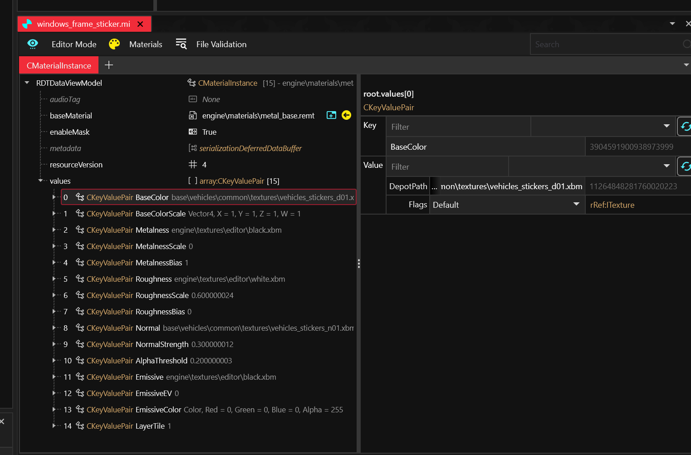

# Getting Started

#### Before you get started

Make sure you have all the required programs to operate mods and their managers; these are separate from modding framework requirements, but just as important.

* [Visual C Redistributable 2022](https://learn.microsoft.com/en-us/cpp/windows/latest-supported-vc-redist?view=msvc-170)&#x20;
* [.NET 6.0+](https://dotnet.microsoft.com/en-us/download/dotnet/6.0)
* [The latest graphics driver for your GPU](https://www.wikihow.com/Update-Your-Graphics-Driver)
* If you are on Windows, [Windows 10 or above](https://www.wikihow.com/Install-Windows-10) and the latest [Windows Update](https://www.wikihow.com/Update-Windows)

This guide assumes that you have already bought Cyberpunk 2077 on the platform of your choice (Steam, GOG or EPIC).

## Installing the Game

In order to set up your game to be best suited for mods, you'll want to keep a few things in mind:


**TL;DR:** If possible, install Cyberpunk 2077

* on an SSD to speed up load time
* outside of `Program Files` to keep Windows from "protecting" your files


For the purpose of this guide, we will assume the following install paths:

<table data-header-hidden><thead><tr><th width="267"></th><th></th></tr></thead><tbody><tr><td>Game install</td><td><code>C:\Games\Cyberpunk 2077</code></td></tr><tr><td>Mod download and staging</td><td><code>C:\Games\Mods</code></td></tr></tbody></table>

#### Performance

Like everything else, Cyberpunk will run significantly faster from an SSD rather than a HDD.

#### Permissions


Folder permissions **can** cause problems down the line, especially for Windows users. Most users never run into these, but you can prevent them altogether by installing your game to a folder like  `C:\Games` rather than `C:\Program Files.`


By default, all three platforms (GOG, Steam, and Epic) want to install the game to their own install location, which defaults to `C:\Program Files`. That wouldn't be a problem if not for Windows and what it will permit there, which is not much.&#x20;

This **can** (but doesn't have to) cause problems in two different spots by "protecting" the Cyberpunk install dir from modding tools such as mod managers (like our recommendation [Vortex](vortex-mod-manager.md)) or even CDPR's own REDmod launcher. But hey, at least things are very secure.

You likely won't run into any of these problems, but you can rule them out altogether by installing Cyberpunk to a directory other than `C:\Program Files` or `C:\Program Files(x86)`, like `C:\Games\Cyberpunk 2077`

Now we will go through the install options to use on each platform to accomplish this, and the recommended settings for modded Cyberpunk 2077.

### Installing Cyberpunk: GOG

Open GOG Galaxy, click on "Owned Games" in the left sidebar, and scroll until you find Cyberpunk. Single click on its picture to display the main Cyberpunk page.&#x20;

1. Click the button at the top of the page labeled "Install".&#x20;
2.  In the pop-up window, choose your install location:

    * Click the drop-down box
    * select "browse"
    * browse to the target folder (we're assuming `C:\Games`)&#x20;

    You don't need to create a subfolder for Cyberpunk, as GOG will do that for you.
3. Optional: Select a game language other than English
4. Optional: Create a desktop shortcut by ticking the first box "Create desktop shortcut"
5. Optional, but recommended: Disable auto-updates by unchecking the second box "Keep this game up to date automatically"

<figure><figcaption>
How the window should look for recommended install.
</figcaption></figure>

6. Press "Install"
7. Wait until GOG has done it's thing, then proceed to the next section.

### Configuring Cyberpunk: GOG

Once the game has installed, we want to make it run with mods. Click the button to the right of the play button (formerly the install button) pictured below.

<figure><figcaption>
The Cyberpunk 2077 main page on GOG, with the sidebar open on the left
</figcaption></figure>

From there, select "Manage Installation" and then "Configure". A window will pop up where you can change your desired settings:

* Installation (first tab): Disable auto-updates
* Features (second tab): Enable mods
* DLC (third tab): Select at least Cyberpunk 2077 REDMod

<figure><figcaption>
You may select any additional settings you like, but these are the minimum recommended options.
</figcaption></figure>

That's it, you are done with your install of the game! You can now move on to [installing Vortex](vortex-mod-manager.md).

### Installing Cyberpunk: Steam

To be done

### Configuring Cyberpunk: Steam

To be done

* Navigate to _Cyberpunk 2077_
* Click **Play**
* Click the **Settings** button and **Enable mods**
* Click **Play** (Do not skip this)

That's it, you are done with your install of the game! You can now move on to [installing Vortex](vortex-mod-manager.md).

### Installing Cyberpunk: Epic

To be done

### Configuring Cyberpunk: Epic

To be done

* Navigate to _Cyberpunk 2077_
* Click **Play**
* Click the **Settings** button and **Enable mods**
* Click **Play** (Do not skip this)

That's it, you are done with your install of the game! You can now move on to [installing Vortex](vortex-mod-manager.md).

You may now move on to mod manager and mod installation.
