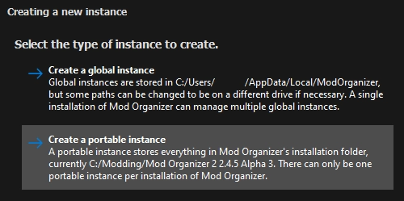
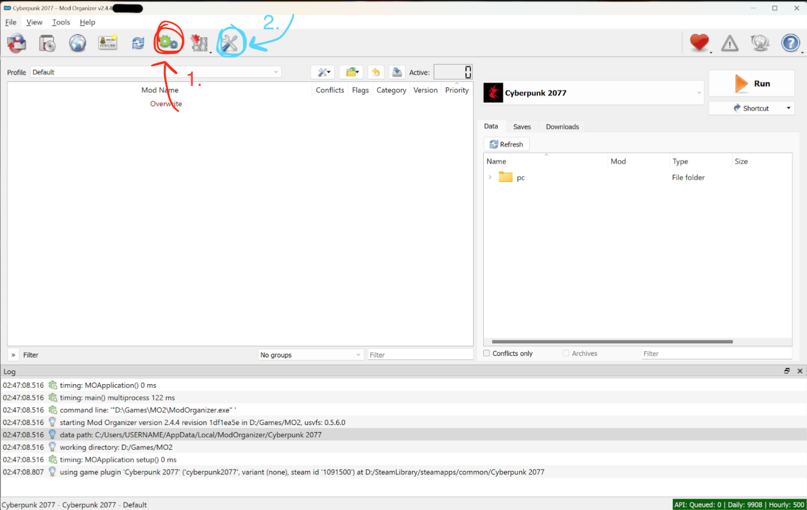
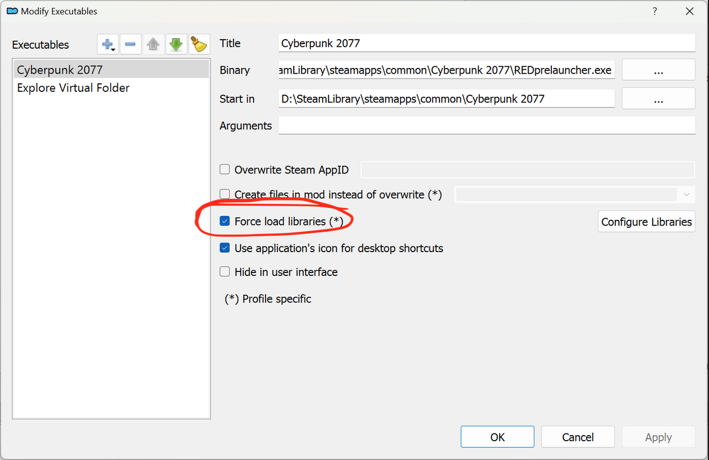
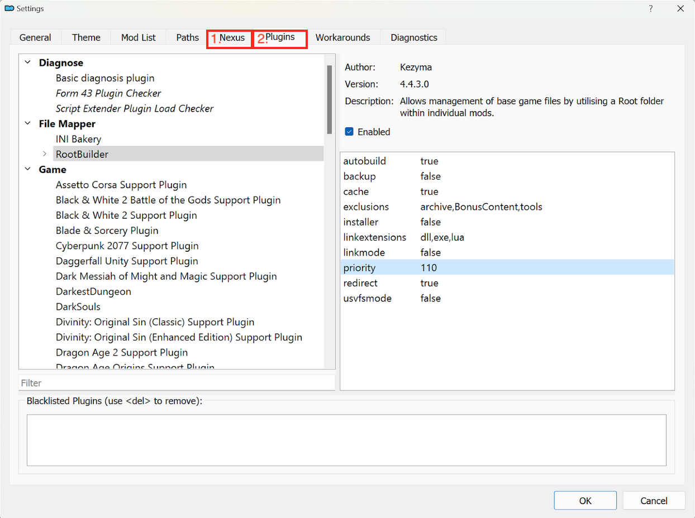

# MO2 (Mod Organizer 2)

MO2 (Mod Organizer 2) is a free mod manager that is widely used in modding Bethesda games like Skyrim or Fallout. It supports Cyberpunk and is easy to use.


For additional detail, please check the [original guide on Google Docs](https://docs.google.com/document/d/19eMPBRBan2RJ\_qf1hrnHkOFfgiTo8p3p/edit). \
If you need help with MO2, please ask on [their Discord server](https://discord.gg/ewUVAqyrQX), because everything we know about it fits on this wiki page!

If you want to improve the guide, you are [very welcome](https://app.gitbook.com/invite/-MP5ijqI11FeeX7c8-N8/H70HZBOeUulIpkQnBLK7)!


## Installing MO2

[Original guide](https://docs.google.com/document/d/19eMPBRBan2RJ\_qf1hrnHkOFfgiTo8p3p/edit) by u/CaitSkyClad (via [Reddit](https://www.reddit.com/r/cyberpunkgame/comments/146d76b/mod\_organizer\_2\_and\_cyberpunk\_2077\_configuration/))

1. Create a directory for all your Cyberpunk mods (e.g. `D:\Games\CP2077`). This is where MO2 will store the downloaded files, so it's gonna use a lot of disk space. Plan accordingly!
2. Download MO2 ([nexus](https://www.nexusmods.com/skyrimspecialedition/mods/6194) | [website](https://www.modorganizer.org/) | [github](https://github.com/ModOrganizer2/modorganizer))
3. Run the installer. For the purpose of this guide, we assume that you're installing to `D:\Games\MO2`
4.  Select either of the install types:\

    <figure><figcaption></figcaption></figure>

### Edit the Cyberpunk plugin's default paths

1. Find the following file (your install directory might vary):\
   `D:\Games\MO2\plugins\basic_games\games\game_cyberpunk2077.py`
2. Create a backup (copy and paste the file in place)
3. Open it file in a text editor like [Notepad++](https://notepad-plus-plus.org/downloads/):
4. Now we need to point the installer to the right relative path for archive mods.\
   Find the entry that says \
   `GameDataPath = "%GAME_PATH%"`\
   and change it to\
   `GameDataPath = "archive"`


Be careful that you don't make any typos!



If your file already contains this information, you can skip this step. In this case, how about [editing this guide](https://app.gitbook.com/invite/-MP5ijqI11FeeX7c8-N8/H70HZBOeUulIpkQnBLK7)?


Now it's time to launch and configure the tool.

## Configuring MO2


If you have launched MO2 before, bring up the prompt via the menu by selecting File -> Manage Instances...


1. Create a new global instance.

<figure><figcaption></figcaption></figure>

2. Select Cyberpunk 2077 from the list. If it doesn't show up, you fucked up during [#edit-the-cyberpunk-plugins-default-paths](mo2-mod-organizer-2.md#edit-the-cyberpunk-plugins-default-paths "mention").

<figure><figcaption></figcaption></figure>

3. Select Cyberpunk 2077 and click "Next".&#x20;
4. Give your new instance a name (such as Cyberpunk 2077 launcher) and click "Next"
5. Change `game location` to your Cyberpunk 2077 install directory
6. Change the `base directory` to the directory you created in step 1 of the install (e. g. `D:\Games\CP2077`)
7. Review the information and click "Finish":

<figure><figcaption></figcaption></figure>

7. MO2 will now restart.

### Configuring the Root Builder

1.  In the MO2 window, click on the green cogwheel button to configure the executable (1).

    <figure><figcaption></figcaption></figure>

2. Make sure that "Force load libraries" is checked:

<figure><figcaption></figcaption></figure>

3. Close the dialogue again and click on the Settings icon (2 in the first screenshot).&#x20;
4. Click on the `Nexus` tab
5. Click the Connect to Nexus button and follow the instructions.
6. Click on the Plugins tab, where we'll configure Root Builder:
   1. Set **`backup`** to `false`
   2. Set **`exclusions`** to `archive,BonusContent,tools`
   3. Set **`linkextensions`** to `dll,exe,lua`
7. Verify the changes:

<figure><figcaption></figcaption></figure>

8. Click OK

### Installing Mods with MO2


TL;DR: \

[Red4Ext](https://www.nexusmods.com/cyberpunk2077/mods/2380) and [Cyber Engine Tweaks](https://www.nexusmods.com/cyberpunk2077/mods/107) **must** be installed manually or via Root Builder.

**Always run the game through MO2!**


You can select MO2 on Nexus by clicking "download with manager" on Nexus.&#x20;

### Example mod install (via Root Builder)

1. Download [Cyber Engine Tweaks](https://www.nexusmods.com/cyberpunk2077/mods/107) from Nexus.
2. Install CET from the downloads tab.
3. Right-click on “\<archive>”
4. &#x20;create a directory named `root`
5. Drag the `bin` directory into your newly-created `root` directory:

<figure><figcaption></figcaption></figure>

5. Click OK.
6. Launch Cyberpunk 2077.

The game should start, and you should be prompted to set the CET bind key.
