# Vortex Mod Manager

## Summary

**Last documented update:** January 20th, 2026 by [minnierylands](https://app.gitbook.com/u/VSIYzNHUyRPaBCk2ExHhQzpPfo82 "mention")


**Windows 10 or higher is required to use Vortex mod manager. If you are not using Windows, see our Manual Install page.**


Vortex is a multi-game mod manager developed for and by [NexusMods](https://www.nexusmods.com/), the website where most [Cyberpunk 2077 mods](https://www.nexusmods.com/cyberpunk2077) are hosted. Here you can download mods manually or with Vortex and keep track your download history.


To use Vortex, you need an account there. If you don't have one, you can sign up [here](https://users.nexusmods.com/register) – don't worry, it's free.


***

## Why do I need this?

Technically speaking, you don't. You can [install mods manually](../#manual-install) or use [Mod Organizer 2](https://www.modorganizer.org/) (but without our support, sorry, choom).&#x20;

However, Vortex for Cyberpunk is the most beginner-friendly way of managing your mods and will save you a lot of hassle.


If you have PTSD from modding Skyrim or Fallout with Vortex, be assured that Vortex for Cyberpunk is integrated **extremely** well. Go ahead, give it a try!

If you run into issues with Vortex that aren't addressed in this guide, you can contact [Nexus support](https://github.com/Nexus-Mods/Vortex/wiki) or join our [Discord](https://discord.gg/redmodding) and find (volunteer) help in the #vortex-support channel.


***

## TL;DR

* Your staging folder **must** be on the same drive as your game installation
* Your staging folder **must be separate** from your game install directory
* Vortex has [a lot of options](vortex-mod-manager.md#settings). If you put wrong options, mods can go brr.

***

## Download

Once you're signed in on Nexus, it's time to download Vortex Mod Manager.


If you can download it on your own, you can skip to the [Install](vortex-mod-manager.md#installation) or [Setup](vortex-mod-manager.md#setup) section of this guide.


1. Click [this link](https://www.nexusmods.com/site/mods/1), it will take you directly to the download page
2. Select the "Manual Download" option on the first entry:

<figure><figcaption></figcaption></figure>

3. You'll now see a download page. If you don't have Nexus Premium:
   1. Select "Slow Download"
   2. Wait through the five seconds cooldown
4. Optional, depending on your browser:&#x20;
   * Select your download location for files that you don't want to keep
5. Wait until the installer is downloaded


Nice, now the installer should be downloaded! You can proceed with the steps in the next section.


***

## Installation


This guide will assume that you install Vortex to `C:\Program Files\Black Tree Gaming Ltd\Vortex`. You can install it whereever you want, but then you need to adjust accordingly.


1. Run the installer by double-clicking it.
2. If Windows shows you a prompt now, select **yes** — you want the setup to make changes on your device, it's supposed to install Vortex.
3. Click through the setup and finish its instructions!


Congrats! You've finished installation! Vortex should launch automatically and you can now move onto setup.


***

## Setup

Here is where we get into the weeds, the particulars of Vortex setup before we can use it.


If you can setup Vortex on your own, skip to the [Settings](vortex-mod-manager.md#settings) section of this guide. (Why are you reading this?)


#### Logging In To Nexusmods

If you are already logged in, proceed to the next section "[Adding Cyberpunk](vortex-mod-manager.md#vortex-adding-cyberpunk)"

1. If Vortex didn't open by itself, open it from the start menu
2. Log into Nexusmods by clicking on the red circle in the top right of your client

<figure><figcaption>
The initial dashboard on launch
</figcaption></figure>

3. You will see either a browser window or an error message that Vortex couldn't open one – in this case, copy the URL in the box at the bottom and open the browser window yourself

<figure><figcaption>
If your browser doesn't open automatically, copy the url starting with users.nexusmods in the box
</figcaption></figure>

4. Optional: Log into Nexusmods (if you aren’t already)
5. Allow Vortex to access your Nexus account by clicking "Authorize":

<figure><figcaption>
Allow Vortex to authorise your account
</figcaption></figure>

6. Click "Log in to Vortex":

<figure><figcaption>
Log into Vortex and close the page
</figcaption></figure>

7. Instead of the red icon, you should now see your profile picture and username from nexusmods.

***

#### Vortex: Adding Cyberpunk

This section will tell you how to add Cyberpunk to Vortex's managed games.

1. On the sidebar on the left side of your dashboard, click "`Games`"
2. In the page that now shows, type "`Cyberpunk`" into the search bar
3. Hover over its thumbnail and click "`Manage`"
4. You will now see a popup complaining about "`Game support not installed`". Don't panic, this is expected!


**Important Note: Downloading The Cyberpunk Extension**

As of January 2026, downloading the Cyberpunk Vortex Extension through Vortex itself will not download the latest version. It will download the previous version, which has an unfortunate bug.

For now, you will have to **manually download the extension. Check below to see how!**


5. [You can download the Cyberpunk 2077 Vortex Extension here](https://www.nexusmods.com/site/mods/196?tab=files). The link should take you straight to the `FILES` tab.
6. Click `Manual download` - this will download it straight to your computer.&#x20;


Currently, the `Mod manager download` button is not functioning as expected. You **need** to click `Manual download`


7. Navigate to Vortex and find the `Extensions` tab on the left side of the window.

<figure>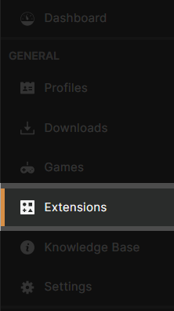<figcaption>
This is the extensions tab!
</figcaption></figure>

8. On the `Extensions` page, you should see a box at the bottom that says `Drop File(s)` - you need to take the Cyberpunk Extension `.zip` file you just downloaded and drop it into this box.

<figure><figcaption></figcaption></figure>

9. Your Vortex extension should now be installed, and should say `0.12.1` in the `Version` column.

<figure>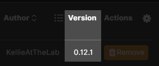<figcaption>
This is what you want to see!
</figcaption></figure>

9. You need to restart Vortex – agree to the prompt if there is one. If not, manually close Vortex and re-open it.
10. Optional: If Vortex was able to auto-detect your game install, you are done now and can proceed with the [Settings](vortex-mod-manager.md#settings) section.
11. Vortex will tell you that it couldn't detect your game install and prompt you to set it manually. Click "Continue".
12. In the explorer window that now pops up, navigate to the folder containing your Cyberpunk exe (e.g. `C:\Games\Cyberpunk 2077\bin\x64`)
13. Once you are in the right folder, click "`Select Folder`"

Vortex can now manage your game! Proceed to the next section, [Settings](vortex-mod-manager.md#settings).

***

### Settings

This section tells you how to set the recommended settings in Vortex, grouped by tab. If a tab isn't covered, there are no recommendations and you can do what you like.

Start by clicking "Settings" in the left sidebar of your Vortex Dashboard, then select the first tab.

#### Interface -> Customization

This section controls how Vortex looks and behaves. If this is your first time using Vortex, just leave it at the defaults and scroll down to "`Automation`".

#### Interface -> Advanced

<figure>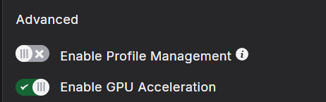<figcaption></figcaption></figure>

#### Interface -> Automation

The settings here tell Vortex what to do with your mods as it gets them.

Here's a screenshot of the recommended settings with an explanation below:

<figure><figcaption>
Recommended automation settings
</figcaption></figure>

To put a mod in the game, Vortex requires you to complete four steps. The folders for these are configured in the [Mods section](vortex-mod-manager.md#mods).

1. Downloading: Putting the mod into Vortex's download cache, either by clicking the button on Nexus or by dragging-and-dropping an archive onto the client. The archive will now live in Vortex's **download directory**.
2. Installing: Unpacks the mod and copies it to Vortex's **staging** directory.
3. Enabling: This mod should be included in the next deploy
4. Deploying: The mod has been copied from Vortex's **staging** directory to your Cyberpunk **game** directory.

<table data-header-hidden><thead><tr><th width="332"></th><th></th></tr></thead><tbody><tr><td>Deploy mods when Enabled</td><td>Automatically deploys each mod as you enable it, merging step 3 and 4. We recommend enabling this, as it saves you a click.</td></tr><tr><td>Install Mods when downloaded</td><td>Automatically completes step 2 when you download a mod. We recommend disabling this as it lets you address issues and popup one after the other</td></tr><tr><td>Enable Mods when installed</td><td>Automatically completes step 2 when you install a mod. We recommend enabling this, as it saves you a click.</td></tr><tr><td>Run Vortex when my computer starts</td><td>Starts Vortex with Windows - disable or enable at your discretion</td></tr></tbody></table>


In theory, you can configure Vortex so that you hit the download button on the website and it will download, install, enable and deploy for you. The downside with that is that you might not notice errors as they pop up in the background, which is why we recommend doing that one single click by yourself.


#### V2077 Settings


#### This toggle says "(NOT recommended)" for a reason. Do **NOT** enable it.

This setting controls the automatic REDmod conversion. In general, **you do not want this**.

It will convert all of your "legacy" mods into REDmod format, and has a habit of breaking a lot of them in the process.

**For a full explanation of what that means, give** [**this**](../#mod-format-redmod-or-legacy) **a read.**


<figure>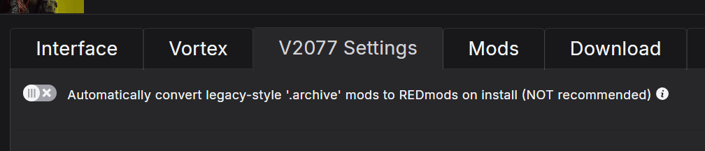<figcaption></figcaption></figure>


### **Vortex Extension Bug**

In the 0.12.0 version of the Cyberpunk 2077 Vortex Extension, a bug was introduced that would **enable this toggle without warning**.&#x20;

Thankfully, version 0.12.1 of the extension has squashed that bug, but Vortex will not automatically acknowledge the new version. [You can get version 0.12.1 here](https://www.nexusmods.com/site/mods/196).

#### **How can I check my extension version?**

In Vortex, there's an "`Extensions`" tab on the left hand side. Click it.

Check what it says under "`Version`" for the "`Cyberpunk2077`" extension.

If it says `0.12.1`, you're good to go!

If not, you'll need to **manually** update it.

1. [Click "**Manual Download**" on the top file from the extension's download page.](https://www.nexusmods.com/site/mods/196?tab=files)
2. Go back to your Vortex "`Extensions`" page
3. Drop the zip you just downloaded into the box that says "`Drop File(s)`"

4. The old version (`0.12.0`) should now be disabled. Click "`Remove`" on the old extension.
5. You need to go back into your "`V2077`" settings and **turn the toggle off**!
6. Go to your "`Mods`" page in Vortex, press `CTRL + A` on your keyboard (you may need to click on one of your enabled mods first)
7. A bar should pop up at the bottom. Click "`Reinstall`". It shouldn't take too long!

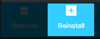

You should now be free of the autoconvert bug.


***

#### Mods

This section controls Vortex file storage. It's mostly a matter of personal preference and disk space availability on your end.

#### Mods: Staging


This folder

* **must** be on the same drive as your game installation, or deploy will fail
* **must not** be your [game install directory](../the-cyberpunk-2077-game-directory/)


Where Vortex keeps its mods, ready to deploy them into the Cyberpunk game directory.

The default folder location is `{USERDATA}\{GAME}\mods`, which resolves to `C:\Users\YourUsername\AppData\Roaming\Vortex\cyberpunk2077\mods`

You can keep it as this, or you can make a folder for it in a place you can easily access it, like `C:\Games\Mods`. Wherever you decide, you want to make sure it is accessible and you can remember it in case of issue.

<figure><figcaption>
Mod staging folder default location
</figcaption></figure>

***

#### Mods: Download

Where Vortex stores downloaded archives. Can be wherever you like, even on a different drive.

We recommend keeping an extra folder in there for manually downloaded mods, as Vortex can manage these as well – you just have to drag-and-drop them into the client.

***

### Dashboard

Finally, we will return to our dashboard.

No matter what settings you chose in interface, you should still have a section labeled "Tools", where at this point you should at least see four things, the last of which will be disabled:

<figure><figcaption>
The default tools on the dashboard.
</figcaption></figure>

It can be helpful here to toggle "Enable Toolbar" above it so that you can always see them wherever you are in Vortex.

These are different options to launch the game via Vortex.


Click on the three dots next to "Launch Game with REDmods Enabled" and set it as primary. This will make Vortex pick this option when you click on the Cyberpunk 2077 picture on the far left.


"REDmod Deploy Latest Load Order" is also incredibly useful if your mods are acting up: Just using the "deploy" button on the main management page can fail – by using this button, you can debug your REDmod deployment.

***

## Installing mods

This section will teach you how to install mods. Keep reading!


You can browse different mod collections [on Nexus,](https://next.nexusmods.com/cyberpunk2077/collections) but caution: collections tend to be **outdated** or **abandoned**.&#x20;

Collections require constant upkeep, and most collection makers just don't do that.&#x20;

You **can** use collections as a reference list, though. Just download the mods you want individually; that way you definitely have the latest versions of them all.&#x20;


***

### Mod Manager Download

On Nexus, you download mods from the `FILES` tab on mod pages.&#x20;


When you open a mod's page, make sure to read the description first; most mod authors will give detailed instructions for how to download, which optional files are available, and what to expect in game.&#x20;


Since you're using a mod manager, you get to use the handy `Mod manager download` button! Since you've linked your Nexus account, clicking this will send the files straight to Vortex. It doesn't get much easier than this.&#x20;

<figure>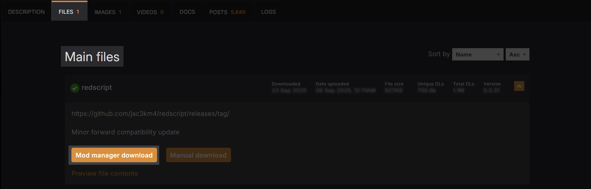<figcaption>
This is the <code>FILES</code> tab for Redscript - all the important parts of the page have been highlighted for you!
</figcaption></figure>


Don't download anything just yet - we'll get to that next moment, promise!


***

### Installing the Core Mods


The game should always be able to launch with just the core mods enabled. If it doesn't, head over to the [troubleshooting page](../../user-guide-troubleshooting/#troubleshooting-first-steps) and make sure that you can launch and start a new game.



Check if you have an up-to-date version of the **core mods**. Outdated collections can include earlier versions. If you update them, there's a good chance that everything will work.


The following mods are **requirements** for many other Cyberpunk mods. We recommend you install their latest version and keep them up-to-date, since you will run into them sooner or later.

**The Core Mods:**

* [Cyber Engine Tweaks](https://www.nexusmods.com/cyberpunk2077/mods/107)
* [RED4ext](https://www.nexusmods.com/cyberpunk2077/mods/2380)
* [redscript](https://www.nexusmods.com/cyberpunk2077/mods/1511)
* [ArchiveXL](https://www.nexusmods.com/cyberpunk2077/mods/4198)
* [TweakXL](https://www.nexusmods.com/cyberpunk2077/mods/4197)
* [Codeware](https://www.nexusmods.com/cyberpunk2077/mods/7780)

For more information on the core mods, check [core-mods-explained](../../../for-mod-creators-theory/core-mods-explained/ "mention")


Some mods that depend on **redscript** may say they require [cybercmd](https://www.nexusmods.com/cyberpunk2077/mods/5176), but it's unnecessary to install.**RED4ext** performs the same functionality (and more).


Let's download Cyber Engine Tweaks together, and then you can repeat the same process for the other mods listed above!



#### Find The Mod

First, you need to go to the [Cyber Engine Tweaks mod page](https://www.nexusmods.com/cyberpunk2077/mods/107). You'll see this page many times as you download mods, with their own information, content, and requirements. Make sure to check them!



#### The Files Tab

Now, we need to go to the `FILES` tab, next to the `DESCRIPTION` tab on the mod page.&#x20;

<figure><figcaption>
A full picture of the top of a mod page, so you can see where these tabs are
</figcaption></figure>



#### Download The Mod

Now that you're on the `FILES` tab, you'll see a section that says `Main Files` - this is where the file you need to download lives.&#x20;

Navigate to the top file listed and click the `Mod manager download` button.

<figure>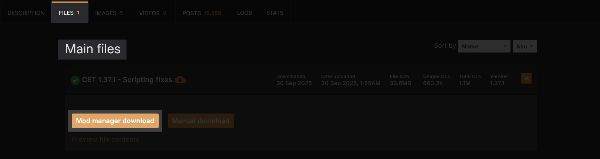<figcaption>
You need to click the first big orange button at the bottom
</figcaption></figure>


Most downloads will have a pop-up box at this point with a **list of required mods** - this is to remind you to download them!&#x20;

It's good practice to **check the `Requirements` tab** on the `Description` page before you download mods!

Cyber Engine Tweaks **doesn't have any requirements**, so it won't pop up this time, but it will for most other mods!


There will be a pop-up - cilck `Slow Download`. This will give a short timer before your mod begins downloading.&#x20;



#### Back To Vortex


Sometimes, Vortex will bring up a screen saying a mod may need manual adjustment, or that there was an unexpected file layout.&#x20;

Make sure to read these pop-ups, as they usually tell you exactly what the issue is!

If you ever get one that you're not sure about, or it just leaves you confused, [head on over to our Discord](https://discord.gg/redmodding) and someone will help you figure it out!


Now, if you kept the default `Bring Vortex to foreground when starting downloads in browser` setting enabled, Vortex should pop up on your screen. If you turned that setting off, you can click on Vortex.


There should now be a `1` next to `Downloads` on the left side of Vortex!




#### Start The Game

If you left the Vortex settings as default, the mod should already be enabled and deployed!


If you changed any of these settings, you'll have to click `Enable` button on the mod in the `Mods` tab, and then the icon of a linked chain along the top bar to `Deploy` it.


Before you start the game, check the bell in the top right corner next to your profile picture. Click it to expand the notifications. What you want to see is all green or blue.&#x20;

Any red or orange issues will need to be resolved before starting your game.

<figure><figcaption>
Notifications are ordered with most recent at the top, which means there was a successful REDmod deployment notification AFTER the failure, so the failure can be safely dismissed.
</figcaption></figure>


If all went well, you should see a prompt to bind an overlay key for **Cyber Engine Tweaks** (CET)! (If it does not, [check here](../../user-guide-troubleshooting/#cyber-engine-tweaks-isnt-working)).&#x20;

You can assign whatever you like, this button will hide or unhide the CET overlay.

This means everything is working, and you've successfully installed your first mod!




#### Download The Other Core Mods

Now that you've downloaded and successfully installed Cyber Engine Tweaks, you know how to download the other core mods!&#x20;

To make life easier, you can click the links below to take you straight to the mod pages!

* [RED4ext](https://www.nexusmods.com/cyberpunk2077/mods/2380)
* [redscript](https://www.nexusmods.com/cyberpunk2077/mods/1511)
* [ArchiveXL](https://www.nexusmods.com/cyberpunk2077/mods/4198)
* [TweakXL](https://www.nexusmods.com/cyberpunk2077/mods/4197)
* [Codeware](https://www.nexusmods.com/cyberpunk2077/mods/7780)


If you get stuck, go back over the steps above with the mod you're trying to download - it gets easier the more you do it.




***

### Manual Download

Sometimes, you'll go to download a mod and won't see the `Mod manager download` button. Mod authors sometimes disable mod manager integration for a variety of reasons.&#x20;

In these cases, you'll need to click `Manual download` and add the mod to Vortex yourself. Usually, Vortex can handle these files just fine – if not, it will complain about it, and loudly so.


It may seem odd to manually download a mod and then still put it into your mod manager, but it's to make your life easier in the future.&#x20;

Mixing manual and mod manager downloads is _not_ recommended, and can make potential troubleshooting way harder than it needs to be.


Let's download a mod that only allows for manual download and add it to Vortex, so you can get used to the steps involved. Don't worry, it's not too different from what you're used to already!


This guide assumes you have also followed the [#mod-manager-download](vortex-mod-manager.md#mod-manager-download "mention")guide - it's important as it lays the groundwork for installing mods through Vortex!




#### Find The Mod

For the sake of this guide, we'll say you've found [Meluminary's Kimber Space Buns](https://www.nexusmods.com/cyberpunk2077/mods/19255) hair mod.


Again, it's important to read the mod description and check for any requirements on _any_ mod you download, including this one.&#x20;


<figure>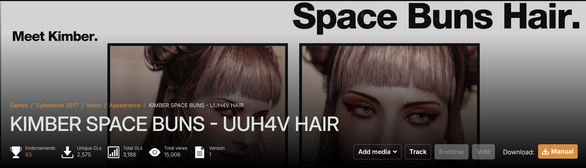<figcaption></figcaption></figure>



#### The Files Tab

Navigate to the `FILES` tab. You'll immediately notice that the main file only has one download option - \`Manual download\`.&#x20;

<figure>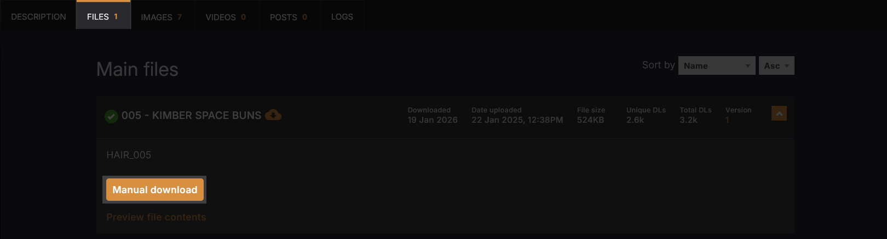<figcaption></figcaption></figure>

Before you download the mod, it's worth pressing the `Preview file contents` text underneath the download button.&#x20;

This can show you if there's multiple files included in the download, if it comes with the proper folder structure, or, for this mod, which hair slot it replaces.


Sometimes, mods that don't come in pre-defined folder structures can end up in the wrong places. For now, you don't need to worry about that, but if you want to check what this means, [you can read more about it here](../#fixing-broken-mod-file-paths).


<figure>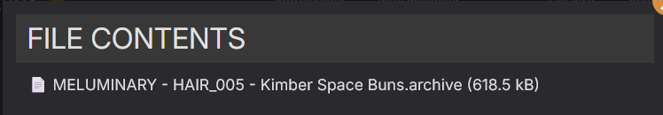<figcaption>
This shows us the mod author, which hairstyle slot it replaces (Hair 5), and the name of the mod!
</figcaption></figure>



#### Download The Mod

Just as before, download the mod. This time, it'll be `Manual download` - which means Vortex won't pop up on your screen. Instead, it'll download directly to your computer.



#### Back To Vortex

Open your Vortex window back up and navigate to the `Downloads` tab on the left side. You should see a box at the bottom that says `Drop URL(s) or File(s).` You can drop the zip file you just downloaded into this box.

<figure>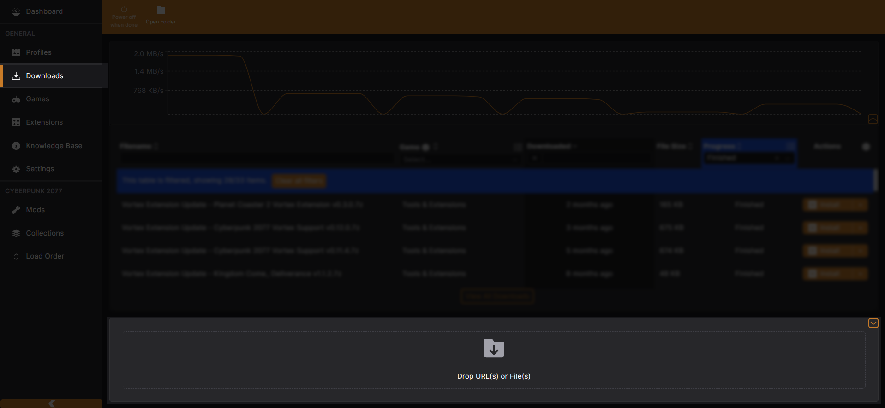<figcaption></figcaption></figure>

If that doesn't work, there is another way!&#x20;

Navigate to the `Mods` tab. Along the top bar, you should see a button that says `Install From File` - click this and select the zip file you just downloaded.

<figure>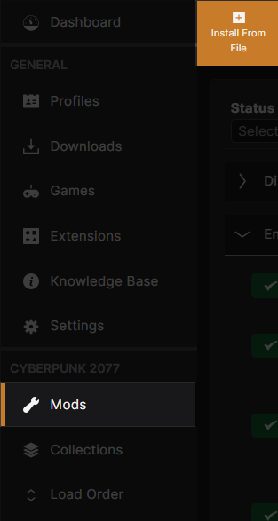<figcaption></figcaption></figure>



#### Start The Game

Make sure the mod is enabled and deployed before you launch the game!


If you changed any of these settings, you'll have to click `Enable` button on the mod in the `Mods` tab, and then the icon of a linked chain along the top bar to `Deploy` it.


Start a new game and select a female-bodied V. In the character creation screen, go to the `Hairstyle` category and select hair 05, which normally looks like this:

<figure>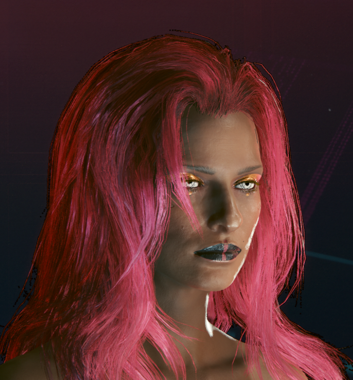<figcaption>
It's pretty, but it's not quite space buns, is it?
</figcaption></figure>


If all went well, your V should now have space buns!


<figure>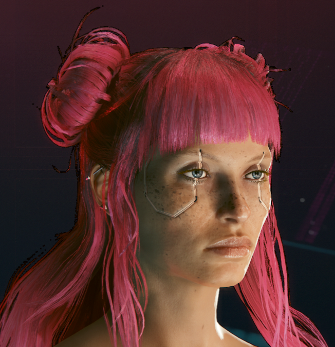<figcaption>
Hairstyle should look like this!
</figcaption></figure>

If V doesn't have spacebuns, you'll need to try installing the mod again.&#x20;


Most of the time, a mod will have more than just a singular `.archive` file. Occasionally, a mod author won't set up the correct structure for files to end up where they need to be.&#x20;

This one worked because it was a single `.archive` file, and the Cyberpunk Vortex extension is smart enough to fix it for you when you install the mod.

If you're running into constant issues with a mod not showing, even after making sure you've done every step correctly, you might have to do a little bit of adjustment yourself.\
[To find out how, check here!](../#fixing-folder-paths-in-vortex)




Congratulations! You know how to use Vortex!
