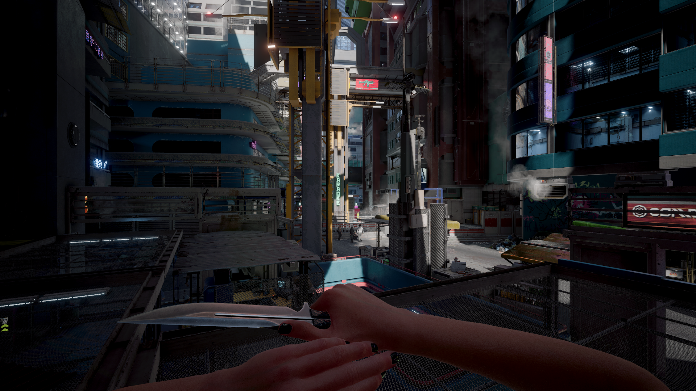

# Vortex Mod Manager


#### Windows 10 or higher is required to use Vortex mod manager. If you are not using Windows, see our Manual Install page.


Vortex is a multi-game mod manager developed for and by [NexusMods](https://www.nexusmods.com/), the website where most [Cyberpunk 2077 mods](https://www.nexusmods.com/cyberpunk2077) are hosted. Here you can download mods manually or with Vortex and keep track your download history.


To use Vortex, you need an account there. If you don't have one, you can sign up [here](https://users.nexusmods.com/register) – don't worry, it's free.


## Why do I need this?

Technically speaking, you don't. You can [install mods manually](../#manual-install) or use [Mod Organizer 2](https://www.modorganizer.org/) (but without our support, sorry, choom). However, Vortex for Cyberpunk is the most beginner-friendly way of managing your mods and will save you a lot of hassle.


If you have PTSD from modding Skyrim or Fallout with Vortex, be assured that Vortex for Cyberpunk is integrated **extremely** well. Go ahead, give it a try!

If you run into issues with Vortex that aren't addressed in this guide, you can contact [Nexus support](https://wiki.nexusmods.com/index.php/Category:Vortex) or join our [Discord](https://discord.gg/redmodding) and find (volunteer) help in the #vortex-support channel.


## TL;DR

* Your staging folder **must** be on the same drive as your game installation
* Your staging folder **must not** be your game install directory
* Vortex has [a lot of options](vortex-mod-manager.md#settings). If you put wrong options, mods can go brr.

## Download

&#x20;Once you are signed in on Nexus, it's time to download Vortex Mod Manager.


If you can download it on your own, you can skip to the [Install](vortex-mod-manager.md#installation) or [Setup](vortex-mod-manager.md#setup) section of this guide.


1. Click [this link](https://www.nexusmods.com/site/mods/1), it will take you directly to the download page
2. Select the "Manual Download" option on the first entry:

<figure><figcaption></figcaption></figure>

3. You'll now see a download page. If you don't have Nexus Premium,
   1. Select "Slow Download"
   2. Wait through the five seconds cooldown
4. Optional, depending on your browser: Select your download location for files that you don't want to keep
5. Wait until the installer is downloaded
6. Run the installer: either
   * select the file from your download history (Ctrl+J for most browsers)
   * go to your download directory and double-clicking the file
7. Proceed with the steps in the next section

## Installation

Once you run the installer, you may get a prompt from Windows, asking you if you want to allow this app to make changes to your device. Select yes, and then Vortex will begin its install.

If you chose the custom install  location option, you will a prompt asking you where you would like to install Vortex to. Further instructions will assume an install location of `C:\Program Files\Black Tree Gaming Ltd\Vortex`

Congrats! You've finished installation! Vortex should launch automatically and you can now move onto setup.

## Setup

Here is where we get into the weeds, the particulars of Vortex setup before we can use it.&#x20;


If you can setup Vortex on your own, skip to the [Settings](vortex-mod-manager.md#settings) section of this guide. (Why are you reading this?)


#### Logging into Nexusmods

If you are already logged in, proceed to the next section "[Adding Cyberpunk](vortex-mod-manager.md#vortex-adding-cyberpunk)"

1. If Vortex didn't open by itself, open it from the start menu.
2. Log into Nexusmods by clicking on the red circle in the top right of your client

<figure><figcaption>
The initial dashboard on launch
</figcaption></figure>

3. You will see either a browser window or an error message that Vortex couldn't open one – in this case, copy the URL in the box at the bottom and open the browser window yourself

<figure><figcaption>
If your browser doesn't open automatically, copy the url starting with users.nexusmods in the box
</figcaption></figure>

4. Optional: log into nexusmods (if you aren’t)
5. Allow Vortex to access your Nexus account by clicking "Authorize":

<figure><figcaption>
Allow Vortex to authorise your account
</figcaption></figure>

6. Click "Log in to Vortex":

<figure><figcaption>
Log into Vortex and close the page
</figcaption></figure>

7. Instead of the red icon, you should now see your profile picture and username from nexusmods.

#### Vortex: Adding Cyberpunk

This section will tell you how to add Cyberpunk to Vortex's managed games.

1. On the sidebar on the left side of your dashboard, click "Games"
2. In the page that now shows, type "Cyberpunk" into the search bar
3. Hover over its thumbnail and click "manage"
4. You will now see a popup complaining about "Game support not installed". Don't panic, this is expected!
5. Click the "download" button at the bottom of the window to install the Vortex plugin for Cyberpunk:

<figure><figcaption>
The games page, with the extension dialogue open
</figcaption></figure>

6. The extension should download automatically
7. You need to restart Vortex – agree to the prompt.
8. Optional: If Vortex was able to auto-detect your game install, you are done now and can proceed with the [Settings](vortex-mod-manager.md#settings) section.
9. Vortex will tell you that it couldn't detect your game install and prompt you to set it manually. Click "Continue".
10. In the explorer window that now pops up, navigate to the folder containing your Cyberpunk exe (e.g. `C:\Games\Cyberpunk 2077\bin\x64`)
11. Once you are in the right folder, click "Select Folder"

Vortex can now manage your game! Proceed to the next section, [Settings](vortex-mod-manager.md#settings).

### Settings

This section tells you how to set the recommended settings in Vortex, grouped by tab. If a tab isn't covered, there are no recommendations and you can do what you like.

Start by clicking "Settings" in the left sidebar of your Vortex Dashboard, then select the first tab.

#### Interface

The settings here tell Vortex what to do with your mods as it gets them.&#x20;

Here's a screenshot of the recommended settings with an explanation below:

<figure><figcaption>
Recommended automation settings
</figcaption></figure>

To put a mod in the game, Vortex requires you to complete four steps. The folders for these are configured in the [Mods section](vortex-mod-manager.md#mods).

1. Downloading: Putting the mod into Vortex's download cache, either by clicking the button on Nexus or by dragging-and-dropping an archive onto the client. The archive will now live in Vortex's **download directory**.
2. Installing: Unpacks the mod and copies it to Vortex's **staging** directory.
3. Enabling: This mod should be included in the next deploy
4. Deploying: The mod has been copied from Vortex's **staging** directory to your Cyberpunk **game** directory.

<table data-header-hidden><thead><tr><th width="332"></th><th></th></tr></thead><tbody><tr><td>Deploy mods when Enabled</td><td>Automatically deploys each mod as you enable it, merging step 3 and 4. We recommend enabling this, as it saves you a click.</td></tr><tr><td>Install Mods when downloaded</td><td>Automatically completes step 2 when you download a mod. We recommend disabling this as it lets you address issues and popup one after the other</td></tr><tr><td>Enable Mods when installed</td><td>Automatically completes step 2 when you install a mod. We recommend enabling this, as it saves you a click.</td></tr><tr><td>Run Vortex when my computer starts</td><td>Starts Vortex with Windows - disable or enable at your discretion</td></tr></tbody></table>

In theory, you can configure Vortex so that you hit the download button on the website and it will download, install, enable and deploy for you. The downside with that is that you might not notice errors as they pop up in the background, which is why we recommend doing that one single click by yourself.

#### V2077 Settings


This setting controls the automatic REDmod conversion. For an explanation of what that means, see [here](../#installing-and-activating-redmod).


This only has one setting, but it's recommended to keep it toggled "on" unless otherwise directed specifically by install instructions on a mod.

<figure><figcaption>
This option can also show up on the dashboard.
</figcaption></figure>

#### Mods

This section controls Vortex file storage. It's mostly a matter of personal preference and disk space availability on your end.

#### Mods: Staging


This folder MUST be on the same drive as your Cyberpunk.exe, or the deploy might fail.


Where Vortex keeps its mods, ready to deploy them into the Cyberpunk game directory.&#x20;

The default folder location is `{USERDATA}{game}\mods`, which resolves to `C:\Users\YourUsername\AppData\Roaming\Vortex\cyberpunk2077\mods`

You can keep it as this, or you can make a folder for it in a place you can easily access it, like `C:\Games\Mods`. Wherever you decide, you want to make sure it is accessible and you can remember it in case of issue.

<figure><figcaption>
Mod staging folder default location
</figcaption></figure>

#### Mods: Download

Where Vortex stores downloaded archives. Can be wherever you like, even on a different drive.&#x20;

We recommend keeping an extra folder in there for manually downloaded mods, as Vortex can manage these as well – you just have to drag-and-drop them into the client.

### Dashboard

Finally, we will return to our dashboard.&#x20;

No matter what settings you chose in interface, you should still have a section labeled "Tools", where at this point you should at least see four things, the last of which will be disabled:

<figure><figcaption>
The default tools on the dashboard.
</figcaption></figure>

It can be helpful here to toggle "Enable Toolbar" above it so that you can always see them wherever you are in Vortex.

These are different options to launch the game via Vortex.&#x20;


Click on the three dots next to "Launch Game with REDmods Enabled" and set it as primary. This will make Vortex pick this option when you click on the Cyberpunk 2077 picture on the far left.


"REDmod Deploy Latest Load Order" is also incredibly useful if your mods are acting up: Just using the "deploy" button on the main management page can fail – by using this button, you can debug your REDmod deployment.

## Use

You're almost to the mod page, but first, you need to _get_ some mods. Let's start by installing the [core framework collection](https://next.nexusmods.com/cyberpunk2077/collections/r1flnc), which contains everything that other mods require.

1. Click on "Collections" in the sidebar
2. Select "Discover more collections."&#x20;
3. Wait until the selection page pops up.
4. Select [Core Mods](https://next.nexusmods.com/cyberpunk2077/collections/r1flnc) and click "Add to Vortex".

This will open a window in Vortex, with the thumbnail and name of the collection, which profile you want to install it to if enabled, and any additional install instructions.&#x20;

<figure><figcaption>
Collection installation confirmation window
</figcaption></figure>

5. Click "Install Now": This collection has no extra instructions.
6. You will get a new window for the first mod: click the "Download" button

<figure><figcaption>
The download window for a mod in the collection.
</figcaption></figure>

7. The Nexus "Slow/Fast" download button for the corresponding version will open. The correct version has been picked by the mod author.
8. Click "Slow Download" (unless you're a premium user)
9. Rinse and repeat this process until you have all mods in the collection.


As this is a collection, each mod will – regardless of our settings – be installed as its downloaded. As they deploy, you will see a screen pop up with a lot of code flowing by. Don't worry, this is just Vortex deploying your REDmods.


Before you play your game, check the bell in the top right corner next to your profile picture. Click it to expand the notifications. What you want to see is all green or blue--any red or orange issues will need to be resolved before starting your game.

<figure><figcaption>
Notifications are ordered with most recent at the top--which means there was a successful REDmod deployment notification AFTER the failure, so the failure can be safely dismissed.
</figcaption></figure>

At this point, assuming your notifications are all green or blue, you can safely play your game. However, you won't notice many changes, as the framework mods aren't doing much on their own...

### Starting up the game


The game should always launch with just the core frameworks enabled. If it doesn't, head over to the [troubleshooting page](../../user-guide-troubleshooting/#your-game-is-crashing) and make sure that you can launch and start a new game.


Since this is your first time launching the game with mods, you should see a prompt to bind an overlay key for **Cyber Engine Tweaks** (CET). (If it does not, check [here](../../user-guide-troubleshooting/#mod-isnt-working-cet).) You can assign whatever you like, this button will hide or unhide the CET overlay.

&#x20;While you have it open, you can navigate to the "Settings" option, and select "Skip Start Menu" and "Suppress Intro Movies" (if you don't want them). The setting will become active after the next restart.

Make sure to click save to keep your choices.

<figure><figcaption>
CET overlay on the main menu screen on the Settings option.
</figcaption></figure>

### Downloading a mod with Mod Manager Download enabled

Let's get a mod that'll change something. For this example, we've picked KS UV framework, which will change V's feet.


Usually, you want to start at the description page to see the exact file that you need to download. For a detailed guide on the parts of a mod page and how to navigate Nexus, see our Downloading Mods section.&#x20;


For now, you can simply go straight to the [Files](https://www.nexusmods.com/cyberpunk2077/mods/3783?tab=files) page of the KSUV mod.&#x20;

<figure><figcaption>
The example mod's "Mod Manager Download" button
</figcaption></figure>

So that you can see the changes in-game immediately, to know if you've installed correctly, you will download the first option, "Recommended. UV Framework New High Heel Feet with Custom Textures - Classic Install". This will change the feet visually now, and allow for custom textures later. Click "mod manager download". A window will pop up telling you that you need another mod "[-KS- Vanilla Shoes for High Feet](https://www.nexusmods.com/cyberpunk2077/mods/7055)" installed before downloading this. You can do this after downloading this mod; your feet just won't fit in any vanilla shoes until you do. For now, click download to continue to the final download page, where you will select "slow".

Once your timer counts down, it should begin downloading in Vortex. The setting "Bring Vortex to foreground when starting downloads in browser" is enabled by default, so if you didn't change it, the Vortex window should pop up now. Otherwise, click over to it, and you should be able to see a 1 next to Downloads in the sidebar.

Assuming you're using recommended settings, the mod won't have installed itself, so you will click on "Mods" in the left sidebar. You should already have mods installed, enabled, and downloaded from the collection. Scroll down until you locate the blue "Never Installed" button next to the mod you want to install. Click it once, and if you're using recommended settings, it should enable and deploy automatically.&#x20;

For this mod, a window will pop up, warning you that it may need manual adjustment, due to multiple .archive files. These are important windows to pay attention to, because many mods that have multiple files _do_ require manual adjustment. This information is usually found on the description page, which is why you want to read it carefully before download.

<figure><figcaption>
The warning window that pops up in Vortex for mods with more than one .archive file
</figcaption></figure>

For this mod, however, that is ok, and intended. You may simply click "Understood".

To test your new body framework mod, simply select "New Game" and pick a female-bodied V. If the feet are flat, it is not installed correctly. If they look a little funny, like barbie feet, you've done it right.

<figure><figcaption>
The left is what you're shooting for--if you see the right, the mod isn't working.
</figcaption></figure>

### Downloading a mod manually to manage in Vortex

Let's install a mod without a mod manager download button and manage it in Vortex to show you how it works.


Mod authors sometimes disable mod manager integration for a variety of reasons. Usually, Vortex can handle these files just fine – if not, it will complain about it, and loudly so.


1. Click [this link](https://www.nexusmods.com/cyberpunk2077/mods/6072), which will take you straight to the files tab.&#x20;
2. Select whichever one you like, like the "Arey", third option down.&#x20;
3. Optional: Check what it looks like
   1. Click on the "images" tab (to the right of "files")
   2. Find the picture named "Arey"
   3. Navigate back to the "Files" tab

<figure><figcaption>
Arey hair by Wingdeer
</figcaption></figure>

4. Scroll down to the third option, `Arey Hair PHYSICS ENABLED`\
   The file doesn't have any particular instruction.
5. Optional: view the file contents – they sometimes contain helpful information:

<figure><figcaption>
The naming convention tells us that it's a hair replacer from Wingdeer for the female body gender, changing hair 48, There's also a preview picture included.
</figcaption></figure>

6. Manually download the file – you know the drill by now.
7. Return to the Vortex "mods" page. You have two ways to install the mod now:&#x20;
   * Drag-and-drop the downloaded file on your client, or&#x20;
   * use "Install From File" in the orange bar and select the file you just downloaded in the explorer window that pops up

<figure><figcaption>
The "Install From File" button
</figcaption></figure>

8. You should now have successfully installed the file.
9. If you have used the recommended settings, it should enable and deploy automatically. Otherwise, you need to do that yourself.
10. Start the game
11. Head to the character creator and create a female-bodied V
12. Check hair 48 – normally, it looks like this:

<figure><figcaption>
Vanilla hair 48
</figcaption></figure>

If your hair is two big buns--you did it! If it's just the normal single bun with braids, go back and try again.

<figure><figcaption>
Arey hair in place of hairstyle 48
</figcaption></figure>

Congratulations! You know how to use Vortex!

