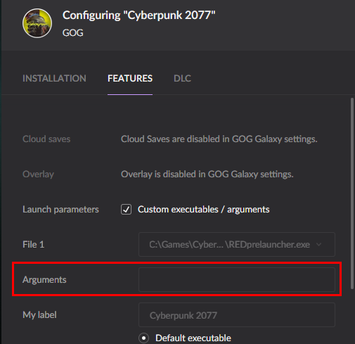

# Modding on Linux

## Summary

This page tells you how to **set the launch options** for Steam under Linux.&#x20;

### Wait, this is not what I want!

* If you have trouble after an update and have exhausted [all the usual steps](../user-guide-troubleshooting/users-troubleshooting-after-a-game-update.md), double-check your [#launch-options](modding-on-linux.md#launch-options "mention") (sometimes, Steam helpfully changes them to make you crash)
* If you want to optimize Cyberpunk 2077 settings for your SteamDeck, find a guide on [/r/SteamDeck](https://www.reddit.com/r/SteamDeck/)

## TL;DR

You need to&#x20;

* Install `d3dcompiler_47`
* Install `vcrun2022`
* Adjust the Steam launch option to be:\
  `WINEDLLOVERRIDES="winmm,version=n,b" %command%`


The guide below has been confirmed working for dozens of people on SteamDeck, various Linux distributions, and Mac OS. Follow it **by the letter** and it will work for you as well.


## Installing the required tool

To play games on Linux, you need various programs and libraries. On the steam deck, most are preinstalled, and all you need is a tool to configure them.

This guide has information about Protontricks (recommended) and Lutris (only here for the sake of completeness). If you use anything else, we can not support you

### Protontricks: Setting up


Make sure that you are on the most recent version of Protontricks. This guide will follow how to perform these steps on a SteamDeck, but other KDE-based distros should be similar. Other Linux distros will need to go to their respective app stores to download Protontricks.



If you don't want to read text, find a video documenting the process [here](https://youtu.be/CYKCOBaZpBU?t=110). Thanks to Connor for providing the screenshots and transcription!


To configure the necessary parameters, you can use the app Protontricks, which you can download through the built-in app browser "Discover":&#x20;

<figure><figcaption><p>Protontricks as Shown in Discover</p></figcaption></figure>

2. Open Protontricks (you can search for this by selecting start menu)

<figure><figcaption><p>Opening Protontricks</p></figcaption></figure>

3. When Protontrick opens, select Cyberpunk:

<figure><figcaption><p>Finding Cyberpunk 2077 in Protontricks</p></figcaption></figure>

4. Choose "Select the default wineprefix":

<figure><figcaption></figcaption></figure>

5. Add an override: Check **both** of the checkboxes below

<figure><figcaption></figcaption></figure>

<figure><figcaption><p>Selecting <code>d3dcompiler_47</code></p></figcaption></figure>

<figure><figcaption><p>Selecting <code>vcrun2022</code></p></figcaption></figure>


If you do not see `vcrun2022` please verify you're on the latest version of Protontricks


Apply via "OK". You may receive an error below or similar. If you do, click "Yes" to continue the installation.

<figure><figcaption><p>Example Installation Warning</p></figcaption></figure>

### Lutris: setting up

Taken from [CET's github](https://github.com/maximegmd/CyberEngineTweaks/issues/821)

1. Open Lutris
2. Right click on the game > `Settings` > `Runner options`
3. While newer versions of Lutris can use Proton, it is advised you use Wine-GE instead. Make sure you're using at least `lutris-GE-Proton8-1`

<figure><figcaption></figcaption></figure>

4. Scroll down to **DLL overrides**, click on **Add** to add a key. Add the following keys:

<figure><figcaption></figcaption></figure>

## Launch Options

You need to pass a few parameters to the Cyberpunk.exe to enable mods. Read the section for your client to find out how.


If you have typos or forget characters in your launch parameters, **they will not work**. \
You can copy-paste the text from the guide below.


For a full list of launch options, check [launch-parameters.md](the-cyberpunk-2077-game-directory/launch-parameters.md "mention"). Use them at own risk!

### Steam: Launch Options

Switch to steam and make sure that the launch options are set as below:

```
WINEDLLOVERRIDES="winmm,version=n,b" %command%
```


The command is case sensitive. Copy-paste the text from the box above to make sure.


<figure><figcaption><p>Setting Launch Options in Steam</p></figcaption></figure>

If this still doesn't work, check the [Cyber Engine Tweaks wiki](https://app.gitbook.com/s/-MP5jWcLZLbbbzO-\_ua1-887967055/getting-started/installing) for additional instructions, or find us on [Discord](https://discord.gg/redmodding) in `#mod-troubleshooting`.

### GOG: Launch Options

You can find the launch options for GOG in the game's config menu under `Manage Installation` -> `Configure...`

<figure><figcaption></figcaption></figure>

As under Steam, you have to add the following:

```
WINEDLLOVERRIDES="winmm,version=n,b" %command%
```


The command is case sensitive. Copy-paste the text from the box above to make sure.


## Troubleshooting

### This is not working!

#### Check the launch options

This is the most common error. You wouldn't believe how often people show up in the support discord channel, yell in frustration for 10 minutes, and then found out that they included an extra space, forgot a letter, or made a simple typo.

Do not be these people. Copy-paste from the guide and delete any extra spaces.

#### Update protontricks

Make sure to be on the last version of protontricks. If that does not work, try the **second-to-last** version — sometimes, the tools themselves break.


You can check protontricks' [github page](https://github.com/Matoking/protontricks/issues). If there is anything seriously broken, you will find something there.


#### Ask for help

You can find us on the [modding discord](https://discord.gg/redmodding) in `#cet-troubleshooting` or `#red4ext-support`. Beware: If it turns out to be a typo in your launch options, there will be snark. ;)&#x20;

