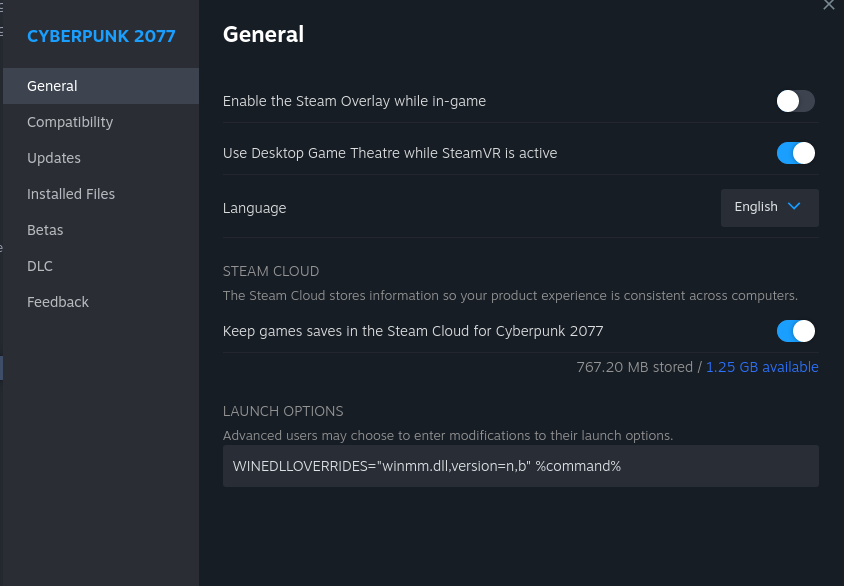
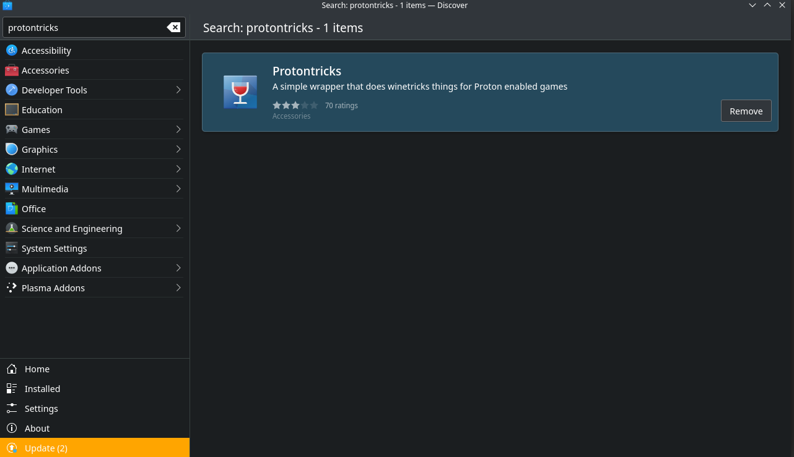
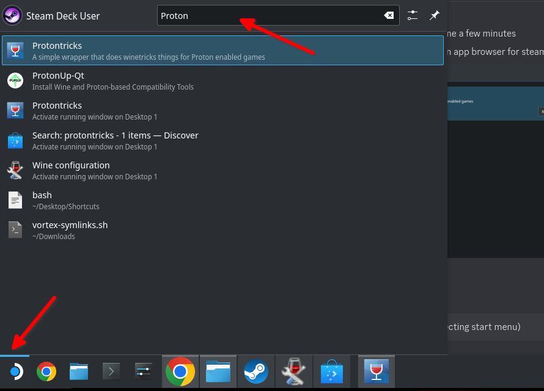
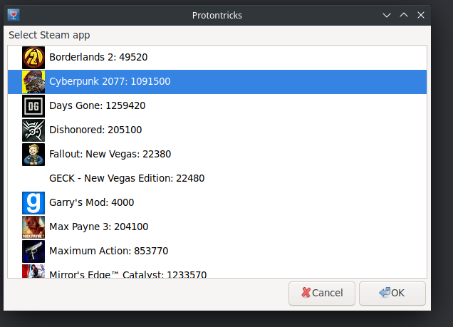
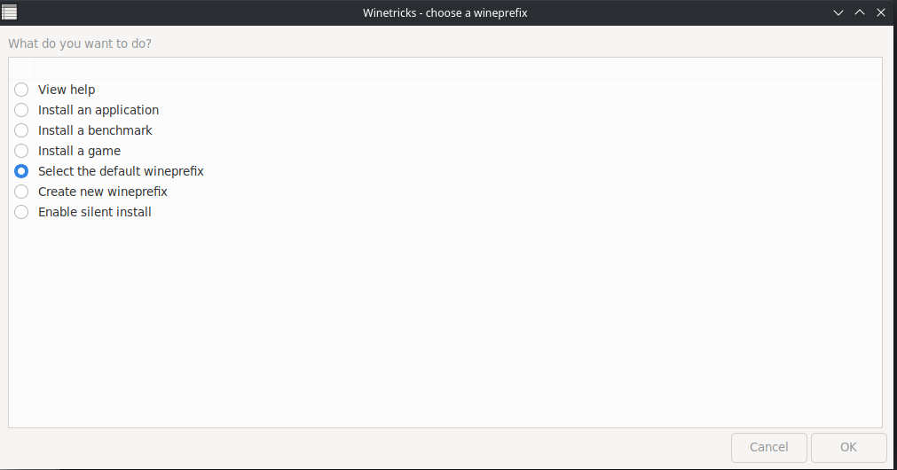
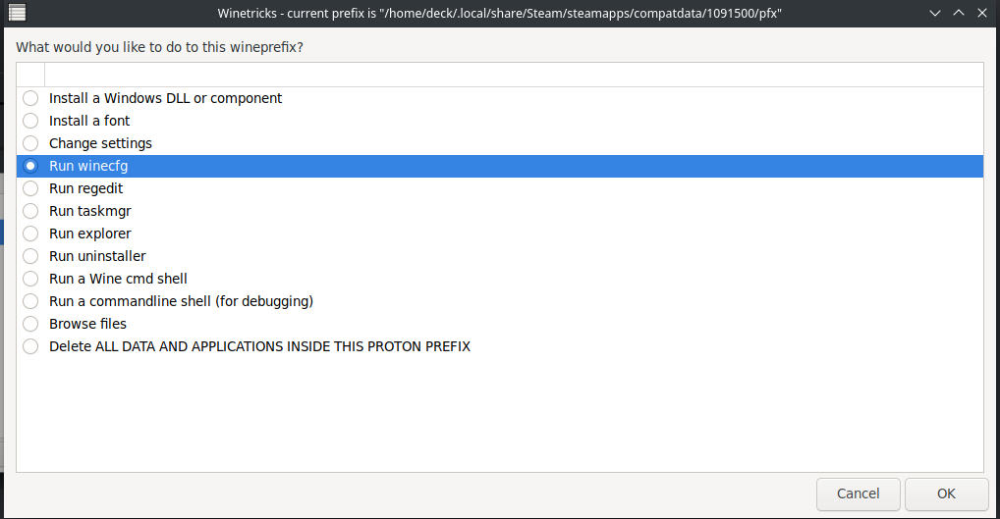
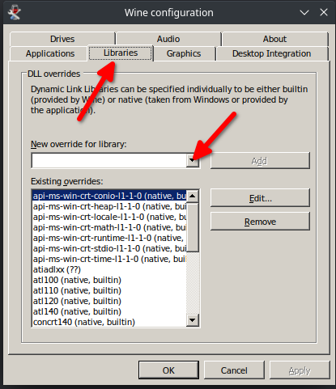
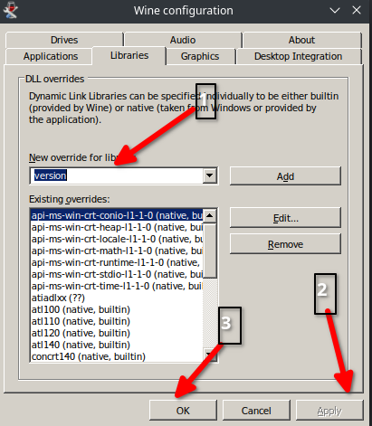

# Modding on Linux

## Summary

This page tells you how to set the launch options for Steam under Linux. If you have trouble after an update and have exhausted [all the usual steps](../user-guide-troubleshooting/users-troubleshooting-after-a-game-update.md), make sure to double-check them — sometimes, Steam helpfully deletes them for you to make sure that your game crashes on startup.

## TL;DR

You need to&#x20;

* install d3dcompiler\_47
* install vcrun2022
* set your launch options to `WINEDLLOVERRIDES="winmm,version=n,b" %command% -modded`

## Setting the launch options by hand

Under Linux, you have to start the game by setting the following launch options for Cyberpunk:

```
WINEDLLOVERRIDES="winmm,version=n,b" %command% -modded
```

<figure><figcaption></figcaption></figure>

If you can't get it to work, follow the steps below to apply the launch options via Protontricks, or search the #red4ext-support channel on the [modding discord](https://discord.gg/redmodding) for `winmm` to find out what else you can do.

## Setting the launch options via Protontricks


Make sure&#x20;



If you don't want to read text, find a video documenting the process [here](https://youtu.be/CYKCOBaZpBU?t=110). Thanks to #Connor for providing the screenshots and transcription!


To configure the necessary parameters, you can use the app Protontricks, which you can download through the built-in app browser "Discover":&#x20;

<figure><figcaption></figcaption></figure>

2. Open Protontricks (you can search for this by selecting start menu)

<figure><figcaption></figcaption></figure>

3. When Protontrick opens, select Cyberpunk:

<figure><figcaption></figcaption></figure>

4. Choose "Select the default wineprefix":

<figure><figcaption></figcaption></figure>

5. Choose "run winecfg":

<figure><figcaption></figcaption></figure>

6. Add an override:\
   Switch to the libraries tab and open the drop down menu

<figure><figcaption></figcaption></figure>

7. Select "version" and "Add"

<figure><figcaption></figcaption></figure>

8. Repeat the process for `d3dcompiler_47`
9. Apply via "OK". You're now done with Protontricks.
10. Switch to steam and make sure that the launch options are set. They should look like this:\
    `WINEDLLOVERRIDES="winmm.dll,version=n,b" %command%`

<figure><figcaption></figcaption></figure>

If that didn't help you, you might be able to find the solution on the [CET wiki page](https://wiki.redmodding.org/cyber-engine-tweaks/getting-started/installing/untitled).
