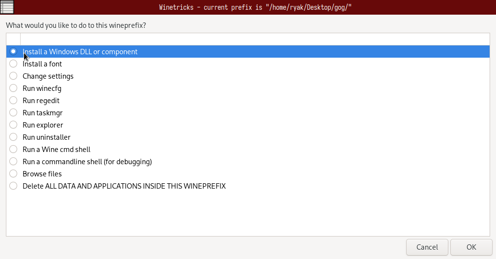
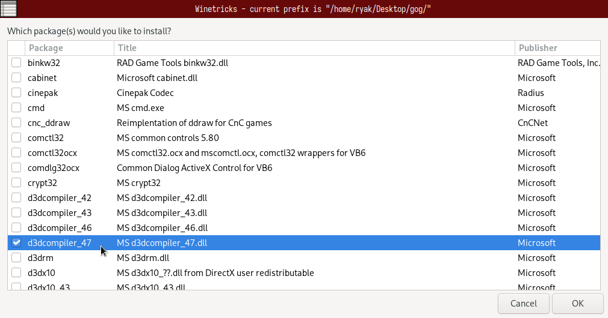
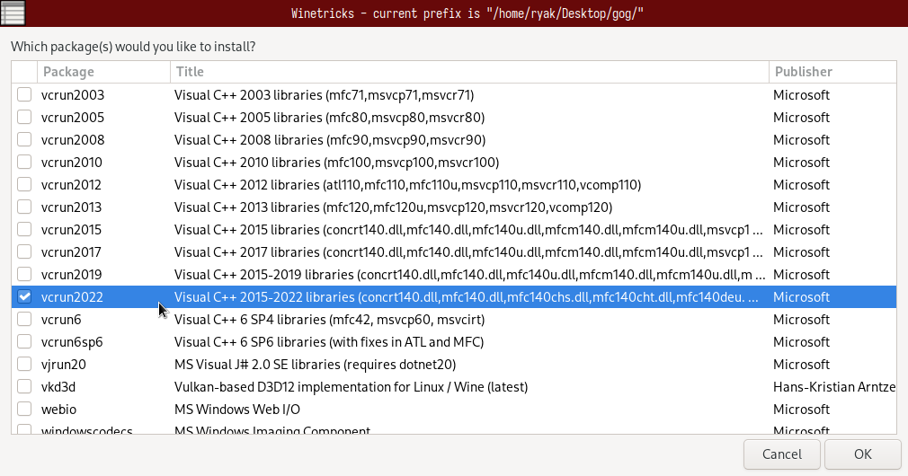
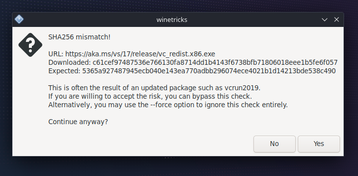

# Modding on Linux


Find a guide how to optimize Cyberpunk 2077 settings for SteamDeck on [/r/SteamDeck](https://www.reddit.com/r/SteamDeck/)


## Summary

This page tells you how to set the launch options for Steam under Linux. If you have trouble after an update and have exhausted [all the usual steps](../user-guide-troubleshooting/users-troubleshooting-after-a-game-update.md), make sure to double-check them — sometimes, Steam helpfully deletes them for you to make sure that your game crashes on startup. For GoG or Epic Games Store, the steps are the same, but the location to set the launch options are different.

## TL;DR

You need to&#x20;

* Install `d3dcompiler_47`
* Install `vcrun2022`
* Adjust the Steam launch option to be:\
  `WINEDLLOVERRIDES="winmm,version=n,b" %command%`

If you can't get it to work, follow the steps below to apply the launch options via Protontricks, or search the `#red4ext-support` channel on the [modding discord](https://discord.gg/redmodding) to find out what else you can do.

## Setting Up Protontricks


Make sure that you are on the most recent version of Protontricks. This guide will follow how to perform these steps on a SteamDeck, but other KDE-based distros should be similar. Other Linux distros will need to go to their respective app stores to download Protontricks.



If you don't want to read text, find a video documenting the process [here](https://youtu.be/CYKCOBaZpBU?t=110). Thanks to Connor for providing the screenshots and transcription!


To configure the necessary parameters, you can use the app Protontricks, which you can download through the built-in app browser "Discover":&#x20;

<figure><figcaption>
Protontricks as Shown in Discover
</figcaption></figure>

2. Open Protontricks (you can search for this by selecting start menu)

<figure><figcaption>
Opening Protontricks
</figcaption></figure>

3. When Protontrick opens, select Cyberpunk:

<figure><figcaption>
Finding Cyberpunk 2077 in Protontricks
</figcaption></figure>

4. Choose "Select the default wineprefix":

<figure><figcaption></figcaption></figure>

5. Add an override: Check **both** of the checkboxes below

<figure><figcaption></figcaption></figure>

<figure><figcaption>
Selecting <code>d3dcompiler_47</code>
</figcaption></figure>

<figure><figcaption>
Selecting <code>vcrun2022</code>
</figcaption></figure>


If you do not see `vcrun2022` please verify you're on the latest version of Protontricks


Apply via "OK". You may receive an error below or similar. If you do, click "Yes" to continue the installation.

<figure><figcaption>
Example Installation Warning
</figcaption></figure>

## Launch Options

Switch to steam and make sure that the launch options are set as below:\
`WINEDLLOVERRIDES="winmm,version=n,b" %command%`

<figure><figcaption>
Setting Launch Options in Steam
</figcaption></figure>

If this still doesn't work, check the [Cyber Engine Tweaks wiki](https://app.gitbook.com/s/-MP5jWcLZLbbbzO-\_ua1-887967055/getting-started/installing) for additional instructions, or find us on [Discord](https://discord.gg/redmodding) in `#mod-troubleshooting`.
