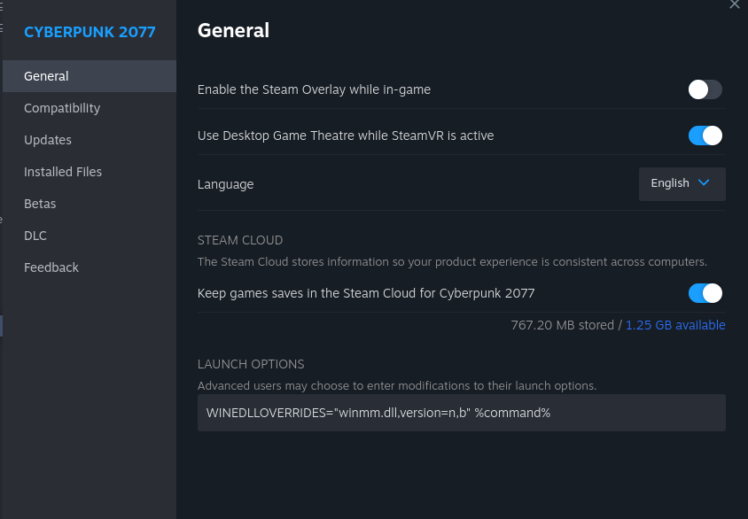
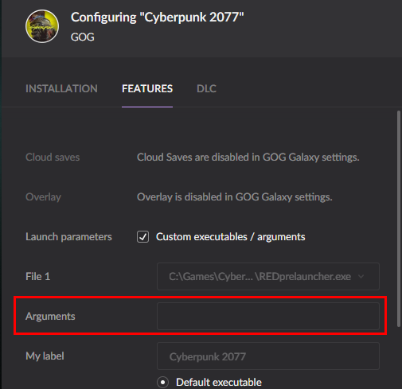

# Modding on Linux

## Summary

This page tells you how to **set the launch options** for Steam under Linux.

### Wait, this is not what I want!

* If you have trouble after an update and have exhausted [all the usual steps](../user-guide-troubleshooting/users-troubleshooting-after-a-game-update.md), double-check your [#launch-options](modding-on-linux.md#launch-options "mention") (sometimes, Steam helpfully changes them to make you crash)
* If you want to optimize Cyberpunk 2077 settings for your SteamDeck, find a guide on [/r/SteamDeck](https://www.reddit.com/r/SteamDeck/)
* For a video about modding on mac, see [https://www.youtube.com/watch?v=x0CDcBui2qE\&t=20s](https://www.youtube.com/watch?v=x0CDcBui2qE\&t=20s)


The guide below has been confirmed working for dozens of people on SteamDeck, various Linux distributions, and Mac OS. Follow it **by the letter** and it will work for you as well.


## Setting up proton

the latest proton experimental doesn't require protontricks/winetricks anymore!

all you have to do is to select proton experimental as the compatibility tool and set launch options below.

### Steam: Launch Options

Switch to steam and make sure that the launch options are set as below:

```
WINEDLLOVERRIDES="winmm,version=n,b" %command%
```


The command is case sensitive. Copy-paste the text from the box above to make sure.


<figure><figcaption><p>Setting Launch Options in Steam</p></figcaption></figure>

If this still doesn't work, check the [Cyber Engine Tweaks wiki](https://app.gitbook.com/s/-MP5jWcLZLbbbzO-_ua1-887967055/getting-started/installing) for additional instructions, or find us on [Discord](https://discord.gg/redmodding) in `#mod-troubleshooting`.

### GOG: Launch Options

You can find the launch options for GOG in the game's config menu under `Manage Installation` -> `Configure...`

<figure><figcaption></figcaption></figure>

As under Steam, you have to add the following:

```
WINEDLLOVERRIDES="winmm,version=n,b" %command%
```


The command is case sensitive. Copy-paste the text from the box above to make sure.


### Heroic: Launch Options

While at your library right click Cyberpunk then navigate to `Settings` -> `ADVANCED` and scroll down to `Environment Variables`

Now set a new variable name `WINEDLLOVERRIDES` with a value of `winmm,version=n,b`

<figure><figcaption><p>Don't forget to click the + button for the changes to save.</p></figcaption></figure>


Variable Name and Value are both case sensitive, Copy-paste for certainty.



Anything that includes **`=`** and doesn't start with **`-`** goes to Environment Variables, while things starting with\*\*`-`**usually go under Game Arguments, for example**`-skipStartScreen`\*\*


## Troubleshooting

#### Check the launch options

This is the most common error. You wouldn't believe how often people show up in the support discord channel, yell in frustration for 10 minutes, and then found out that they included an extra space, forgot a letter, or made a simple typo.

Do not be these people. Copy-paste from the guide and delete any extra spaces.

## Make sure you're using the correct proton version

Make sure your selected compatibility tool is "proton experimental"!

#### Ask for help

You can find us on the [modding discord](https://discord.gg/redmodding) in `#cet-troubleshooting` or `#red4ext-support`. Beware: If it turns out to be a typo in your launch options, there will be snark. ;)
