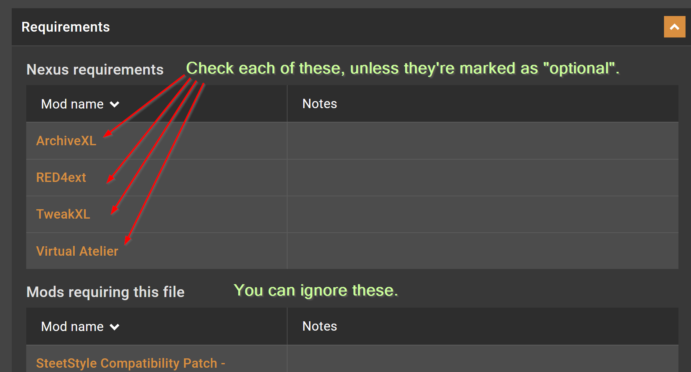

# Requirements explained

## Summary

This guide will show you how to debug a dependency chain to troubleshoot a mod. It'll use [VirtualAtelier](https://www.nexusmods.com/cyberpunk2077/mods/2987?tab=description) for an example, but the same principle applies to each and any mod.


In the process of this guide, you will be told to check a certain mod's log file. If you don't know how to do that, check [this](../user-guide-troubleshooting/finding-and-reading-log-files.md) page for a step-by-step guide.Technique: Reading log files


## Theory: What is a requirement?

It is something that your mod needs to work; for that reason, requirements are also called **dependencies**. The game will load them **first**.

Most of them are other mods.

<figure><figcaption></figcaption></figure>


[Do you want to know more?](../../for-mod-creators/core-mods-explained/)


## Level 1: The mod itself

### Situation

You're trying to install a mod — and it's not working.

### Step 1: Try to find its log file


For Atelier stores, there won't be individual log files. Skip [here](requirements-explained.md#level-2-the-requirements), starting with [VirtualAtelier ](https://www.nexusmods.com/cyberpunk2077/mods/2987)as a dependency.


Search for a matching log file in the Cyberpunk folder (either the mod's name or in the mod's folder). [Here](../user-guide-troubleshooting/finding-and-reading-log-files.md) are instructions on how you do that.&#x20;

\=> If you have found a log file, go [here](requirements-explained.md#a-log-file-exists).

\=> If you have not found one or it contains no errors or warnings, go [here](requirements-explained.md#you-cant-find-a-log-file).

### A log file exists

If you can't find one, go [here](requirements-explained.md#the-file-only-has-warnings).

#### The file is empty

This means that your mod is loaded, but never initialized. Go [here](requirements-explained.md#you-cant-find-a-log-file).

#### The file has errors

The mod itself is broken. You can now go and [troubleshoot it](../user-guide-troubleshooting/#dealing-with-a-broken-mod).

#### The file only has warnings

Your mod is being loaded, so the dependencies are OK (if they aren't, the log file would tell you so).

Warnings in the log file don't necessarily mean that something is outright broken. But since you're here and your mod isn't working, that is probably the case. Proceed with [troubleshooting](../user-guide-troubleshooting/#dealing-with-a-broken-mod).

### You can't find a log file

The good news: the mod itself is not the problem.&#x20;

The bad news: you'll have to check its requirements. [Let's do that now.](requirements-explained.md#level-2-the-requirements)

## Level 2: The requirements

### Step 1: Finding the requirements

Open the mod's Nexus page and check the **Description** tab (the first one). You will see something like this:

<figure><figcaption>
If you don't know if a mod is optional, it's most likely not.
</figcaption></figure>

### Step 2: Re-do Step 1 for each requirement&#x20;

For each of the dependencies:

1. If it's marked as optional and you don't have it installed, ignore it and proceed with the next.
2. If you don't have it installed and it's not marked as optional, **install it**.
3. If it's marked as optional with a condition and you match (e.g. "install if you're using codeware"), **install it**.&#x20;
4. Return to [Level 1](requirements-explained.md#level-1-the-mod-itself) and repeat it **for the requirement**.&#x20;

