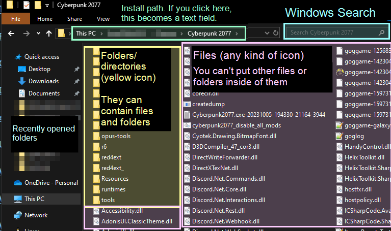
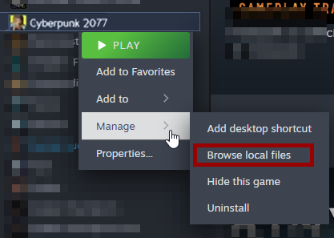
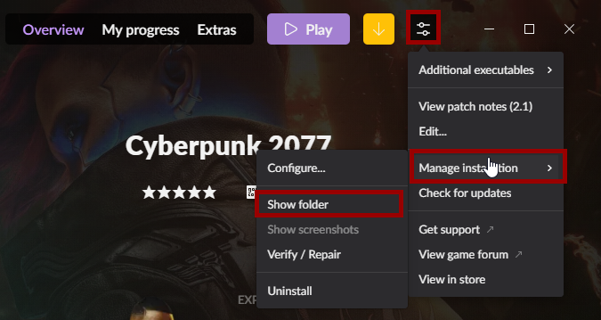
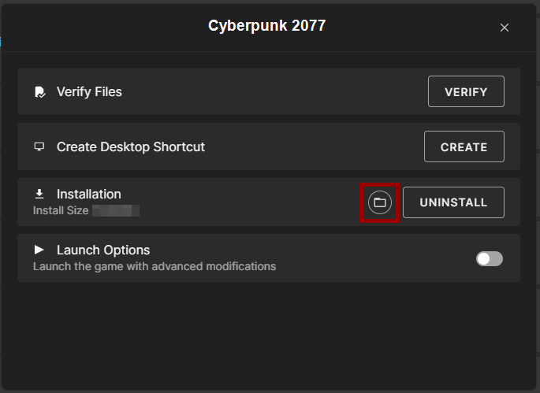
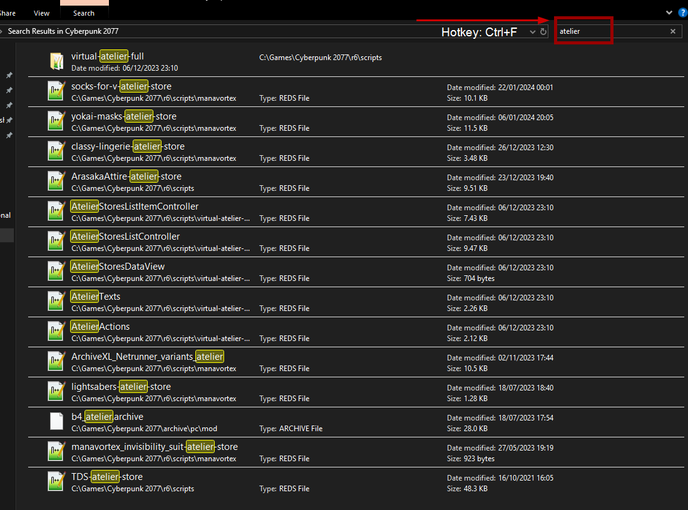
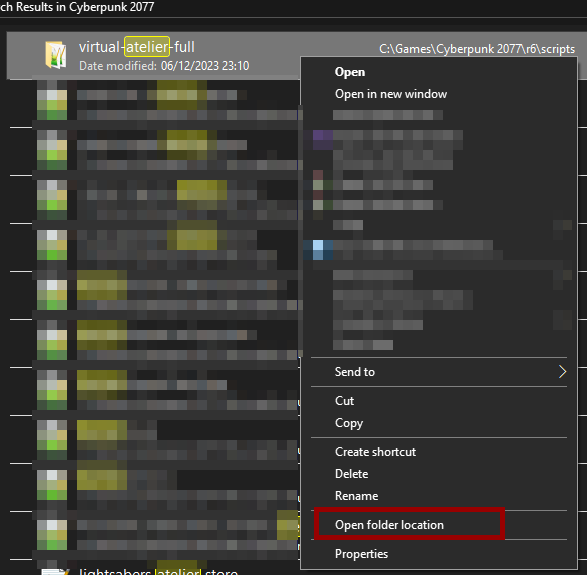

# The Cyberpunk 2077 Game Directory

Summary

**Published:** Jan 27 2024 by [manavortex](https://app.gitbook.com/u/NfZBoxGegfUqB33J9HXuCs6PVaC3 "mention")\
**Last documented update:** Jan 27 2024 by [manavortex](https://app.gitbook.com/u/NfZBoxGegfUqB33J9HXuCs6PVaC3 "mention")

This page will tell you what your Cyberpunk 2077 game directory is, how you can find it, and how you can manually delete residual mod files.

## What is the game directory?

The game directory is called `Cyberpunk 2077` (unless you re-named it). It's the place where Windows put everything that it needs to run the game when you click on the icon — that includes mods.

What's the difference between folders and files?

A **folder** (also called **directory**) has a yellow icon: 📁\
It's a container for **files** and other folders.&#x20;

A **file** can be anything and have any kind of icon. They don't usually contain other files or folders, although exceptions exist.

You browse through this using the Windows Explorer.

This kind of knowledge is considered pretty basic — if you don't have it, don't feel bad! Most of us Netrunners are around this stuff for literal decades. I won't explain everything in detail here, but there's a great guide on [uis.georgetown.edu](https://uis.georgetown.edu/file-explorer/) on how to use the Windows File Explorer.&#x20;

Click on the picture below to zoom in!

## How can I find it?

If you don't know your game directory, you can find it in your client:

### Steam

Right-click on the game in your library, then select `Manage` -> `Browse local files`

<figure><figcaption></figcaption></figure>

### GOG

With the game selected in your library, click on the `More` button, then on `Manage Installation` and `Show folder…`

<figure><figcaption></figcaption></figure>

### Epic

Right-click on your game in the list and select `Manage`. Then, click on the folder icon:

<figure><figcaption></figcaption></figure>

## Using Windows Search to delete residual files

Once you have the Cyberpunk folder open in your Windows Explorer, you can use the Windows Search bar in the upper right corner (Hotkey: `Ctrl+F`) to find files by name. For example, if you have trouble with atelier and have decided to do a clean reinstall, you can search for `atelier`:

<figure><figcaption>
This will also find most of your atelier stores. If you use Vortex, that's no problem - otherwise, you may want to backup before you delete.
</figcaption></figure>

You're seeing the atelier install folder (good) and a bunch of atelier stores (bad, these are innocent). \
You can either double-click on the `virtual-atelier-full` folder (first item) to navigate there, or use any of the following options.

### Finding the folder path in the search results

If you right-click on a folder or file, you will see a menu entry "open folder/file location". This will open a new Windows Explorer window in the folder **containing** the item you selected, letting you browse and delete.

<figure><figcaption></figcaption></figure>

### Deleting from the search results

Select multiple items from the list by holding the `Ctrl` key while you click.&#x20;

Once you have selected everything that you want to delete, simply press the `delete` key, or right-click and select `Delete`.
