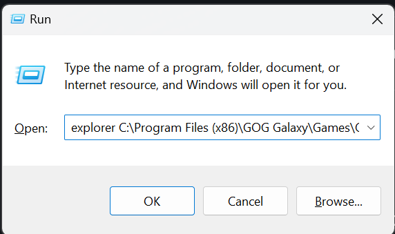

# The Cyberpunk 2077 Game Directory

## Summary

**Published:** Jan 27 2024 by [mana vortex](https://app.gitbook.com/u/NfZBoxGegfUqB33J9HXuCs6PVaC3 "mention")\
**Last documented update:** January 19th, 2026 by [minnierylands](https://app.gitbook.com/u/VSIYzNHUyRPaBCk2ExHhQzpPfo82 "mention")

***

This page will tell you

* What your Cyberpunk 2077 game directory is (with extra information in the expandable box)
* How you can find the game folder
* How to use Windows Search to delete leftover files from a mod

***

## What is the game directory?

The game directory is called `Cyberpunk 2077` (unless you re-named it). It's where Windows puts everything it needs to run the game when you click the icon — including mods.

What's the difference between folders and files?

_Most of us Netrunners have grown up with this and are using it every day for literal decades, so this kind of knowledge is considered pretty basic — but if you don't have it, don't feel bad! I won't explain everything in detail here, but there's a great guide on_ [_uis.georgetown.edu_](https://uis.georgetown.edu/file-explorer/) _on how to use the Windows File Explorer._

A **folder** (also called **directory**) has a yellow icon: 📁\
It's a container for **files** and other folders.

A **file** can be anything and have any kind of icon. They don't usually contain other files or folders, although exceptions exist.

You browse through this using the Windows Explorer.

Click on the picture below to zoom in!

***

## How can I find the game folder?

Unless you changed the default settings, your game is installed here:

<table data-header-hidden><thead><tr><th width="102"></th><th></th></tr></thead><tbody><tr><td>Steam</td><td><code>C:\Program Files (x86)\Steam\steamapps\common\Cyberpunk 2077</code></td></tr><tr><td>GOG</td><td><code>C:\Program Files (x86)\GOG Galaxy\Games\Cyberpunk 2077</code></td></tr><tr><td>Epic</td><td><code>C:\Program Files\Epic Games\Cyberpunk 2077</code></td></tr></tbody></table>

Opening a Windows Explorer directly to your game folder

You can open a Windows Explorer in the game folder like this:

1. Press `Windows+R` to open the `Run` dialogue
2. type `explorer` (don't forget the space)
3. Copy and paste the game path from the table above into the text box
4. Press `Enter` or click `OK`

<figure><figcaption></figcaption></figure>

### It's not there!

If you don't know your game directory, you can find it through your game launcher:



Right-click on the game in your library, then select `Manage` -> `Browse local files`

<figure><figcaption></figcaption></figure>




With the game selected in your library, click on the `More` button, then on `Manage Installation` and `Show folder…`

<figure><figcaption></figcaption></figure>




Right-click on your game in the list and select `Manage`. Then, click on the folder icon:

<figure><figcaption></figcaption></figure>




***

## Copying the folder path

1. Select the folder path by clicking on the empty bit to the right of the explorer's path bar:

<figure><figcaption></figcaption></figure>

2. The entire path will be highlighted (if it's not, you can do that by pressing `Ctrl+A`)
3. Press `Ctrl+C` to copy it to your clipboard

***

## Deleting residual files with Windows Search

Once the Cyberpunk folder is open in your Windows Explorer, you can use the `Windows Search bar` in the upper right corner (Hotkey: `Ctrl+F`) to find files by name.


For example, if you have trouble with atelier and have decided to do a clean reinstall, you can search for `atelier`:


<figure><figcaption>
This will also find most of your atelier stores. If you use Vortex, that's no problem - otherwise, you may want to backup before you delete.
</figcaption></figure>

You're seeing the atelier install folder (good) and a bunch of atelier stores (bad, these are innocent).\
You can either double-click on the `virtual-atelier-full` folder (first item) to navigate there, or use either of the following options.



<h3 align="center">Finding the folder path in the search results</h3>

If you right-click on a folder or file, you will see a menu entry "`open folder/file location`".&#x20;

This will open a new Windows Explorer window in the folder **containing** the item you selected, letting you browse and delete.

<figure><figcaption></figcaption></figure>



<h3 align="center">Deleting from the search results</h3>

Select multiple items from the list by holding the `Ctrl` key while you click.

Once you have selected everything that you want to delete, simply press the `delete` key, or right-click and select `Delete`.


