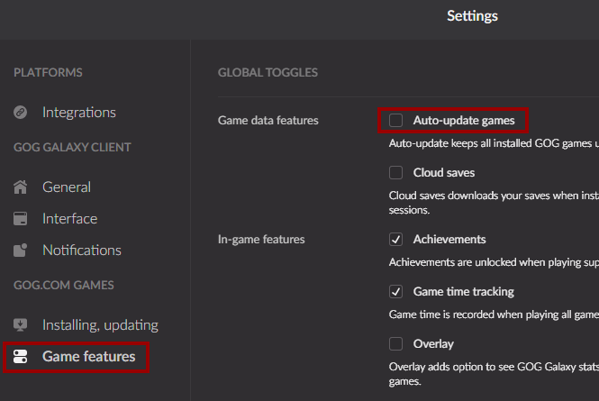
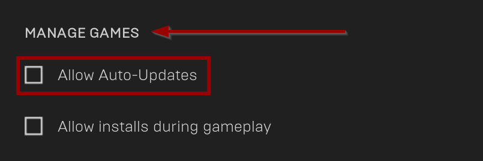
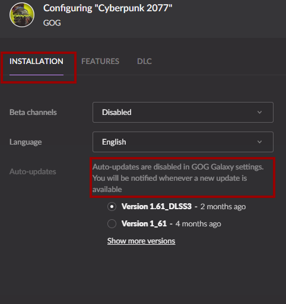
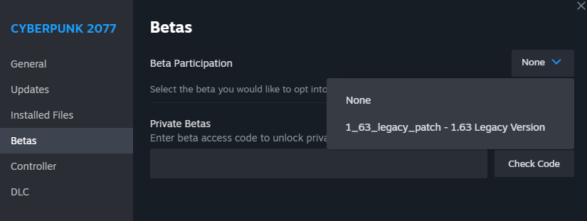

# Downgrading / Preventing auto-updates


Things fall down when you let go of them, and mods break whenever a game updates. That is due to [framework compatibility](../../for-mod-creators-theory/core-mods-explained/).&#x20;

**Always make sure that your framework mods are up-to-date.**

You should generally wait with updating to the latest game version until all mods are up-to-date. If it's too late for that, you can try [downgrading](users-downgrading-preventing-auto-updates.md#downgrading) Cyberpunk, or wait until the frameworks update.


## Preventing the game from auto-updating

### GOG Galaxy

In GOG Galaxy, this can be done as a global setting — you disable auto-update for all of your games — or as a per-game option for some games like Cyberpunk 2077.

#### Only disable updates for CP2077

Open the GOG Galaxy page for Cyberpunk 2077 and click the manage icon next to the big play button, then `Manage installation` and `Configure...`\
Disable the `Automatically update to the newest version` checkbox. Optionally, select the game patch you want to play on here.\
\

<figure><figcaption></figcaption></figure>

#### Globally disable updates

Open the settings and select the entry `Game features` in the sidebar, then uncheck the box for `Auto-update games`.

<figure><figcaption></figcaption></figure>

### Epic

In the EPIC launcher, this is a global setting — you can only disable auto-update for all of your games.&#x20;

Open the settings menu and scroll down to `MANAGE GAMES`, then disable auto-updates.

<figure><figcaption></figcaption></figure>

### Steam

Unlike the competition, Steam will not give you any control about auto-updating. For that reason, you need to forbid it from writing to a specific file on disk, without which it will be literally unable to update. Here's how:

1. Find the `steamapps` folder (:&#x20;
   1. Right-click on Cyberpunk 2077 in your Steam Library and select **`Properties`**
   2. On the side bar, click on **`Local Files`**
   3. Select **`Browse`**. This will take you to Cyberpunk's install directory, which is **inside** the folder we want (e.g. `C:\Steam\steamapps\common\Cyberpunk 2077`)
   4. Navigate two levels up (in windows explorer this is done by clicking the up arrow at the top left of the window, next to the file path, or by using the shortcut Alt + Up Arrow Key)
2. Find the file `appmanifest_1091500.acf`
3. Set the file to read-only:
   1. Right-click on the file and select Properties
   2. At the bottom of the dialogue, check the Read-only box

&#x20;.png>)&#x20;


As long as Steam can't write to this file, it can't update Cyberpunk. Once you are ready to update, simply uncheck the Read-only checkbox again.

Don't forget to deactivate it again later!


## Downgrading

### GOG

1. [Disable auto-updates](users-downgrading-preventing-auto-updates.md#gog)
2. Head to the Cyberpunk game detail page
3. Find the settings button next to the Play button
4. Select `Manage Installation` -> `Configure…`
5. Select the game version

<figure><figcaption></figcaption></figure>

### Epic

Sorry, choomba, you're fucked. No downgrading possible.

### Steam

Since 2.0, Steam supports downgrading to version `1.63_hotfix.1`.&#x20;

Right-click on the game in Steam and select Properties, then go here:&#x20;

<figure><figcaption></figcaption></figure>

For downgrading to other versions, see the expandable box below.

Using steamdb to attempt to download a previous depot

Longer instructions can be found [in this MakeUseOf guide](https://www.makeuseof.com/how-to-downgrade-steam-games/), but the condensed version (courtesy of our lovely Discord community) goes as follows:\
\
First [turn autoupdate off for Steam](users-downgrading-preventing-auto-updates.md#preventing-the-game-from-auto-updating) _**now**_ so that you don't forget to do it later. We'll wait.\
\
Here are the version-specific commands that you need to run. If you can't find your version on the list, check [here](https://steamdb.info/depot/1091501/history/) (Base Game) and [here](https://steamdb.info/depot/2138330/history/) (Phantom Liberty), and find the new Manifest ID tag.

* 2.12 Base Game: `download_depot 1091500 1091501 3935102684525872303`
* 2.12 Phantom Liberty: `download_depot 2138330 2138330 5094071097429923087`
* 2.11 Base Game: `download_depot 1091500 1091501 415651277559119937`
* 2.11 Phantom Liberty: `download_depot 2138330 2138330 1247263585971652529`
* 2.10 Base Game: `download_depot 1091500 1091501 2238892413801664242`
* 2.10 Phantom Liberty: `download_depot 2138330 2138330 8336407654663849967`
* 2.02 Base Game: `download_depot 1091500 1091501 4882158097132343077`
* 2.02 Phantom Liberty: `download_depot 2138330 2138330 255755420818251691`
* 2.0 Base Game: `download_depot 1091500 1091501 7695458851217910405`
* 2.0 Phantom Liberty: `download_depot 2138330 2138330 4702299018468121610`
* 1.63: `download_depot 1091500 1091501 3385393324409330817`

Now, we do the thing:

1. Open Steam
2. Press `Win+R`
3. Type `steam://open/console` to get into the steamdb console
4. In the console, enter this command exactly to start the download (it'll be the entire 60 GB so be prepared): `download_depot 1091500 1091501 7695458851217910405`
5. After the game finishes downloading, go to the installation location listed in the console, and copy either just the changed files (you can view the manifest for the new version) or the whole thing over your game directory to overwrite the new changes.
6. If you have the Phantom Liberty DLC, you will need to do the steps 4 and 5 again for the DLC itself with the command: `download_depot 2138330 2138330 4702299018468121610`

This should leave you with the correct previous game version. You can right-click cyberpunk2077.exe to verify the versions in Properties > Details.

You might still need to do a script cache reset or other cleanup before the game starts up nice, so head on over to [those instructions](../user-guide-troubleshooting/#troubleshooting-after-an-update) if need be.

