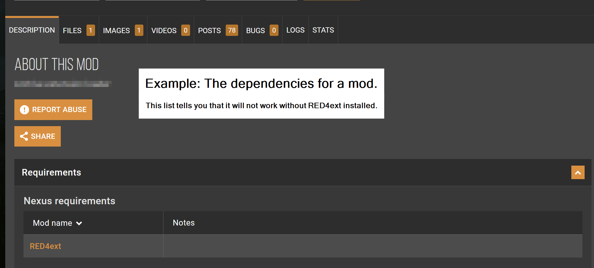
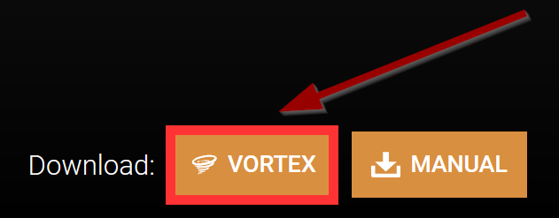
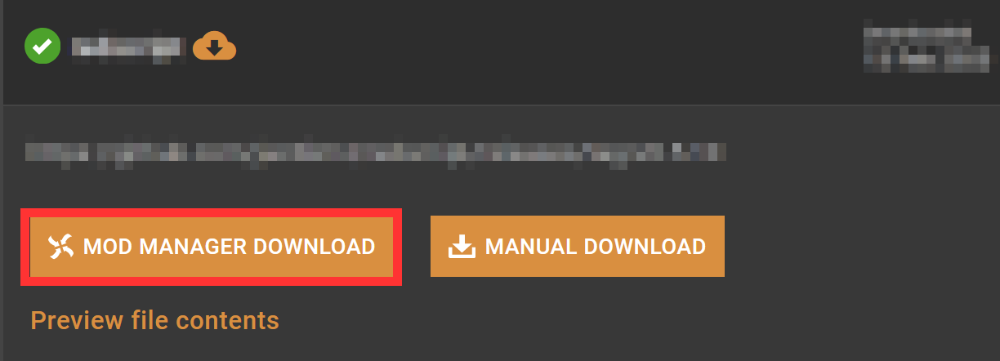
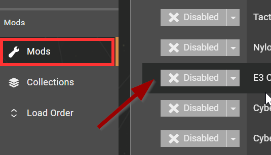
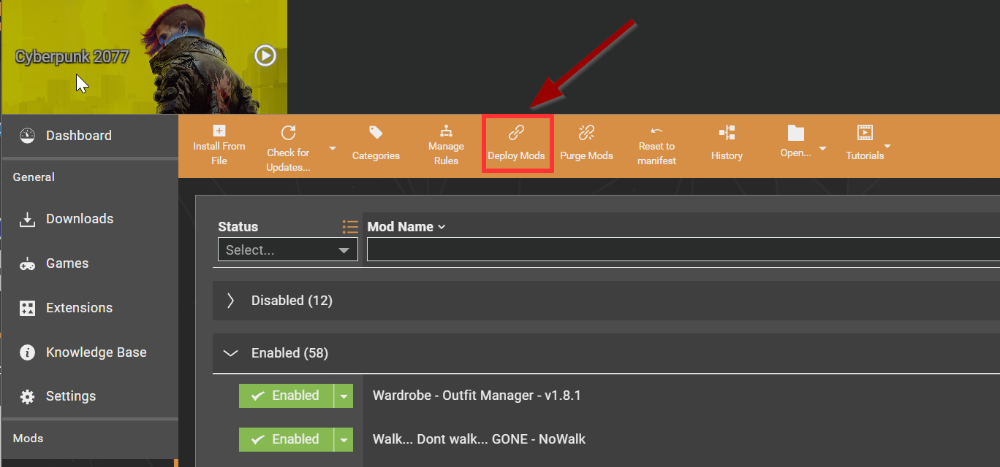
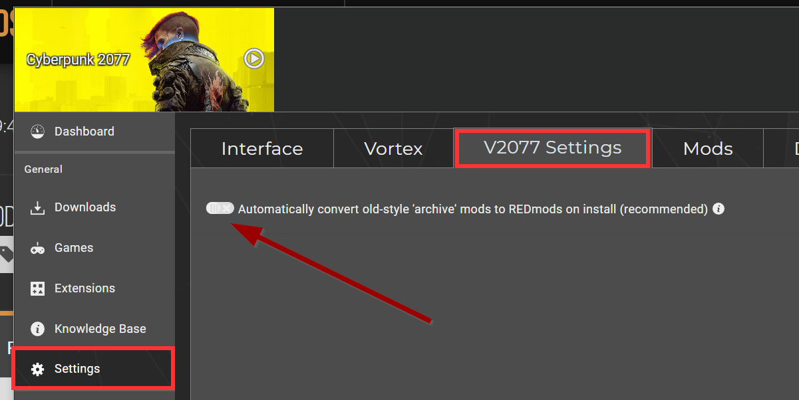
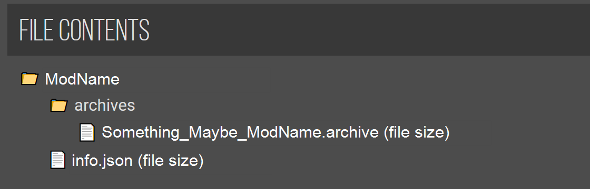
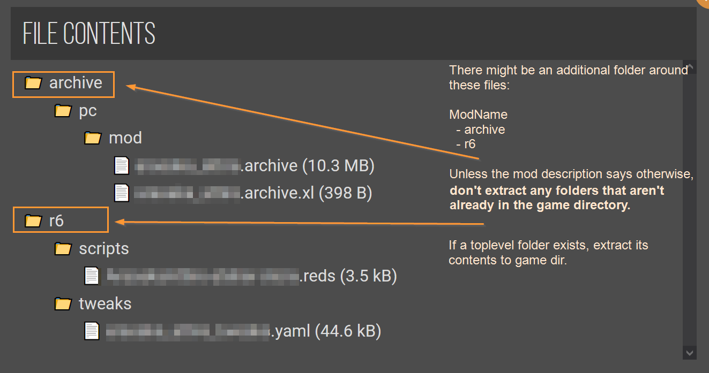
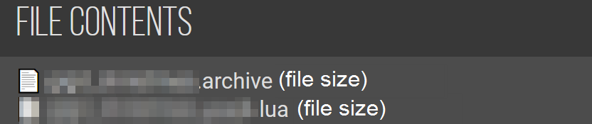

# ❔ Users: Modding Cyberpunk 2077


This page contains instructions on **installing** mods. If you want to **create** mods instead, check [here](../../modding-know-how/modding-cyberpunk-2077/).


## How to install mods


**TL;DR:**&#x20;

_The first thing you will be told on Discord is to read this guide, so you might as well do that before wasting everyone's time._

When installing a mod, make sure to install **all** of its dependencies. You will find a list on the Nexus description tab under "Requirements".\
If you do not do this, your mod will not work.

You need to [enable REDmod](./#installing-and-activating-redmod). Without it, most of your mods will not work.


You mod **Cyberpunk 2077** by adding files to your **game directory**. There is no need to overwrite base game files, since the game natively supports modding.&#x20;


The **game directory** is the toplevel folder of your game install.&#x20;

Unless you changed the default settings, it will be installed to:

**STEAM**\
`C:\Program Files (x86)\Steam\steamapps\common\Cyberpunk 2077\`

**GOG**\
`C:\Program Files (x86)\GOG Galaxy\Games\Cyberpunk 2077\`


You can install mods by hand or by using [Vortex](https://www.nexusmods.com/about/vortex/).&#x20;


Regardless of your past experiences, the [Nexus mod manager](https://www.nexusmods.com/about/vortex/) works reliably and well for modding Cyberpunk, as long as you do not install more than \~250 REDmods.


### Dependencies / Requiremends

Although Cyberpunk natively supports modding, this out-of-the-box support is extremely limited. To allow modders greater freedom, a number of frameworks have been created to allow e.g. adding items, influencing the weather, or add flying cars.


Since this kind of mod interacts with the game's code on such a fundamental level, they are prone to **breaking** whenever CDPR changes their API. This is the reason why game updates break mods — we recommend to [**turn off auto-update**](users-preventing-auto-updates.md) and manually upgrading once the frameworks you need have been brought up-to-date.



Unless they are marked as optional, you **have** to install the dependencies, and their dependencies as well.&#x20;

If you don't, then your mod will not work.


<figure><figcaption></figcaption></figure>

### Overview of mod folders


TL;DR: you can ignore this.


This list is supposed to give you an overview of which files go where. It is **not** a bucket list of things you have to install.

| Folder path in your game dir | Description of folder                                                                                                                             |
| ---------------------------- | ------------------------------------------------------------------------------------------------------------------------------------------------- |
| `/archive/pc/mod`            | holds `.archive` files from non-REDmods                                                                                                           |
| `/bin/x64/plugins`           | Cyber Engine Tweaks ([github](https://github.com/yamashi/CyberEngineTweaks/releases)) ([Nexus](https://www.nexusmods.com/cyberpunk2077/mods/107)) |
| `/mods`                      | Directory for REDmods                                                                                                                             |
| `/r6`                        | [redscript](https://www.nexusmods.com/cyberpunk2077/mods/1511) folder                                                                             |
| `/red4ext`                   | [Red4ext](https://www.nexusmods.com/cyberpunk2077/mods/2380), ArchiveXL, TweakXL                                                                  |

```markup
- archive
  - pc
    - mod          << .archive files from non-REDmods go here
- bin
  - x64
    - plugins      << Cyber Engine Tweaks goes here
- mods             << REDmods go here
- r6               << redscript folder
- tools
```

## Installing and activating REDmod

If REDmod is not installed and activated, your mods will not load.&#x20;

* For instructions on how to install, see [here](../../modding-know-how/frameworks/redmod/#installation).
* For instructions on how to activate it, see [here for GOG](../../modding-know-how/frameworks/redmod/usage.md#gog-galaxy) and here for [Steam and Epic](../../modding-know-how/frameworks/redmod/usage.md#steam-and-epic).

REDmods are installed in `Cyberpunk 2077\mods`, where every mod has a subfolder with an `info.json`.

## Installing Mods

You can install mods via [Vortex](./#vortex) or [manually](./#manual-install). There are upsides and downsides to each of&#x20;

### Vortex


By default, Vortex will convert everything you download to a REDmod, as this is how it maintains load order. If you do not want this, see [here](./#4.-optional-deactivate-redmod-conversion).


#### 0. Download and login

1. Download the mod manager from [Nexus](https://www.nexusmods.com/about/vortex/), then log in to your Nexus account.
2. Set a Mod Staging folder (if it doesn't ask you, open Settings/Mods). **This is where Vortex stores its files**. It needs to be on the same drive as your game, but not the game directory itself.
3. Add Cyberpunk 2077 — the executable is in the game directory under `/bin/x64/Cyberpunk2077.exe`

#### 1. Install a mod

On the mod's page, click the "Vortex" button under "Download":

<figure><figcaption></figcaption></figure>

If there isn't one, browse to the "Files" tab and look for the "Mod Manager Download" button.

<figure><figcaption></figcaption></figure>

If neither of these options are available, the mod author has chosen not to support Vortex. That does not mean that you have to install from hand: you can try to download the archive, then **drag and drop** it on the running Vortex client.

If that doesn't work, you have to install it [**by hand**](./#by-hand).

#### 2. Enabling

By default, mods you install via Vortex will be **disabled**. To add them to Cyberpunk, you need to enable them.

<figure><figcaption></figcaption></figure>

#### 3. Deploying

Vortex keeps its files in the Staging folder that you configure in the settings.&#x20;


If you launch Cyberpunk via Vortex, the mod manager will deploy automatically. Otherwise, you have to click this button:


<figure><figcaption></figcaption></figure>

Vortex will give you an error message if any of your mods couldn't be deployed successfully.&#x20;

#### 4. (optional) Deactivate REDmod conversion


You should only do this if you run into problems with your mods. By default, this setting works fine.


<figure><figcaption></figcaption></figure>

#### 5. Troubleshooting

For problems that are related directly to Vortex, you can use [Nexus support](https://wiki.nexusmods.com/index.php/Category:Vortex) or join our [Discord](https://discord.gg/redmodding) and find (volunteer) help in the #vortex-support channel.


Before your mods **deploy**, there is no need to consult the [general troubleshooting](../../modding-know-how/user-guide-troubleshooting/).


### M[^1]anual install

"Manual install" is a rather glorified term for "extracting the downloaded archive into your game directory". **However**, you have to make sure that the right files end up in the right folders.&#x20;

You can inspect the file structure by simply opening the downloaded file, or by using this feature on Nexus (unless a mod author has disabled it):

<figure><figcaption></figcaption></figure>

The file structure is different for REDmods and non-REDmods. Mod authors usually tell you which file is which, though.&#x20;

### REDmod:

Extract the entire folder into `/mods/`. You should have `/mods/ModName` afterwards.

<figure><figcaption></figcaption></figure>

### Non-REDmod

In your archive, find the folders corresponding to [this overview](./#overview-of-mod-folders) and extract them directly to your game directory. Their content will be added to the already existing files, overwriting anything that needs to be replaced.

<figure><figcaption></figcaption></figure>

### Anything else

Some mods are just a loose collection of files and it's up to you and the mod's install instructions to put them in the right place.&#x20;

<figure><figcaption></figcaption></figure>

As a rule of thumb: usually, but not always…

* `.archive` files go into `/archive/pc/mod/`
* `.xl` files go into `/archive/pc/mod/`
* `.reds` files go into `/r6/scripts/`
* .`lua` files go into a subfolder of `/bin/x64/plugins/cyber_engine_tweaks/`

## Troubleshooting

If you have problems with Vortex, check the [corresponding section](./#5.-troubleshooting) of the guide.&#x20;

For everything else, this wiki has a dedicated [troubleshooting page](../../modding-know-how/user-guide-troubleshooting/) that has solutions to many common problems. If that doesn't cut it, you're welcome to find us on [Discord](https://discord.gg/redmodding) in the #mod-troubleshooting channel (but your first answer will be a link to that guide).

[^1]: 
