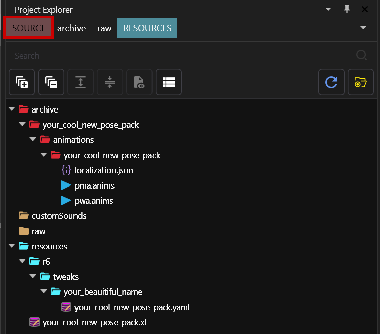
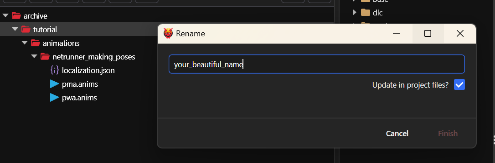
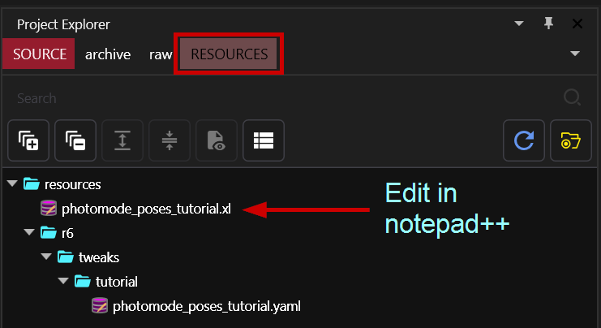

# ArchiveXL: adding Photo Mode Poses

## Summary <a href="#summary" id="summary"></a>

**Published**: May 09 2023 **by @manavortex**\
**Last documented update:** December 17 2024 **by @manavortex**

This guide will walk you through **adding poses** to Cyberpunk 2077's photo mode with **ArchiveXL**.

**Difficulty:** You know how to read ;)

### Wait, this is not what I want!

* To make poses from scratch, check [poses-animations-make-your-own](../poses-animations-make-your-own/ "mention")
* To scale poses/animations, check [scaling-poses-animations.md](../scaling-poses-animations.md "mention")

### Prerequisites:

We will hook up an existing `.anims` file to photo mode. If you don't have one, you can find a dummy file in the AMM [pose guide](../amm-collab-anims-poses.md).

**Tool versions:**

* Cyberpunk 2077 2.2
* [WolvenKit](https://github.com/WolvenKit/WolvenKit-nightly-releases/releases) >= 8.15.0
* [Notepad++](https://notepad-plus-plus.org/downloads/) (you can use any text editor, but N++ is recommended)


You do not need any pose mode extender like PMU or MPAF anymore, and they are currently (Dec 17 2024) not compatible with 2.2



Check out [this tool](https://wolv-photomode-tools.netlify.app/) by @wolv, it will generate yaml files for you. It is currently (Dec 17 2024) not compatible with 2.2.


## Getting the files

Download either of these files:

* full Wolvenkit project ([Nexus](https://www.nexusmods.com/cyberpunk2077/mods/8287))
* Wolvenkit source folder ([Nexus](https://www.nexusmods.com/cyberpunk2077/mods/8287))


This tutorial assumes that your Wolvenkit project is called `your_cool_new_pose_pack`, and that your legal name is `your_beautiful_name`.&#x20;

If that's not the case, please adjust accordingly!


## Setting up the files

At any point during this guide, you can press the green `Install` button on Wolvenkit's toolbar to check the mod in Wolvenkit.

## Step 1: Rename the folders

### TL;DR

1. &#x20;Use Wolvenkit's `Rename` feature with the `Update in project files` box checked&#x20;
2. Use Notepad++ to edit `photomode_poses_tutorial.xl`. Search\&replace the original path (`tutorial\animations\netrunner_making_poses`) with your new folder path.
3. Test. The. Mod.
4. Proceed to [#step-2-hook-up-your-poses](./#step-2-hook-up-your-poses "mention")

### Step by step

We usually do this at the very end and I'm leaving you alone with it. However, this time we start by renaming the folders.&#x20;

Here's how your project should look when you're done.&#x20;

<figure><figcaption></figcaption></figure>

1. Select the highlighted `tutorial` folder and press f2. This will open the rename dialogue.
2.  Change its name, and check the `Update in project files?` box

    <figure><figcaption></figcaption></figure>


3. Do the same for the `netrunner_making_poses` folder (you want your file structure to be as tidy as it can be - future you will thank you for it)
4. Switch your project browser to the resources tab and open `photomode_poses_tutorial.xl` in notepad++:

<figure><figcaption></figcaption></figure>

5. Use `Edit` -> `Replace` (Keyboard shortcut: `Ctrl+H`) to open the search and replace menu. Replace the old path with your new path:\
   `tutorial\animations\netrunner_making_poses` -> `your_beautiful_name\animations\your_cool_new_pose_pack`

<figure><figcaption></figcaption></figure>

6. Hit "Replace All"&#x20;
7. Save your file (Keyboard shortcut: `Ctrl+S`)
8. Now, rename the files under `resources` as well:
   1. `photomode_poses_tutorial.xl` -> `your_cool_new_pose_pack.xl`
   2. `r6\tweaks\tutorial\photomode_poses_tutorial.yaml` -> `r6\tweaks\tutorial\your_cool_new_pose_pack.yaml`
9. Rename `r6\tweaks\tutorial` to `r6\tweaks\your_beautiful_name`

That's it for the renaming. Time to test!&#x20;

10. Install the mod, and make sure that you still have photo mode poses.

## Step 2: hook up your poses

### The .xl file

This file tells Cyberpunk to load your custom poses. It goes **directly** into your project's `resources` folder.&#x20;

Once installed, it will be in the same folder as the `.archive` file for your mod — so you should name it `your_mod_name.archive.xl`&#x20;

Your file should look like this:



<pre class="language-yaml"><code class="lang-yaml"># ##############################################################################
# your .json file with the pose names
# ##############################################################################
localization:
  onscreens:
    en-us: tutorial\animations\netrunner_making_poses\localization.json

<strong># ##############################################################################
</strong># link up the .anims file with the photo mode
# ##############################################################################
animations:
  # female body gender - scope includes player + all NPCs + AXL photomode NPV
  - entity: photomode_wa.ent
    set: tutorial\animations\netrunner_making_poses\pwa.anims  

  # male body gender - scope includes player + all NPCs + AXL photomode NPV
  - entity: photomode_ma.ent
    set: tutorial\animations\netrunner_making_poses\pma.anims  

  # male big body gender - scope includes all male big NPCs + male big AXL photomode NPV
  - entity: photomode_mb.ent
    set: tutorial\animations\netrunner_making_poses\pma.anims

  # male massive body gender - scope includes Adam Smasher + male massive AXL photomode NPV
  - entity: photomode_mm.ent
    set: tutorial\animations\netrunner_making_poses\pma.anims
   
  # nibbles - this is for the cat, not the replacer!
  - entity: photomode_cat.ent
    set: tutorial\animations\netrunner_making_poses\cat.anims
</code></pre>



```yaml
# ##############################################################################
# your .json file with the pose names
# ##############################################################################
localization:
  onscreens:
    en-us: tutorial\animations\netrunner_making_poses\localization.json

# ##############################################################################
# link up the .anims file with AMM Nibbles Replacer
# ##############################################################################
animations:
  - entity: base\characters\entities\player\photo_mode\player_wa_photomode.ent
    set: tutorial\animations\netrunner_making_poses\pwa.anims
  - entity: ep1\characters\entities\player\photo_mode\player_wa_photomode_ep1.ent
    set: tutorial\animations\netrunner_making_poses\pwa.anims
  - entity: base\characters\entities\player\photo_mode\player_ma_photomode.ent
    set: tutorial\animations\netrunner_making_poses\pma.anims
  - entity: ep1\characters\entities\player\photo_mode\player_ma_photomode_ep1.ent
    set: tutorial\animations\netrunner_making_poses\pma.anims
  - entity: base\characters\entities\player\photo_mode\johnny_photomode.ent
    set: tutorial\animations\netrunner_making_poses\pma.anims    
  - entity: base\characters\entities\photomode_replacer\photomode_npc_woman_average.ent
    set: tutorial\animations\netrunner_making_poses\pwa.anims
  - entity: base\characters\entities\photomode_replacer\photomode_npc_man_average.ent
    set: tutorial\animations\netrunner_making_poses\pwa.anims

```


If you want to support more body types from the Nibbles Replacer, you can [switch to the Mod Browser](../../../analysing-other-mods/) and enter the following search query to find all the entities:\
`base\characters\entities\photomode_replacer > .ent`




<details>

<summary>What do these things do?</summary>

* `animations:`&#x20;
  * `entity:` The relative path to the [**photomode scope**](../../../../for-mod-creators-theory/core-mods-explained/archivexl/archivexl-resource-patching.md#distributed-patching-scopes) for patching. There are five of them in total; you can delete the ones you don't need.
  * `set:` The relative path to the .anims file in your Wolvenkit project.&#x20;
* `localization`
  * `onscreens/en-us:` A file with translation strings. Holds the name of your photo mode pose set.

Photo mode knows about custom NPCs through their own `.xl` file, where you add their `.ent` to their body gender's scope — so you don't have to do anything here!

</details>


While editing .xl files, make sure to keep the **indent** (the number of spaces at the beginning of the line). If you fuck up, you can use [yamllint](https://www.yamllint.com/) to check.


1. From the `animations` section, d**elete** the blocks that you don't want
2. Replace `tutorial\animations\netrunner_making_poses\pXa.anims`  with the relative path to your `.anim` file(s) as copied from Wolvenkit's project browser
3. Replace `tutorial\animations\netrunner_making_poses\localization.json` with the relative path to your `.json` file as copied from Wolvenkit's project browser
4. **O**_**ptional:** For compatibility with older game versions, copy the code under `animations:` (not the label itself) from the `<= 2.1 page` in the code box above and add it to your file._
5. **Optional, but recommended:** Run your .xl file through [yamllint](https://www.yamllint.com/) to check for syntax errors.
6. Save your file.&#x20;


The .xl is now updated to support vanilla Photomode NPC and Photomode NPV!


### localization.json


You can name this file whatever you want, as long as you update the .xl file!


* Change the yellow box `UI-Photomode-tutorial-netrunner-making-poses` to something **unique to your mod.**
* To do future you a favour, use names that will make sense even after a year or two - e.g. `UI-Photomode-your_beautiful_name-my_cool_poses` instead of `UI-Photomode-ghuawstsedr-hsarht223445`
* The green text is the name that will show up in photo mode. \
  `femaleVariant` is the default key - if you don't need different pose names for the male body gender, leave it empty.

<figure><figcaption></figcaption></figure>

### The .anim file(s)

If you have created your own animations (as a [replacer](https://xbaebsae.jimdofree.com/cyberpunk-2077-tutorials/cp2077-custom-poses-and-animations/) or for [AMM](../amm-collab-anims-poses.md)), then you are already familiar with this kind of file. If not, it is time to appropriate one from the game files - pick any, since the process is just like with a replacer.

Just as a reminder, here's how they look:

<figure><figcaption></figcaption></figure>

You will need the green text in your [.yaml file](./#the-.yaml-file).


Optional: If you want your pose to move, you can set the duration in the .yaml as well!


### The .yaml file

Without this file (`r6/tweaks/your_beautiful_name/your_cool_new_pose_pack.yaml`), the animations will be in the entity, but the photo mode won't know about them.


You can use [this tool](https://wolv-photomode-tools.netlify.app/) by @wolv to autogenerate your .yaml. If you do that, then you can skip this entire section and check [the result](./#the-result).

As of Dec 17 2024, the tool is not yet up-to-date with 2.2!


The yaml file has three sections:

#### 1. The category

<figure><figcaption></figcaption></figure>

The first block will introduce your new category to the photo mode.


I recommend doing search and replace on `netrunner_making_poses`, because it's used a bunch of times.


* `PhotoModePoseCategories.netrunner_making_poses`: This is the name of the category, used to assign individual pose entries to your category.
* `displayName:` This tells Cyberpunk the name of your pose. It must match the `secondaryKey` in your .json

#### 2. Pose entry definitions


If one of your poses is called `idle_stand`, that will break a bunch of other mods. Please re-name it in both the .anims file and the .yaml before releasing.


Now comes a long list of entries. They'll look like this:

<figure><figcaption></figcaption></figure>


You need to add one of those for every pose from your .anim file. Yes, it's a lot of copy-pasting right now!


<details>

<summary>What does this do?</summary>

* <mark style="color:orange;">`PhotoModePoses.sit_chair_table_keyboard__2h_on_keyboard__make_amm_addon`</mark>: This is the **unique key** to assign your pose to your pose set. \
  You need this in the third part of the `.yaml` to hook up the poses with photo mode.
* <mark style="color:yellow;">`animationName`</mark>: This must match the animation name in your [.anim file](./#the-.anim-file-s) (the green box).
* <mark style="color:green;">`category`</mark>: This must match the category in the first block.
* `displayName`:  The name of your pose (plain text or a LocKey in your `.json` file)

</details>

### 3. Telling photo mode about the poses

You register your poses for photo mode by creating the following entry categories. You can use yaml anchors to minimize copy-pasting:


The entries in the list under `#Player` **must** match the unique keys that you've chosen during [#id-2.-pose-entry-definitions](./#id-2.-pose-entry-definitions "mention"), and you need one entry (one line) per pose.

If you have different names for differently-gendered poses, you need to use the correct keys!




```yaml
# ##############################################################
# Player
# ##############################################################
photo_mode.character.malePoses: &AddPosesM
  - !append PhotomodePoses.sit_chair_table_keyboard__2h_on_keyboard_01__thinking
  - !append PhotomodePoses.sit_chair_table_keyboard__2h_on_keyboard__make_amm_addon
photo_mode.character.femalePoses: &AddPosesF
  - !append PhotomodePoses.sit_chair_table_keyboard__2h_on_keyboard_01__thinking
  - !append PhotomodePoses.sit_chair_table_keyboard__2h_on_keyboard__make_amm_addon

# ##############################################################
# extra NPCs: female body gender
# ##############################################################
photo_mode.character.altPoses: *AddPosesF
photo_mode.character.bluemoonPoses: *AddPosesF
photo_mode.character.evelynPoses: *AddPosesF
photo_mode.character.hanakoPoses: *AddPosesF
photo_mode.character.judyPoses: *AddPosesF
photo_mode.character.lizzyPoses: *AddPosesF
photo_mode.character.meredithPoses: *AddPosesF
photo_mode.character.panamPoses: *AddPosesF
photo_mode.character.purpleforcePoses: *AddPosesF
photo_mode.character.redmenacePoses: *AddPosesF
photo_mode.character.rogueoldPoses: *AddPosesF
photo_mode.character.rogueyoungPoses: *AddPosesF
photo_mode.character.songbirdPoses: *AddPosesF
photo_mode.character.myersPoses: *AddPosesF

# ##############################################################
# extra NPCs: male body gender
# ##############################################################
photo_mode.character.adamPoses: *AddPosesM
photo_mode.character.altjohnnyPoses: *AddPosesM
photo_mode.character.johnnyPoses: *AddPosesM
photo_mode.character.goroPoses: *AddPosesM
photo_mode.character.jackiePoses: *AddPosesM
photo_mode.character.kerryPoses: *AddPosesM
photo_mode.character.riverPoses: *AddPosesM
photo_mode.character.viktorPoses: *AddPosesM
photo_mode.character.kurtPoses: *AddPosesM
photo_mode.character.reedPoses: *AddPosesM
```



```yaml
photo_mode.character.malePoses
photo_mode.character.johnnyPoses
photo_mode.character.femalePoses
photo_mode.character.quadrupedPoses
```



<details>

<summary>What does this do?</summary>

`&AddPosesM` and `&AddPosesF` are so-called **yaml anchors**. They allow easy re-using of lists that you defined previously.&#x20;

An entry without YAML anchors, where poses are manually appended to each character, looks like this:


If your pose lists are identical, you can use one anchor (`&AddPoses`), and treat the second body gender like any of the NPC pose sets.

</details>

### 4. Double-checking

Before finishing up, make sure to run your file through [yamlLint](https://www.yamllint.com/) and get rid of any errors.

## Finishing up

Before you can share your pose pack, you need to **change the paths**. If you don't and the next modder **also** doesn't, then only one of your mods will work.

You can find a full guide on changing the paths [here](../../../items-equipment/moving-and-renaming-in-existing-projects.md).


If you rename files or folders under resources, remember to **delete** the old control files from your game directory!


## The result


At any point during this guide, you can press the green `Install` button on Wolvenkit's toolbar to check the mod in Wolvenkit.


<figure><figcaption><p>She has no idea what she's doing</p></figcaption></figure>

<figure><figcaption><p>Fortunately, you can hire specialists</p></figcaption></figure>


## Optional: Further fine-tuning poses

### Spawning props with the pose


You can find a more detailed guide on this on [xbae's website](https://xbaebsae.jimdofree.com/cyberpunk-2077-guides/cp2077-custom-photomode-props/).



It is possible to have certain props spawned automatically. **However, this feature works only for Player V.**

<figure><figcaption><p>Example of prop spawned with the pose after defining it in yaml</p></figcaption></figure>

In your .yaml file (`r6/tweaks/your_beautiful_name/your_cool_new_pose_pack.yaml`), add the `acceptedWeaponConfig` attribute.


Find a list of the potential entries under [poses-animations.md](../../../../for-mod-creators-theory/references-lists-and-overviews/cheat-sheet-tweak-ids/poses-animations.md "mention") ->[#acceptedweaponconfig](../../../../for-mod-creators-theory/references-lists-and-overviews/cheat-sheet-tweak-ids/poses-animations.md#acceptedweaponconfig "mention")


<figure><figcaption><p>I'm using KNIFE as example</p></figcaption></figure>

In the case of weapons, V spawn with whatever weapon you were holding when entering PhotoMode, or the default weapon if none was defined.&#x20;

The position of the prop is defined by `WeaponRight`/ `WeaponLeft` bone.

### Pose conditions \[Optional]

You can limit the availability of poses by setting a `poseStateConfig`.  For example, the following entry in your yaml will cause the pose to be unavailable unless V is swimming forwards:

<pre class="language-yaml"><code class="lang-yaml"><strong>  poseStateConfig: POSE_STATE_SWIMMING_MOVING
</strong></code></pre>


Find a list of the potential entries under [poses-animations.md](../../../../for-mod-creators-theory/references-lists-and-overviews/cheat-sheet-tweak-ids/poses-animations.md "mention") -> [#posestateconfig](../../../../for-mod-creators-theory/references-lists-and-overviews/cheat-sheet-tweak-ids/poses-animations.md#posestateconfig "mention")

