# CP77 Tutorial Retargeting Animations in Blender

## Summary

**Published:** April 2023 by [PinkyJulien](https://app.gitbook.com/u/iKTJipgsEBTEnUVSuliSjOUuiJq2 "mention") ([original link](https://docs.google.com/document/d/1nHPQvkK6ijwb8iQ8y1X8CBG-wnNUCTYCjrdUCGMenW4/edit?tab=t.0))\
Last documented edit: Jan 2025 by [manavortex](https://app.gitbook.com/u/NfZBoxGegfUqB33J9HXuCs6PVaC3 "mention")

This guide will teach you how to retarget game animations for other armatures. It assumes that you're generally familiar with the process.

### Wait, this is not what I want!

To learn about making animations, check the [..](../ "mention") category, such as

* [poses-animations-make-your-own](poses-animations-make-your-own/ "mention")
* [amm-collab-anims-poses.md](amm-collab-anims-poses.md "mention")

You can also check the [**Retargeting Tutorial**](https://docs.google.com/document/d/1CrPTKiGJzy2Tj_klJVHhRdXZgqD7yC2ZsJuRu9nqQuc/edit) by Halkuonn, which uses a different plugin. This is most useful for single frame poses, but won't work for animations!

### Requirements

* You need to have a [Wolvenkit Project](https://app.gitbook.com/s/-MP_ozZVx2gRZUPXkd4r/wolvenkit-app/usage/wolvenkit-projects)
* The guide requires a Blender plugin and a pose template; the steps below will walk you through that.


## 1. Installing the Rokoko Plugin


As of January 2025, the plugin is **free**, but requires you to have a Rokoko account.


1. Download the Rokoko Plugin from its [official website](https://www.rokoko.com/integrations/blender)

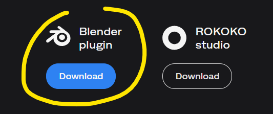

2. Install it like any Blender AddOn (for a step-by-step guide, follow the instructions under [installing-the-wolvenkit-blender-plugin](../../../for-mod-creators-theory/modding-tools/wolvenkit-blender-io-suite/installing-the-wolvenkit-blender-plugin/ "mention") -> [#step-1-install-the-plugin](../../../for-mod-creators-theory/modding-tools/wolvenkit-blender-io-suite/installing-the-wolvenkit-blender-plugin/#step-1-install-the-plugin "mention")
3. Create an account\
   &#xNAN;_&#x54;his is completely free and you can sign in via your Google account_

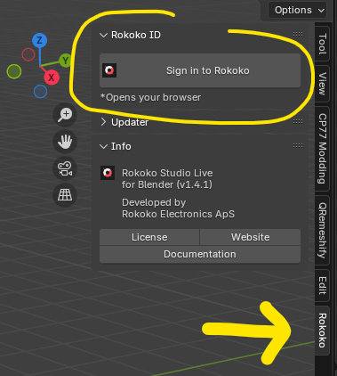

Once signed in, you can return to blender

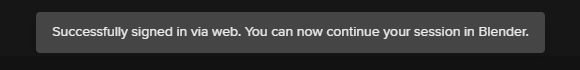

For the sake of this tutorial, we’ll focus on the **Retargeting** tab

Close up everything else 👀

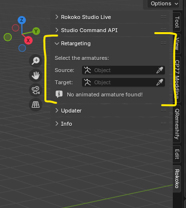

## 2. Gathering Files


This tutorial will retarget Alex's dance to the MaleAverage rig. If you retarget something else, download the necessary files.


### The pose template

You need to download Angy's pose templates. You can find the most recent link under [easy-ik-based-posing.md](poses-animations-make-your-own/easy-ik-based-posing.md "mention") -> [#requirements](poses-animations-make-your-own/easy-ik-based-posing.md#requirements "mention")

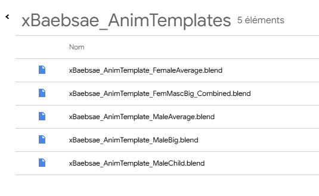

Download the desired template and open it in Blender.

### The animation

1. Add the .anims file that you want to your Wolvenkit project. This guide will use alex's dance:\
   `ep1\animations\quest\main_quests\q304\q304_04e_alex_heart_to_heart\body\q304_04e_alex_heart_to_heart__alex.anims`
2. Export the animation (see [wkit-blender-plugin-import-export.md](../../../for-mod-creators-theory/modding-tools/wolvenkit-blender-io-suite/wkit-blender-plugin-import-export.md "mention") -> [#animations](../../../for-mod-creators-theory/modding-tools/wolvenkit-blender-io-suite/wkit-blender-plugin-import-export.md#animations "mention"))

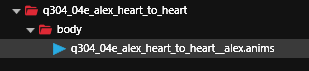

## 3. Import the animation into Blender

see [wkit-blender-plugin-import-export.md](../../../for-mod-creators-theory/modding-tools/wolvenkit-blender-io-suite/wkit-blender-plugin-import-export.md "mention") -> [#animations](../../../for-mod-creators-theory/modding-tools/wolvenkit-blender-io-suite/wkit-blender-plugin-import-export.md#animations "mention")


For the sake of this tutorial, I renamed the MaleAverage armature to `MA` and Alex' animation to `ALEX`


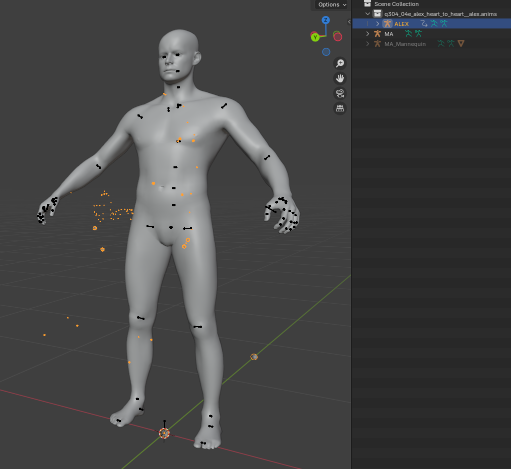

### 3.1. Selecting the animation

1. Select the source armature (`Alex`)
2. Open the `CP77 Modding` tool
3. Open the `Animation Tools` menu
4. The `Animsets` list will be populated with all animations available for the current armature

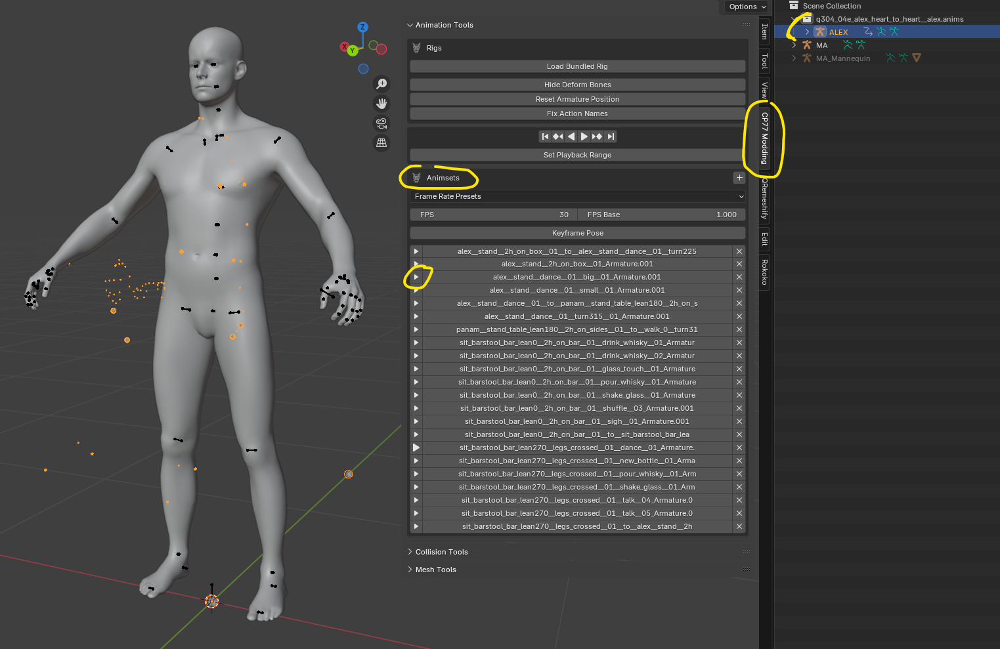

5. Click the Play button of any animation that you want to retarget
6. You should see the armature bones move to the chosen anim (the model will not move):

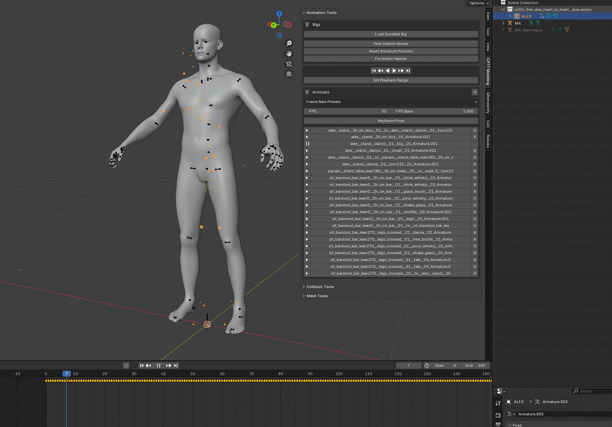

7. Press space or the pause button ⏸ on the timeline to stop the anim

## 4. Actual retargeting

### 4.1 Configuring the Rokoko Plugin

1. Select your **Target** Armature, in my case `MA`
2. Open the **`Rokoko`** tab
3. focus on the **Retargeting** menu
   1. `Source`: The source armature (`Alex`)
   2. `Target`: The target armature (`MA`)

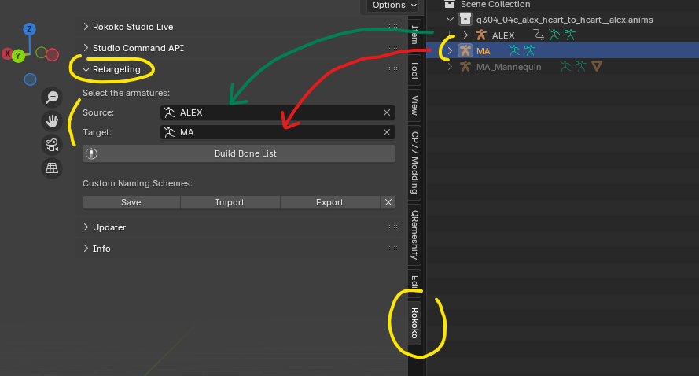

4. Press `Build Bone List`

### 4.2 Double-checking and cleanup

Since we’re retargeting a CP77 anim to another rig, the bones share the same names between the armatures, making this step really easy - However I still recommend reading through the list and **verifying that everything does match!**

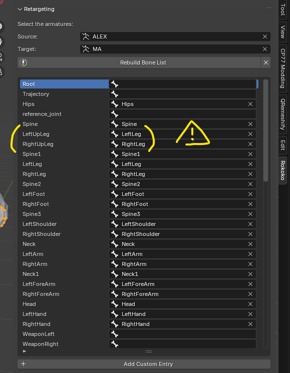


I recommend leaving the **Root**, **Trajectory** and **Reference\_Joint** **empty** regardless of the type of animation you’re retargeting


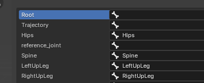

#### Adjustments

For example, we can see that the **LeftUpLeg** and **RightUpLeft** doesn’t automatically match; to fix that, simply click on the miss-matching bones names and select the right ones


### 4.3 Push the button

1. Check the `Auto Scale` box
2. Make sure that `Use Pose:` has the `Rest` pose selected

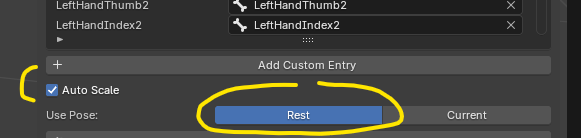

3. Press Retarget Animation

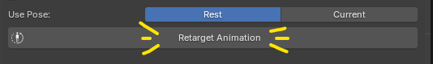

4. Your Template model should automatically get into a pose
5. press space or the start button ▶ on the timeline to see the animation!

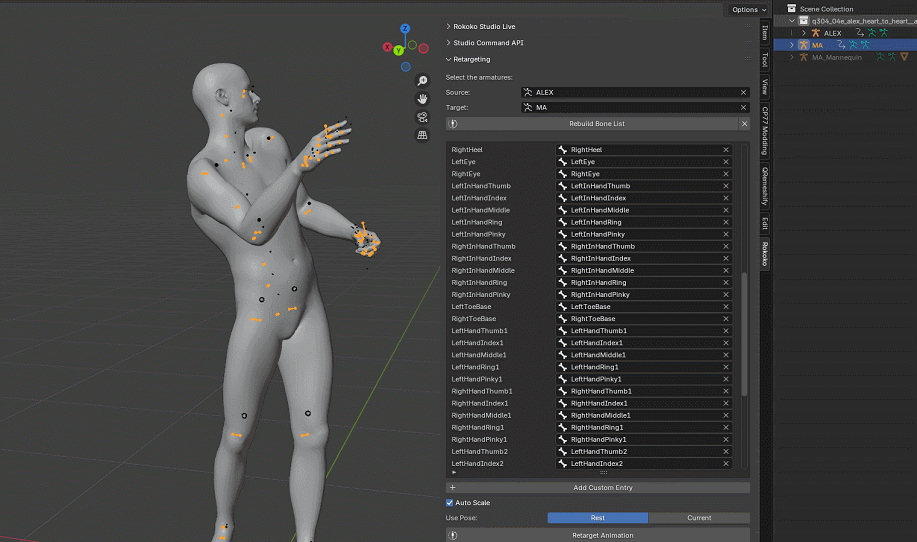

You might see some deformation or bones breaking; that’s ok! It won’t happen in game (don’t ask me how, it’s _Engine Magic_ ✨)

### 4.1 Optional: Delete all animations

This will make it easier to keep track of your animation in Wolvenkit:

<figure>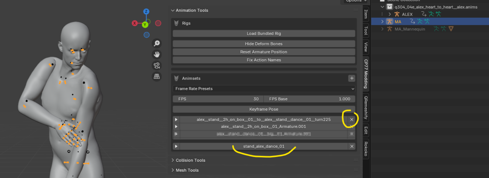<figcaption></figcaption></figure>

### 4.2 Adjusting the time frame

If your animation loops or is cut off in the middle, change your **timeline frame zone** with the exact amount of frame in the animation

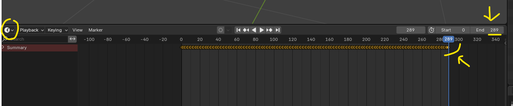

From there, follow the regular Pose Making workflow (you can find step-by-step instructions under [poses-animations-make-your-own](poses-animations-make-your-own/ "mention") -> [#step-2-creating-the-animation](poses-animations-make-your-own/#step-2-creating-the-animation "mention"))

## 5. Importing into Wolvenkit

We still need a container ([`.anims` file](../../../for-mod-creators-theory/files-and-what-they-do/file-formats/animations-.anims/)) to import into.&#x20;

For male average anims, I recommend using this file:


```
base\animations\npc\generic_characters\male_average\interactive_scene\generic_male_average__stand__2h_on_sides__02.anims
```


since it has a single animation and is easy to clean.


TODO: Port the second half of [https://docs.google.com/document/d/1nHPQvkK6ijwb8iQ8y1X8CBG-wnNUCTYCjrdUCGMenW4/edit?tab=t.0](https://docs.google.com/document/d/1nHPQvkK6ijwb8iQ8y1X8CBG-wnNUCTYCjrdUCGMenW4/edit?tab=t.0) (the importer shat itself, so it's a carbon copy anyway)
