# Poses/Animations: make your own

## Summary <a href="#summary" id="summary"></a>

**Published:** September 2023 by [manavortex](https://app.gitbook.com/u/NfZBoxGegfUqB33J9HXuCs6PVaC3 "mention")\
**Last Documented Update:** Mar 04 2024 by [manavortex](https://app.gitbook.com/u/NfZBoxGegfUqB33J9HXuCs6PVaC3 "mention")

This guide will teach you how to **create a custom pose** in Blender and import it into the game via **Wolvenkit**.&#x20;

Since this guide is about creating and imported custom poses, we will make a **photo mode replacer**. To convert it to a standalone pose pack, follow the guide for either  [Photo Mode](archivexl-adding-photo-mode-poses.md) or [Appearance Menu Mod](amm-collab-anims-poses.md).&#x20;


If you have never done this before, don't do both at once. Or... do whatever, but it might result in unnecessary frustration.


### **Wait, this is not what I want!**

* For an overview of all poses in photo mode, check [cheat-sheet-photo-mode.md](../../../for-mod-creators-theory/references-lists-and-overviews/cheat-sheet-photo-mode.md "mention")
* For more general knowledge, check the [..](../ "mention")section.


We all stand on the shoulders of giants: this process has first been documented by [xbaebsae | Angy](https://xbaebsae.jimdofree.com/cyberpunk-2077-tutorials/cp2077-custom-poses-and-animations/), who also provided the [original animation templates](https://drive.google.com/file/d/1kL04dQy9xmK\_yRsvsS4Sn83joPzrljAr/view). Thank you!


### Skipping and skimming

This guide will include the minimum amount of fluff and will **link** background information rather than giving it.&#x20;

For that reason, _**you shouldn't skip or skim**_ unless the section tells you that it's optional.

<figure>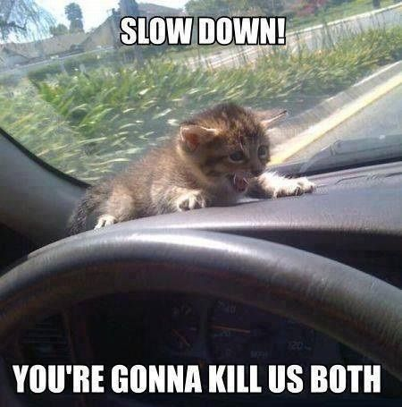<figcaption></figcaption></figure>

Any links in the text will either

* provide additional information which you **do not need** to complete this guide
* lead to step-by-step instructions for any given process

Follow them if  you want to learn more, or if you are unclear on how to complete the current step, then come back here.

## Prerequisites

You will need the following software (install at least this version or higher):

|                                                                                                                                                      |          |
| ---------------------------------------------------------------------------------------------------------------------------------------------------- | -------- |
| Wolvenkit ([stable](https://github.com/WolvenKit/Wolvenkit/releases) \| [nightly](https://github.com/WolvenKit/WolvenKit-nightly-releases/releases)) | >= 8.13  |
| [Blender](https://www.blender.org/download/)                                                                                                         | >= 4.0   |
| [wolvenkit-blender-io-suite](../../../for-mod-creators-theory/modding-tools/wolvenkit-blender-io-suite/ "mention")                                   | >= 1.5.3 |

## Step 0: Preparations

### Your Wolvenkit project

To import your pose into Cyberpunk, you need a Wolvenkit project.&#x20;

1. [Create a project](https://app.gitbook.com/s/-MP\_ozZVx2gRZUPXkd4r/wolvenkit-app/usage/wolvenkit-projects#creating-a-new-wolvenkit-mod-project). Give it a name that you can identify later.
2. Now, your project needs the photo mode .anims file appropriate for your pose(s). The table below shows your options.\
   \
   [Search](https://app.gitbook.com/s/-MP\_ozZVx2gRZUPXkd4r/wolvenkit-app/usage/wolvenkit-search-finding-files) for the correct photo mode file and add it to your project:

| body gender | file                                                           |
| ----------- | -------------------------------------------------------------- |
| female      | base\animations\ui\photomode\photomode\_\_female\_\_idle.anims |
| male        | base\animations\ui\photomode\photomode\_\_male\_\_idle.anims   |

<figure><figcaption><p>This is what adding your .anims to your project may look like</p></figcaption></figure>

3. Export the file(s) to GLB via [Export Tool](https://app.gitbook.com/s/-MP\_ozZVx2gRZUPXkd4r/wolvenkit-app/usage/import-export#ui-location-tools). Default settings are fine.\
   \
   (We will **overwrite** these glb(s) with our new pose, then use Wolvenkit to merge them into the existing .anims file.)


You **can not move** these .glb files. Wolvenkit needs them to stay where they are so it can splice your new animation into the existing `.anims` file.


### Download the template files

Download the animation template(s) for your rig(s):

* for single characters: from [Angy's Google Drive](https://drive.google.com/file/d/1kL04dQy9xmK\_yRsvsS4Sn83joPzrljAr/view)&#x20;
* for multiple characters: [Zwei's edit](https://drive.google.com/u/0/uc?id=1okbjLQE23f-eUvrM85v1MoiNTRtiO66w\&export=download) of Angy's templates

Move/copy them somewhere, then open the one you want in Blender.&#x20;

I'll be using Angy's template for female V, because ~~the other one doesn't exist~~ I happen to have one of those.

## Step 1: Posing the mannequin

This step will happen in **Blender**.&#x20;


If the written instructions aren't clear enough for you, check the screenshots below them.


1. Open up the file
2. Select the armature by clicking on one of the bones in the viewport (the red circle on the screenshot below). They will be highlighted if you did it right.

<figure>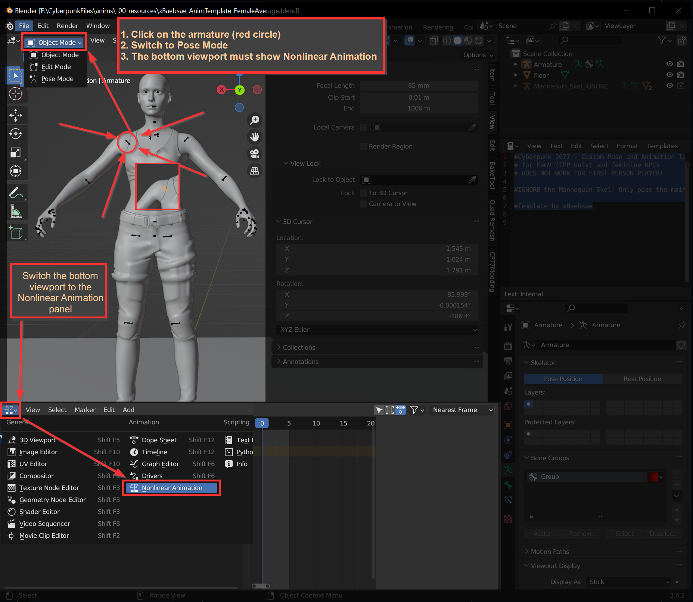<figcaption><p>Your viewport directly after opening the file.</p></figcaption></figure>

3. Switch the viewport to `Pose Mode` in the dropdown menu at the topleft of the viewport, immediately below the "File" and "Edit" menus. This will turn the armature red.

<figure><figcaption><p>"Pose Mode" dropdown looks like this</p></figcaption></figure>

3. Now, you need to **create your pose**. Before you do that, check the box below:

<details>

<summary>Nice-to-know about creating poses</summary>

**General**

* The real human skeleton changes pose **only** via **bone rotation** — moving bones leads to dislocated joints. **Do not move bones**.

**Tooling**

* Instead of **overwriting** the entire `.anims` file, Wolvenkit will splice the NLA tracks that you will create below into the container. For that reason, you can have as many .blend and .glb files as you want and import them in sequence, or have all your poses in a single .blend.

**Tool usage**

* You can limit a tool's effect to an axis by pressing `x`, `y` or `z`. Press the key a second time to use the **local** axis rather than the **global** one, and a third time to remove the limitation.
* Viewport zoom matters. Get closer for finer movements!

</details>

5. As of today (September 2023), we can only create poses and animations by **adjusting each bone by hand**. This is how:
   1. Select a bone by clicking on it (it will appear highlighted)
   2. Rotate the bone by either
      * pressing `R` to enter rotation mode, then moving the mouse to rotate the bone (read up on axis limitation in the expandable box above)\
        **or**
      * selecting the `Rotate` tool from the toolbar on the left, then clicking and dragging along the coloured axes
   3. When you're done with this bone, position the next one.

<figure>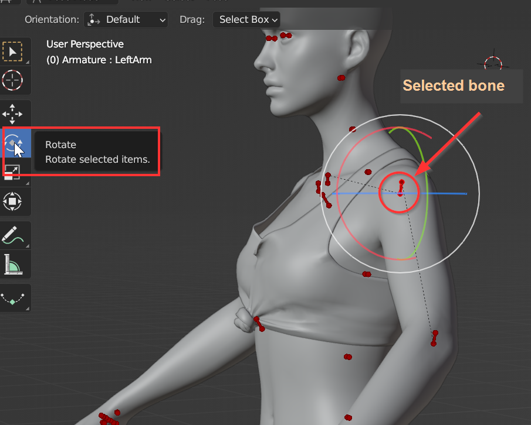<figcaption></figcaption></figure>

6. Now, [draw the rest of the owl](https://knowyourmeme.com/memes/how-to-draw-an-owl), then proceed to the next section.

## Step 2: Creating the animation

You now need to create an animation that Wolvenkit can add into the existing file. For that purpose, we will create a **nonlinear animation** in Blender.

1. In the panel at the bottom, click on `<No Action>` to select it.&#x20;
2. In the Armature -> Animation Data panel, click on the **New** button.

<figure><figcaption><p>Armature -> Animation Data panel looks like this</p></figcaption></figure>

3. Now, we need to add keyframes, one for the **fallback position** and one for the **pose**.
   1. Make sure that the keyframe selected in the animation timeline is 0 (see "Animation Timeline" screenshot below)
   2. Click into the main viewport next to the armature
   3. Open the Keyframe menu (Pose -> Animation -> Insert Keyframe, Hotkey: `I)`
   4. Select `Whole Character` (Hotkey: `W).` The menu will close now.&#x20;
   5. Press the right arrow to select the next keyframe
   6. Repeat the steps 3 and 4
   7. After you have done that, click on the `Push Down Action` button

<figure>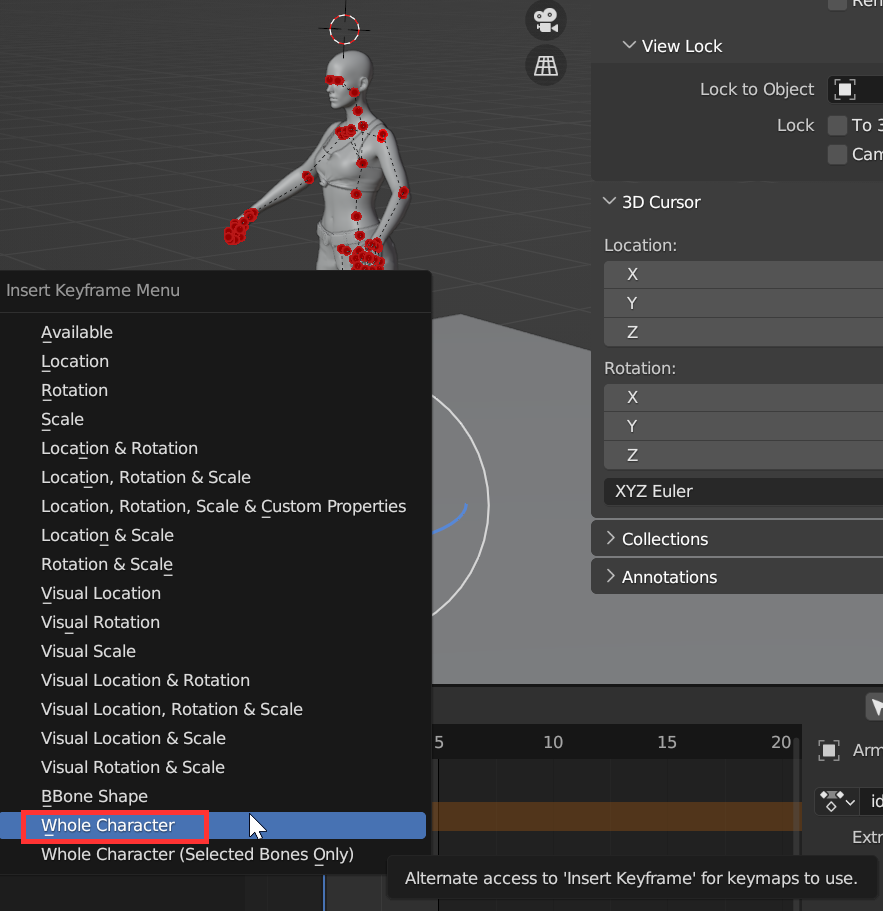<figcaption></figcaption></figure>

<figure>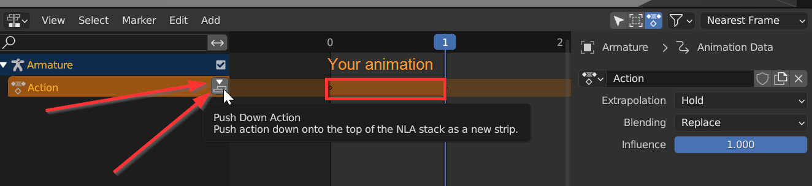<figcaption><p>Animation timeline</p></figcaption></figure>

4. Now, **rename** both your NLA strip **and** your animation to **`idle_stand_01`**.  This will overwrite the "Tabula Rasa" animation. (Find a list of animations and their associated names [here](../../../for-mod-creators-theory/references-lists-and-overviews/cheat-sheet-photo-mode.md#idle).)\
   \
   If you aren't planning on replacing the in-game idle poses (i,e., Tabula Rasa), _it is still required that your NLA strip and your animation have the same name._

#### This is important!


This step is **crucial**. If you don't do this, then Wolvenkit won't import your animation.

The names **must** be the same, and they **must** match the name in your .anim file.


<figure>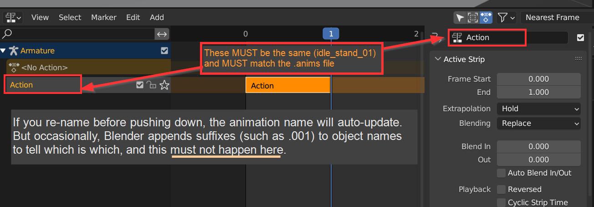<figcaption><p>Before</p></figcaption></figure>

<figure>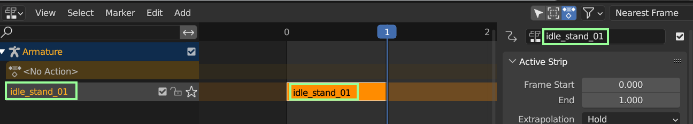<figcaption><p>After</p></figcaption></figure>

5. Go back and read the warning box under step 4.
6. Double-check the names. (Yes, this is **that** important)
7. **Optional:** To add another pose, you can go back to Step 1, then rinse and repeat.
8. Now that you're sure that you have the correct names, switch the viewport back to **Object Mode** (the same way you switched to pose mode). Your armature should still be selected.\
   _TODO: This step will be made **optional** when the Blender plugin update hits. Update guide when it does._
9. From the File -> Export menu, select `Export Selection to GLB for Cyberpunk`

<figure>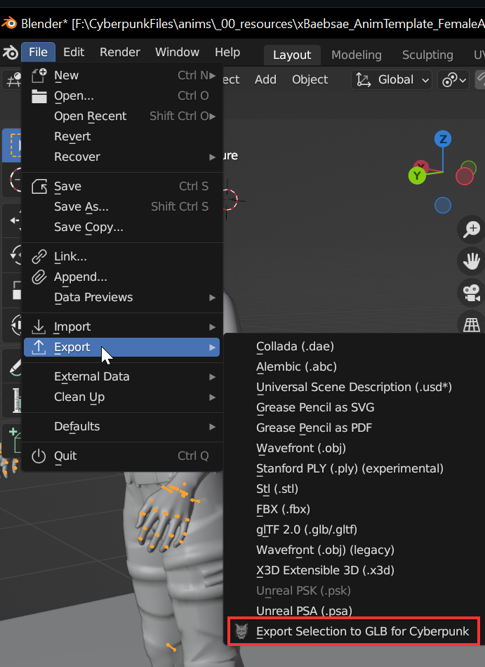<figcaption></figcaption></figure>

8. This will open a file picker. Do the following things:
   * Check the `Animations` box on the right
   * Navigate the to the path of the file you exported in the [previous step](poses-animations-make-your-own.md#your-wolvenkit-project) and click on it to overwrite it
9. When you're done, hit "Export for Cyberpunk".

Now it's time to import the file back into Wolvenkit.

## Step 3: Importing and testing

1. Switch back to Wolvenkit and open the [Import Tool](https://app.gitbook.com/s/-MP\_ozZVx2gRZUPXkd4r/wolvenkit-app/usage/import-export#ui-location-tools).
2. Click on `photomode__female__idle.glb` to select it and open the import settings panel.
3. In the panel on the right, change `Target File Format` to Anims:

<figure>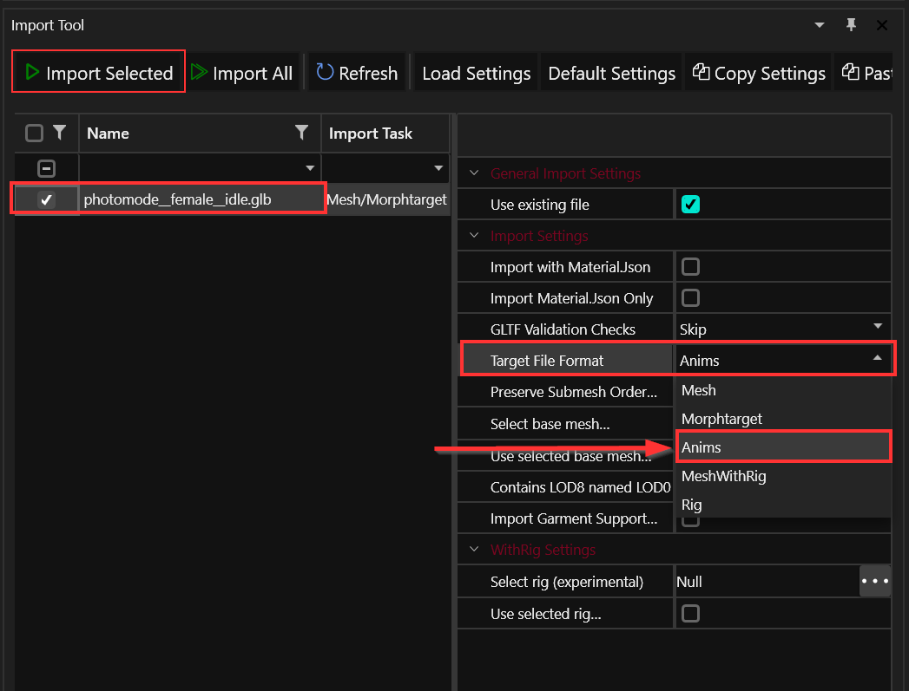<figcaption></figcaption></figure>

4. Hit the **Import Selected** button.


Youc an now test your mod: Install your Wolvenkit project by clicking the green button on the taskbar, and launch the game.&#x20;

If all went well, entering photo mode will show your new pose.


## Troubleshooting

### My pose is twitching!

1. Open your `.anims` file in Wolvenkit&#x20;
2. expand the `animations` array at the top of the file
3. For each `animAnimSetEntry`, change the property `animation` -> `animBuffer` -> `numTracks` to 2

<figure>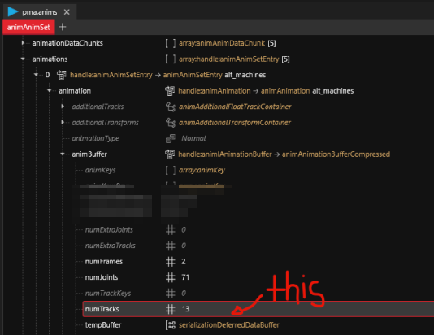<figcaption></figcaption></figure>

4. If that doesn't work, change the numTracks to `0`
5. If that still doesn't work, make sure that your pose has **at least two keyframes** by going back to [#step-2-creating-the-animation](poses-animations-make-your-own.md#step-2-creating-the-animation "mention") and not skimming this time.&#x20;

### Can't import: No extra data

If Wolvenkit's console tells you something like this:

```
animation `anim_name` has no extra data, can't import!
```

1. To make sure that the `.glb` file that you want to **import into** is okay, do a fresh [Wolvenkit export](https://app.gitbook.com/s/-MP\_ozZVx2gRZUPXkd4r/wolvenkit-app/tools/tools-import-export#export-tool) of your `.anim` with a Wolvenkit version from after February 10 2024 (>8.13 should be ok)
2. Use the Wolvenkit Blender IO suite [**1.5.3**](https://github.com/WolvenKit/Cyberpunk-Blender-add-on/releases/tag/v1.5.3) **or greater** to [export as animation](../../../for-mod-creators-theory/modding-tools/wolvenkit-blender-io-suite/wkit-blender-plugin-import-export.md#importing-into-wolvenkit). If the error does not go away, update the plugin.
3. Import the .glb file into Wolvenkit again.

### My pose doesn't import!

I have no idea how to tell you this, choomba, other than stressing thrice that it's important and putting a big red box, but the NLA strip and the animation **must** have the same name. Go back to "[this is important](poses-animations-make-your-own.md#this-is-important)" and double-check. The animation might have trailing numbers, e.g. be called `photomode__female__idle.001`, that will already do it.

### Very funny, but it wasn't that

If you're really 100% sure, then you might have a broken NLA strip. That happens sometimes — simply recreate it:

1. If your armature isn't selected anymore, click on it to select it
2. Switch into Pose Mode
3. Press `A` to select all bones
4. Press `Ctrl+C` to copy their positions
5. Create a new NLA strip by repeating [Step 2](poses-animations-make-your-own.md#step-2-creating-the-animation) — but instead of posing the armature, you can simply press `Ctrl+V` to paste the bone positions from your previous animation.
6. Export the new NLA strip, then [import it via Wolvenkit](poses-animations-make-your-own.md#step-3-importing-and-testing). This should work now.

### Nope, still borked

We're reaching the end of the rope here. Go back and [check the animation names](poses-animations-make-your-own.md#this-is-important). If that wasn't it,

1. create a new copy of the .blend file you downloaded (but keep yours open)
2. In your old Blend file, repeat 1-4 of the [previous step](poses-animations-make-your-own.md#very-funny-but-it-wasnt-that)
3. In your new Blend file, repeat 5+6 of the [previous step](poses-animations-make-your-own.md#very-funny-but-it-wasnt-that)

### Noesis Layer: Invalid Joint

When trying to import into Wolvenkit, you get an error message like this:


```
$fst_root.001|Noesis Frames|Noesis Layer: Invalid Joint Transform, joint Armature not present in the associated rig 
```


That is because there is ancient data in the template, which Wolvenkit doesn't know how to handle. Delete everything called "Noesis" from the list of animations below:

<figure>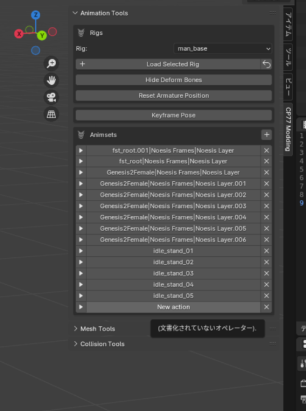<figcaption></figcaption></figure>
