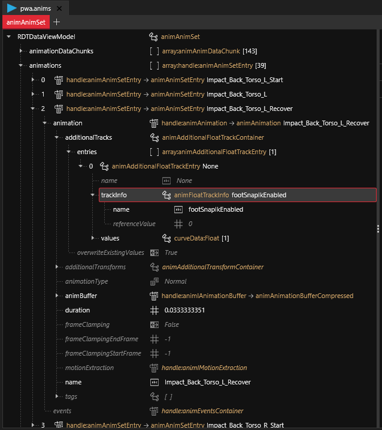

# Removing Foot Snap IK from Poses/Animations


This tutorial was written by me after messing around until I got something to work the way I wanted to. But I only managed to arrive at this point thanks to the many other tutorials, and I actually have no background in animating/posing/using Blender at all. It is possible that some of the things I say are wrong / not the best solution / not perfect, but it did work for me.


### Introduction: Foot Snap IK

Foot Snap IK (inverse kinematics) is a feature in the game that procedurally (at runtime) modifies poses to position feet on the floor. This can be good (e.g., making sure that both feet are on the ground when the character is standing on a slope or stairs), but can also be bad (makes it difficult/impossible to adjust the vertical positioning of your character in photomode, and glues feet to the floor when this is not intended for the pose). This tutorial covers how to disable this feature for individual poses in a `.anims` file in WolvenKit.

### Initial Setup

In this tutorial, I assume that you have a `.anims` file with some of your (photomode) poses in WolvenKit. This would probably contain some of your own new photomode poses that you have created/edited/imported in Blender, and then exported from Blender into WolvenKit, using a mix of the other tutorials.

### What if I don't want any Foot Snap IK at all?

If you know that you don't want any Foot Snap IK for any of your poses at all, the solution is simple: just start out by using the [Edited Photomode containers by Zwei](https://drive.google.com/file/d/1YieCU\_eKdKqHgW1-PZ-dYP9JP2TfML4G/view?usp=drivesdk) that [Importing Animations](../../../for-mod-creators-theory/modding-tools/redmod/importing-raw-files-to-redengine/import.md) also links to. However, sometimes we might have a single Photomode container with a mix of poses, of which we want some to use Foot Snap IK, and we want others not to. For this case, I'm assuming we start with a container that does include Foot Snap IK for all poses, and we'll try to remove it from some individual poses.

### Removing Foot Snap IK from a Pose

The following screenshot shows how you can see in WolvenKit whether or not your pose currently has Foot Snap IK enabled:

<figure><figcaption>
If you see the trackinfo entry with "footSnapIkEnabled" in the box with the red outline in this image, it means that your pose currently has Foot Snap IK enabled.
</figcaption></figure>

If you see this, and you want to get rid of Foot Snap IK for this pose, simply right-click the box with the red outline in the screenshot above, and select "Reset Object". See the screenshot below:

<figure><figcaption></figcaption></figure>

**IMPORTANT**: after doing this, the pose would in my case sometimes completely break, causing the character to explode into a huge graphical glitch of floating triangles in-game. The solution that worked for me was to, after going through the process above, simply re-import the `.glb` file from Blender into WolvenKit again (_exactly the same file that you have already imported once_), as per the other tutorials such as [Poses/Animations: make your own](poses-animations-make-your-own/).
