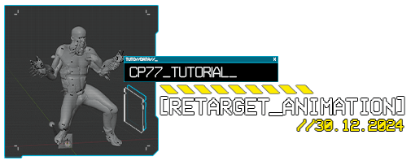

# Retargeting Poses/Animations

## <mark style="color:blue;">▶</mark> <mark style="color:yellow;">Summary</mark>

> **Created & Published:** April 2023 by [PinkyJulien](https://app.gitbook.com/u/iKTJipgsEBTEnUVSuliSjOUuiJq2 "mention") ([original link](https://docs.google.com/document/d/1nHPQvkK6ijwb8iQ8y1X8CBG-wnNUCTYCjrdUCGMenW4/edit?tab=t.0))\
> **Last Documented Update**: March 2025 by [PinkyJulien](https://app.gitbook.com/u/iKTJipgsEBTEnUVSuliSjOUuiJq2 "mention")

In this tutorial, I’ll show you how to Retarget an animation\
Retargeting is also useful for Static poses packs to avoid shrinked shoulders when using WA anims on MA characters for example!

### <mark style="color:blue;">⏸</mark> <mark style="color:yellow;">Wait, this is not what I want!</mark>

> To learn about making animations and pose packs, check the [..](../ "mention") category, such as

* [poses-animations-make-your-own](poses-animations-make-your-own/ "mention")
* [amm-collab-anims-poses.md](amm-collab-anims-poses.md "mention")

If you're here looking to retagert your Static Poses Pack, I recommend checking this other [**Retargeting Tutorial**](https://docs.google.com/document/d/1CrPTKiGJzy2Tj_klJVHhRdXZgqD7yC2ZsJuRu9nqQuc/edit) by **Halkuonn**, which uses a different plugin better suited for static poses

### <mark style="color:blue;">▶</mark> <mark style="color:yellow;">Requirements</mark>

* Latest version of [WolvenKit](../../../for-mod-creators-theory/modding-tools/wolvenkit.md)
* Latest version of [Blender](../../../for-mod-creators-theory/3d-modelling/blender-getting-started/) and [Blender CP77 Plugin](../../../for-mod-creators-theory/modding-tools/wolvenkit-blender-io-suite/wkit-blender-plugin-import-export.md#summary)
* General modding and [pose making](poses-animations-make-your-own/) knowledge

***

## <mark style="color:blue;">◼</mark> <mark style="color:yellow;">Retargeting vanilla animations</mark>

### <mark style="color:blue;">1.</mark> <mark style="color:yellow;">Installing the retargeting plugin: Rokoko</mark>

First, you’ll need to grab the [**Rokoko Plugin from their official website**](https://www.rokoko.com/integrations/blender)

<figure><figcaption>
Rokoko Blender Plugin Download Button
</figcaption></figure>

And [install it like any Blender Addon](../../../for-mod-creators-theory/modding-tools/wolvenkit-blender-io-suite/installing-the-wolvenkit-blender-plugin/#step-1-install-the-plugin)

> _`Edit > Preferences > Add-ons`_\
> &#xNAN;_`drop down arrow on the top right > Install from Disk…`_

<figure><figcaption>
Rokoko Addon in the Add-Ons window
</figcaption></figure>

Upon first opening the Rokoko plugin, you’ll need to **Create an account**


This is completely free and you can sign in via your Google account


<figure><figcaption>
Rokoko Plugin Tab - Sign In
</figcaption></figure>

Once signed in, you can return to blender

<figure><figcaption></figcaption></figure>

For the sake of this tutorial, we’ll focus on the **Retargeting Menu**\
Close up everything else 👀

<figure><figcaption>
Rokoko Plugin Tab - Retargeting
</figcaption></figure>

### <mark style="color:blue;">2.</mark> <mark style="color:yellow;">Gathering our files</mark>

Now that everything’s ready for the retargeting, we need to grab our files\
For the first part of this tutorial, we'll retarget a **vanilla animation to another rig**

If you don’t have them already, you'll need to grab [**Angy’s pose templates**](poses-animations-make-your-own/#download-the-template-files)

<figure><figcaption>
xBaebsae's Animations Templates
</figcaption></figure>

As an example, I’ll be retargeting Alex’s dance for MA\
So I’ll use xBaebsae’s **MaleAverage** template

You’ll also need to grab an animation you wish to retarget from wKit

<figure><figcaption>
.anims file example
</figcaption></figure>

[Export the animation](../../items-equipment/recolours-and-refits/r-and-r-your-own-wolvenkit-project.md#how-to-export-files) and open it in your Blender project

For clarity sake, I renamed the MaleAverage armature to `MA` and Alex's animation to `ALEX`

<figure><figcaption>
xBaeBsae MaleAverage Template and Alex's Dance Animation in Blender
</figcaption></figure>

Before retargeting, we first need to choose which animation we’d like to retarget!\
Cyberpunk's `.anims` files usually have more than one animation in them

To do that, open the [**CP77 Modding tab**](../../../for-mod-creators-theory/modding-tools/wolvenkit-blender-io-suite/#animation-tools)\
Open the **Animation Tools** menu and look into the **Animsets list**

Be sure to select the **Source Armature**, in my case `Alex`\
and click on the **Play Button** ▶ of any animation you want to retarget

<figure><figcaption>
CP77 Modding Plugin - Animation Tools Tab
</figcaption></figure>

You should see the **Source Armature** move to the chosen anim

<figure><figcaption>
GIF - Imported Animation Armature moving
</figcaption></figure>

Press **space** or the **Pause Button** ⏸ on the timeline to stop the anim\
We can now get into the retargeting process!

### <mark style="color:blue;">3.</mark> <mark style="color:yellow;">Retargeting</mark>

Select your **Target Armature**, in my case `MA`

Open the **Rokoko Plugoin tab**\
and focus on the **Retargeting** menu

Put the **Source Armature** (in my case `Alex`) in the `Source` field\
and your **Target Armature** (in my case `MA`) in the `Target` field

<figure><figcaption></figcaption></figure>

Then press **Build Bone List**

Since we’re retargeting a vanilla animation to another rig, the armatures share the same bones names, making this step really easy - However, <mark style="color:yellow;">**I still recommend reading through the list and verifying that everything does match**</mark>**!** If a bone happens to be listed multiple time, the plugin will let you know

<figure><figcaption>
Example of a bones naming missmatch when building the bone list
</figcaption></figure>

In the example above, we can see that the `LeftUpLeg` and `RightUpLeft` bones doesn’t automatically match; to fix that, simply click on the miss-matching bones names and select the correct matching one

<figure><figcaption></figcaption></figure>

I recommend leaving the `Root`, `Trajectory` and `Reference_Joint` bone fields empty **regardless** of the type of animation you’re retargeting, but **especially** if you're porting an external animation

<figure><figcaption>
Leave these fields empty!
</figcaption></figure>

We then need to check `Auto Scale` and make sure to use the `Rest Pose`

<figure><figcaption></figcaption></figure>

Once you **verified** the bone list and checked everything, you can press `Retarget Animation`

Your Template model should automatically get into a pose\
Press **space** or the **start button ▶** on the timeline to see the animation!

<figure><figcaption></figcaption></figure>


You might see some deformation or bones breaking; that’s ok and should be smoothed in game


If the previewed animation isn't complete or you wish to see it loop correctly, you'll need to change the timeline's length by putting the exact number of frames for this specific animation

<figure><figcaption></figcaption></figure>

If you're happy with the retargeting, you can follow the regular [**Pose Making** worflow](poses-animations-make-your-own/#summary)

Switch to the **Nonlinear Animation** menu

<figure><figcaption></figcaption></figure>

Close the **Source Armature** list to only see your **Target Armature**’s animations list

<figure><figcaption></figcaption></figure>

**Double click** on the name to rename the animation

<figure><figcaption></figcaption></figure>

And **bake** your animation by pressing the `push down action` button

<figure><figcaption></figcaption></figure>

The animation is now saved into your **Target Armature**!

<figure><figcaption></figcaption></figure>

### <mark style="color:blue;">4.</mark> <mark style="color:yellow;">Exporting our retargeted animation</mark>

Before exporting our animation, we need to clean up our blender project

Go back to the CP77 Modding plugin's Animsets list\
And **delete ✖** every other animations to keep **only** your retarget

<figure><figcaption></figcaption></figure>

It’s now ready to export back to WolvenKit!

<figure><figcaption></figcaption></figure>

We still need a **container file** to export our new animation into

For **Male Average** `MA` poses, I recommend using the following file:\
`generic_male_average__stand__2h_on_sides__02.anims`

It has a single animation, making it easy to clean up into a blank state

Add it to your wKit project and open it

<figure><figcaption></figcaption></figure>

**Right click** on `animationDataChunks` and select `Delete all items in Array`\
Do the same on `animations`

Verify that the rig matches your **Target Armature** rig

<figure><figcaption></figcaption></figure>

Save the file and **export** it using wkit export tool

Go back to Blender\
Select your **Target Armature** and **Export** the file using **Cyberpunk GLB**\
Make sure to check `Animations` and export over the anim file container you just cleaned

<figure><figcaption></figcaption></figure>

In **WolvenKit**, make sure the **Target File Format** is set to `Anims` and check `Use existing file`

<figure><figcaption></figcaption></figure>

If everything went well, you should read in the log;

`[...] total: 1 animations (...1 new…)`

<figure><figcaption>
Successfull Animation Import Logs
</figcaption></figure>

Your animation is _almost_ ready to test\
Open the file and navigate into your animation `animBuffer` data

There, find the `numTracks` entry and put it at **0**\
In my own experience, this fix multiple issues like animations flickering and twitching when frozen


Thanks to **Halkuonn** for sharing this fix!


<figure><figcaption></figcaption></figure>

Your animation is now ready to test!\
Plop it in game by either making a quick replacer or an [AMM Poses Pack](amm-collab-anims-poses.md#summary)


As of March 2025, Photomode isn't compatible with animated poses


<figure><figcaption></figcaption></figure>


Turns out the forearm/elbow twitch is noticeable in game, you can go back into blender to try and fix it!


***

## <mark style="color:blue;">◼</mark> <mark style="color:yellow;">Retargeting external animation</mark>

Retarget animations form other games requires a bit more work and preparation


Be sure to follow the first part of this tutorial "Retargeting Vanilla Anims" if it's your first time retargeting!


For this example, I’ll be using one of Fortnite animation

First, we'll need to change our template's armature **Rest Position**

For a proper retarget, both source and target armatures should have similar **Rest Poses**\
This is **really important** if you want the animation to look somewhat identical to its original source and avoid weird deformations!

Select your imported **Source Armature** and change it’s pose to **Rest Position**

<figure><figcaption></figcaption></figure>

Then, select your CP77 **Target Armature** and make sure it's currently set to **Pose Position**

<figure><figcaption></figcaption></figure>

With your **Target Armature** still selected, switch to **Pose Mode**\
and change the **Transform Orientations** to `Local` for an easier workflow

<figure><figcaption></figcaption></figure>

Our goal here is to move our CP77 **Target Armature** to best match the **Source Armature** pose

The poses _doesn’t need_ to perfectly match and be layed on top of one another\
\&#xNAN;_(they shouldn't, especially if the models don’t have the same heights)_

Just make sure that the bones are angled and rotated in a **similar** way

<figure><figcaption></figcaption></figure>

I’m making it rough for this tutorial, but the closer you’ll match the **Source pose**, the better the retarget will be! Be precise if you wish to 👌

Once your pose is done, select your whole armature `(CTRL+A)`\
Then go into

`Pose > Apply > Apply Pose as Rest Pose`

<figure><figcaption></figcaption></figure>

The CP77 **Target Armature**’s **Rest Pose** should now match your **Source Armature**'s **Rest Pose**

<figure><figcaption></figcaption></figure>

You can now follow the same Retargeting steps as before!

Make sure to also pay extra attention to the **Bone List**\
Since the armatures are different, you will need to manual input bones names

If the heights of the models differ a lot, check which bones match each area of the body

For example, the Fortnite armature has 5 Spine Bones, while the CP77 Armature only has 4\
But the area doesn't match; I can’t simply input `Spine1` into `spine_01`

By comparing each skeletons and bones placement, I've noticed `Spine1` fits the `spine_03` placement

<figure><figcaption></figcaption></figure>

Once that’s done, hit the **Retarget Animation** button and enjoy your shitpost ✨

<figure><figcaption></figcaption></figure>

***

## <mark style="color:blue;">◼</mark> <mark style="color:yellow;">Fix misaligned limbs and bones</mark>

When retargeting an external animation, you might notice misaligned limbs

<figure><figcaption>
The hands are supposed to form an heart here - obviously Not the case after the retarget
</figcaption></figure>

This can be frustrating, but thankfully we can easily fix this!\
No need to re-do the entire animation keys by keys, bones by bones ✋

Head over the **Graph Editor** tab

<figure><figcaption></figcaption></figure>

In **pose mode**, select the bone you’d want to fix

With the **Move Tool** active, move the different “waves” on the graph;\
each waves correspond to this bone’s **quaternion rotations**

<figure><figcaption></figcaption></figure>

For a better control, I recommend locking all of the waves and only unlocking the one you’re currently fixing/moving - allows you to be more precise


Be careful not to move the selected wave forward or backward in the timeline as this will un-sync the selected bone's keyframes from the rest of the animation!


<figure><figcaption></figcaption></figure>

You can select any other bone at any point and go back-and-forth fixing what needs fixing\
There’s no need to “apply” or insert new keyframes for the change to take effect on your animation

<figure><figcaption>
&#x3C;3 &#x3C;3 &#x3C;3
</figcaption></figure>
