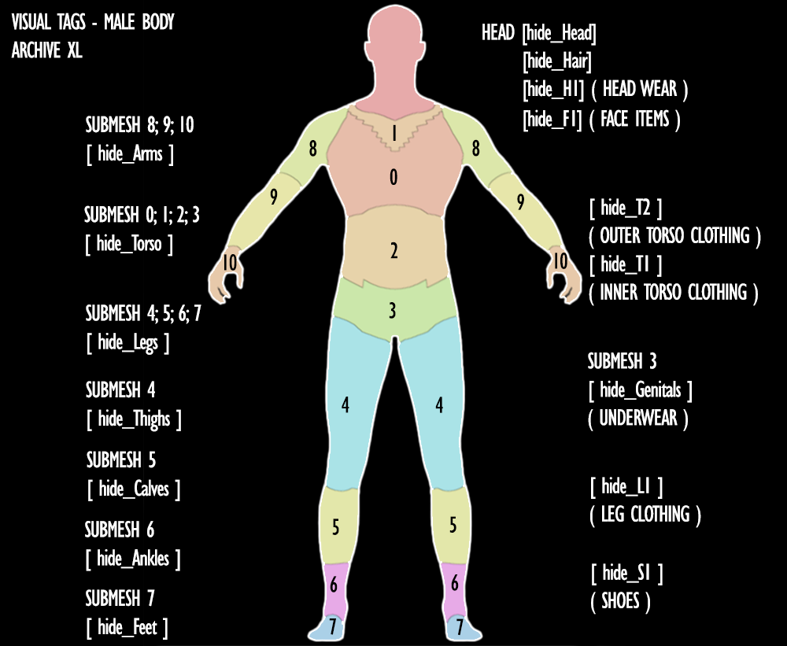
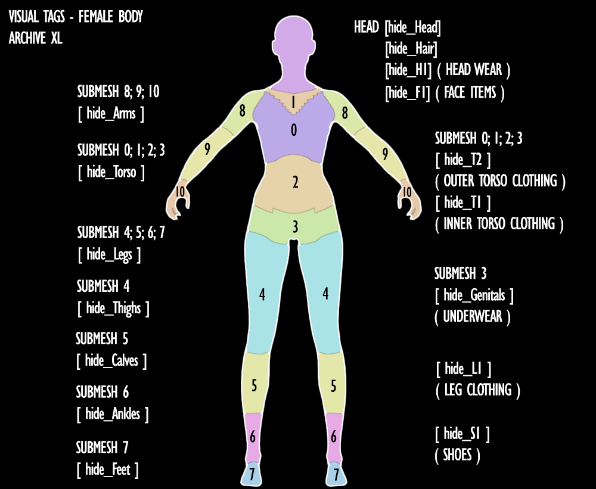

# Changing other items

### Summary 

**Created by @manavortex**\
**Published November 12 2022**


WIP - to be completed


This guide will explain how to influence parts of other meshes by means of the .app file.

## PartsOverrides

## VisualTags

In the .app file, each appearance will contain an array by the name of `visualTags.tags`. These will let you hide parts of all other meshes.


If you are using ArchiveXL, you can in addition use the [following visual tags](https://github.com/psiberx/cp2077-archive-xl#adding-visual-tags):


<figure><figcaption>
male version - image by LadyLea
</figcaption></figure>

 

<figure><figcaption>
female version - image by LadyLea
</figcaption></figure>

