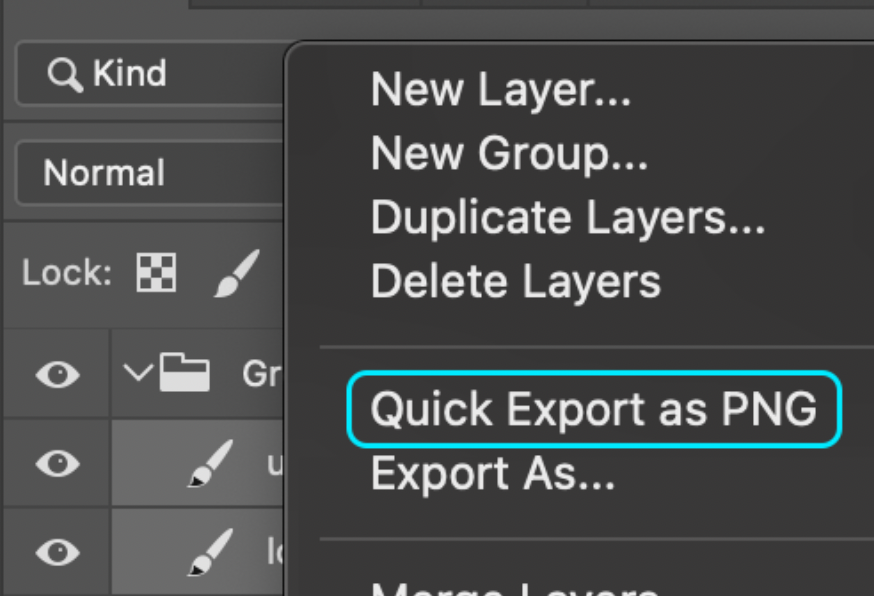
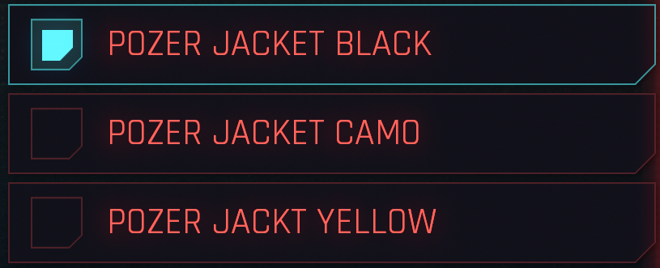
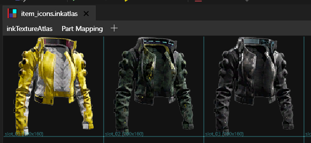
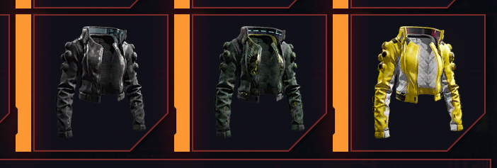

# Your own inventory preview icons

## Summary

**Uploaded:** ??? by [manavortex](https://app.gitbook.com/u/NfZBoxGegfUqB33J9HXuCs6PVaC3 "mention")\
**Last documented update:** Mar 18 2024 **by** [yellingintothevoid](https://www.nexusmods.com/users/127630298)

This guide will teach you how to make custom inventory preview icons.


Technically, this guide is a subsection of the [ArchiveXL item additions guide](../../items-equipment/adding-new-items/), but you can use it to make any kind of preview item.


The guide below will teach you how to make preview icons. While it's a technically a subsection of the [ArchiveXL item additions guide](../../items-equipment/adding-new-items/), you can use the steps below to make any kind of preview item.

**Difficulty Level**: You know how to read and can either edit images or make use of [the corresponding guide](../../textures-and-luts/images-importing-editing-exporting.md). While the process is easy, it also is, unfortunately, quite tedious!

### Wait, this is not what I want!

* If you want to have gendered preview icons, check [here](gendered-preview-icons.md).
* For a script to generate inkatlas files, check [The Magnificent Doctor Presto's github](https://github.com/DoctorPresto/Cyberpunk-Helper-Scripts/blob/main/generate_inkatlas.py)
* To learn more about the files involved, check [game-icons-the-inkatlas-file.md](../../../for-mod-creators-theory/files-and-what-they-do/file-formats/game-icons-the-inkatlas-file.md "mention")

## The required files

If you downloaded the example project ([#getting-the-files](../../animations/animations/archivexl-adding-photo-mode-poses/#getting-the-files "mention")), the preview is already hooked up. Otherwise,[ download ](https://github.com/CDPR-Modding-Documentation/Cyberpunk-Modding-Docs/tree/main/_resources_and_assets/icons)the template archive for your kind of template (kindly provided by Apart).

### Go away with your examples, I'll do everything by hand!

Okay, you do you. Here's how:

<details>

<summary>Finding the files by hand</summary>

1. search in Wolvenkit for `icons > .inkatlas`
2. Pick one of CDPR's icon files (look inside first, you want the right kind of icon — weapons have different icons than equipment) and add it to your project
3. Right-click on the file in the asset browser and select "`find used files`"
4. Find the `.xbm` file and add it to your project as well
5. **Move** both of these files to your custom folder, as you don't want to overwrite game default icons
6. Optionally: Re-name them. This guide assumes that they're named `preview_icons.inkatlas` and `preview_icons.xbm`

</details>

You should now have a structure like this:

```
tutorial  
    ops           
          - my_tshirt_factory.csv 
          - translation_strings.json  
          - preview_icons.inkatlas       <<<  
          - preview_icons.xbm            <<<  
```

## Taking preview pictures

You have two options on taking preview pictures. Both are relatively tedious, since you have to do it by hand.&#x20;

You can find more detail about how to take preview pictures in [#blender](./#blender "mention") or [#in-game](./#in-game "mention") further down the section.

### mana's workflow

#### Prerequisites

* [Photo Studio Props](https://www.nexusmods.com/cyberpunk2077/mods/7436)
* [Invisible V](https://www.nexusmods.com/cyberpunk2077/mods/8412)
* [Appearance Menu Mod](https://www.nexusmods.com/cyberpunk2077/mods/790)
* [Appearance Creator Mod](https://www.nexusmods.com/cyberpunk2077/mods/10795)
* Photoshop or [photopea.com](https://www.photopea.com/)

#### Taking photos

1. Strip V nekkid, then put on the [Invisibility Cloak](https://www.nexusmods.com/cyberpunk2077/mods/8412) and the item you want to create previews of
2. Use [AMM](https://www.nexusmods.com/cyberpunk2077/mods/7436) to spawn "Photo Studio: Wall Cover" from the [Photo Studio Props](https://www.nexusmods.com/cyberpunk2077/mods/7436)
3. Set the appearance to `white (matte)`&#x20;
4. Switch to photo mode. Find a good angle and lighting for your item.
5. Use [ACM](https://www.nexusmods.com/cyberpunk2077/mods/10795) to set the item's appearance to the darkest variant (e.g. `black`)
6. Take a screenshot. You will use this for **masking**.
7. Switch the background color to `black`
8. Use ACM to cycle through the item's appearances and take a screenshot of each
9. In Windows Explorer, find your item screenshots and move them to a folder
10. Re-name the png to the name of your future icon (e.g. `myItem_black`). You can also do this later.

#### Processing photos

1. Open the dark item on the white background in photoshop or [photopea](https://www.photopea.com/)
2. Drag all the other pictures you took on top of it. The items must be in the same space!
3. In the **Layers** panel (bottom right)
   1. &#x20;create a group and put all the layers inside
   2. Drag the layer of the white background picture to the top, and select it (click on it)
4. Press `W` to select the **Magic Wand** tool
5. From the top bar, use the `Select Subject` button
6. Optional: use the Select and Mask view to fine tune your selection
7. Confirm. You now have a selection that includes only your item.
8. In the Layers panel (bottom right),&#x20;
   1. select the group (folder) by clicking on it
   2. create a layer mask by clicking on the icon that looks like the Japanese flag
9. The background will now be transparent
10. Use the Crop Tool (Keyboard shortcut: `C`) to crop a rectangular selection with your icon in the center
11. Select the layers, right-click, and select "Quick Export as PNG"

<figure><figcaption></figcaption></figure>

12. You should now have a bunch of transparent pngs. Now, let's see about [#hooking-up-the-inkatlas](./#hooking-up-the-inkatlas "mention").

### Blender

You [can export your mesh with all its materials](../../../for-mod-creators-theory/modding-tools/wolvenkit-blender-io-suite/wkit-blender-plugin-import-export.md#export-from-wolvenkit) to Blender and take your preview pictures there:

<figure><figcaption></figcaption></figure>

### In-game


This part of the guide is a bit longer, since it tells you how to get decent-quality preview pictures. If you don't care for that (you should, but we all hate it), you can skip ahead to [#hooking-up-the-inkatlas](./#hooking-up-the-inkatlas "mention").


### Overview of the Process

The idea is to combine mods that make V invisible and a ReShade filter called DepthAlpha.fx to create in-game screenshots of your item where the _background is transparent_. This means you don't have to spend a lot of time painstakingly removing the background manually in Photoshop. The screenshots taken with DepthAlpha.fx only need a little bit of cleanup ([#creating-the-actual-icon](./#creating-the-actual-icon "mention")), but can be basically directly imported into the `.xbm` file containing your icons.


Using ReShade is, of course, entirely optional, but teaching how to mask out objects in Photoshop is outside the scope of this tutorial.


#### Prerequisites

[Invisible V](https://www.nexusmods.com/cyberpunk2077/mods/8412) by [manavortex](https://www.nexusmods.com/cyberpunk2077/users/1630319) or the [Invisibility Cap and Shoes](https://www.nexusmods.com/cyberpunk2077/mods/8643?tab=files) by [PinkyDude](https://www.nexusmods.com/cyberpunk2077/users/20892624)

**Optional**, but highly recommended:

[AMM](https://www.nexusmods.com/cyberpunk2077/mods/790) & [AMM Props - PhotoStudio](https://www.nexusmods.com/cyberpunk2077/mods/7436)

[ReShade](https://reshade.me/)

[DepthAlpha.fx](https://github.com/luluco250/FXShaders/tree/master) (make sure to [set up the depth buffer properly](https://github.com/martymcmodding/ReShade-Guide/wiki/The-Depth-Buffer#verifying-the-depth-buffer-is-set-up-correctly))

[AppearanceCreatorMod](https://www.nexusmods.com/cyberpunk2077/mods/10795) or [Equipment-EX](https://www.nexusmods.com/cyberpunk2077/mods/6945)

### The Process

**Preparation:**

Start the game

1. Equip the invisibility garment and the item you want to create icons for.
   1. To switch through appearances on-the-fly, you can use [AppearanceCreatorMod](https://www.nexusmods.com/cyberpunk2077/mods/10795) while V is in the center of the camera.
   2. Alternatively, you can save outfits for all colour variations of your outfit In [Equipment-EX](https://www.nexusmods.com/cyberpunk2077/mods/6945):

<figure><figcaption></figcaption></figure>

**Lighting:**


**Optional:** Finding a good spot

If you can't be bothered, you can simply teleport to the window of Saburo's office:

```
Game.GetTeleportationFacility():Teleport(GetPlayer(), ToVector4{x=-1349.5053710938, y=138.80358886719, z=545.84600830078, w=1}, ToEulerAngles{roll=0, pitch=0, yaw=0})
```

Make sure to have some decent lighting on your item.


<details>

<summary>See the long version</summary>


1. Enter Photo Mode and build a black photo booth around V that looks like the one in the screenshot above using [AMM](https://www.nexusmods.com/cyberpunk2077/mods/790). The [AMM Props - PhotoStudio](https://www.nexusmods.com/cyberpunk2077/mods/7436) are very useful for this.
2. Save your photo booth as an AMM preset to create similar looking icons across all your mods.
3. It's also very useful to make sure the angle of the camera in relation to V remains similar across all your icons:
   1. Exit photo mode and look at the lower edge of your photo booth.
   2. Align the edge with the bottom of your screen, to ensure V is positioned parallel to the photo booth (this will make more sense later).
   3. Enter photo mode again and rotate V to about +15 in the Pose tab.
4. Add some area lights to the scene. The goal is to highlight the shape of the item. So aim for deep shadows, lots of contrast, and prominent contours. In the screenshot below, there are four lights: two from each side behind the item as rim lights, one at a roughly 45° angle in front and above the item as key light, and one of very low intensity directly in front of the camera to fill in shadows.


</details>


Sometimes, it can be helpful to disable RTX to create icons. The screenshot of item on the left in the image below was taken using Path Tracing and DLSS, the one on the right using rasterised lighting without DLSS:


* If your item is a jacket, the shadows on the inside can look broken with RTX.
* If your item is jewellery made from glossy metal, you might get _unwanted_ reflections with RTX.
* If your item features fine textures, you might want to disable RTX, so that you can also disable DLSS/FSR without burning up your graphics card.
* If your item is a piece of clothing made from glossy material, you might _want_ RTX reflections.


#### Taking the screenshots

1. To actually take the screenshot, position the Photo Mode camera so that it is rougly parallel to the bottom edge of your photo booth.
2. Set the Field of View to about 30 to prevent distortion when taking a closeup.
3. Move the camera so that the item fills the entirety of your screen without cutting off a part of it.


**If you're using ReShade:**

3.1 Enable DepthAlpha.fx in ReShade. Check `Colorize Transparency` and adjust the `Range` until your item is the only visible object in the scene.


3.2 Disable `Colorize Transparency` and take the screenshot using ReShade (**not** the built-in Photo Mode).


4. Switch to the pose tab and cycle through all appearances of your item and take a screenshot of each one (make sure you haven't skipped any!).


You can use [AppearanceCreatorMod](https://www.nexusmods.com/cyberpunk2077/mods/10795) to switch appearances without changing the tab!


### Photoshop

#### Fixing Jaggy Edges Left By DepthAlpha.fx

1. Open the first of your screenshots in Photoshop and drop all other screenshots of the item onto the one you've just opened.
2. Select the newly created Smart Objects, right click them and select "Rasterize Layers".
3. Select the first layer and hide all other layers.
4. Go to "Layer" in the menubar at the top of your screen on the left and select "Layer Mask" → "From Transparency".
5. Create a new colour fill layer and choose a colour that contrasts with your item.
6. Double click the layer mask on your first layer in the layers window to enter Select and Mask mode.
7. Make sure your View Mode is set to "On Layers" and play around with the "Global Refinements" until the outline of your item looks smooth.


Smooth <5, Feather <1, Contrast 30-50, and Shift Edge of around -30% works quite well usually. Highly depends on how intricate your item is.


<figure><figcaption><p>Before / After</p></figcaption></figure>

8. Duplicate the Layer Mask onto your other layers.
9. From here on out, you can play around with a bunch of Adjustment Layers with Clipping Masks for each of your layers/appearances. I recommend some Levels Adjustments to set proper black and white points, as well as Black & White Adjustment Layers for items that are black, grey, silver or white and so on.
10. Once you're done with that, select each layer and its Adjustment Layers, right click them, and select "Convert to Smart Object".
11. Give each layer a meaningful name and save your image as a `.psd`.

| Adjustment Layers                                                          | Converted to Smart Objects                                             |
| -------------------------------------------------------------------------- | ---------------------------------------------------------------------- |
| .png>) | .png>) |


#### Creating The Actual Icon

1. Open [this](../../../.gitbook/assets/item_icons.psd) `.psd` and import the Smart Objects of your icons into it. The `.psd` is based on the `preview_icons.xbm` found in [manavortex](https://www.nexusmods.com/cyberpunk2077/users/1630319)'s [Archive XL item additions and guide](https://www.nexusmods.com/cyberpunk2077/mods/8268) and can be easily used with projects based on the [guide](https://wiki.redmodding.org/cyberpunk-2077-modding/for-mod-creators/modding-guides/items-equipment/adding-new-items).
2. With all layers selected in Photoshop, transform them so that the longest side is 158px.
3. Align each item to the centre of each grey square.
4. Hide all other layers except your icons.
5. Now save the image as a `.png` in the raw folder of your WolvenKit project.
6. Import the `.png` into your WolvenKit project with the `TEXG_Generic_UI` `TextureGroup` setting and make sure that "Transparency from alpha channel" is enabled.

<figure><figcaption></figcaption></figure>

## Hooking up the inkatlas

1. Open the file in WolvenKit.
2. Open the list `slots`.
3. For the first two `inkTextureSlot` items, set the value for `DepotPath` to the relative path of your xbm (`tutorial\torso\my_custom_shirt\ops\preview_icons.xbm`):

<figure><figcaption></figcaption></figure>

4. Save the file. If it doesn't update, reload it (Hotkey: `Ctrl+R`)
5. You now have a tab "PartMapping", where you can see which texture corresponds to which slot: select it on the left and check the `partsName`, which corresponds to the entry in the slot's `parts` array:

<figure><figcaption></figcaption></figure>

<figure><figcaption></figcaption></figure>


Congratulations! You now have preview icons!


<figure><figcaption></figcaption></figure>

## Using it

You can now hook up your preview icon(s) to whatever mod you are making.


If you want to use gendered preview icons, check [here](gendered-preview-icons.md). In this case, you do **not** add an icon record to your item.


### ArchiveXL: Add it to the .yaml

Check the code box below — the last three lines add a preview icon.

```
Items.my_custom_shirt_redwhite:
  $base: Items.GenericInnerChestClothing
  entityName: my_custom_shirt_factory_name
  appearanceName: appearance_root_entity_white_red
  displayName: my_shirt_localization_name_white_red
  localizedDescription: my_shirt_localization_desc
  quality: Quality.Legendary
  appearanceSuffixes: []
  icon:
    atlasResourcePath: tutorial\torso\my_custom_shirt\ops\preview_icons.inkatlas
    atlasPartName: slot_01
```

Please refer to the [ArchiveXL guide](../../animations/animations/archivexl-adding-photo-mode-poses/) for an explanation of the other properties, as this page will only hold information about preview icons.

* `atlasResourcePath`: relative path to your .inkatlas file
* `atlasPartName`: slot name in your .inkatlas file (which you can see in the `PartsMapping` tab)


Again, please note that indent is **crucial** here, as it determines the node structure. The first line needs to have an indent of 0, the lines from `$base` to `icon` need to have two spaces, and the lines `atlasResourcePath` and `atlasPartName` need to have four.


## That's it! Time to test!

If you run into any issues with your texture's transparency, please [check the textures import/export guide!](../../textures-and-luts/images-importing-editing-exporting.md)
