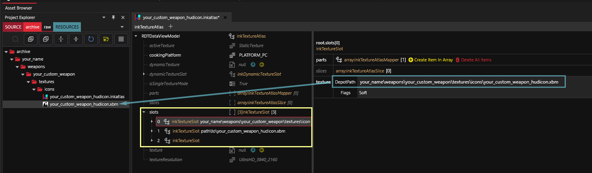

# Your own HUD icons

## Summary

**Published:** July 15. 2023 by [MxOrcBoi](https://app.gitbook.com/u/YRvTJDa38nMHXIZUnmSdbzZv4lw2 "mention")\
**Last documented edit:** Mar 24 2024 by [manavortex](https://app.gitbook.com/u/NfZBoxGegfUqB33J9HXuCs6PVaC3 "mention")

This guide tells you how to add a custom HUD icon for a weapon.  It is a subsection of the [weapons](../items-equipment/adding-new-items/weapons/ "mention") guide, but since the same principle applies for all parts of the UI, it can be used standalone.

## The final result

<figure><figcaption>
Custom HUD created for the rebar club.
</figcaption></figure>

## Step 1: Setting up the files

We need an [.inkatlas](../../for-mod-creators-theory/files-and-what-they-do/file-formats/game-icons-the-inkatlas-file.md) file and a [texture](../../for-mod-creators-theory/files-and-what-they-do/materials/textures-.xbm-files.md).&#x20;

1. Download the correct template from the wiki's [github repository](https://github.com/CDPR-Modding-Documentation/Cyberpunk-Modding-Docs/tree/main/_resources_and_assets/icons). For a hudicon, that's [weapons\_hudicon.zip](../../_resources_and_assets/icons/weapon_hudicon.zip)
2. Extract both files to a fitting subfolder in your Wolvenkit project.

Now we need to [custompath](../items-equipment/custompathing-assets.md#inkatlas) those files:

1. Open your `.inkatlas` file
2. Open the `slots` array
3. Click on each slot and set the value to your texture's relative path

<figure><figcaption></figcaption></figure>

#### **Optional: re-name your slot**

If you're cool with your slot's name being `your_custom_hudicon`, you can change its name:

1. Expand the first slot (the one with the number 0)
2. Expand its list of parts
3. Select the first entry `your_custom_hudicon` and change its name to whatever you want to use in the yaml

## **Editing the texture**

[Export](../textures-and-luts/images-importing-editing-exporting.md) your .xbm (texture) via Wolvenkit, then edit the resulting .png in chosen your image editor of choice.

* For more info on texture editing (and transparency!), check [images-importing-editing-exporting.md](../textures-and-luts/images-importing-editing-exporting.md "mention")
* For a (far) more detailed guide, check [creating custom inventory icons](adding-items-preview-images/)

**Once you are done,** [Import](../../for-mod-creators-theory/3d-modelling/exporting-and-importing-meshes/) your PNG over the xbm with those settings:

<figure><figcaption>
HUD Icon import settings.
</figcaption></figure>

4. Edit the inkatlas file as in the [icon creation guide](adding-items-preview-images/#hooking-up-the-inkatlas).

## Editing the .yaml file

Now that you have a custom preview icon, it's time to hook it up. You do this by editing the .yaml file.&#x20;

You'll find written instructions below the screenshot.

<figure><figcaption></figcaption></figure>

#### The base record

Add a `HUDWeaponIcons` entry at the root level of your .yaml (no indent). Give it a name, such as `HUDWeaponIcons.TheFallout` in the screenshot above.

It has the following properties (indent level 1):

<table><thead><tr><th width="222">Key</th><th width="248">Value</th><th>Explanation</th></tr></thead><tbody><tr><td><code>$type</code></td><td><code>gamedataUIIcon_Record</code></td><td>This tells the game that it's a UI icon</td></tr><tr><td><code>atlasResourcePath</code></td><td>path/to/your/file.inkatlas</td><td>relative path to your inkatlas file (right-click it in Wolvenkit and select "Copy relative path")</td></tr><tr><td><code>atlasPartName</code></td><td>slot_02</td><td>name of the icon's slot in the inkatlas. If you don't know it, see <a href="adding-items-preview-images/#hooking-up-the-inkatlas">here</a>.</td></tr></tbody></table>

#### Making the weapon use it

Add a new property to the weapon that refers to the record you have created above:

| `hudIcon` | `HUDWeaponIcons.TheFallout` |
| --------- | --------------------------- |

That's it! After starting the game,&#x20;
