# Adding props

## Summary <a href="#summary" id="summary"></a>

**Published:** April 2023 by **@manavortex**\
**Last documented update:** Jul 4 2026 by **@manavortex**

This guide will show you the **minimal way** of creating spawnable props with WolvenKit via the built-in generator.

### Wait, this is not what I want!

* To learn the file structure and understand how this works, read [custom-props.md](custom-props.md "mention"). **This page also has a video guide**!
* To use Cyberpunk materials with your props, check [textured-items-and-cyberpunk-materials.md](../../textures-and-luts/textured-items-and-cyberpunk-materials.md "mention")
* To register existing props or items with WorldBuilder, check [adding-custom-resources-props.md](../../world-editing/object-spawner/features-and-guides/adding-custom-resources-props.md "mention")
* If you want to enable collisions, see [enable-embedded-collisions.md](../../world-editing/miscellaneous/enable-embedded-collisions.md "mention")
* If you want to make meshes out of 2d textures, see [your-image-as-custom-mesh.md](../../../for-mod-creators-theory/3d-modelling/your-image-as-custom-mesh.md "mention")
* If you want to use a custom model (Or other resource type) with World Builder, see [Adding custom resources](../../world-editing/object-spawner/features-and-guides/adding-custom-resources-props.md)
* … or use the wiki's search function, or simply poke around

## Where to find models

Many websites host free stuff; you can find the largest archives below. Browse [this list](https://www.3printr.com/3dmodels/categories/free-models) for a more comprehensive collection, or use the following queries in your search engine of choice:

```
thing_I_want free 3d model
thing_I_want free fbx file
```

For game design or rendering, usually textured:

* [Sketchfab](https://sketchfab.com)
* [TurboSquid](https://www.turbosquid.com/) (there's a drop-down menu on the left-hand side where you can select to search for free models!)
* [CGTrader](https://cgtrader.com)
* [Renderosity](https://www.renderosity.com/freestuff)
* [Daz3D](https://www.daz3d.com/free-3d-models)
* [ArtStation](https://www.artstation.com/marketplace/game-dev?section=free\&page=4)
* [RenderHub](https://www.renderhub.com/free-3d-models)

For 3d printing, usually not textured:

* [thingyverse](https://www.thingiverse.com/)
* [MyMiniFactory](https://www.myminifactory.com/)
* [Pinshape](https://pinshape.com/)

## **Requirements:**

* [Appearance Menu Mod](https://www.nexusmods.com/cyberpunk2077/mods/790) or [WorldBuilder](https://github.com/Akiway/CP77_entSpawner/releases/) to spawn your prop
* &#x20;[Notepad++](https://notepad-plus-plus.org/downloads/) to edit text files



**Level of difficulty:** You know how to read.

## Skipping and skimming

<figure><figcaption></figcaption></figure>

If you follow this guide to the letter, you will end up with a working prop. If you decide to skip steps, or if you're sloppy about the instructions, you will run into problems. Do yourself a favour and be thorough!

* Any links in this guide will lead to **extra information**. You should not need to follow any of them to complete this guide, but if you're curious, feel free to browse around.
* Optional steps will always begin with the word **`Optional:`**
* Optional sections will tell you in the first sentence where to go if you skip them

## Step 1: Creating a prop

This section will walk you through **setting up the file structure**. At the end of this, you should have a spawnable prop, which will be the copy of an existing game item.

### 1.1 Creating a project

Create a [project in Wolvenkit](https://app.gitbook.com/s/-MP_ozZVx2gRZUPXkd4r/wolvenkit-app/usage/wolvenkit-projects) and give it a name (mine will be "swords").&#x20;


The project name will become the name of your mod.


### 1.2 Add container files

We can't create files on import, so we'll have to start with an existing game file (which we will then re-name). I will use a piece of concrete, but you can pick whatever you want:\
`base\environment\decoration\construction\concrete_debris\concrete_debris_piece_h.mesh`&#x20;

1. In the **Asset Browser**, [search](https://app.gitbook.com/s/-MP_ozZVx2gRZUPXkd4r/wolvenkit-app/usage/wolvenkit-search-finding-files) for `environment > .mesh`, and double-click on one to add it to your project
2. **Optional:** You can include up to four meshes in a prop. If you want, you can add more files.
3. In the **Project Explorer** on the left, select your mesh file, and hit F2 to bring up the rename dialogue

<figure>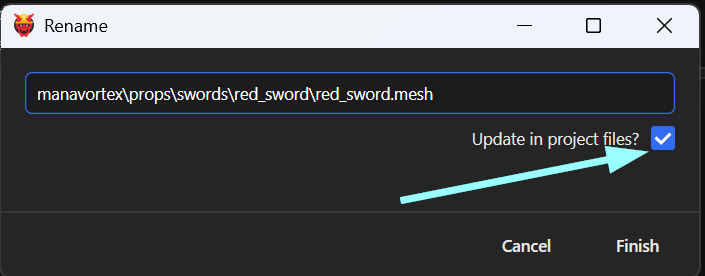<figcaption></figcaption></figure>

3. Pick a custom file path and -name for your prop. This path will be used to spawn it in WorldBuilder — use something like `your_modder_name\props\prop_pack\prop\prop.mesh`
4. Make sure that the box "Update in project files" is checked, then click "finish".

### 1.3 Creating the prop


See [Prop generator](https://app.gitbook.com/s/-MP_ozZVx2gRZUPXkd4r/wolvenkit-app/editor/generators/prop-generator "mention") in the red wiki for a full description of the tool


I (manavortex) have written a generator for Wolvenkit, which will do all the hard work for you. Let's use it:

1. Open the generator (`File` -> `Generate files` -> `Prop (Decoration)`)
2. Pick a `Parent folder` from the dropdown (use the folder from 1.2.2, e.g. (`manavortex\props\swords\red_sword`)
3. `Name` will be auto-populated. You can change it if you want.
4. In `Define appearances`, list the appearances that you want to create. I'll make two, so I'll set `default, glowing`
5. `Mesh files`: Skip ahead and set the first entry to the file you added in 1.2.1 (`manavortex\props\swords\red_sword\red_sword.mesh`)
6. Go back to `Write to meshes` (under `Appearances`), and check the box with `1`. This will create the appearances `default` and `glowing` in the skeleton mesh.
7. Click "Finish"

<figure>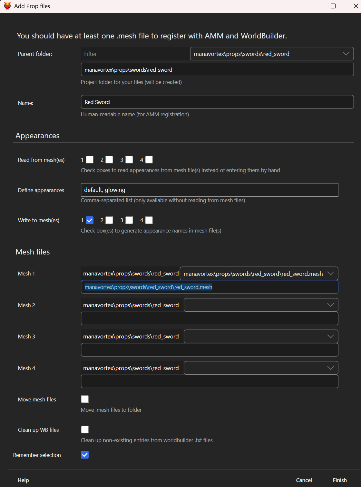<figcaption></figcaption></figure>

### 1.4 The file structure


This section is **optional** - if you want to skip it, go to [#id-1.5-testing](./#id-1.5-testing "mention").&#x20;


In the Project Explorer's source tab, you should now see something like this:

<figure>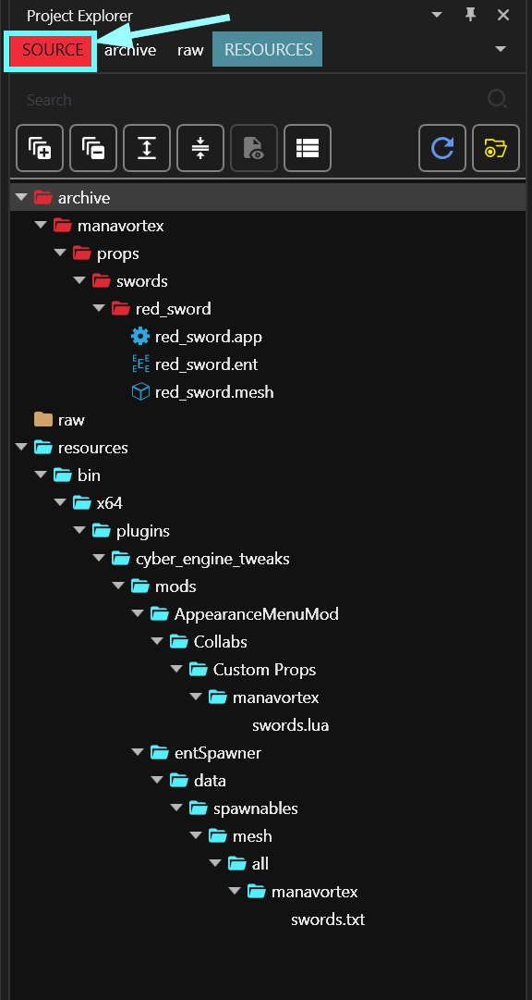<figcaption></figcaption></figure>

This section will give a brief explanation what these files do.

#### prop\_name.ent

Your prop's [root entity](../../../for-mod-creators-theory/files-and-what-they-do/file-formats/entity-.ent-files/#root-entity).&#x20;

If you have **one appearance**, it will contain components loading in your .mesh files.\
If you have multiple appearances, it will register each appearance, pointing at `your_prop.app` .

#### prop\_name.app


You will only have this file if you selected more than one appearance.


Your prop's [appearance definitions](../../../for-mod-creators-theory/files-and-what-they-do/file-formats/#app-appearance-definition):&#x20;

* One entry for each of the appearances you added with the generator
* In each appearance, one component per mesh file that you selected

#### prop\_name.mesh

The [.mesh file](../../../for-mod-creators-theory/files-and-what-they-do/file-formats/#mesh-3d-object) contains your 3d data. Right now, this is a game item, but we will customize it in [#step-2-adding-your-own-item](./#step-2-adding-your-own-item "mention").

#### mod\_name.lua

This file registers your prop(s) with AMM. You can open it with a text editor to make changes — if you do and the mod breaks, use a [lua online compiler](https://onecompiler.com/lua) to check what's wrong with it.

#### mod\_name.txt

This file tells WorldBuilder about your props.&#x20;


By default, only the .mesh files will be registered. If you want to tell WB about your entities, run `File` -> `Generate files` -> `WorldBuilder asset file`, and check the .ent files as well.


### 1.5 Testing


This section is **optional** (but highly recommended). If you want to skip it, go to [#step-2-adding-your-own-item](./#step-2-adding-your-own-item "mention")


Let's make sure that this is working (it _is_ working, but I want you to see it).

In Wolvenkit's toolbar, hit the green Play ([Install and Launch](https://app.gitbook.com/s/-MP_ozZVx2gRZUPXkd4r/wolvenkit-app/menu#install-and-launch-game)) button to install the mod and start the game.

#### Spawning the prop with AMM

1. Pull up the AMM menu
2. Open the Decor tab
3. In the search box, enter the **prop name** that you picked in the dialogue (`Red Sword` for me)&#x20;
4. Spawn the item

#### Spawning the prop with WorldBuilder

ToDo: Look up what exactly the menu items are called

## Step 2: Your own item

You have created a prop and it's spawning. Now it's time to actually put your custom 3d data and textures there!

### 2.1 Blender

1. Use the Export Tool to export the meshes from 1.2
2. In the Project Explorer, copy the absolute path to the raw folder: right-click on an item, then hold `Ctrl` and `Shift` to change the context menu entry.

<figure>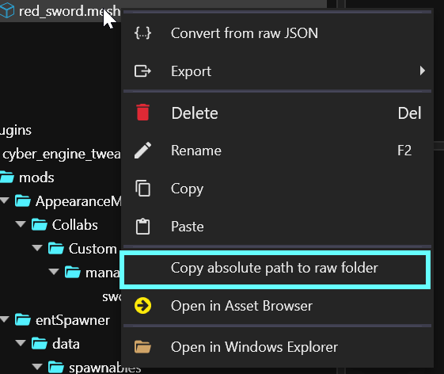<figcaption></figcaption></figure>

3. Now, open Blender
4. **Optional:** Delete everything from the scene (move your mouse over the viewport, hit `A`, then hit `X` and click `Delete`)
5. Select `File` -> `Import` -> `Cyberpunk GLTF`
6. In the file selection dialogue, click into the path box at the top, and paste your path (Ctrl+V). That will open the folder.

<figure>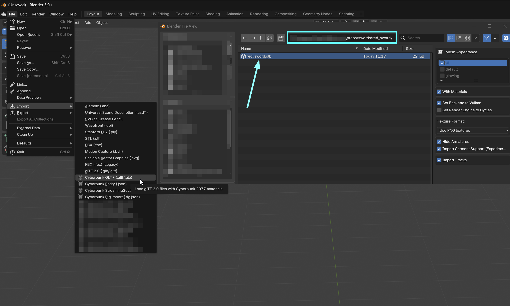<figcaption><p>Screenshot taken with version 2.0 of the Blender addon - interface might change in future versions</p></figcaption></figure>

6. Select your file, and hit Enter (or click the "Import gltf" button)

You should now see something like this:

<figure><figcaption></figcaption></figure>

### 2.2 Converting your download


For this guide, we'll be using a [sketchfab model](https://sketchfab.com/3d-models/adventure-time-demon-sword-5ea5c6014c544432b4eda438a4813974) that I downloaded in `.glb` format — if your download is from a different source, your structure may look different.&#x20;



You may be tempted to use 4k textures. Don't — most people won't even _see_ them, and they will clog up your memory while the engine has to work overtime to size them down. Use 2k at max or check [here](../../../for-mod-creators-theory/3d-modelling/on-4k-textures-and-high-poly-meshes.md) to learn more.


#### 2.2.1 Importing into Blender&#x20;

You can usually drag and drop the downloaded files into Blender, and it will offer you an import dialogue. If not, hit up Google.

#### 2.2.2 Mesh conversion


This process is covered in detail in the [textured-items-and-cyberpunk-materials.md](../../textures-and-luts/textured-items-and-cyberpunk-materials.md "mention")guide. I'll only tell you which buttons to push.


1. In the Outliner, click through the file structure until you see triangles (meshes)
2. Ctrl+click on all of them to select them
3. Join (Ctrl+J) to put them all in one mesh
4. Enter Edit Mode (Hotkey: `tab`)
5. Hit A to select all vertices
6. Right-click, and select `Separate` -> `By Material`

<figure><figcaption></figcaption></figure>

7. Switch back to Object Mode (Hotkey: `tab`)
8. Un-parent the meshes (Hotkey: `Alt+P`), Select `Clear Parent and Keep Transform`.
9. **Optional**: _Scale_ the meshes (Hotkey: `s`)
10. **Optional:** `Move` the meshes (Hotkey: `G`). If you turn them in game, they will turn around the world origin.
11. Optional: Apply transforms (Hotkey: `Ctrl+A`, `All Transforms`)

Now, re-name the meshes to meet Cyberpunk's naming scheme:

12. Double-click on every mesh in the Outliner at the top right, and change its name to `submesh_xx_LOD_1` (xx is the number, starting at 00). You can use the mesh that you imported as an example to get it right.&#x20;


Blender will add suffixes like .001 to keep track of things - you can ignore them!


12. In the Outliner at the top right, make sure that all meshes that you want to export are selected
13. Switch to edit mode again (Hotkey Tab) and triangulate (hotkey: `Ctrl+T`, `enter`)
14. Use `File` -> `Export` -> `Cyberpunk GLB`, and **overwrite** the file you exported from WolvenKit with the following settings:
    1. Skinned Mesh: turn it **off**
    2. Fix meshes: turn it **on**
15. Now, export from Blender: **overwrite** the file you previously exported.

<figure>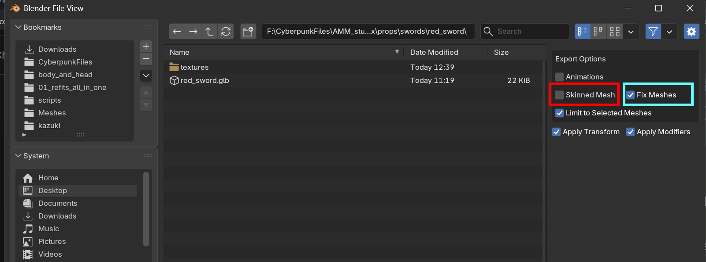<figcaption><p>Interface as of plugin version 2.0, it might change in the future. Important is that you export without armature/rigging.</p></figcaption></figure>


If you don't **exactly overwrite the file**, you won't be able to import into WKit.


Now you can use the Import Tool to [import it back](../../../for-mod-creators-theory/modding-tools/wolvenkit-blender-io-suite/wkit-blender-plugin-import-export.md#importing-into-wolvenkit-1).

### 2.3 Textures


If your textures are in a folder in your download, rather than embedded in the file, re-name it to `textures`  and skip to 2.3.4 below the picture



When saving files, make sure that everything has **lower case letters and numbers** only. No spaces, no uppercase letters, no emojis, no ascii art!


We're not quite done in Blender yet: we need to export the textures, too.

1. Switch to the **Shading** tab at the top
2. In the node editor, click on one of the orange texture nodes to select the texture in the editor
3. In the texture editor (bottom left), export the image (Hotkey: `Ctrl+Alt+S`). Save it in the same folder as your mesh, or put it in the subfolder `textures`

<figure>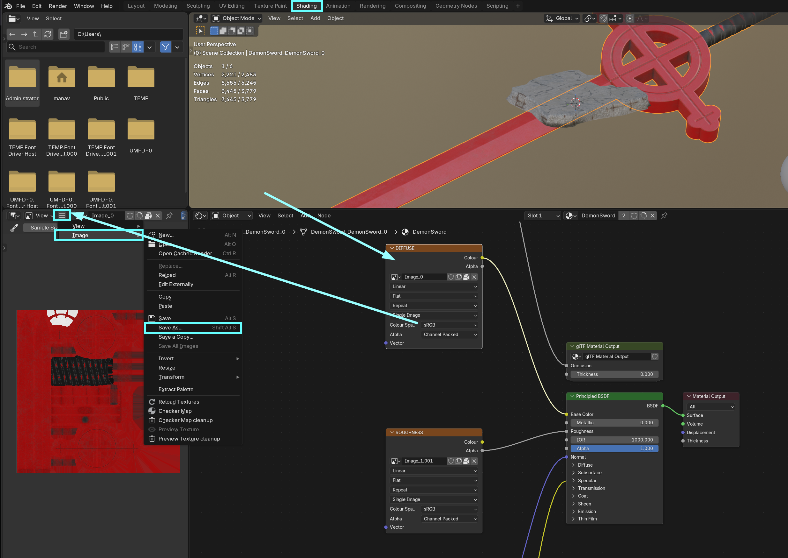<figcaption></figcaption></figure>

Now, let's re-name our files to match Cyberpunk's naming scheme. That will let WKit pick the correct import settings:

4. The diffuse/albedo (actual colour of the item) needs to end in \_d0X (make it `d_01` for the first texture set, `d_02`, and so on)
5. The normal map (the buumpmap, blue/purple or yellow) needs to end in \_n0X
6. Roughness (if present) needs to end in \_r0X
7. Metalness (if present) needs to end in \_m0X
8. **Optional:** If any of the textures you used has transparency, check this guide.
9. **Optional:** Both image width and image height should be even numbers (1024, 2048 etc).&#x20;
10. **Optional:** Re-scale your textures (max width/height: 2048)

#### Import

Let's get those files into the project!

1. Switch back to WolvenKit
2. Use the Import tool to import all textures and .glb file(s) - you can use `Import All`
3. You might see warnings. These are fine: as long as the text is not red, you can ignore it.
4. If you click on your .mesh, the preview should change. If not, check the log and hit up [troubleshooting-your-mesh-edits.md](../../../for-mod-creators-theory/3d-modelling/troubleshooting-your-mesh-edits.md "mention").
5. Optional: If any texture imports failed, check [#troubleshooting](../../textures-and-luts/images-importing-editing-exporting.md#troubleshooting "mention")

### Step 3: Your textures


This process is covered in detail in the [textured-items-and-cyberpunk-materials.md](../../textures-and-luts/textured-items-and-cyberpunk-materials.md "mention")guide, so this guide will only show you how to hook up one (1) textured material.


This section will show you how to configure your object to use textures instead of Cyberpunk's prodedurally generated materials.  However, [Cyberpunk materials](../../../for-mod-creators-theory/materials/configuring-materials/) are cool, and you'll definitely want to learn about them (check also [changing-materials-colors-and-textures](../../items-equipment/editing-existing-items/changing-materials-colors-and-textures/ "mention")).


All this takes place in WKit.


### 3.1 Materials

We'll configure the materials first, then update the appearances to use them.

#### Prep

1. Double-click your .mesh file in the Project Explorer to open it. You will now see something like this (the arrows show you where the materials are defined):
2. **Optional: If the materials are in the red list from the screenshot**
   1. Select `Clean Up` from the menu bar
   2. Expand the `Convert material preloading state` submenu
   3. Select Convert preload materials to local

* From the menu bar, select `Clean Up` -> `Adjust Submesh Counts`. This will make sure that you have exactly as many chunks in your appearances as you need.

<figure>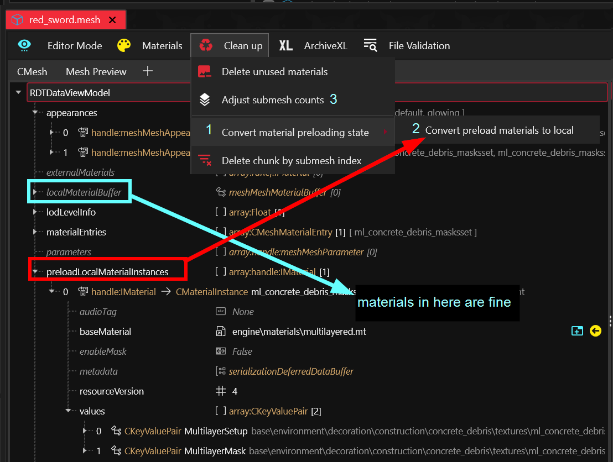<figcaption></figcaption></figure>

#### Using a textured material

1. Optional: Expand the `materialEntries` node, where the materials are defined.
2. Select the first material (`CMaterialInstance`)
3. Right-click, and select `Rename Material`. If you do not have this option, you have selected the wrong thing.
4. Name it something that you can remember (e.g. `textured_1`, or `sword_metal` )\
   &#xNAN;_&#x44;oing this will make the entry in `materialEntries` change._ \
   _Alternatively, you can also use this entry directly, but that won't update material names in the appearances._
5. Change `baseMaterial` to `engine\materials\metal_base.remt` — that will make it a textured material
6. Click on the `values` array
7. Right-click and select `Clear Array/Buffer` to delete all properties
8. In the right-hand panel, click on the yellow + button to add a new parameter
9. Select `Texture` and click Create

<figure>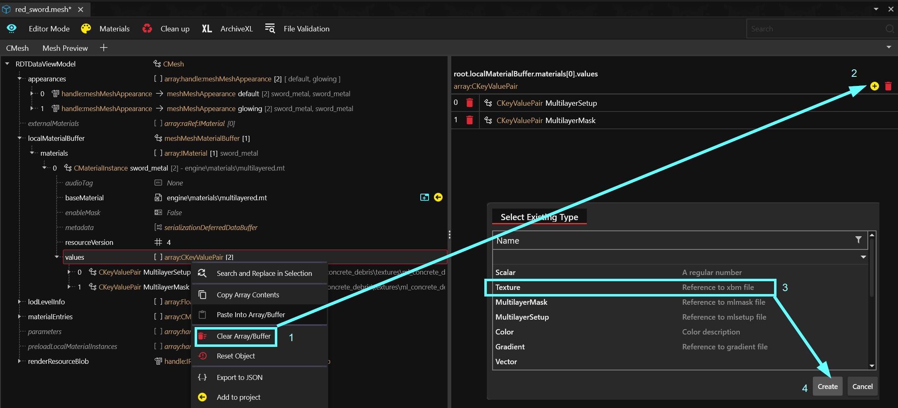<figcaption></figcaption></figure>

10. Select the entry in the values array
11. Right-click, and `Duplicate Item in Array/Buffer`. Do this once for every xbm file you have.
12. In the panel on the right, click the refresh button next to the dropdown menu for `Key`. This will read the material parameters from the base material:

<figure>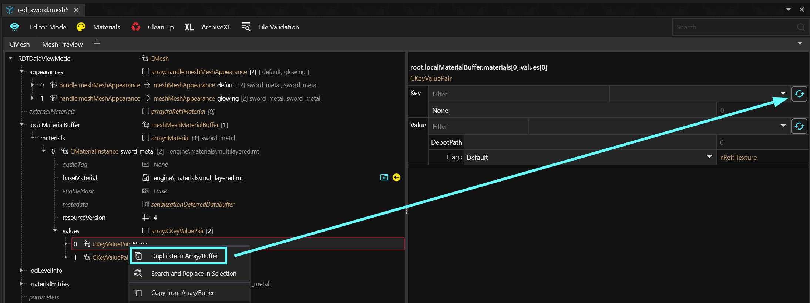<figcaption></figcaption></figure>

Now let's connect our textures. We use the `CKeyValuePair` in the values array that we just created. This **parameter** is of the type texture, so we can pick our textures from the dropdown.

1. For `Key`, select the property name corresponding to your texture
2. For `Value`, select the `.xbm` file corresponding to the name

You can find a full list of options under [textured-material-properties.md](../../../for-mod-creators-theory/materials/configuring-materials/textured-material-properties.md "mention"). Your options for textures are:

* `BaseColor`: The texture ending in `_d01` (material color). By default, this is using `engine\textures\editor\grey.xbm` and is grey.
* `Normal:` Bumpmap (height map). By default, it is using `engine\textures\editor\normal.xbm` and is just flat.\
  ℹ️ Importing the normal map into wkit with the correct settings should have turned it yellow.
* `Roughness`: (greyscale) How rough or glossy the surface _&#x69;_&#x73;. By default, it uses `engine\textures\editor\white.xbm` and is maximally rough.
* `Metalness`: (greyscale) How metallic the surface is. By default, it uses `engine\textures\editor\black.xbm` and is not metallic at all.
* `Emissive`: (greyscale mask): Which parts of the mesh you want to glow, and how much. By default, items do not glow at all.

#### Another material


This is optional - you can skip to [#id-3.2-appearances](./#id-3.2-appearances "mention").


After splitting the hilt into a different submesh in Blender and adjusting the submesh count in the prep step of this section, my appearances now have two submeshes, which can use different materials.&#x20;

I already have my `sword_metal` material, now I need another for the hilt.

1. Expand `materialEntries`&#x20;
2. Select the last item in the list
3. From the context menu, select Duplicate as new item(s)
4. Change the name of the new material to e.g. `sword_hilt`
5. Go to `localMaterialBuffer.materials`&#x20;
6. Click on the material node that you want do duplicate


If this material is the last in the list, you can simply duplicate the item and skip to 10.


7. From the context menu, select `Copy from Array/Buffer`&#x20;
8. Select the last item or the materials array (the parent node)
9. From the context menu, select `Paste into Array/Buffer` . This will give you a new material with your new name.
10. Select and expand your metallic material (`sword_metal`)
11. Add another Texture parameter to the `values` array of the metal material (or duplicate an existing one)
    1. Set its `key` to Metalness
    2. Set its `value` to `engine\textures\editor\white.xbm`&#x20;
12. Add another
    1. Set its `key` to Roughness
    2. Set its `value` to `engine\textures\editor\black.xbm`&#x20;

<figure>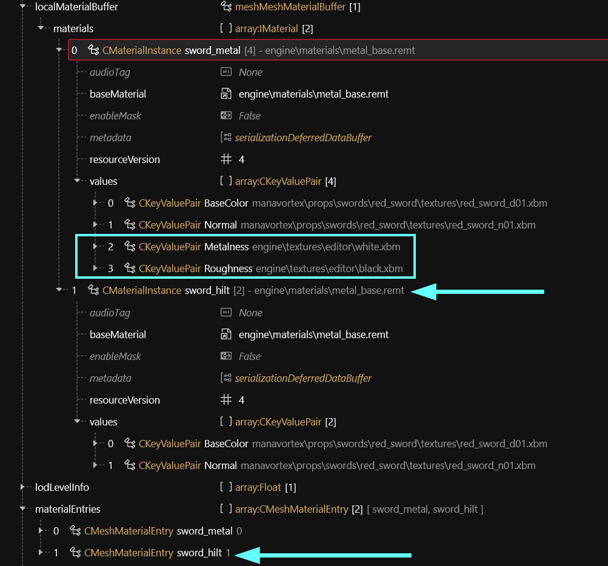<figcaption></figcaption></figure>

### 3.2 Appearances

Now, all that is left to do is to pick the right materials per mesh appearance! Fortunately, this is easy:

1. Expand the `appearances` array at the top of the file. If you press `Ctrl`, all child nodes will be expanded as well.
2. For every appearance, select the chunkMaterials node
3. In the panel on the right, you can pick materials per chunk in the dropdowns.&#x20;


If you are not sure which chunk is which, you can switch to the Mesh Preview tab, and toggle the checkboxes. This is only a preview, and will have no effect on the game.


## Troubleshooting

There are no dedicated troubleshooting steps for this workflow yet. For the general package, check [#troubleshooting](custom-props.md#troubleshooting "mention").
