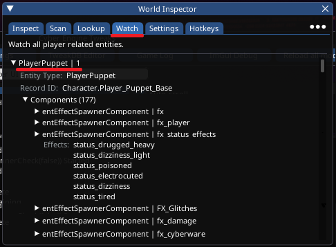
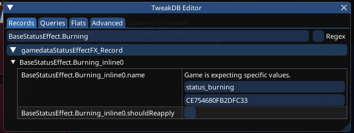

# Creating Custom FX

## Summary

**Published**: Mar 04 2025 by [beckylou\_1](https://app.gitbook.com/u/cqyE5SIC8GdJ2SJjjKCB32zFDM62 "mention")\
**Last documented edit**: Mar 04 2025 by [beckylou\_1](https://app.gitbook.com/u/cqyE5SIC8GdJ2SJjjKCB32zFDM62 "mention")

This guide will teach you the basics of how to Create a new Custom FX based on existing assets in the game. For example blackwall visuals.

## Red Hot Tools

The first thing you'll need is [Cyber Engine Tweaks ](https://app.gitbook.com/o/-MP5ijqI11FeeX7c8-N8/s/-MP5jWcLZLbbbzO-_ua1-887967055/)and [RedHotTools](../../../for-mod-creators-theory/modding-tools/redhottools/) to be able to inspect objects in the world, to see what effects spawners they have on them and what effects are available to be played.

In the World Inspector under the Watch tab, you'll find PlayerPuppet, which is V. This will have a Components section with hundreds of things attached to V. The ones we're interested in are entEffectSpawnerComonent. These each contain a list of fx effects that you can play straight away.

<figure><figcaption><p>World Inspector / Player Puppet / Status Effects</p></figcaption></figure>

You can find the Effects list of NPCs as well; walk up to an NPC. Look at it open up the RedHotTools window, go to Inspect and if the NPC is dead center of the screen it will have a section of the inspection window for the NPC in front of you.\
It should be noted that depending on the NPC, they have different sets of EffectSpawnerComponents, children for example do not have fx\_status\_effects; and so any of the effects contained in that list will not be available to be used on the kids.

## Testing an Effect

Lets say that you were looking through the FX\_Glitches list and found afterimage\_glitch and wanted to see what it looks like. The simplest way to do this is to edit an existing effect. For simplicity we'll take the burning status effect that gets applied when you walk into a fire or get hit by a fire grenade.

To begin with Open the TweakDB Editor and type BaseStatusEffect.Burning into the Search bar; then scroll down until you  find gamedataStatusEffectFX\_Record, click on it to open it up and then inspect those records until you find one with "status\_burning" as the name.

<figure><figcaption><p>TweakDB Editor / gamedataStatusEffectFX_Record / Burning</p></figcaption></figure>

Once you have found this, select status\_burning and replace it with afterimage\_glitch and press \[Enter]. You'll know it has worked because the hex number below the text will change.

Now take out your flame grenade and throw it in a place where you'll be able to walk over it and set yourself on fire.

Congratulations. You've successfully changed an effect and now you can't see. Brilliant right? But don't worry it only lasts a few seconds!

## Creating an Effect

Lets say that you've been through all the lists of effects, tried them all and you can't find the one that you want. Well there's good news and bad news. The good news is not every effect is registered as a playable effect on the character. The bad news is that you need to hunt through the 100s of .effect files to find the one you're looking for. However [FX player](https://www.nexusmods.com/cyberpunk2077/mods/8194) has you covered on that point.

Say you've been through the FX player list and found blackwall\_force\_screen.effect and wanted to test that.

Create a new folder inside Cyberpunk 2077\bin\x64\plugins\cyber\_engine\_tweaks\mods called example, create a new file called init.lua and drop the following code into that file.

```
local CNameNew = function(theString)
	local output = CName.new(theString)
	if output.value ~= theString then
		CName.add(theString)
		output = CName.new(theString)
	end
	return output
end

registerForEvent('onInit', function()
	local NewFXName = 'my_custom_blackwall_onscreen'
	local EffectPath = 'ep1\\fx\\quest\\q306\\other\\blackwall_force\\blackwall_force_screen.effect'

	local newEffect =  entEffectDesc.new()
	newEffect.effectName = CNameNew(NewFXName)
	newEffect.effect = EffectPath

	Observe('PlayerPuppet', 'OnGameAttached', function(puppet)
		local fx_status_effects = puppet:FindComponentByName('fx_status_effects')
		local fx_effectDescs = fx_status_effects.effectDescs
		table.insert(fx_effectDescs,newEffect)
		fx_status_effects.effectDescs = fx_effectDescs
	end)
end)
```

Fire up the game, investigate your playerpuppet fx\_status\_effects list and you'll find a new record in there for your new effects

Open up TweakDB Editor, find the StatusEffectFX\_Record from earlier and change it to my\_custom\_blackwall\_onscreen and set yourself on fire. Instead of the burning screen effects you'll find that your screen gets filled with flashy blackwall things.
