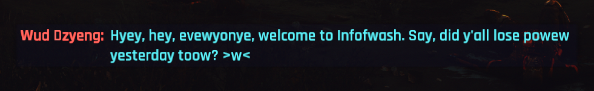
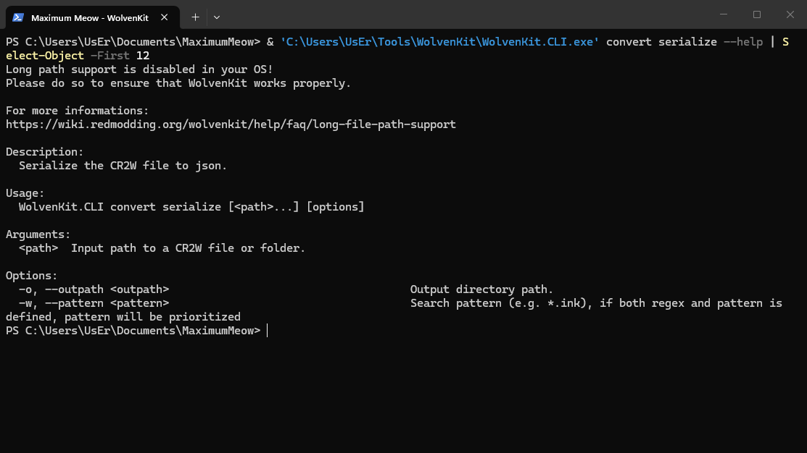
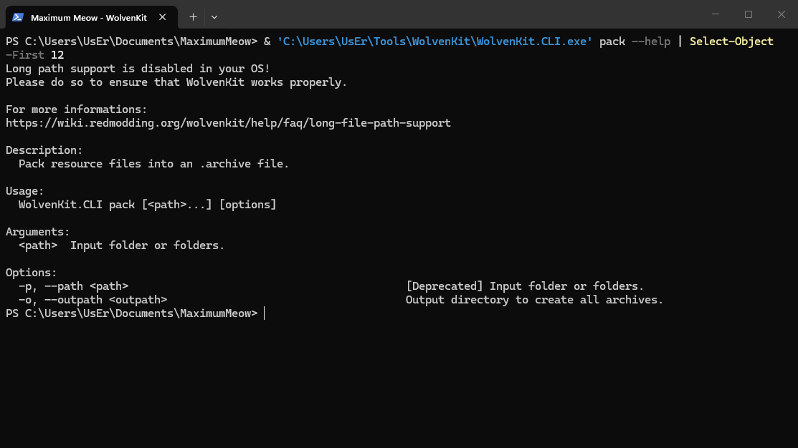

# How I UwU-transformed Cyberpunk 2077's localization

## Summary

**Published:** August 27, 2026 by [Marcus Sinne](https://github.com/MarcusSinne)

This guide shows the full extraction, serialization, transformation, CR2W rebuild, semantic readback, packing, and test process.

Related wiki pages:

* [Translation files: .json](https://wiki.redmodding.org/cyberpunk-2077-modding/for-mod-creators-theory/files-and-what-they-do/file-formats/translation-files-.json)
* [How to Translate a Mod](https://wiki.redmodding.org/cyberpunk-2077-modding/modding-guides/everything-else/how-to-translate-a-mod)

Nope I did not paste onscreen to chat gee pee twee that's like committing linguistic homicide.

I extracted the compiled localization resources using WolvenKit + power of Python to make a text replacer, rebuilt them, then Boom I become cat boy Nyaaa\~! Python rules changed words and added catboy bits from fixed lists. The process is deterministic. Same source + same seed = same UwU transformation every time.



## What this process changes

The python script only change visible Eng text stored in localization entries `femaleVariant` and `maleVariant` fields. Menus use readable phonetic mutation, while dialogue and descriptions use lighter transformation rules so they do not become `wwwwww` soup.

## What this process doesn't touch

Audio, Texture, Localized IDs, Resource paths, CP's original archives.

## 1. Get the English localization resources

Cyberpunk does not store its localization as loose editable text files. The English localization resources are compiled CR2W files packed inside REDengine `.archive` containers.

### Locate the game archives

Base game:

```
<Cyberpunk 2077>\archive\pc\content\lang_en_text.archive
```

Phantom Liberty:

```
<Cyberpunk 2077>\archive\pc\ep1\lang_en_text.archive
```

### Save the paths as PowerShell variables

I saved the WolvenKit, game, and project paths as PowerShell variables first. It's easier for me to write the extraction commands and prettier to read imo.

```powershell
$WolvenKit = "C:\path\to\WolvenKit.CLI.exe"
$Game = "C:\path\to\Cyberpunk 2077"
$Project = "C:\path\to\MaximumMeow"
```

Replace these example paths with your own directories.

### Extract the base-game localization

```powershell
& $WolvenKit unbundle `
  "$Game\archive\pc\content\lang_en_text.archive" `
  -o "$Project\source\base" `
  -v Minimal
```

This will read only:

```
archive\pc\content\lang_en_text.archive
```

and writes the extracted stuff under:

```
source\base\
└─ base\
   └─ localization\
      └─ en-us\
```

In my current game version, WolvenKit reported:

```
lang_en_text.archive: Unbundled 3087/3087 entries.
```

The exact count may change after game updates(I wrote this before Endgerunner 2). Check the archive name in the output: it must say `lang_en_text.archive`. If it names another archive, stop!!!!!! you got the wrong one.

### Extract the Phantom Liberty localization

```powershell
& $WolvenKit unbundle `
  "$Game\archive\pc\ep1\lang_en_text.archive" `
  -o "$Project\source\ep1" `
  -v Minimal
```

And this writes the expansion stuff under:

```
source\ep1\
└─ ep1\
   └─ localization\
      └─ en-us\
```

### Understand the extracted files

The extraction retain an identical path of the internal depot paths from each archive.

Base-game resources begin under:

```
base\localization\en-us\
```

Phantom Liberty resources begin under:

```
ep1\localization\en-us\
```

For example, this is what an extracted base-game resource look like.:

```
base\localization\en-us\subtitles\open_world\vendors\wat_kab_stylist_01.json
```

Although the file has `.json` extension, it is not editable nor readable (yet),

### Understand command syntax

In WolvenKit CLI, use `unbundle --help`.


CLI help shown from my PowerShell console; output shortened for readability.

WolvenKit 8.19 defines the syntax as:

```
WolvenKit.CLI unbundle [<path>...] [options]
```

The arguments used here are:

* `<path>`: the specific `.archive` file to extract
* `-o`, `--outpath`: where WolvenKit writes the extracted resources
* `-v`, `--verbosity`: how much information WolvenKit prints

**Source:** [WolvenKit CLI — Unbundle](https://wiki.redmodding.org/wolvenkit/wolvenkit-cli/usage/command-list#unbundle)

> **Note:** My screenshot shows WolvenKit's long-path warning. The extraction still completed, but a short project path or Windows long-path support is recommended.

## 2. Make the CR2W files readable

The extracted `.json` files are still binary CR2W files. Python cannot read them normally yet, so I used WolvenKit to turn them into readable JSON.

I tested one file first.

The output folder needs to exist:

```powershell
New-Item -ItemType Directory -Force "$Project\raw\example" | Out-Null
```

Then I serialized the file:

```powershell
& $WolvenKit convert serialize `
  "$Project\source\base\base\localization\en-us\subtitles\open_world\vendors\wat_kab_stylist_01.json" `
  -o "$Project\raw\example" `
  -v Minimal
```

WolvenKit turned this:

```
wat_kab_stylist_01.json
```

into this:

```
wat_kab_stylist_01.json.json
```

Now it is readable. Finally.

Yes, `.json.json`. Very normal naming. Nothing cursed here. Do not worry.

The text entries are stored under:

```
Data\RootChunk\root\Data\entries
```

For this subtitle file, each entry contains:

```
$type
femaleVariant
maleVariant
stringId
```

After this test worked, I used the same process for all base-game and Phantom Liberty localization files.



CLI help from my PowerShell console; shortened so it fits.

**Source:** [WolvenKit CLI — Convert](https://wiki.redmodding.org/wolvenkit/wolvenkit-cli/usage/command-list#convert)

## 3. Find the actual text

I opened the readable JSON and followed the mess until I found the entries:

```
Data\RootChunk\root\Data\entries
```

Menu and onscreen entries look like this:

```
$type
primaryKey
secondaryKey
femaleVariant
maleVariant
```

Subtitles and dialogue look like this:

```
$type
stringId
femaleVariant
maleVariant
```

The actual text lives in:

```
femaleVariant
maleVariant
```

Everything else is identity and structure.

```
primaryKey
secondaryKey
stringId
$type
```

Touching those IDs is how text becomes homeless and stops appearing in-game. So leave them tf alone.

The basic Python loop is:

```python
entries = document["Data"]["RootChunk"]["root"]["Data"]["entries"]

for entry in entries:
    for field in ("femaleVariant", "maleVariant"):
        text = entry[field]

        if text:
            entry[field] = transform_visible_text(text)
```

That is the tiny version. The real script also checks the file type, protects game formatting, and screams if it sees a structure it does not understand.

No screenshot here. The readable JSON contains CDPR's actual game text, and I am not uploading that whole thing to my repo.

## 4. Apply the UwU rules

It is a pile of deterministic UwU kawaii cat boy Python rules. You can say I'm committing linguistic cutey homicide on purpose.

The script checks where the text came from before touching it.

### Menus and short UI text

Menus need to stay readable while someone is being shot at.

The script mutates every eligible word using simple phonetic rules:

```
r or l  → w
th      → d
ove     → uv
final s → z
```

### Dialogue and descriptions

Long text gets lighter treatment. The script mutates around 40% of its words instead of attacking the whole sentence.

It also crushes repeated `ww` so dialogue does not become:

```
wwwwwwww
```

Long description or dialogue gets one ASCII emoticon. Short ones may get one, a cat noise, an action, or a single stutter. These are picked from fixed lists, not generated.

### Same input, same cat crime

The production seed is:

```
game-of-the-nya-v1
```

The script combines that seed with the file path, entry ID, field name, and rule being used.

```
same file + same ID + same field + same seed = same result
```

Run it again and it makes the same choices.

### Do not eat the game formatting

The script protects things like:

```
<Input ...>
<Rich ...>
<Image ...>
{placeholders}
\n
URLs
numbers
```

If those any of those got touched, the game might start having seizure.

## 5. Turn the edited JSON back into CR2W

After Python finishes UwUsified, the `.json.json` file needs to become a CR2W resource again, so the game can actually read it.

I used WolvenKit's `convert deserialize` command:

```powershell
& $WolvenKit convert deserialize `
  "$Project\raw\example\wat_kab_stylist_01.json.json" `
  -v Minimal
```

WolvenKit turned this:

```
wat_kab_stylist_01.json.json
```

back into this:

```
wat_kab_stylist_01.json
```

WolvenKit reported:

```
Found 1 files to process.
Imported wat_kab_stylist_01.json.json
Converted wat_kab_stylist_01.json.json to CR2W
```

Checked the rebuilt file header. It should begin with:

```
CR2W
```

So it is a compiled game resource again.

I run this inside the build folder and so should you. It does not overwrite the extracted source files or anything inside the game folder. (don't blame me if any of your game file got overwritten, I warned you multiple times at this point.)


CLI help from my PowerShell console; shortened so it fits.

**Source:** [WolvenKit CLI — Convert](https://wiki.redmodding.org/wolvenkit/wolvenkit-cli/usage/command-list#convert)

## 6. Check that WolvenKit did not eat anything

A `CR2W` header only proves the rebuilt file looks like a game resource. It does not prove the text survived.

So I serialized every rebuilt CR2W file back into JSON again.

```
edited JSON
    ↓ deserialize
rebuilt CR2W
    ↓ serialize again
readback JSON
```

Then my Python script compared the `Data` section from the edited JSON with the readback JSON:

```python
if readback["Data"] != edited["Data"]:
    raise SystemExit("semantic round-trip mismatch")
```

I compare `Data` because that contains the resource structure and localization entries. WolvenKit can change export information inside `Header`, so comparing the entire file would scream about harmless metadata.

My final check:

```
Base game:       3086 / 3086 matched
Phantom Liberty:  716 / 716 matched
Total:           3802 / 3802 matched
```

If one entry, ID, field, or piece of text comes back different, the build stops. This is non-negotiable! I don't know if mismatched numbers of entries would cause anything, and I do not want to find out. You can try at your own risk.

## 7. Pack the mod archives

The rebuilt CR2W files keep their original depot paths:

```
base\localization\en-us\...
ep1\localization\en-us\...
```

I pack base game and Phantom Liberty separately.

```powershell
$Build = "$Project\build\full-b"

New-Item -ItemType Directory -Force `
  "$Build\archives\base-pack", `
  "$Build\archives\ep1-pack" | Out-Null
```

Base game:

```powershell
& $WolvenKit pack `
  "$Build\stage\base" `
  -o "$Build\archives\base-pack" `
  -v Detailed
```

Phantom Liberty:

```powershell
& $WolvenKit pack `
  "$Build\stage\ep1" `
  -o "$Build\archives\ep1-pack" `
  -v Detailed
```

WolvenKit made:

```
base.archive
ep1.archive
```

My build script renamed them to:

```
!ultimate-uwu-meowification-nyaa-base.archive
!ultimate-uwu-meowification-nyaa-phantom-liberty.archive
```

The leading `!` gives them an early filename load order. This lets the full localization override win when another archive edits the same vanilla localization file.

That also means a collision can hide another mod's edits to that file.

Then I opened both finished archive indexes and checked every depot path:

```
Base game:       3086 / 3086
Phantom Liberty:  716 / 716
```

These are new mod archives. Cyberpunk's original `lang_en_text.archive` files are never touched and must never be touched under any circumstances.(I know I keep warning you about overwrite issue.)



CLI help from my PowerShell console; shortened so it fits.

**Source:** [WolvenKit CLI — Pack](https://wiki.redmodding.org/wolvenkit/wolvenkit-cli/usage/command-list#pack)

## 8. Test the damn thing

Before touching the game, I ran the Python tests:

```powershell
& "$Project\.venv\Scripts\python.exe" -m pytest
```

Result:

```
105 passed
```

The full build also passed:

```
CR2W rebuild:        3802 / 3802
JSON readback:       3802 / 3802
Base archive paths:  3086 / 3086
Phantom Liberty:      716 / 716
```

I also built it twice from clean folders. Both builds were identical.

### In-game test

Automation cannot check what actually appears in-game, so I still need to check:

* main and settings menus
* HUD and input icons
* cinematic subtitles
* overhead dialogue
* quest objectives
* item descriptions
* shards and computers
* one Phantom Liberty scene

Pass means the text is transformed without:

* raw markup
* missing lines
* changed numbers
* broken input icons
* unusable menus

Then remove both mod archives and launch the same save.

## Code

* [UwU rules](https://github.com/MarcusSinne/UwU-transforming-Cyberpunk-2077/blob/main/src/maximum_meow/transformer.py)
* [Localization file handling](https://github.com/MarcusSinne/UwU-transforming-Cyberpunk-2077/blob/main/src/maximum_meow/resource.py)
* [Build scripts](https://github.com/MarcusSinne/UwU-transforming-Cyberpunk-2077/tree/main/scripts)
* [Synthetic tests](https://github.com/MarcusSinne/UwU-transforming-Cyberpunk-2077/tree/main/tests)
