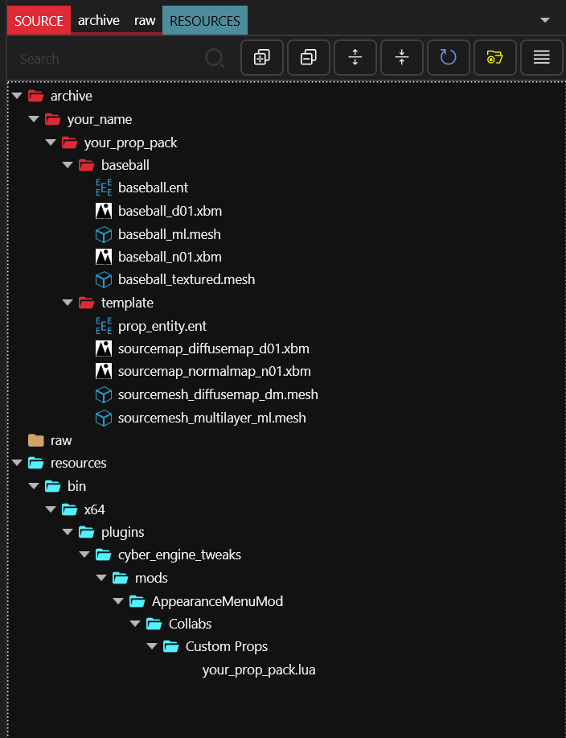
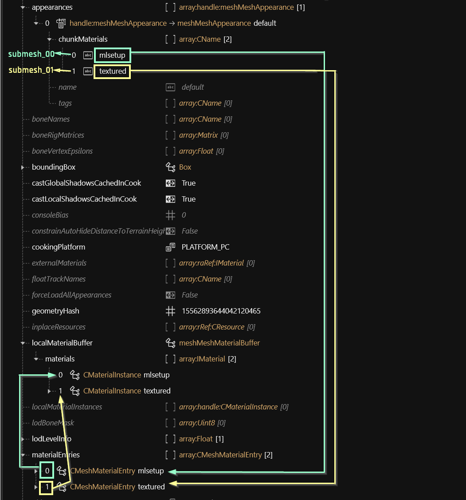
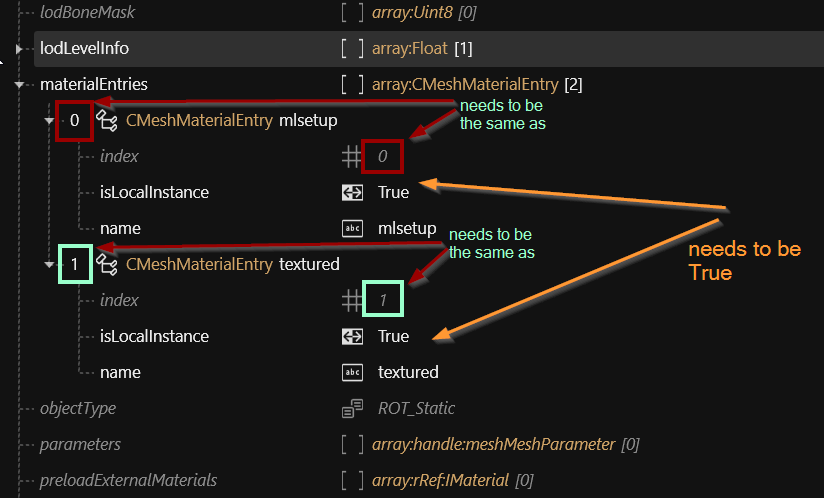

# Textured items and Cyberpunk materials

## Summary <a href="#summary" id="summary"></a>

**Created by @manavortex**\
**Published February 11 2023**

This guide will walk you through **importing 3d objects** into Cyberpunk 2077, which can then be spawned via [Appearance Menu Mod](https://www.nexusmods.com/cyberpunk2077/mods/790).&#x20;

**It uses the following versions:**

* Cyberpunk 2077 game version 1.6.1 (DLSS)
* [WolvenKit](https://github.com/WolvenKit/WolvenKit-nightly-releases/releases) >= 8.8.1
* [Appearance Menu Mod](https://www.nexusmods.com/cyberpunk2077/mods/790) (version 2.0.2, but pretty much any version will do)

**Level of difficulty:** You know how to read.


If you don't want to create an AMM prop pack, simply ignore those parts of the guide that are prefixed with **AMM:** and just use the rest of the knowledge.



If you only want to know how to apply Cyberpunk materials to parts of your mesh, check "[Splitting off submeshes](textured-items-and-cyberpunk-materials.md#splitting-off-submeshes-mildly-advanced)" below.


## Where to find models

You can find many free 3d models across the web.&#x20;

For game design or rendering, usually textured:

* &#x20;[sketchfab](https://sketchfab.com)
* [Turbosquid](https://turbosquid.com)
* [CGTrader](https://cgtrader.com)

For 3d printing, usually not textured:

* [thingyverse](https://www.thingiverse.com/)
* [MyMiniFactory](https://www.myminifactory.com/)
* [Pinshape](https://pinshape.com/)

You can also search Google for "`thing_I_want` free 3d model" or "`thing_I_want` free `<format>` file" (\<format> = STL, OBJ, FBX), or check [STLFinder](https://www.stlfinder.com/) or the pages on [this list](https://www.3printr.com/3dmodels/categories/free-models).

## AMM: Setting up the project

1. Create a project in Wolvenkit and give it a name. (Will be referred to `your_prop_pack` in the rest of the guide)


If you can't be bothered, find a prepared source folder [here](https://mega.nz/file/7RFWzQzA#ezoH84bJEUZhDidJgPbQS1nJujiWwWpV8k5Y0f8PhUI).\
The file has been uploaded on February 02 2023 and is confirmed working as of today.


2. Download Pinkydude's [AMM Custom Props Creation Kit](https://www.nexusmods.com/cyberpunk2077/mods/5979) and extract it somewhere on your harddrive. (You don't have to use it. If you're comfortable with Wolvenkit's file structure, you can use any given game files. But if that's the case, why are you [following this guide](textured-items-and-cyberpunk-materials.md#splitting-off-submeshes-mildly-advanced)? :D)
3. Download [this baseball](https://mega.nz/file/vd0X3Yaa#tcakXF6\_t0k\_EouthuKcJSPL3o2nI6b\_zVWi528Kv5k). It's a re-pack of [AlexBes's](https://sketchfab.com/3d-models/worn-baseball-ball-fdf3de6ae225421ea78961b897b9608a) mesh that I have prepared for this tutorial.
4. Prepare your Wolvenkit project: navigate to the folder on your hard drive and open "source". Then, make sure that you have the following folder structure:

<pre class="language-yaml"><code class="lang-yaml">- archive
<strong>  - your_name
</strong>    - your_prop_pack
      - template
- resources
  - bin
    - x64
      - plugins
        - cyber_engine_tweaks
          - mods
            - AppearanceMenuMod
              - Collabs
                - Custom Props  
</code></pre>


The first part of the structure is up to you, although for the asake of the tutorial you might want to stick to it and [change it at the end](moving-and-renaming-in-existing-projects.md).

The second part of the structure is where AMM will look for custom props. You can't change this part.


4. We will now create a **template** folder inside the project. Whenever you want to add a new prop, you just create a copy of the template folder, rename the files, and get importing.\
   \
   Copy files from the downloaded prop creation kit to your project:

| Source path in downloaded files                                                                                      | Target path in your project                                                                                                                                                         |
| -------------------------------------------------------------------------------------------------------------------- | ----------------------------------------------------------------------------------------------------------------------------------------------------------------------------------- |
| `03_ENTITY\yourprops_template.lua`                                                                                   | `resources\bin\x64\plugins\cyber_engine_tweaks\mods\AppearanceMenuMod\Collabs\Custom Props\your_prop_pack.lua`                                                                      |
| `03_ENTITY\prop_entity.ent`                                                                                          | `archive\your_name\your_prop_pack\template\prop_entity.ent`                                                                                                                         |
| <p><code>02_MESHES\sourcemesh_diffusemap_dm.mesh</code><br><code>02_MESHES\sourcemesh_multilayer_ml.mesh</code></p>  | <p><code>archive\your_name\your_prop_pack\template\sourcemesh_diffusemap_dm.mesh</code><br><code>archive\your_name\your_prop_pack\template\sourcemesh_multilayer_ml.mesh</code></p> |
| <p><code>01_TEXTURES\sourcemap_diffusemap_d01.xbm</code><br><code>01_TEXTURES\sourcemap_normalmap_n01.xbm</code></p> | <p><code>archive\your_name\your_prop_pack\template\sourcemap_diffusemap_d01.xbm</code><br><code>archive\your_name\your_prop_pack\template\sourcemap_normalmap_n01.xbm</code></p>    |


Depending on your level of OCD, you might want to have an own subfolder for textures. You can simply create one and then adjust the paths accordingly.


### Explanation

#### Entity file

The file where AMM looks up which meshes to load. As of AMM 2.0.2, you need one entity per variant, because you need to define mesh appearances in the entity file itself.


Your component names need to be `amm_prop_slot1` .. `amm_prop_slot4`. If you use other names, or have more than 4 components, AMM will disable scaling.


#### sourcemesh\_diffusemap\_dm.mesh

A pre-configured mesh for a textured material. Expects the following textures:

* A diffuse (albedo) map, colouring the mesh
* A normal (bump) map, adding depth to the object.

#### sourcemesh\_multilayer\_ml.mesh

A pre-configured mesh for a textured material. Expects the following files:

* A multilayer setup,&#x20;
* A normal (bump) map, adding depth to the object


Time to create our first prop!

The tutorial will be using a custom version of [this baseball](https://sketchfab.com/3d-models/worn-baseball-ball-fdf3de6ae225421ea78961b897b9608a) by AlexBes.


## AMM: Setting up the prop


If you plan to have many props, it is a good idea to group them by type, e.g. creating subfolders for "pistols", "animals", "toys"


In the Windows Explorer

1. Copy the "template" folder
2. Rename the new folder to the name of your prop (e.g. "basketball")
3. Rename the files inside of the folder by replacing the prefixes with the name of your prop. Your Wolvenkit project should now look like this:

<figure><figcaption></figcaption></figure>

## Importing a mesh

### AMM: Download the prepared files

Download [this archive](https://mega.nz/file/vd0X3Yaa#tcakXF6\_t0k\_EouthuKcJSPL3o2nI6b\_zVWi528Kv5k) - I have prepared it for import. It contains both the original glb from sketchfab and the version I prepared for import.

### Step 1: Exporting


The first step to importing a mesh is exporting a mesh.&#x20;


In Wolvenkit, open the Export Tool (Tools -> Export), and export everything in your folder: the mesh(es) you want to use and the textures.&#x20;


You can only import 3d files by overwriting a .mesh.


### Step 3: Importing

In Wolvenkit, open the Import Tool (Tools -> Import), and overwrite the files&#x20;

**After you have exported the files from Wolvenkit**, overwrite them with the files you downloaded from sketchfab. They need to have the same names!

The process won't be covered in detail here, as it already has [its own guide](../../modding-know-how/3d-modelling/exporting-and-importing-meshes.md), but it works just as exporting. There's also a [troubleshooting page](../../modding-know-how/3d-modelling/self-made-normal-maps/troubleshooting-normal-maps.md) if you're stuck.

#### Wait, where did Step 2 go?


Good! You've been paying attention! \
\
Step 2 is to prepare the downloaded 3d asset to work with Cyberpunk. Depending on your target file, this can be any level of difficult, but the steps below should be enough for most meshes.


### Step 2: Processing the downloaded mesh

The files you download will have all sorts of structures. In the end, you want to end up with a flat hierarchy of object(s):

```
Scene Collection
    ▽ submesh_00_LOD_1
    ▽ submesh_01_LOD_1
    ▽ submesh_02_LOD_1
    ▽ submesh_03_LOD_1
```

LOD\_1 indicates the level of detail, whereas the submeshes need to be numbered explicitly (or Wolvenkit will number them for you, which you'll want to avoid).


A mesh that I imported with 9 submeshes made the game crash with a likelihood of \~ 80% when I spawned or despawned it (scaling was fine). You might want to create two separate files if you have too many objects.


#### Splitting off submeshes (mildly advanced)


Every submesh can have its own material assigned in the mesh, and can be hidden or displayed via chunkmask. This is how you assign Cyberpunk materials to parts of your imported asset.


I usually join everything into one object that'll have the same material in the game, unless I want to hide parts of it to make variants.

But the opposite is also possible: You can split off parts from the original object, putting them into their own submeshes. I have done this in the [baseball example](https://mega.nz/file/vd0X3Yaa#tcakXF6\_t0k\_EouthuKcJSPL3o2nI6b\_zVWi528Kv5k): the seams will get a texture, and the rest of the mesh will be coloured with a cyberpunk material.

You do that by changing into the edit mode, then selecting everything that you want to split off ("Select Linked" or "Select More" is your friend here),  and **splitting** it (P -> Split Selection).


You can duplicate your selection first (Shift+D, ESC)


Now, switch back to Object mode and select your new mesh before going into Edit Mode again. Make sure to [**scale**](../../modding-know-how/3d-modelling/self-made-normal-maps.md#step-0-preparing-the-viewport) your new mesh so that it is slightly above the surface of the old one.

Make sure to [correctly name your new submesh](textured-items-and-cyberpunk-materials.md#step-2-processing-the-downloaded-mesh).

#### Unparent

Select everything (click the viewport and press A), then unparent the objects by pressing Alt+P. Select "Clear and Keep Transformation".

#### Applying transformations

Since those are saved relatively and Wolvenkit will ignore them, your objects might end up larger or smaler than you expect them, or be in different places.&#x20;

Select your objects in the viewport, then press Ctrl+A and choose "All Transforms".&#x20;

#### Scale it

Scale your 3d object in Blender until it has the size you expect it to be in-game.&#x20;

If you do this in the object mode, you need to [apply transformations](textured-items-and-cyberpunk-materials.md#applying-transformations) afterwards. Alternatively, you can scale the vertices in edit mode.


If your mesh still scales weirdly in Wolvenkit / the game, you can create a new mesh in Blender, delete its vertices in edit mode, and then join your original object on top of it.



If you need a reference object, you can use this [lightsaber](https://mega.nz/file/aJkXxTaT#3hCUT\_qULkYu4VfL3QVXYE8NJ77sTPCftZiTPRs\_6a0) from my [props](https://www.nexusmods.com/cyberpunk2077/mods/7391).


#### Origin

Keep in mind that your prop will rotate around the world origin, and position it accordingly.

<figure><figcaption><p>AMM will rotate your object around the point 0,0,0. </p></figcaption></figure>


Once you are done, import the glb file over your original mesh (you can consult the [troubleshooting section ](textured-items-and-cyberpunk-materials.md#troubleshooting)below).

Your import has been successful when the preview in Wolvenkit changes (you might have to select another file first).


## Material assignments

AMM: We'll be using`baseball_ml.mesh`.&#x20;

### Theory


You can copy entire materials between meshes - that's how I transfered the "textured" material to the "baseball\_ml" mesh. You can find a step by step guide to this [below](textured-items-and-cyberpunk-materials.md#transfer-the-material).


This is how the lookup works:

<figure><figcaption><p>I transfered "textured" by hand from the other mesh and created the second materialEntry the same way.</p></figcaption></figure>

#### ChunkMaterials

You assign materials based on the "chunks" (the individual submeshes) inside a mesh. Open the mesh file in Wolvenkit and open the "appearances" array, then make sure that each of your submeshes has an entry inside the array.

In the&#x20;

<figure><figcaption><p>You may have to create additional entries in "chunkMaterials": You can do that by selecting it and checking the panel on the right.</p></figcaption></figure>

#### Material definition

Materials are defined in the array **`materialEntries`** inside your mesh:

<figure><figcaption></figcaption></figure>

#### MaterialInstance: The actual material

The materials themselves are inside the array `localMaterialBuffer.materials` (some meshes have them in `preloadLocalMaterials` instead). They look like this:

<figure><figcaption><p>baseMaterial picks the material (shader), while "values" contains properties to adjust it.</p></figcaption></figure>


For an overview of materials that you might want to use for something, check [here](../../modding-know-how/references-lists-and-overviews/cheat-sheet-materials.md).&#x20;

You can check a material's properties by opening the file inside of Wolvenkit and checking the last entry of the "parameters" array, or search for "files using this" and looking at how they're doing things.


## AMM: Let's implement the theory

### Setting up our materials

#### Add a new material entry

1. Select the entry "texture" inside the array `materialEntries`
2. Duplicate it
3. Select the new entry
4. Change the name to `mlsetup`&#x20;
5. Change the index to `1`

#### Assign the submesh

Open the array `appearances`, select the first appearance (`default`) and select the array `chunkMaterials`.  Create a new entry, or duplicate the existing one. Make sure the list order shows

```
0    mlsetup
1    textured
```

#### Transfer the material

1. Open `baseball_textured.mesh`&#x20;
2. Find the CMaterialInstance "texture" inside `localMaterialBuffer.materials`.&#x20;
3. Select it, then copy it via right-click (Copy (Selection) from Array/Buffer)
4. Switch to `baseball_tml.mesh`
5. Select `localMaterialBuffer.materials`
6. Paste the textured material (Right click, Paste (Selection in) to Array/Buffer)
7. You can now delete the second mesh, as you don't need it anymore.

#### Change the material parameters

Let's update paths and values. Still inside of `localMaterialBuffer.materials`, change the following properties:

| Material | name of KeyValuePair | value                                                                                                     |
| -------- | -------------------- | --------------------------------------------------------------------------------------------------------- |
| textured | Normal               | `your_name\your_prop_pack\baseball\baseball_n01.xbm`                                                      |
|          | BaseColor            | `your_name\your_prop_pack\baseball\baseball_d01.xbm`                                                      |
| mlsetup  | GlobalNormal         | `your_name\your_prop_pack\baseball\baseball_n01.xbm`                                                      |
|          | MultilayerMask       | delete it                                                                                                 |
|          | MultilayerSetup      | `base\characters\garment\gang_nomad\legs\l1_021_pants__cargo_computer\textures\leather_red_basic.mlsetup` |

For the leather texture, I've just picked a random mlsetup from the game files (which I found by searching Wolvenkit for `leather > .mlsetup`). If you want to make your own mlsetups, see [here](../items-equipment/editing-existing-items/changing-materials-colors-and-textures.md#exporting-the-.mlsetup).


Save the mesh. You can check the "Mesh Preview" tab if the materials show up. If the mesh turns invisible, you'll want to double-check your paths, though!


### Let's set up our entity file

1. Open the baseball's entity file (`your_name\your_prop_pack\baseball\baseball.ent`).&#x20;
2. Open the `components` array.
3. Select the second component (`amm_prop_slot1`)
4. Change the mesh -> depotPath to the path of your baseball mesh (`your_name\your_prop_pack\baseball\baseball_ml.mesh`).&#x20;
5. Leave `meshAppearance` on `default`, unless your mesh has multiple appearances: This is where you select which entry in the mesh's appearance array will be used.
6. **D**elete the other **`amm_prop_slot`** components. (These are where you would add more mesh files to your prop - but keeping them makes your prop be full of glowing cubes).
7. Save the entity file.


If you have more than four mesh files assigned to your entity's components, the prop will no longer be scaleable (as of AMM 2.0.2). You can get around this limitation by making meshes with more submeshes instead of individual files.


### AMM: Let's set up our lua file

Open the lua file under `resources\bin\x64\plugins\cyber_engine_tweaks\mods\AppearanceMenuMod\Collabs\Custom Props\your_prop_pack.lua`.

Set modder to your name and unique\_identifier to anything, e.g. `your_name_your_props`. Now, adjust the first entry in the "props" list to point to your entity file:&#x20;

```lua
return {  
  modder = "your_name",

  unique_identifier = "your_prop_pack",

  props = {
    {
      name = "Baseball",
      path = "your_name\\your_prop_pack\\baseball\\baseball.ent",
      category = "Misc",
      distanceFromGround = 1,
    },
  }
}

```


The "path" parameter is the relative path to your entity file, but every backslash has to be doubled.


"name" is what you'll search for in AMM. "distanceFromGround" is pretty self-explanatory, but I prefer it if my objects are floating.


Save the lua file, install your mod, and launch the game. Time to test!


<figure><figcaption><p>Not a moon</p></figcaption></figure>

## Troubleshooting

This section will only cover troubleshooting steps for this guide. For general 3d model troubleshooting (including import errors), see [here](../../modding-know-how/3d-modelling/troubleshooting-your-mesh-edits.md).

### My prop doesn't spawn and AMM won't target it!

AMM can't find your .ent file. Check the paths in the lua.

### My prop is invisible (but AMM targets it)!

This can be one of the following issues:&#x20;

* the path from .ent to .mesh is wrong
* the mesh appearance in the .ent file can't be found (check spelling in both .ent and .mesh)
* the mesh appearances's chunk materials can't be found (check spelling in the .mesh, both in the chunkMaterial assignments and the CMaterialInstance in `localMaterialBuffer.materials`)
* Check your mesh's **face orientation** in Blender — inside-facing meshes are usually transparent.
* Check your mesh's chunkmasks in the .ent file: maybe you have accidentally hidden a submesh?

If that doesn't help as well, try assigning a default game material (search for anything ending in .mt and put the path in your material's `baseMaterial.DepotPath`).&#x20;

* Try assigning a default game material by searching for&#x20;

### My prop is all over the place / too big / too small

Check the [scaling](textured-items-and-cyberpunk-materials.md#scale-it) in Blender and make sure that you have [applied transformations](textured-items-and-cyberpunk-materials.md#applying-transformations).

### I don't have a normal map texture, but my import looks shit without one

Use `engine\textures\editor\normal.xbm`

### Some of my props are much "lighter" than others!

These ones will have a blue normal map as opposed to a yellow one. Invert the blue normal texture before importing it.
