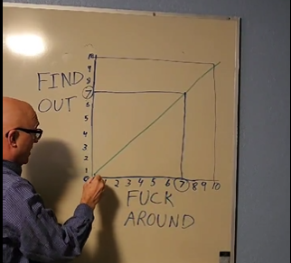

# 🎉 Getting started: Making mods

## Summary

**Created:** Jul 18 2024 by [manavortex](https://app.gitbook.com/u/NfZBoxGegfUqB33J9HXuCs6PVaC3 "mention")\
**Last documented update:** Jul 18 2024 by [manavortex](https://app.gitbook.com/u/NfZBoxGegfUqB33J9HXuCs6PVaC3 "mention")

This page is for people who are just getting started.

## How do I start?

First of all, you are welcome to join us on the [REDmodding Discord](https://discord.gg/redmodding) – it's not mandatory, though.

But before you can call yourself a modder, you must master an important skill:

<figure><figcaption>
Fuck around and find out
</figcaption></figure>

If there are mods that already do what you want, you can [analyze them](analysing-other-mods/) and try to change what they do. You will **break** them — that's a normal part of the modding experience. Just make sure to keep a working back-up.

### Is that allowed?

The short answer: **Yes**, you are allowed. CDPR says so.


Never forget that **somebody made that mod**. Another person poured time and creativity in the thing you're holding – treat it respectfully.&#x20;

**Always give credit where credit is due** and **don't be a jerk.**


The long answer

Every mod is **a change of CDPR's product**. We have their [**permission**](https://www.cdprojektred.com/en/fan-content) to do that:

* We’re happy for you to make mods for our games (i.e. software that modifies or works with our games – e.g. changing the UI or adding new mechanics) so long as it doesn’t breach the relevant game’s EULA (e.g. no cheating – this is especially important for GWENT!). \
  If you want to make a mod for another game or service using our content, or make the mod a standalone product, ask us in advance via legal@cdprojektred.com (we just don’t want the next Soulkiller virus).

But how about intellectual property?

From the [Fan Content guidelines](https://www.cdprojektred.com/en/fan-content):&#x20;

* So, we kindly ask that you give us from the moment of creation of your fan content a **non-exclusive**, permanent, irrevocable, worldwide, sub-licensable, royalty-free licence to use, modify, reproduce, create derivative works from, distribute, exploit, transmit, perform and communicate your fan content in connection with our games. From our side, rest assured that if your creation stands out we will do our best to reach out, have a chat and grant you appropriate recognition.

"We kindly ask" means "you have to". And guess what? CDPR really like open source, so we're surfing on their ticket.

## What tools do I need?

Giving you a straight answer would be too easy: that depends on the type of mod you want to make.

That said you can see some recommendations for tooling here:


[modding-tools](../for-mod-creators/modding-tools/)


## Mod Types

### Changing game item stats

**The bad news:** No cool Wolvenkit magic for you – you can use it to look up stuff, though.\
**The good news:** You only need a text editor!

#### Where do I go from here?

1. Start with [how-to-yaml-tweak-modding-basics.md](../for-mod-creators-theory/core-mods-explained/tweakxl/tweakxl-changing-game-records/how-to-yaml-tweak-modding-basics.md "mention")
2. After completing the guide, you know everything to explore the[tweaks](../for-mod-creators-theory/tweaks/tweaks/ "mention") on your own

### Cars!

**The bad news:** Making cars is a long and involved process.\
**The good news:** We have a detailed guide, and after doing this, you will have covered all the basics.

#### Where do I go from here?

Everything you need to know is explained in  [boe6s-guide-new-car-from-a-to-z](vehicles/boe6s-guide-new-car-from-a-to-z/ "mention")

### Anything 3d: Gear, body parts and chrome

**The bad news:** 3d editing is scary and has a steep learning curve.\
**The good news:** We have step-by-step guides for almost everything

#### Where do I go from here?

Start by installing Wolvenkit and the required tools. There's a full walkthrough in the red wiki: [Download, Install and Setup](https://app.gitbook.com/s/-MP_ozZVx2gRZUPXkd4r/getting-started/download "mention")

You can now fuck around and find out on your own. If you feel overwhelmed, I recommend the following guides (in that order):&#x20;

1. [recolours-and-refits](items-equipment/recolours-and-refits/ "mention") will show you the process and the workflows
2. [adding-new-items](items-equipment/adding-new-items/ "mention") shows you how to add game items. You can use the results of step 1 as a base.

### Anything NPC

**The bad news:** There are a lot of NPCs, and their files are pretty convoluted\
**The good news:** We have guides for almost everything. They are occasionally confused, though.

#### Where do I go from here?

You can check out the [npcs](npcs/ "mention") section. If you feel lost or need a mod to fuck around and find out with, take the example project from the [npv-creating-a-custom-npc.md](npcs/npv-v-as-custom-npc/npv-creating-a-custom-npc.md "mention") (but ignore everything about making a custom head).

Otherwise, you can take a look at these guides:

1. [amm-custom-npcs](npcs/amm-custom-npcs/ "mention")
2. [appearances-change-the-looks](npcs/appearances-change-the-looks/ "mention")

## Synopsis

Go forth and create mods! If you found any of our tutorials useful, maybe put a link in your mod description? See you around!

<figure><figcaption></figcaption></figure>
