# HUD Painter Resource

## Summary

**Published**: Apr 21 2026 by [nak](https://app.gitbook.com/u/bs7aSz6bIRelsXqp1IvSmwehIkg2 "mention")\
**Last documented update**: Apr 21 2026 by [nak](https://app.gitbook.com/u/bs7aSz6bIRelsXqp1IvSmwehIkg2 "mention")

This page shows you how to create presets for [HUD Painter](https://www.nexusmods.com/cyberpunk2077/mods/14935).&#x20;

### Wait, this is not what I want!

* Check [#ink-inspector](../for-mod-creators-theory/modding-tools/redhottools/#ink-inspector "mention") to inspect the overall HUD.

## Overview


<mark style="color:$primary;">The content on this page contains some</mark> <mark style="color:$primary;"></mark><mark style="color:$primary;">**very minor**</mark> <mark style="color:$primary;"></mark><mark style="color:$primary;">spoilers, in the form of loading screens and journal menu screenshots at a later stage in the game.</mark>&#x20;


#### For each option in the [HUD Painter](https://www.nexusmods.com/cyberpunk2077/mods/14935) menu I have provided the following:

1. Search terms (so you can use ctrl+f to find something specific).
2. In game screenshots where the associated option is set to <mark style="color:$success;">**green**</mark> and all other options are set to white. Essentially, any HUD/UI elements that are <mark style="color:$success;">**green**</mark> are controlled by that option.&#x20;

Each screenshot has its own tab (for the sake of sane formatting).

\
<mark style="color:$info;">**NOTE:**</mark> <mark style="color:$info;">Scanning highlight overlay/outline colors can be changed using HUD Painter, but this is done in a separate menu and are not affected by these options. Any highlight overlays you see in these images are irrelevant.</mark>


This resource is by no means exhaustive. I did not enter into every single menu and sub-menu in the game. There are also some options that are currently empty, they will be added to over time.\
\
However, all of the significant options are covered comprehensively enough for you to be able to create a cohesive HUD Painter preset!


### MainColors.Red


**SEARCH TERMS:** **splash screen text, main menu, pause menu, primary text, loading, health bar, quickhack, scanner, tooltip, headings, hacking minigame, damage indicators**




<figure>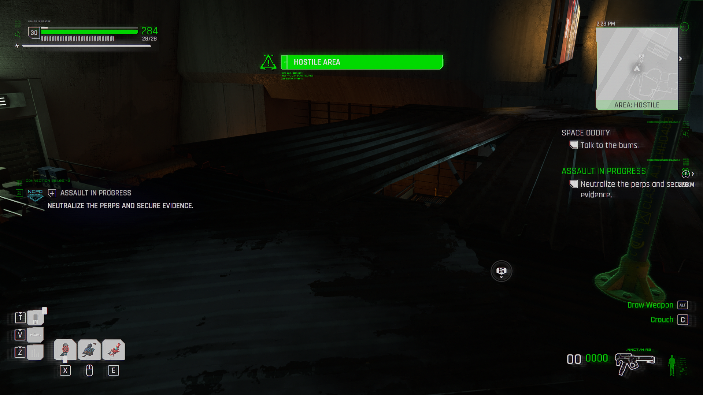<figcaption></figcaption></figure>



<figure>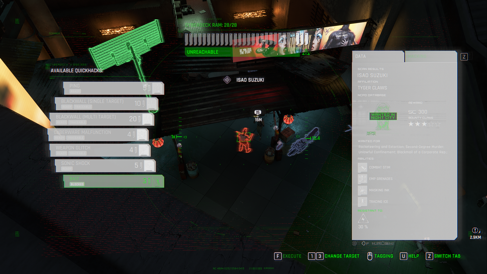<figcaption></figcaption></figure>



<figure>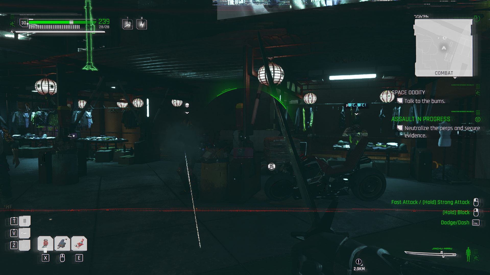<figcaption></figcaption></figure>



<figure>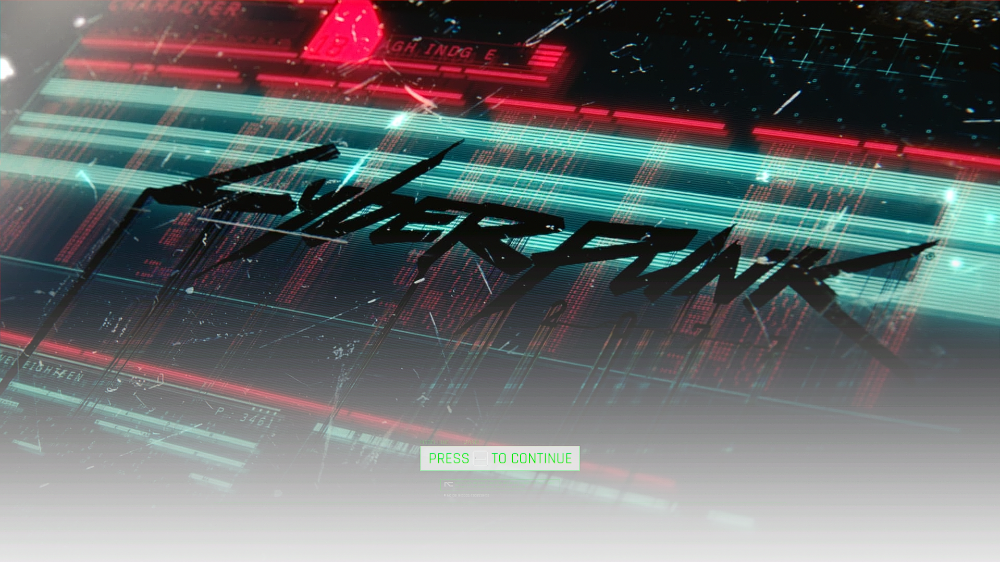<figcaption></figcaption></figure>



<figure>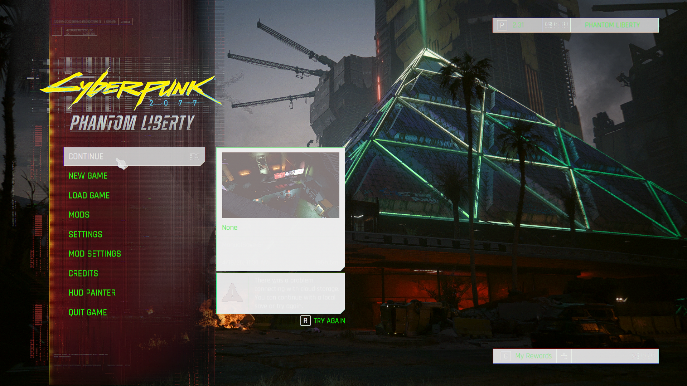<figcaption></figcaption></figure>




<figure>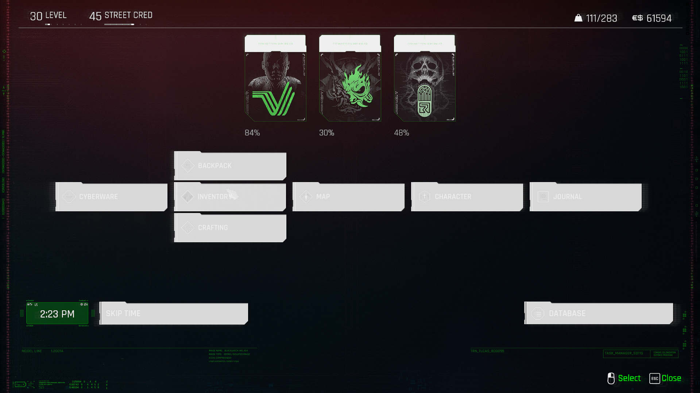<figcaption></figcaption></figure>



<figure>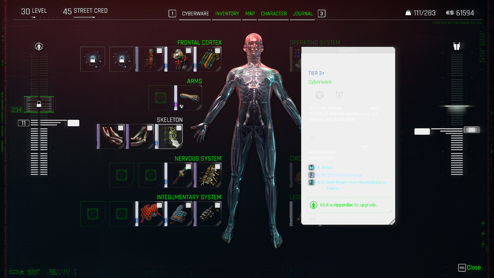<figcaption></figcaption></figure>



<figure>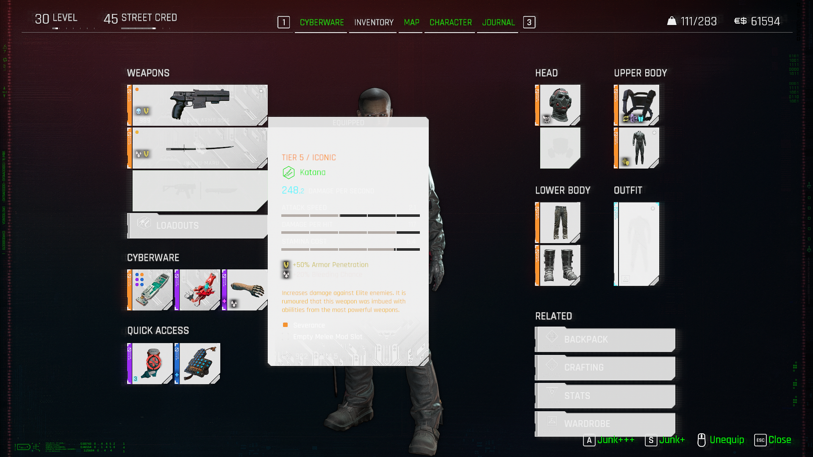<figcaption></figcaption></figure>



<figure>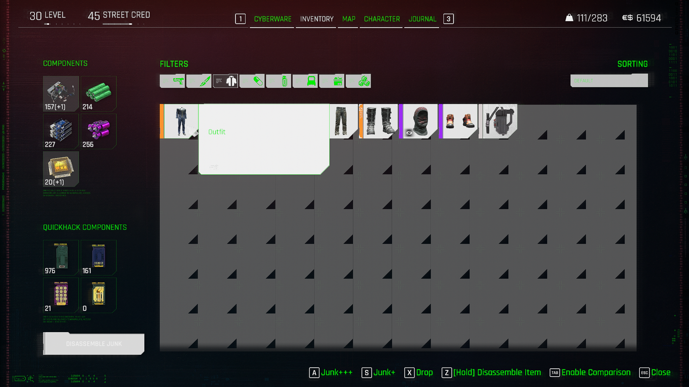<figcaption></figcaption></figure>



<figure>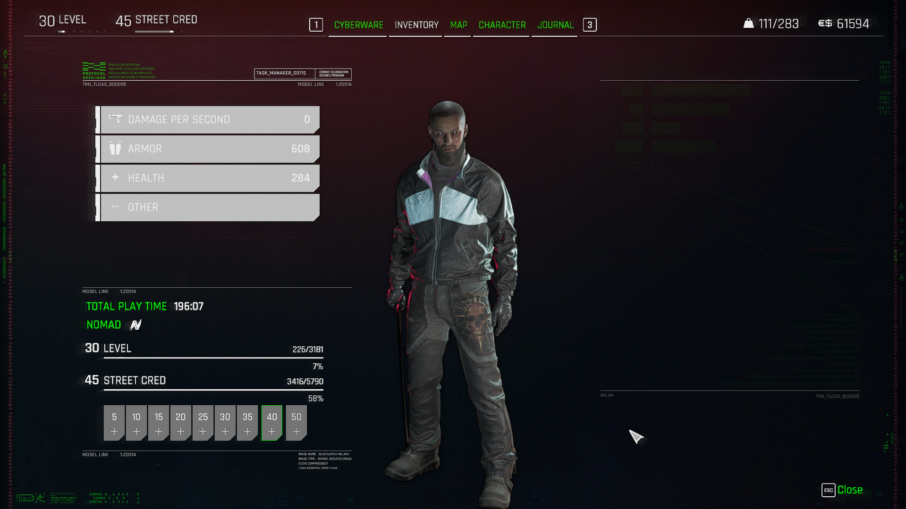<figcaption></figcaption></figure>



<figure>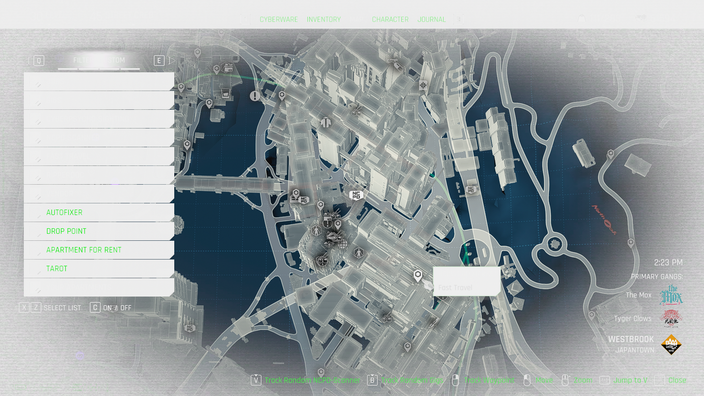<figcaption></figcaption></figure>



<figure>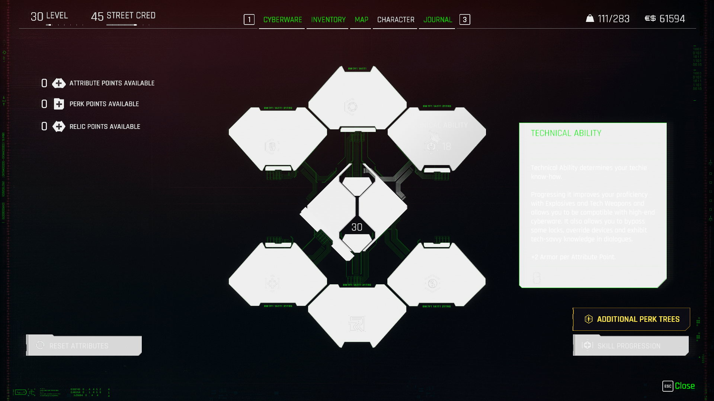<figcaption></figcaption></figure>



<figure>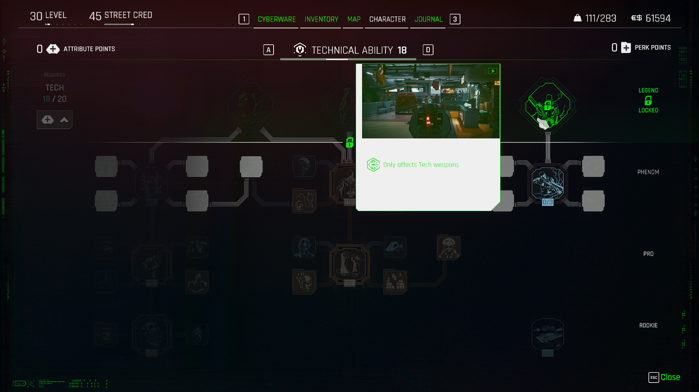<figcaption></figcaption></figure>



<figure>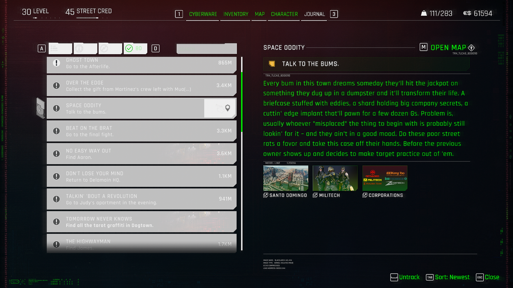<figcaption></figcaption></figure>



<figure>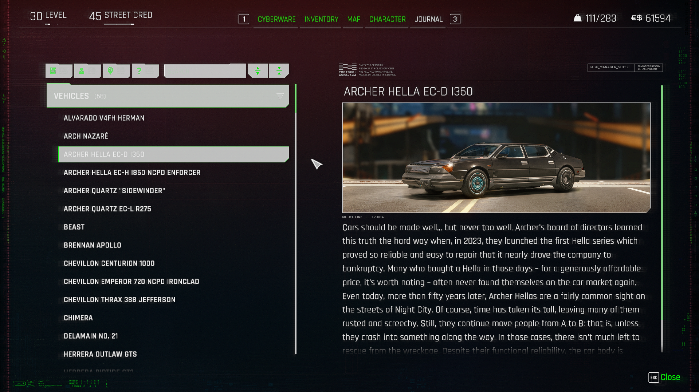<figcaption></figcaption></figure>



<figure>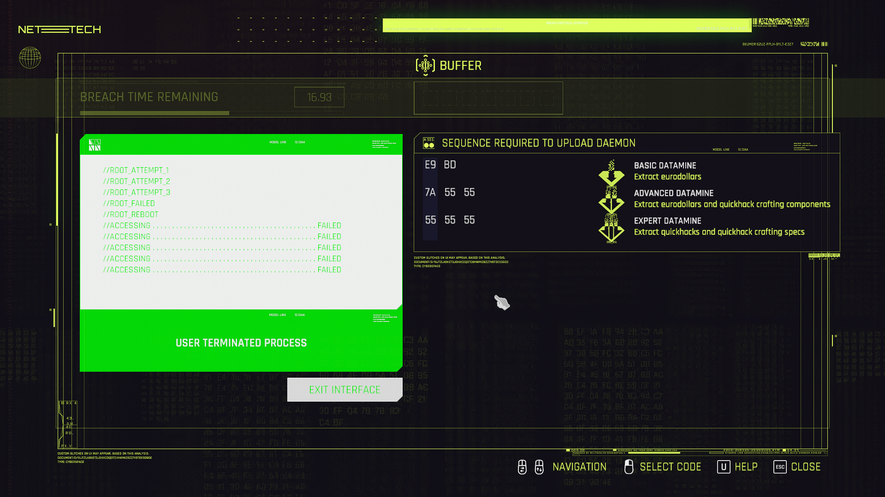<figcaption></figcaption></figure>



### MainColors.PanelRed


**SEARCH TERMS:** **HUD effects, loading bar, title text, loading, weight, eddies, tabs, interaction indicators, progress graphics**




<figure><figcaption></figcaption></figure>



<figure><figcaption></figcaption></figure>



<figure><figcaption></figcaption></figure>



<figure><figcaption></figcaption></figure>



<figure><figcaption></figcaption></figure>



<figure><figcaption></figcaption></figure>



<figure><figcaption></figcaption></figure>



<figure><figcaption></figcaption></figure>



<figure><figcaption></figcaption></figure>



### MainColors.ActiveRed


**SEARCH TERMS:** **HUD weapon, secondary text, progress graphics, separator**




<figure><figcaption></figcaption></figure>



<figure><figcaption></figcaption></figure>



<figure><figcaption></figcaption></figure>



<figure><figcaption></figcaption></figure>



<figure><figcaption></figcaption></figure>




<figure><figcaption></figcaption></figure>




<figure><figcaption></figcaption></figure>



### MainColors.DamageType\_Critical


**SEARCH TERMS:** **critical damage indicator numbers**




<figure><figcaption></figcaption></figure>







### MainColors.MildRed


**SEARCH TERMS: button outline, settings toggle, module accent, border, background effects, perks line connector, subtext**




<figure><figcaption></figcaption></figure>



<figure><figcaption></figcaption></figure>



<figure><figcaption></figcaption></figure>



<figure><figcaption></figcaption></figure>



<figure><figcaption></figcaption></figure>




<figure><figcaption></figcaption></figure>



<figure><figcaption></figcaption></figure>



<figure><figcaption></figcaption></figure>



### MainColors.DarkRed


**SEARCH TERMS: minimap location text, background, scroll bar, divider, quickhack fill, quickhack blocked**




<figure><figcaption></figcaption></figure>



<figure><figcaption></figcaption></figure>




<figure><figcaption></figcaption></figure>




<figure><figcaption></figcaption></figure>




<figure><figcaption></figcaption></figure>



### MainColors.PanelDarkRed


**SEARCH TERMS: scroll bar, hacking minigame, exit interface**




<figure><figcaption></figcaption></figure>



<figure><figcaption></figcaption></figure>




<figure><figcaption></figcaption></figure>



<figure><figcaption></figcaption></figure>



### MainColors.FaintRed


**SEARCH TERMS: settings slider, tooltip module border, quickhack blocked text, quickhack blocked fill background**




<figure><figcaption></figcaption></figure>



<figure><figcaption></figcaption></figure>



<figure><figcaption></figcaption></figure>



<figure><figcaption></figcaption></figure>



<figure><figcaption></figcaption></figure>



<figure><figcaption></figcaption></figure>



### MainColors.CombatRed


**SEARCH TERMS: !, detected, enemy awareness, combat**




<figure><figcaption></figcaption></figure>







### MainColors.Blue


**SEARCH TERMS: ram nodes counter, hotkey icons, ammo counter, subtitle text, subtext, radiant dialogue text, space, breaching, cursor outline, menu toggles, scanner mission icon, scanner mission tracking, armor, map filter icons**




<figure><figcaption></figcaption></figure>



<figure><figcaption></figcaption></figure>



<figure><figcaption></figcaption></figure>



<figure><figcaption></figcaption></figure>




<figure><figcaption></figcaption></figure>



<figure><figcaption></figcaption></figure>



<figure><figcaption></figcaption></figure>




<figure><figcaption></figcaption></figure>



<figure><figcaption></figcaption></figure>



<figure><figcaption></figcaption></figure>



<figure><figcaption></figcaption></figure>



<figure><figcaption></figcaption></figure>



<figure><figcaption></figcaption></figure>



<figure><figcaption></figcaption></figure>



<figure><figcaption></figcaption></figure>



<figure><figcaption></figcaption></figure>



<figure><figcaption></figcaption></figure>



<figure><figcaption></figcaption></figure>



<figure><figcaption></figcaption></figure>



<figure><figcaption></figcaption></figure>



### MainColors.PanelBlue


**SEARCH TERMS: secondary text, secondary icons**




<figure><figcaption></figcaption></figure>



<figure><figcaption></figcaption></figure>




<figure><figcaption></figcaption></figure>



<figure><figcaption></figcaption></figure>



<figure><figcaption></figcaption></figure>




<figure><figcaption></figcaption></figure>



### MainColors.DamageTypeEMP


**SEARCH TERMS: electrical damage indicator numbers**




**W.I.P**&#x20;







### MainColors.ActiveBlue


**SEARCH TERMS: minimap time text, main menu icons, level number, icon outline, cursor outline, scroll bar**




<figure><figcaption></figcaption></figure>



<figure><figcaption></figcaption></figure>



<figure><figcaption></figcaption></figure>



<figure><figcaption></figcaption></figure>



<figure><figcaption></figcaption></figure>



<figure><figcaption></figcaption></figure>



### MainColors.DamageTypeEMP\_Critical


**SEARCH TERMS: critical electrical damage indicator numbers**




**W.I.P**&#x20;







### MainColors.MildBlue


**SEARCH TERMS: Module panel outlines, perk level text**




<figure><figcaption></figcaption></figure>



<figure><figcaption></figcaption></figure>



<figure><figcaption></figcaption></figure>



<figure><figcaption></figcaption></figure>



<figure><figcaption></figcaption></figure>



<figure><figcaption></figcaption></figure>




### MainColors.DarkBlue


**SEARCH TERMS: minimap**




<figure><figcaption></figcaption></figure>



### MainColors.PanelDarkBlue


**SEARCH TERMS:**




**W.I.P**&#x20;







### MainColors.FaintBlue


**SEARCH TERMS: quickhack scanner icons, settings panel fill, tooltip borders and separators, map filter icons, journal tabs fill**




<figure><figcaption></figcaption></figure>



<figure><figcaption></figcaption></figure>



<figure><figcaption></figcaption></figure>




<figure><figcaption></figcaption></figure>



<figure><figcaption></figcaption></figure>



<figure><figcaption></figcaption></figure>



### MainColors.MediumBlue


**SEARCH TERMS: map gangs text**




<figure><figcaption></figcaption></figure>



### MainColors.Yellow


**SEARCH TERMS: stamina bar, traceable text, progress text, cyberware capacity, perk points text, unlocked skills text, journal mission icons**




<figure><figcaption></figcaption></figure>




<figure><figcaption></figcaption></figure>




<figure><figcaption></figcaption></figure>



<figure><figcaption></figcaption></figure>



<figure><figcaption></figcaption></figure>



<figure><figcaption></figcaption></figure>




<figure><figcaption></figcaption></figure>



<figure><figcaption></figcaption></figure>



### MainColors.Gold


**SEARCH TERMS: scan results text, tier 5 iconic icon overlay, perk icons, tracked quest fill**




<figure><figcaption></figcaption></figure>



<figure><figcaption></figcaption></figure>




<figure><figcaption></figcaption></figure>



<figure><figcaption></figcaption></figure>



<figure><figcaption></figcaption></figure>



### MainColors.PanelGold


**SEARCH TERMS: eddies symbol**




<figure><figcaption></figcaption></figure>



### MainColors.Overshield


**SEARCH TERMS: Overshield, hud, health bar**




<figure><figcaption></figcaption></figure>



### MainColors.ActiveYellow


**SEARCH TERMS: mission text, mission icon, launch menu highlight text, cyberware capacity, cyberware upgrade icon arrow, perk icons**




<figure><figcaption></figcaption></figure>



<figure><figcaption></figcaption></figure>



<figure><figcaption></figcaption></figure>



<figure><figcaption></figcaption></figure>



<figure><figcaption></figcaption></figure>



### MainColors.MildYellow


**SEARCH TERMS: map road outlines**




<figure><figcaption></figcaption></figure>



### MainColors.FaintYellow


**SEARCH TERMS: map road fill**




<figure><figcaption></figcaption></figure>



### MainColors.DarkGold


**SEARCH TERMS:**




**W.I.P**&#x20;







### MainColors.PanelDarkGold


**SEARCH TERMS:**




**W.I.P**&#x20;







### MainColors.Green


**SEARCH TERMS: scanner bounty reward text, components quantity text**




<figure><figcaption></figcaption></figure>



<figure><figcaption></figcaption></figure>



### MainColors.PanelGreen


**SEARCH TERMS:**




**W.I.P**&#x20;







### MainColors.DamageTypeChemical


**SEARCH TERMS:**




**W.I.P**&#x20;







### MainColors.MildGreen


**SEARCH TERMS: journal tab icons**




<figure><figcaption></figcaption></figure>



### MainColors.ActiveGreen


**SEARCH TERMS: player map location icon**




<figure><figcaption></figcaption></figure>



<figure><figcaption></figcaption></figure>



### MainColors.DarkGreen


**SEARCH TERMS:**




**W.I.P**&#x20;







### MainColors.PanelDarkGreen


**SEARCH TERMS:**




**W.I.P**&#x20;







### MainColors.Purple


**SEARCH TERMS:**




**W.I.P**&#x20;







### MainColors.LightPurple


**SEARCH TERMS:**




**W.I.P**&#x20;







### MainColors.StreetCred


**SEARCH TERMS: tracked gigs text and icon, street cred level and text**




<figure><figcaption></figcaption></figure>



<figure><figcaption></figcaption></figure>



### MainColors.Black


**SEARCH TERMS: hostile area text, player map location icon outline, enemy awareness exclamation, cyberware number text, armor number text, menu icon module background, map structure building outlines, map filter title background, journal tracked mission distance text, hacking minigame selection overlay, hacking minigame text**




<figure><figcaption></figcaption></figure>



<figure><figcaption></figcaption></figure>



<figure><figcaption></figcaption></figure>



<figure><figcaption></figcaption></figure>



<figure><figcaption></figcaption></figure>



<figure><figcaption></figcaption></figure>



<figure><figcaption></figcaption></figure>



<figure><figcaption></figcaption></figure>



<figure><figcaption></figcaption></figure>



### MainColors.PanelBlack


**SEARCH TERMS: hacking minigame failed**




<figure><figcaption></figcaption></figure>



### MainColors.Grey


**SEARCH TERMS: quickhack scanner subtitle text, launch menu subtext, settings info text, save game info text, cyberware slot lock icon, perk tooltip primary text, journal subtext, database tab numbers text**




<figure><figcaption></figcaption></figure>



<figure><figcaption></figcaption></figure>



<figure><figcaption></figcaption></figure>



<figure><figcaption></figcaption></figure>



<figure><figcaption></figcaption></figure>



<figure><figcaption></figcaption></figure>



<figure><figcaption></figcaption></figure>



<figure><figcaption></figcaption></figure>



### MainColors.DarkGrey


**SEARCH TERMS: locked cyberware icon outline**




<figure><figcaption></figcaption></figure>



### MainColors.White


**SEARCH TERMS: quickhack scanner subtitle text, settings subtitle text, save game information highlight, map buildings, map vendor icons, perk tooltip secondary text, skills primary text, hacking minigame text**




<figure><figcaption></figcaption></figure>



<figure><figcaption></figcaption></figure>



<figure><figcaption></figcaption></figure>




<figure><figcaption></figcaption></figure>



<figure><figcaption></figcaption></figure>



<figure><figcaption></figcaption></figure>



<figure><figcaption></figcaption></figure>



### MainColors.PanelWhite


**SEARCH TERMS:**




**W.I.P**&#x20;







### MainColors.ActiveWhite


**SEARCH TERMS: ripperdoc menu icon, skills progress bar**




<figure><figcaption></figcaption></figure>



<figure><figcaption></figcaption></figure>



### MainColors.Orange


**SEARCH TERMS: map region outline, player apartment icon**




<figure><figcaption></figcaption></figure>



### MainColors.MildOrange


**SEARCH TERMS: quickhack scanner text, tooltip text, crafting info text**




<figure><figcaption></figcaption></figure>



<figure><figcaption></figcaption></figure>



<figure><figcaption></figcaption></figure>



<figure><figcaption></figcaption></figure>



<figure><figcaption></figcaption></figure>



### MainColors.Warning


**SEARCH TERMS:**




**W.I.P**&#x20;







### MainColors.Neutral


**SEARCH TERMS: minimap structures outline, database primary text**




<figure><figcaption></figcaption></figure>



<figure><figcaption></figcaption></figure>



### MainColors.Hacking


**SEARCH TERMS:**




**W.I.P**&#x20;







### MainColors.Cyberspace


**SEARCH TERMS:**




**W.I.P**&#x20;







### MainColors.GettingHacked


**SEARCH TERMS:**




**W.I.P**&#x20;







### MainColors.FastTravel


**SEARCH TERMS: fast travel map text**




<figure><figcaption></figcaption></figure>



### MainColors.StrongFastTravel


**SEARCH TERMS: fast travel map icons, fast travel hud icons**




<figure><figcaption></figcaption></figure>



<figure><figcaption></figcaption></figure>



<figure><figcaption></figcaption></figure>



### MainColors.QuickhackAccent


**SEARCH TERMS:**




**W.I.P**&#x20;







### MainColors.PanelGrey


**SEARCH TERMS:**




**W.I.P**&#x20;







### MainColors.DamageTypePhysical


**SEARCH TERMS: physical damage indicator numbers**




**W.I.P**&#x20;







### MainColors.DamageTypeThermal


**SEARCH TERMS: thermal damage indicator numbers**




**W.I.P**&#x20;







### MainColors.DamageTypePhysical\_Critical


**SEARCH TERMS: critical physical damage indicator numbers**




**W.I.P**&#x20;







### MainColors.DamageTypeChemical\_Critical


**SEARCH TERMS: critical chemical damage indicator numbers**




**W.I.P**&#x20;







### MainColors.DamageTypeThermal\_Critical


**SEARCH TERMS: critical thermal damage indicator numbers**




**W.I.P**&#x20;







### MainColors.TutorialColorIntensity


**SEARCH TERMS:**




**W.I.P**&#x20;







### MainColors.TutorialIntensity


**SEARCH TERMS:**




**W.I.P**&#x20;







### MainColors.TutorialColor


**SEARCH TERMS:**




**W.I.P**&#x20;







### MainColors.NPC\_Chatter


**SEARCH TERMS: hud xp bar, menu xp bar**




<figure><figcaption></figcaption></figure>



<figure><figcaption></figcaption></figure>



### MainColors.EnemyBase


**SEARCH TERMS: enemy indicator**




<figure><figcaption></figcaption></figure>



### MainColors.EnemyMinimapBase


**SEARCH TERMS: enemy minimap indicator**




<figure><figcaption></figcaption></figure>

(its hard to see, lil enemy icon on the minimap)



### MainColors.Fullscreen\_PrimaryForegroundDarker


**SEARCH TERMS: menu background fx effects, perks locked icon**




<figure><figcaption></figcaption></figure>



<figure><figcaption></figcaption></figure>



<figure><figcaption></figcaption></figure>



<figure><figcaption></figcaption></figure>



<figure><figcaption></figcaption></figure>




### MainColors.Fullscreen\_PrimaryBackgroundDark


**SEARCH TERMS: quickhack panels fill, menu background, progress graphics header, map icons text box**




<figure><figcaption></figcaption></figure>



<figure><figcaption></figcaption></figure>



<figure><figcaption></figcaption></figure>



<figure><figcaption></figcaption></figure>



### MainColors.Fullscreen\_PrimaryBackgroundDarkest


**SEARCH TERMS: BACKGROUNDS FILL, hover, icon, fill minimap, menu modules, menu panels, tooltip**




<figure><figcaption></figcaption></figure>



<figure><figcaption></figcaption></figure>



<figure><figcaption></figcaption></figure>



<figure><figcaption></figcaption></figure>



<figure><figcaption></figcaption></figure>



<figure><figcaption></figcaption></figure>



<figure><figcaption></figcaption></figure>



<figure><figcaption></figcaption></figure>



<figure><figcaption></figcaption></figure>



<figure><figcaption></figcaption></figure>



<figure><figcaption></figcaption></figure>



<figure><figcaption></figcaption></figure>



<figure><figcaption></figcaption></figure>



<figure><figcaption></figcaption></figure>



<figure><figcaption></figcaption></figure>



<figure><figcaption></figcaption></figure>



<figure><figcaption></figcaption></figure>



<figure><figcaption></figcaption></figure>



### MainColors.Fullscreen\_SecondaryBackground1


**SEARCH TERMS:**




**W.I.P**







### MainColors.Fullscreen\_SecondaryBackground2


**SEARCH TERMS: quickhack scanner icons, street cred progression icons**




<figure><figcaption></figcaption></figure>



<figure><figcaption></figcaption></figure>



### MainColors.Fullscreen\_SecondaryBackground3


**SEARCH TERMS: perk tree connection lines**




<figure><figcaption></figcaption></figure>



### MainColors.Fullscreen\_SecondaryBackground4


**SEARCH TERMS: menu module borders, outlines**




<figure><figcaption></figcaption></figure>



<figure><figcaption></figcaption></figure>




<figure><figcaption></figcaption></figure>



### MainColors.Fullscreen\_VioletBackground


**SEARCH TERMS: quickhack scanner tabs, character menu central module**




<figure><figcaption></figcaption></figure>



<figure><figcaption></figcaption></figure>



### MainColors.Fullscreen\_RedDarkBackground


**SEARCH TERMS: character menu attribute buttons**




<figure><figcaption></figcaption></figure>



### MainColors.SubtitleSpeaker


**SEARCH TERMS:**




**W.I.P**







### MainColors.NameplateBackground


**SEARCH TERMS:**




**W.I.P**







### MainColors.SupBlue


**SEARCH TERMS: armor level indicator**




<figure><figcaption></figcaption></figure>



### MainColors.SupRed


**SEARCH TERMS: menu text, tooltip text**




<figure><figcaption></figcaption></figure>



<figure><figcaption></figcaption></figure>



<figure><figcaption></figcaption></figure>



### MainColors.RelicColor


**SEARCH TERMS: relic icon, relic text**




<figure><figcaption></figcaption></figure>



### MainColors.RelicDark


**SEARCH TERMS:**




**W.I.P**







