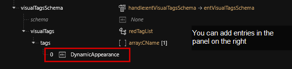
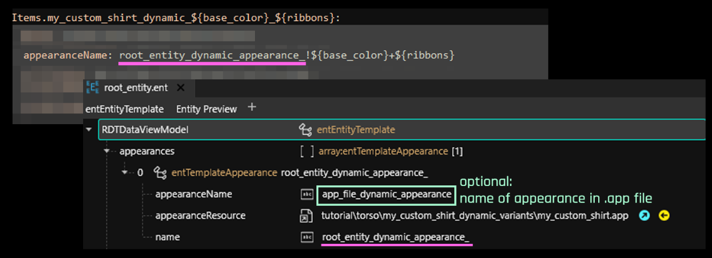
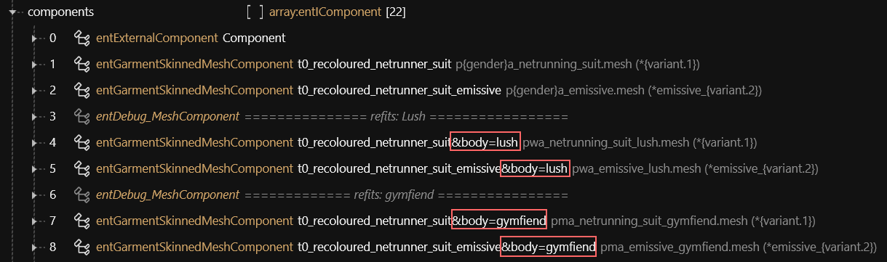
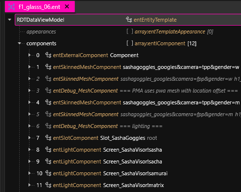

# ItemAdditions: Dynamic Appearances

## Summary <a href="#summary" id="summary"></a>

**Published:** 29 Oct. 2023 by [manavortex](https://app.gitbook.com/u/NfZBoxGegfUqB33J9HXuCs6PVaC3 "mention")\
**Last documented update**: Jul 05 2024 by [manavortex](https://app.gitbook.com/u/NfZBoxGegfUqB33J9HXuCs6PVaC3 "mention")

This guide will cover a sub-case of [..](../ "mention")via ArchiveXL (added in 1.13). Dynamic variants are both **easier** and **more flexible**. Unless you don't need different appearances, you will want to default to this approach.

### Wait, this is not what I want!

* If you are an absolute beginner who has never done this before, check out [..](../ "mention"). The guide will tell you when to switch over.
* You can find the technical documentation for dynamic variants on [ArchiveXL's github](https://github.com/psiberx/cp2077-archive-xl/wiki/Dynamic-Appearances).
* If you want to create an Atelier store, see [adding-items-atelier-integration.md](../adding-items-atelier-integration.md "mention")
* To quickly generate instances with up to two keys, check out [W's generator](https://codepen.io/Wandering-Aldecaldo/full/BaeKRyp) (Codepen.IO)

### Prerequisites

You need **at least** the following tools and versions (get the most recent):

* [WolvenKit](https://github.com/WolvenKit/WolvenKit-nightly-releases/releases) >= 8.11.0 (you should have it [installed and configured](https://app.gitbook.com/s/-MP_ozZVx2gRZUPXkd4r/getting-started/download))
* [TweakXL](https://www.nexusmods.com/cyberpunk2077/mods/4197) >= 1.4.4
* [ArchiveXL](https://www.nexusmods.com/cyberpunk2077/mods/4198) >= 1.5.0
* [Red4ext](https://www.nexusmods.com/cyberpunk2077/mods/2380) >= 1.17.0
* [Cyber Engine Tweaks ](https://www.nexusmods.com/cyberpunk2077/mods/107)(for spawning items)

<details>

<summary>TL;DR</summary>

In your `root_entity`:

1. Add the `DynamicAppearance` tag
2. Delete all but one entry from the appearances array.&#x20;
   1. Name it like your `entityName` in the yaml
   2. Leave the `appearanceName` blank

In your `.app`:

1. Delete all but one entry from the appearances array
2. Name it like your `entityName` in the yaml
3. Delete all components
4. Point it to your `mesh_entity`

In your `mesh_entity`:

1. To enable substitution in mesh depot paths, make sure they start with `*`
2. Put all attributes that ArchiveXL should [switch out](../../../../for-mod-creators/core-mods-explained/archivexl/archivexl-suffixes-and-substitutions.md) in the paths in `{}`

e.g

`meshes/t2_pwa_base_body_jacket.mesh`\
`meshes/t2_pwa_ebbwtfbbq_jacket.mesh`

after:

`*meshes/t2_pwa_{body}_jacket.mesh`

</details>

You define an appearance as dynamic by adding the `DynamicAppearance` tag to the visual tags in its root entity.

If you don't know what that means yet, read on — it will hopefully become clear soon.

## How is this better than the old approach?


TL;DR: It just is, source: **trust me bro**. Proceed to [the next section](./#skipping-and-skimming).


With vanilla item additions, you need **one entry in the root entity per suffix**. This gets out of hand quickly. When making stockings, there are four feet states (`flat`, `flat_shoes`, `lifted` and `high_heels`), and two body genders (`Male` and `Female`) . That leads to 4x2 entries for a single item.

For 15 appearances (colour variants) per mesh, I (manavortex) ended up with

* 120 entries in the root entity (4\*15 per body gender)
* 120 entries in the .app file, (4\*15 per body gender)
* six mesh\_entity files (`flat`, `lifted`, and `heels` for each body gender. I used the same for `flat` and `flat_shoes`, or I'd have ended up with eight.)

The most frustrating part was that everything was just duplication. Each set of entries in the .app file would only differ by name (`_pwa` and `_pma` to select it from the root entity), and the mesh entity path in `partValues`. Everything else was virtually identical, but I had to copy-paste and maintain 120 entries.

I cried to psiberx, who went and made the problem go away.

Dynamic variants put the logic into the `mesh entity` file. Instead of defining appearances with suffixes, I can **conditionally define** which component gets loaded, and ArchiveXL does the rest.

<table><thead><tr><th width="492.3333333333333"></th><th width="107">vanilla</th><th>dynamic</th></tr></thead><tbody><tr><td>number of root_entity entries</td><td>120</td><td>1</td></tr><tr><td>number of .app entries</td><td>120</td><td>1</td></tr><tr><td>number of mesh entity files</td><td>6</td><td>1</td></tr><tr><td>number of components per mesh entity</td><td>2</td><td>5</td></tr></tbody></table>

If you still aren't convinced, go to [..](../ "mention") and start duplicating entries. Everyone else, [to the batmobile](./#skipping-and-skimming)!

## Skipping and skimming

This guide contains the minimal amount of fluff and will **link** background information rather than giving it. Any links will tell you what you're supposed to read.

For that reason, _**you shouldn't skip or skim**_ unless the section tells you that it's optional.

<figure><figcaption></figcaption></figure>

That being said, make sure to check the section

## Step 0: Download the example project

This guide assumes that you have access to the prepared example project, so go and grab it.

1. Create a [Wolvenkit project](https://app.gitbook.com/s/-MP_ozZVx2gRZUPXkd4r/wolvenkit-app/usage/wolvenkit-projects)
2. Find the [**template project**](https://www.nexusmods.com/cyberpunk2077/mods/10516) on **Nexus**.
3. Download it and extract the files to your project's root folder, so that the `source` directory merges with the existing one.

## Step 1: Understanding the process


You will be able to change the template project just by following the steps, but if you want to make your own mods, then you're going to want to understand this.

Depending on how you learn best, you can also fuck around and try to understand the connections yourself. In that case, check [#exercise-1-create-more-records](./#exercise-1-create-more-records "mention") at the end of the section.


### The yaml

For a general explanation of what the yaml file does, check [#the-control-file-yourmodname.yaml](../archive-xl-item-structure-explained.md#the-control-file-yourmodname.yaml "mention"). This section will only cover the differences between a dynamic and a regular yaml.


This file contains the biggest part of the dynamic magic.


This is your dynamic project's yaml file, minus any properties that aren't influenced by the dynamic appearances:

<pre class="language-yaml"><code class="lang-yaml"><strong>Items.my_custom_shirt_dynamic_$(base_color)_$(ribbons):
</strong>  $base: Items.GenericInnerChestClothing
  $instances:
    - { base_color: white, ribbons: red,  icon: 01 }
    - { base_color: black, ribbons: red,  icon: 02 }
    - { base_color: black, ribbons: blue, icon: 03 }
  appearanceName: root_entity_dynamic_appearance_!$(base_color)+$(ribbons)
  displayName: my_custom_shirt_dynamic_i18n_$(base_color)_$(ribbons)
  icon:
    atlasResourcePath: tutorial\torso\my_custom_shirt_dynamic_variants\ops\preview_icons.inkatlas
    atlasPartName: slot_$(icon)
</code></pre>

This section will explain how that works - except for the appearanceName, you will find that in [#the-root\_entity](./#the-root_entity "mention").

#### Record names

TweakXL will generate one record per entry in `$instances`, according to the rules that you're using in the item name. This happens via **property interpolation**.

The example above will generate three item entries by **substituting** `$(property_name)` with the value of the property from the entry. If that isn't clear enough, check the example and the resulting item codes at the end of the line.

```yaml
tems.my_custom_shirt_dynamic_$(base_color)_$(ribbons):
  $instances:
    - { base_color: white, ribbons: red,  icon: 01 } # Items.my_custom_shirt_dynamic_white_red
    - { base_color: black, ribbons: red,  icon: 02 } # Items.my_custom_shirt_dynamic_black_red
    - { base_color: black, ribbons: blue, icon: 03 } # Items.my_custom_shirt_dynamic_black_blue
```

If you [install and launch](https://app.gitbook.com/s/-MP_ozZVx2gRZUPXkd4r/wolvenkit-app/menu/toolbar#install-and-launch) your project, you can immediately spawn them in Cyberpunk via Cyber Engine Tweaks:

```
Game.AddToInventory("Items.my_custom_shirt_dynamic_white_red") 
Game.AddToInventory("Items.my_custom_shirt_dynamic_black_red") 
Game.AddToInventory("Items.my_custom_shirt_dynamic_black_blue") 
```

#### Display names

Like the record names, the `displayName` property is also generated for each entry:

```yaml
  $instances:
    - { base_color: white, ribbons: red,  icon: 01 } # my_custom_shirt_dynamic_i18n_white_red
    - { base_color: black, ribbons: red,  icon: 02 } # my_custom_shirt_dynamic_i18n_black_red
    - { base_color: black, ribbons: blue, icon: 03 } # my_custom_shirt_dynamic_i18n_black_blue
```

All you need to do is to make sure that such an entry exists in your [localization file](../archive-xl-item-structure-explained.md#the-.json-file-custom-texts-i18n).

#### Icons

The icon name in the record is also generated for each entry. They are all using the same [inkatlas](../../../../for-mod-creators-theory/files-and-what-they-do/file-formats/game-icons-the-inkatlas-file.md), but you can generate that as well if you want - I've done it for the [Netrunner suits](https://www.nexusmods.com/cyberpunk2077/mods/9314), since I needed more than 100 icons.

```yaml
  $instances:
    - { base_color: white, ribbons: red,  icon: 01 } # slot_01
    - { base_color: black, ribbons: red,  icon: 02 } # slot_02
    - { base_color: black, ribbons: blue, icon: 03 } # slot_03
```

The only important thing here is that the naming follows your inkatlas file's slot definitions.

If you want to make gendered icons, please check [gendered-preview-icons.md](../../../custom-icons-and-ui/adding-items-preview-images/gendered-preview-icons.md "mention") -> [#does-this-work-with-dynamic-variants](../../../custom-icons-and-ui/adding-items-preview-images/gendered-preview-icons.md#does-this-work-with-dynamic-variants "mention")

#### Exercise 1: Create more records

With clever hook-ups in the mesh entity, you can set up your items so that they can be changed **with a simple `.yaml` edit** — that means, the user can switch out the ribbon colour without ever starting Wolvenkit!

We'll use that here to enable "hidden" appearances.

I have hooked up the example project to support two base colours:

* black
* white

and three ribbon colors:

* red
* blue
* green

By editing the `$instances` block in the `.yaml`, you should be able to spawn 6 different shirt in the game without touching any of the additional files!

### The root\_entity

For a general explanation of the root entity, check [#root\_entity.ent](../archive-xl-item-structure-explained.md#root_entity.ent "mention"). This section will only cover the differences between a dynamic and a regular root entity.


This is where you **enable** the feature by adding the tag **`DynamicAppearance`** to the `visualTagsSchema` (the last entry in the file):


<figure><figcaption><p>It's <strong><code>DynamicAppearance</code>, without S.</strong></p></figcaption></figure>


For dynamic appearances, your `root_entity` file will contain **one entry**. Each item should have [its own root entity](../../../../for-mod-creators/files-and-what-they-do/entity-.ent-files#root-entity).


The appearance name in the root entity corresponds to the `appearanceName` property in the `.yaml` without the variant:

<figure><figcaption></figcaption></figure>

You can leave the `appearanceName` blank. In that case, ArchiveXL will look for an appearance with the same name as the `name` attribute.

Since the appearance in the .app is called `app_file_dynamic_appearance` for clarity, and there is no `root_entity_dynamic_appearance_` in the .app, this will not work for the example project.

### The .app

For a general explanation of the .app file, check [#appearance.app](../archive-xl-item-structure-explained.md#appearance.app "mention"). This section will only cover the differences between a dynamic and a regular .app file.


For dynamic variants, components in the .app file will be **ignored**. You **have** to use a mesh entity.


#### .app file: Conditional switching

You can define appearances for different circumstances by changing the appearance names. This will let you influence the mesh entity even further by e.g. hiding parts of the mesh via [#chunkmask](../../../../for-mod-creators-theory/files-and-what-they-do/components/#chunkmask "mention"). And the best part is: you don't even need to touch your root entity.

In the context of our example project, this means that you can define your **appearances** like this:

<table><thead><tr><th width="450">Appearance name</th><th>Explanation</th></tr></thead><tbody><tr><td><code>app_file_dynamic_appearance</code></td><td>Your regular appearance. Is displayed when none of the conditional ones apply.</td></tr><tr><td><code>app_file_dynamic_appearance&#x26;camera=tpp</code></td><td>This is only active in third person perspective. The item will be completely invisible in first person.</td></tr><tr><td><code>app_file_dynamic_appearance&#x26;camera=fpp</code></td><td>This becomes active whenever you are in first person perspective. You'll usually want this to<a href="../../first-person-perspective-fixes.md#problem-2-its-in-your-face-juststormtrooperthings"> remove the mesh from your face</a> via <a href="../../../../for-mod-creators/files-and-what-they-do/appearance-.app-files#partsoverrides">partsOverrides</a>.</td></tr><tr><td><code>app_file_dynamic_appearance&#x26;gender=male</code></td><td>You shouldn't do this — instead, use <a data-mention href="./#substitutions">#substitutions</a> in the mesh file path.</td></tr></tbody></table>

### The mesh\_entity

For a general explanation of the mesh entity, check [#mesh\_entity.ent](../archive-xl-item-structure-explained.md#mesh_entity.ent "mention"). This section will only cover the differences between a dynamic and a regular mesh entity.


Unless you are using [#app-file-conditional-switching](./#app-file-conditional-switching "mention"), this is where the magic happens.


Like appearance definition names, components in the mesh entity support  [#ent-file-conditional-switching](./#ent-file-conditional-switching "mention"). On top of that, they also support [#substitutions](./#substitutions "mention").

Check [#the-diagram](./#the-diagram "mention")'s bottom left corner for a demonstration of both, or read up the [ArchiveXL documentation](../../../../for-mod-creators-theory/core-mods-explained/archivexl/#dynamic-appearances) on how they work.

#### Substitutions

In your mesh entity, you can use **substitutions** in path names to load different meshes. This is better than [#ent-file-conditional-switching](./#ent-file-conditional-switching "mention") because it won't create extra components.

To enable substitution, your depot path must begin with an asterisk `*`. Each substitution needs to be enclosed in braces, e.g. `{gender}`.

For a list, check [#which-substitutions-exist](../../../../for-mod-creators/core-mods-explained/archivexl/archivexl-suffixes-and-substitutions.md#which-substitutions-exist "mention")

<figure><figcaption></figcaption></figure>


[File validation](https://app.gitbook.com/s/-MP_ozZVx2gRZUPXkd4r/wolvenkit-app/file-validation) can help you spot errors in your paths.


#### .ent file: conditional switching


ArchiveXL will create **all** components, hiding those that aren't matched by your current conditions. If possible, use [#substitutions](./#substitutions "mention") instead.


Just like in the .app file, you can apply conditional switching to component names. It works exactly like [#app-file-conditional-switching](./#app-file-conditional-switching "mention"):

<figure><figcaption></figcaption></figure>

Components can also be selected by variant, this currently cannot be broken down by variant parts (eg variant.1, variant.2 etc) but it uses the full variant after the ! in the yaml.

```yaml
$instances:
    - { base_color: white, ribbons: red  }
    - { base_color: black, ribbons: red  }
    - { base_color: black, ribbons: blue }
appearanceName: root_entity_dynamic_appearance_!$(base_color)+$(ribbons)
```

In this above example you can create filtered components by instance as follows. The one without the ! will be used by default if the variant is not in the list (eg black\_pink).

```
entSkinnedMeshComponent: MyJacketDecals!white_red
entSkinnedMeshComponent: MyJacketDecals!black_red
entSkinnedMeshComponent: MyJacketDecals!black_blue
entSkinnedMeshComponent: MyJacketDecals
```

This is what your compontent can look like; in this example a different light is used based on the variant.

<figure><figcaption></figcaption></figure>

## The diagram

Now let's look at what we just did and check the diagram. You'll see that the control files are almost identical to the[ vanilla variants](../archive-xl-item-structure-explained.md#the-final-result), but that the rest of the files has gotten a lot more manageable:

<figure><figcaption></figcaption></figure>

And that's it! With this and the [original guide](../../../../for-mod-creators-theory/core-mods-explained/archivexl/), you should hopefully be able to add items to your heart's content!

## Tools and utilities

### Generating display names

I have written a [Python script](https://github.com/manavortex/cyberpunk2077/blob/master/python/archive_xl_dynamic_variants/generate_translation_strings.py) to auto-generate display names, you can find it on my github. If you don't know how to use this, check [running-python-scripts.md](../../../../for-mod-creators/modding-guides/everything-else/running-python-scripts.md "mention").

## Troubleshooting

Please see the original guide's [#troubleshooting](../#troubleshooting "mention")section.
