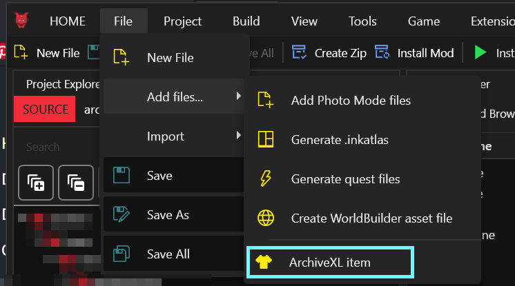
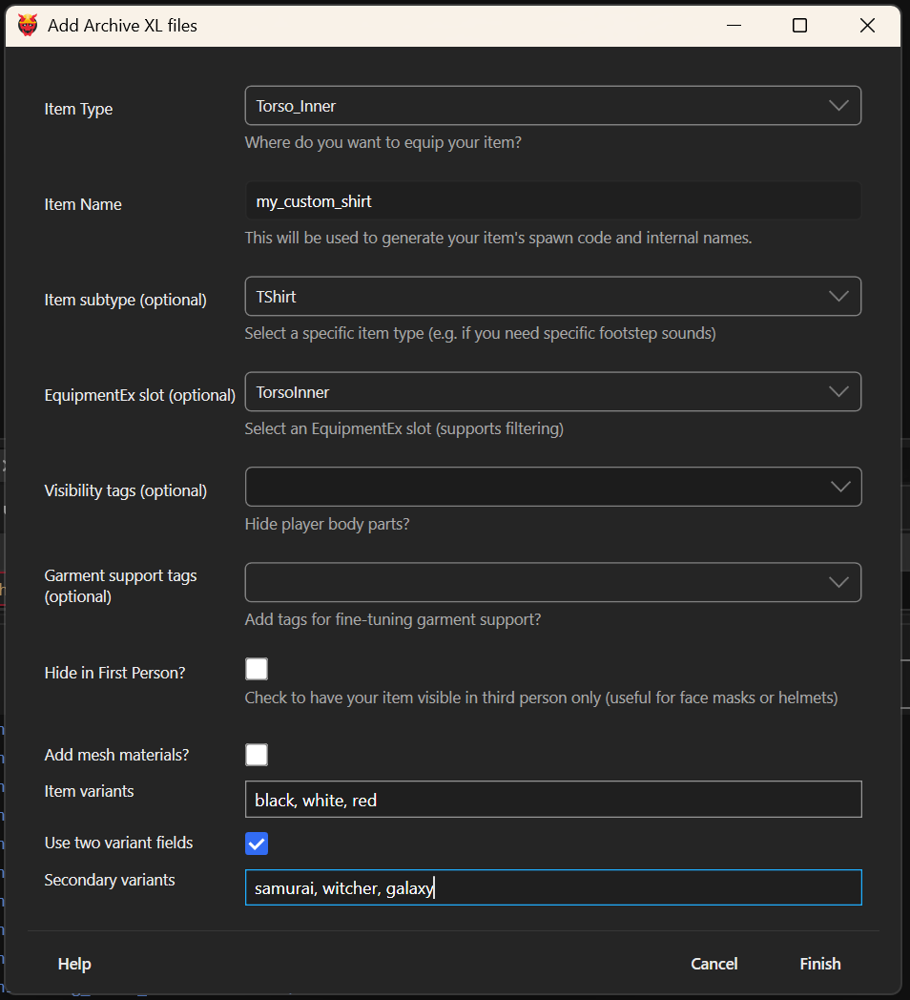
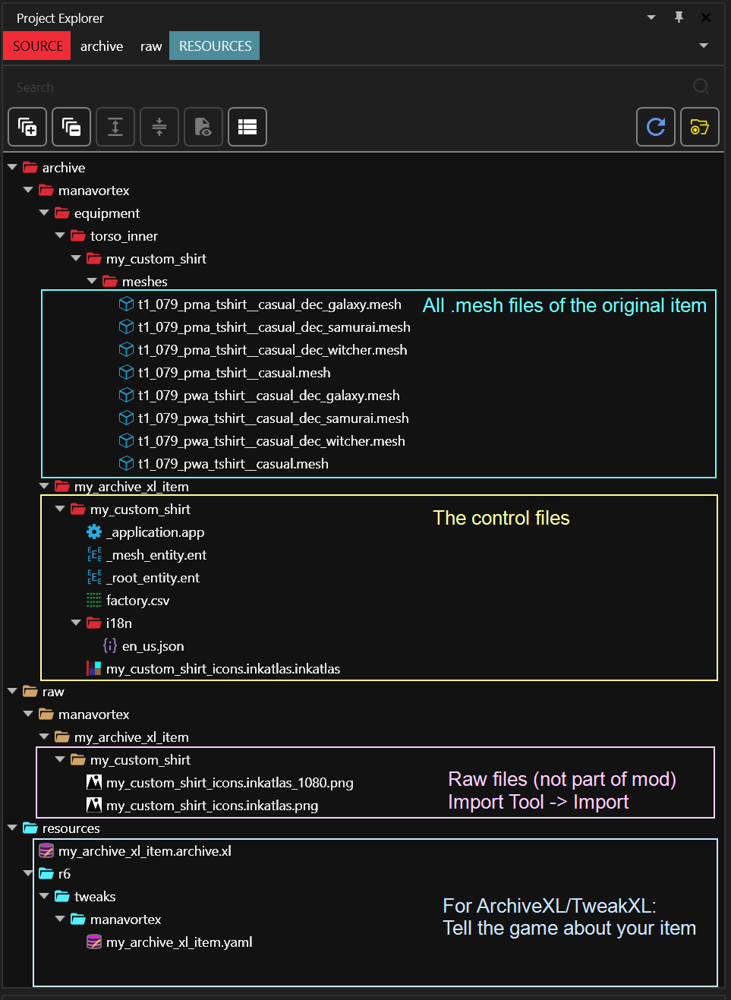
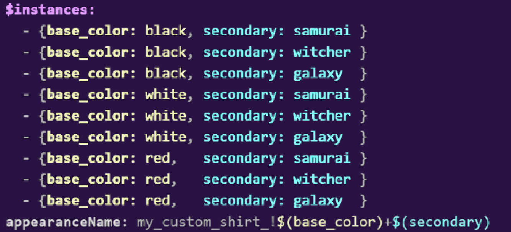
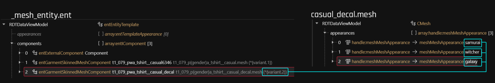
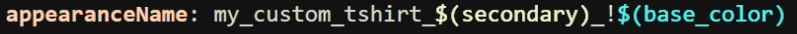
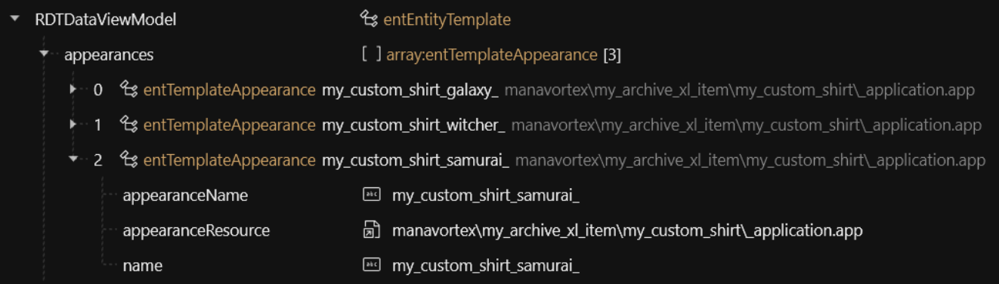
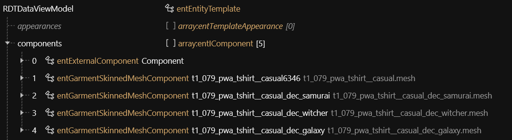
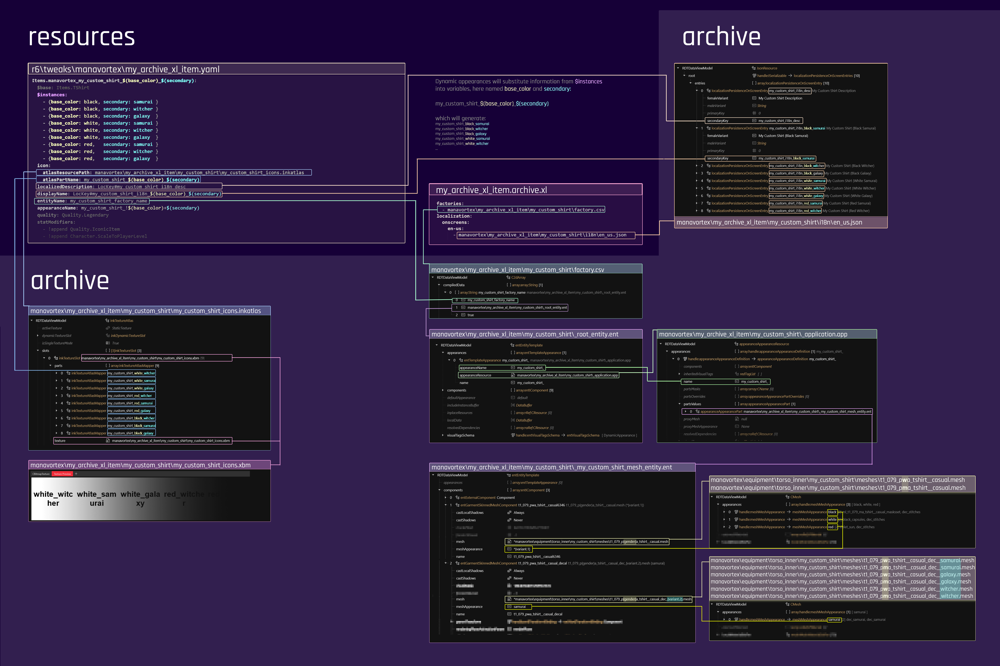

# ItemAdditions: Dynamic Appearances

## Summary 

**Published:** 29 Oct. 2023 by [mana vortex](https://app.gitbook.com/u/NfZBoxGegfUqB33J9HXuCs6PVaC3 "mention")\
**Last documented update**: Jul 05 2024 by [mana vortex](https://app.gitbook.com/u/NfZBoxGegfUqB33J9HXuCs6PVaC3 "mention")

This guide will cover a sub-case of [..](../ "mention")via ArchiveXL (added in 1.13). Dynamic variants are both **easier** and **more flexible**. Unless you don't need different appearances, you will want to default to this approach.

TL;DR

In your `root_entity`:

1. Add the `DynamicAppearance` tag
2. Delete all but one entry from the appearances array.&#x20;
   1. Name it like your `entityName` in the yaml
   2. Leave the `appearanceName` blank

In your `.app`:

1. Delete all but one entry from the appearances array
2. Name it like your `entityName` in the yaml
3. Delete all components
4. Point it to your `mesh_entity`

In your `mesh_entity`:

1. To enable substitution in mesh depot paths, make sure they start with `*`
2. Put all attributes that ArchiveXL should [switch out](../../../../for-mod-creators/core-mods-explained/archivexl/archivexl-suffixes-and-substitutions.md) in the paths in `{}`

e.g

`meshes/t2_pwa_base_body_jacket.mesh`\
`meshes/t2_pwa_ebbwtfbbq_jacket.mesh`

after:

`*meshes/t2_pwa_{body}_jacket.mesh`

### Wait, this is not what I want!

* If you want to understand how things work, check out the links during the rest of the guide.
* You can find the technical documentation for dynamic variants on [ArchiveXL's github](https://github.com/psiberx/cp2077-archive-xl/wiki/Dynamic-Appearances).
* If you want to create an Atelier store, see [adding-items-atelier-integration.md](../adding-items-atelier-integration.md "mention")
* To quickly generate instances with up to two keys, check out [W's generator](https://codepen.io/Wandering-Aldecaldo/full/BaeKRyp) (Codepen.IO)

### Prerequisites

You need **at least** the following tools and versions (get the most recent):

* [WolvenKit](https://github.com/WolvenKit/WolvenKit-nightly-releases/releases) >= 8.11.0 (you should have it [installed and configured](https://app.gitbook.com/s/-MP_ozZVx2gRZUPXkd4r/getting-started/download))
* [TweakXL](https://www.nexusmods.com/cyberpunk2077/mods/4197) >= 1.4.4
* [ArchiveXL](https://www.nexusmods.com/cyberpunk2077/mods/4198) >= 1.5.0
* [Red4ext](https://www.nexusmods.com/cyberpunk2077/mods/2380) >= 1.17.0
* [Cyber Engine Tweaks ](https://www.nexusmods.com/cyberpunk2077/mods/107)(for spawning items)

You define an appearance as dynamic by adding the `DynamicAppearance` tag to the visual tags in its root entity.

If you don't know what that means yet, read on — it will hopefully become clear soon.

## How is this better than the old approach?


TL;DR: It just is, source: **trust me bro**. Proceed to [the next section](./#skipping-and-skimming).


Why dynamic appearances are superior

With vanilla item additions, you need **one entry in the root entity per suffix**. This gets out of hand quickly. When making stockings, there are four feet states (`flat`, `flat_shoes`, `lifted` and `high_heels`), and two body genders (`Male` and `Female`) . That leads to 4x2 entries for a single item.

For 15 appearances (colour variants) per mesh, I (manavortex) ended up with

* 120 entries in the root entity (4\*15 per body gender)
* 120 entries in the .app file, (4\*15 per body gender)
* six mesh\_entity files (`flat`, `lifted`, and `heels` for each body gender. I used the same for `flat` and `flat_shoes`, or I'd have ended up with eight.)

The most frustrating part was that everything was just duplication. Each set of entries in the .app file would only differ by name (`_pwa` and `_pma` to select it from the root entity), and the mesh entity path in `partValues`. Everything else was virtually identical, but I had to copy-paste and maintain 120 entries.

I cried to psiberx, who went and made the problem go away.

Dynamic variants put the logic into the `mesh entity` file. Instead of defining appearances with suffixes, I can **conditionally define** which component gets loaded, and ArchiveXL does the rest.

<table><thead><tr><th width="492.3333333333333"></th><th width="107">vanilla</th><th>dynamic</th></tr></thead><tbody><tr><td>number of root_entity entries</td><td>120</td><td>1</td></tr><tr><td>number of .app entries</td><td>120</td><td>1</td></tr><tr><td>number of mesh entity files</td><td>6</td><td>1</td></tr><tr><td>number of components per mesh entity</td><td>2</td><td>5</td></tr></tbody></table>

If you still aren't convinced, go to [..](../ "mention") and start duplicating entries. Everyone else, [to the batmobile](./#skipping-and-skimming)!

## Skipping and skimming

This guide contains the minimal amount of fluff and will **link** background information rather than giving it. Any links will tell you what you're supposed to read.

For that reason, _**you shouldn't skip or skim**_ unless the section tells you that it's optional.

<figure><figcaption></figcaption></figure>

That being said, make sure to check the [#troubleshooting](./#troubleshooting "mention") section if you run into issues, and to run File Validation ->[File Validation #On the entire project](https://app.gitbook.com/s/-MP_ozZVx2gRZUPXkd4r/wolvenkit-app/file-validation#on-the-entire-project "mention")to check for common mistake.

## Step 0: Run the generator

Archived lore: the example project

This guide assumes that you have access to the prepared example project, so go and grab it.

1. Create a [Wolvenkit project](https://app.gitbook.com/s/-MP_ozZVx2gRZUPXkd4r/wolvenkit-app/usage/wolvenkit-projects)
2. Find the [**template project**](https://www.nexusmods.com/cyberpunk2077/mods/10516) on **Nexus**.
3. Download it and extract the files to your project's root folder, so that the `source` directory merges with the existing one.

1. If you haven't, go and create a [Wolvenkit Project](https://app.gitbook.com/s/-MP_ozZVx2gRZUPXkd4r/wolvenkit-app/usage/wolvenkit-projects#create-a-new-wolvenkit-mod-project). I'll name mine `my_archive_xl_item`,&#x20;
2. In the `File` -> `Add files`... menu, select `ArchiveXL item`

<figure><figcaption></figcaption></figure>

3. Fill out the wizard with your item's information. For the example project, I'll create a t-shirt:

<figure><figcaption></figcaption></figure>

The fields, Mason! What do they mean?

#### Item Type

This determines the equipment type of your item, which slot you equip it in. It also determines the base game item for the generator.

#### Item Name

Your item's unique name. This will be used to generate spawn codes and translation entries (you can change them later).

#### Item Subtype

Allows fine-tuning of the Item Type (e.g. instead of a generic head item, you can pick a mask)

#### EquipmentEx slot

EquipmentEx decides what slot to equip your item in based on its type and subtype, but you can override this - for example, a tight netrunner suit can be worn on the innermost layer. This also influences item layering via [Garment Support](../../../../for-mod-creators-theory/3d-modelling/garment-support-how-does-it-work/) (which item is worn above/below)

#### Visibility Tags

Hides parts of the player body. For a list of what the tags do, see [archivexl-tags.md](../../../../for-mod-creators/core-mods-explained/archivexl/archivexl-tags.md "mention") -> [#archivexl-tags](../../../../for-mod-creators/core-mods-explained/archivexl/archivexl-tags.md#archivexl-tags "mention")

#### Garment support tags

In theory, this allows fine-tuning of garment support (e.g. by defining a coat as XLarge). In praxis, you're better-off relying on EquipmentEx for this.

#### Hide in First Person

Should the item be hidden in first person? (This hides the entire item, not just parts of it - use this for e.g. face masks or glasses. You can check [#app-file-conditional-switching](dynamic-appearances-understanding-the-process.md#app-file-conditional-switching "mention") or [dynamic-appearances-fine-tuning-visibility-conditions.md](dynamic-appearances-fine-tuning-visibility-conditions.md "mention") for more.)

#### Add mesh materials

This will add all of the template item's materials to your mod and custompath them. Takes at least a few extra seconds. Instead of doing this, you can also open the `.mesh` files and select Materials -> Add dependencies.

#### Item variants

This field lets you define colour variants for your item. You can easily set this up via dynamic appearances later, so go nuts, you crazy diamond.

#### Use two variant fields

Use this if your item has more than one variant (for example, a t-shirt colour and a decal)

#### Secondary variants

Here you can enter values for your secondary variant. In the example, I'll be using the decal options - `galaxy`, `witcher`, and `samurai`.

### 0.1: Import the icons

Import the auto-generated .png icon files ([Import Tool](https://app.gitbook.com/s/-MP_ozZVx2gRZUPXkd4r/wolvenkit-app/usage/import-export#importing) -> Import All). They are just dummy icons, but they will help telling apart your shirts while you work on them.&#x20;


You can now delete the .png files.


Check [adding-items-preview-images](../../../custom-icons-and-ui/adding-items-preview-images/ "mention") for a guide on how to create the final thing. Most people do this at the end of their project, so you don't have to do it now.

### Generated files


**Optional, but recommended:** Read[dynamic-appearances-understanding-the-process.md](dynamic-appearances-understanding-the-process.md "mention")to figure out **what** your new files do and **how** they do it


Depending on the options you picked, your project will now look similar to this:

<figure><figcaption></figcaption></figure>

## Step 1: Connecting the decal (and understanding variants)


Before starting this section, create a copy of your `mesh_entity.ent`  now (press the ctrl-key and drag it on itself), as you need the original file for one of the alternative approaches.


This section will teach you how to make use of the variant to switch out item parts via `.yaml`. As a reminder, this is our yaml:

<figure><figcaption></figcaption></figure>

`DynamicAppearances` makes everything after the `!` available in the mesh entity under the key `variant`. By adding +, you can split the variant into parts. Expand the box below to see more examples, because this is where the magic lives.

Examples

<table><thead><tr><th width="239.7999267578125">raw variant</th><th width="179.199951171875">variant</th><th>variant.1</th><th>variant.2</th></tr></thead><tbody><tr><td><code>$(base_color)+$(secondary)</code></td><td><code>black+samurai</code></td><td>black</td><td>samurai</td></tr><tr><td><code>$(base_color)$(secondary)</code></td><td><code>blacksamurai</code></td><td><code>blacksamurai</code></td><td>-</td></tr><tr><td><code>$(base_color)+$(foo)</code></td><td><code>black+</code></td><td>black</td><td>-</td></tr></tbody></table>

By default, our `_mesh.ent`  looks like this (because the generator re-uses CDPR's file structure)

<figure><figcaption></figcaption></figure>

As you can see, the paths are already dynamic - the `m` or `w` has been replaced with `{gender}`. This makes sure that our mod will display the right file based on your V's body gender.&#x20;


This is incredibly powerful — for example, by using `{body}`, you make ArchiveXL pick the correct refit per body mod. \
[archivexl-suffixes-and-substitutions.md](../../../../for-mod-creators/core-mods-explained/archivexl/archivexl-suffixes-and-substitutions.md "mention") contains a full list of suffixes and substitutions, but do finish this guide and its exercises before playing around even further!


Now, let's get that decal connected.

1. Select the first deactivated component, and turn it on by checking a few of the boxes (e.g. the first 3).
2. Select the second and third deactivated component, and delete them.
3. Based on the value of `secondary` (see the expandable above), we have the following values for variant.2:
   * `galaxy`
   * `samurai`
   * `witcher`
4. In the mesh depot path, replace `samurai.mesh` with `{variant.2}.mesh`
5. Change the `meshAppearance` to `samurai` (since the generator set that up for us)&#x20;

Thanks to ArchiveXL's substitution, we only need one component to pick our choice from three `.mesh` files — based on the value for `secondary` in the `yaml`.


This approach is not recommended for anything user-editable. For details, see [#exercise-1-other-options](./#exercise-1-other-options "mention")


## Exercise 1: Other options

Dynamic mesh picking based on yaml params saves a lot of duplication, typos can lead to crashes — if you enter `semurai` instead of `samurai`, the game will try to find (for female V)\
`manavortex\equipment\torso_inner\my_custom_shirt\meshes\t1_079_pwa_tshirt__casual_dec_semurai.mesh`\
and then crash because it doesn't exist.&#x20;

This is generally bad, so which options do we have to prevent it?


The boxes below contain **suggestions** and detail **different ways** to tackle the same problem with ArchiveXL. You can combine them or completely ignore them, as you want.&#x20;


mesh_entity: One decal mesh, multiple appearances

This requires the least amount of changes in our project: you put all the appearances into the same .mesh file, and only switch the loaded texture via `meshAppearance`.

Unfortunately, CDPR used three different meshes, so you'd have to create the full decal on your own (check out the [adding-decals.md](../../editing-existing-items/adding-decals.md "mention")guide)

The result would look like this:

<figure><figcaption></figcaption></figure>

_app: Three decals, one appearance, partsOverrides

By slightly changing our `.yaml`, we create different appearances in the root.ent and the .app file:

<figure><figcaption></figcaption></figure>

&#x20;This will create the following appearance names:

`my_custom_shirt_galaxy_!$(base_color)`\
`my_custom_shirt_witcher_!$(base_color)`\
`my_custom_shirt_samurai_!$(base_color)`

The `!$(base_color)` will still arrive in our mesh\_entity.ent as `{variant}`, but we no longer have a second field (no `+`).

We need to register our appearances in the `root.ent` :

<figure><figcaption>
Instead of a single appearance, we now have three. Still better than 9 (per colour) or 18 (per colour+body gender)!
</figcaption></figure>

This is what we kept the original mesh entity for, as we will use this in the .app file in the next step. Open it, and turn all disabled components visible:

<figure><figcaption></figcaption></figure>

If you were to spawn this t-shirt now, it would have all three decals. We don't want this. Luckily, we can use [`partsOverrides`](../../influencing-other-items.md#partsoverrides-changing-other-meshes) to hide things from the `.app` (but not show them, that's why we turned them all visible).

In the .app file,&#x20;

1. Change the path under `partsValues` to `mesh_entity_copy.ent`
2. Duplicate the entire appearance two more times
3. Change the names to the same ones you used in the `root_entity.ent`

Now, create a `partsOverrides`, and then two `componentOverrides` inside. For every `componentOverride`, set the following values:

1. `chunkMask` to `0` (this will completely hide the component)
2. `meshAppearance` to an empty string (displays as `None`, this will make AXL ignore it)
3. `componentName` to the name of a component that you want to hide (you can copy them from the `mesh_entity_copy.ent`)

<figure><figcaption></figcaption></figure>

For every appearance, hide the **other two decals**.

### An example of a real mod

I use both of these techniques in my [University Outfit](https://www.nexusmods.com/cyberpunk2077/mods/25257) mod. Every mesh file contains several states of the same item, and I use `partsOverrides` to switch between them based on the yaml configuration.

For details, expand the box.

How University Outfit uses dynamic variants

#### Polo: Collar states

The mod supports two collar states on the polo - `open` and `closed`.

| mesh   | submeshes for "closed" | submeshes for "open" |
| ------ | ---------------------- | -------------------- |
| torso  | 0,1,2                  | 3,4,5                |
| collar | 0,1                    | 2,3                  |
| tie    | 0,1                    | 2,3                  |

#### Polo: Sleeve lengths

You can pick three sleeve lengths for the polo: `short`, `long`, and `gloved`. The mesh chunks are set up as follows:

* short: 0
* long: 1, 2
* gloved: 1, 3

(Yes, `long` and `gloved` share the same mesh for the part from shoulder to elbow, only the part below that is different).

So I ended up with six appearances in the `_root.ent` and `.app`:&#x20;

`university_polo_short_sleeves_open_collar_`\
`university_polo_long_sleeves_open_collar_`\
`university_polo_gloved_sleeves_open_collar_`\
`university_polo_short_sleeves_closed_collar_`\
`university_polo_long_sleeves_closed_collar_`\
`university_polo_gloved_sleeves_closed_collar_`

#### Sweatshirt: polo collar

On top of that, I am using [ArchiveXL custom tags](../../influencing-other-items.md#custom-tags-un-hiding-chunks) to display yet another collar when the sweatshirt is worn on top of it. For this, I'm also using the "open collar" tie, so I had to make sure that it fits both... I spent a lot of time re-fitting on this mod.

## The diagram

Now let's look at what we just did and check the diagram. You'll see that the control files are almost identical to the[ vanilla variants](../archive-xl-item-structure-explained.md#the-final-result), but that the rest of the files has gotten a lot more manageable:

<figure><figcaption></figcaption></figure>

And that's it! With this and the [original guide](../../../../for-mod-creators-theory/core-mods-explained/archivexl/), you should hopefully be able to add items to your heart's content!

## Tools and utilities

### Generating display names

I have written a [Python script](https://github.com/manavortex/cyberpunk2077/blob/master/python/archive_xl_dynamic_variants/generate_translation_strings.py) to auto-generate display names, you can find it on my github. If you don't know how to use this, check [running-python-scripts.md](../../../../for-mod-creators/modding-guides/everything-else/running-python-scripts.md "mention").

### Creating preview icons

This problem is so common that it has its own wiki page: [adding-items-preview-images](../../../custom-icons-and-ui/adding-items-preview-images/ "mention")

## Troubleshooting

Please see the original guide's [#troubleshooting](../#troubleshooting "mention")section.
