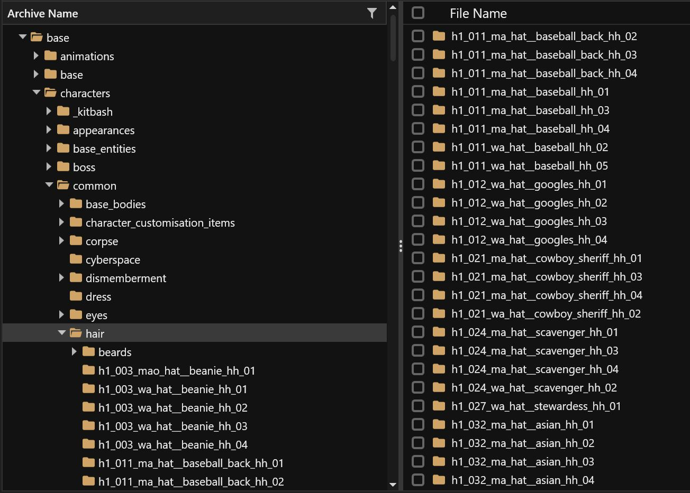
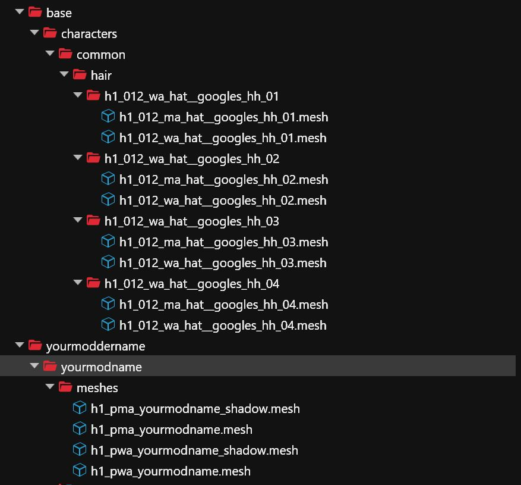
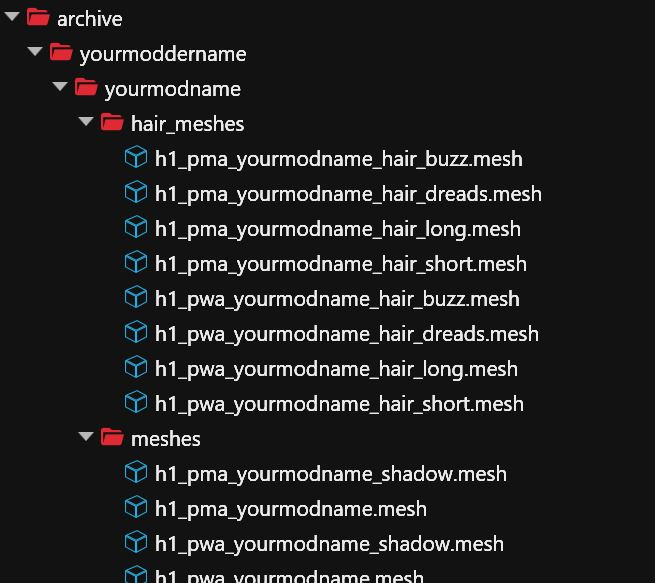
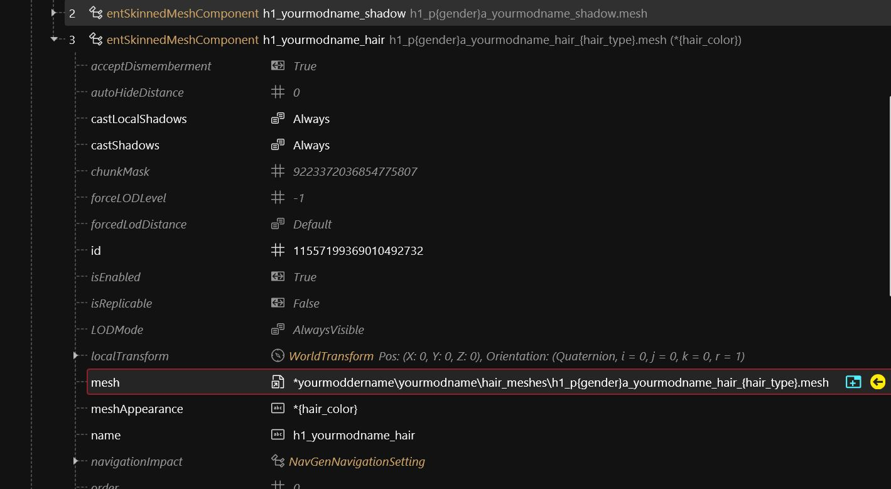
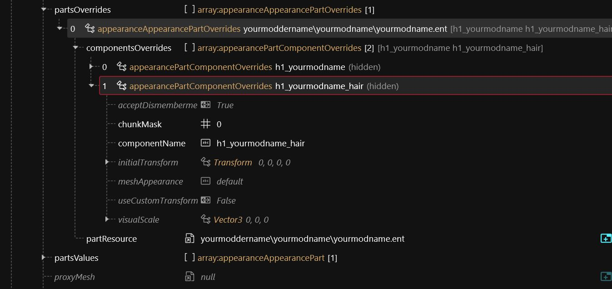
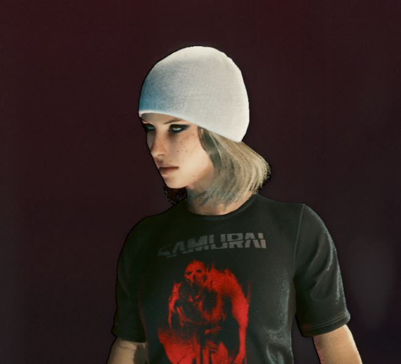
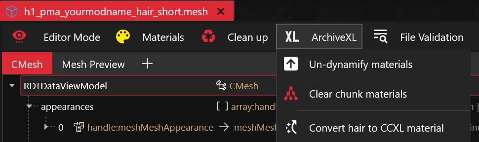
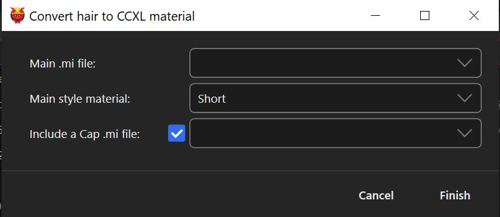

# Dynamic Appearances: Adding custom hat hairs

### Wait, this is not what I want!

* If you want to add a custom hat from the start, start with [.](./ "mention") and come back here once you've done that and have a hat minus the hair. The process for hats is no different than for other garment items.

### Prerequisites

* You know how to add custom garment items with Dynamic Appearances
* You either have your own WolvenKit project with a custom hat or you've downloaded the starting point project from [Modders Resource - Custom Hat Hairs](https://www.nexusmods.com/cyberpunk2077/mods/26859)


Most of the names and paths given in this guide are specific to the example/template project. If you want to apply this guide to your own project, you'll have to make the transfer to the names in your project. If you get confused at some point, consider following the steps with the example project first.


### Assumed Skill Level

If you can successfully add custom garment items with Dynamic Appearances to the game, you shouldn't have any problems with this guide.

## Step 1: Finding appropriate basegame hat hair meshes

In WolvenKit use the Asset Browser to navigate to `base->characters->common->hair`

<figure><figcaption></figcaption></figure>


Notice that for each basegame hat, there are four folders with hat hairs ending with a number between 1 and 4. These numbers are related to the different hair types:

```
01 - short
02 - long
03 - dreads
04 - buzz
```

Find a set of hairs that seem to be a good starting point for your custom hairs.


It is not necessary to use basegame hat hairs for your custom hairs. You can use any hair mesh from the game or custom-made hair. We just add basegame hat hairs for the sake of simplicity here. If you take an animated hair, keep in mind that your hat mesh entity will need the related `entAnimatedComponent` (aka hair\_dangle) to work properly.



Just ignore the body type tokens in the names of the hair folders. Some may seem like they're for `ma`, some for `wa` and some for something else entirely. The names are a lie. Each folder may contain meshes for multiple body types.


## Step 2: Adding the meshes to your project

Use Wkit's mesh preview and decide on a starting point for your hat hairs. For this guide, we'll use `h1_012_xx_hat__googles_hh_xx`.

Add the meshes of the set to your project with the `ma/wa` body type token and for all suffixes between `01` and `04`. In the end you should have added 8 meshes to your project.

<figure><figcaption></figcaption></figure>

## Step 3: Renaming the hat hair meshes

Add a new folder for the hair meshes to your project namespace. In this guide we'll use `yourmoddername\yourmodname\hair_meshes`.

Move all the mesh files you added in Step 2 to the new folder.

Rename the files. You can rename them to your liking, but it's important that they

* still contain an `m` or `w` indicating the gender
* you replace the number suffix with the matching hair type name (01- short, 02 - long, 03 - dreads, 04 - buzz)
* all follow the same schema for the file name with just the body type token and the hair type name being different

In this guide, we'll rename `h1_012_xx_hat__googles_hh_xx` to `h1_xx_yourmodname_hair_xxxx` with the body type token after `h1` and the hair type at the end.

E.g. `h1_012_wa_hat__googles_hh_03` becomes `h1_pwa_yourmodname_hair_dreads`.

The result should look something like this.

<figure><figcaption></figcaption></figure>


The `h1` prefix is not technically necessary. Neither is the full body type token `pwa` (player woman average). It is a good habit to stick to the conventions of the existing game files, though.


## Step 4: Adding the hair component to your entity

Open the mesh entity of your hair item. In this guide the mesh entity is `yourmodname.ent`. Right-Click on the hat component h1\_yourmodname and select "Duplicate in Array/Buffer".

Expand the duplicated component.

* Right-click on the id and select "Generate new CRUID".
* Click on the name property and change it to `h1_yourmodname_hair`. This name will be important when we update the .app!
* Click on the `meshAppearance` property and change it to `*{hair_color}`.
* Now the most important thing, the `mesh` path.&#x20;
* Right-click on one of your hair mesh files in the Project Explorer and select "Copy relative path to game file".&#x20;
* Click on the `mesh` property on your hair component and paste the path into the `DepotPath` field.
* Add an asterisk `*` at the front of the path and replace the w/m indicating the gender with `{gender}` and the hair type suffix with `{hair_type}`. In this guide the result will be `*yourmoddername\yourmodname\hair_meshes\h1_p{gender}a_yourmodname_hair_{hair_type}.mesh`.
* Save the .ent file.

The final component should now look like this:

<figure><figcaption></figcaption></figure>

## Step 5: Updating the .app file

Open your .app file, `yourmodname.app`. A working hat should have (at least) two appearances, one for first person view and one for third person view. In first person view, both the hat and the hairs should be hidden.

* Expand the appearance for first person view. In the example project it's `yourshortname_yourmodname_&camera=fpp`.
* Navigate to the `partsOverrides` property, expand the first element and in it the `componentsOverrides` property.
* Right-click on the component that hides the hat, `h1_yourmodname` and select "Duplicate in Array/Buffer".
* Change the `componentName` of the duplicated element to the name you picked for the hair component in the .ent in step 4.3. We picked `h1_yourmodname_hair` in this guide.
* Save the file.


If you started with a hat item that has no different appearances for fpp/tpp and no component hiders, consider downloading the "finished" example project and copy the appearances from its .app file.


The result should look like this:

<figure><figcaption></figcaption></figure>

## Step 6: Checking your result

Install the mod, give your V the hat item via console, equip it and check the result. If you followed all the steps your hat should now come with hair.


Check the .yaml file of the template project if you're unsure about the item names. It has the full console commands as comments as well.


<figure><figcaption></figcaption></figure>

Check both genders and all four hair types to be make sure it works correctly.


Now is the time to make sure the hair is hidden in first person view, especially if the hair you picked has bangs or something like it. Crouch and jump and look up and down and left and right. It might not be immediately obvious if the hair is still visible in fpp. It might only be visible in certain situations or perspectives. The game is weird like that.


## Step 7: Make your hat hair compatible with CCXL hair colors


This is step isn't strictly necessary, because at this point you already have working custom hat hairs. It's still a good idea to implement this, because CCXL additions are pretty much standard now.


### 7.1 Converting the .mesh files

In a file explorer open your Cyberpunk 2077 main directory and from there navigate to `/red4ext/plugins/ArchiveXL/Bundle` and open the file `PlayerCustomizationHairFix.xl` in a text editor.

In Wkit find the original file of your first copied hair mesh in the Asset Browser and copy its relative path. In this guide that will be `base\characters\common\hair\h1_012_wa_hat__googles_hh_01\h1_012_ma_hat__googles_hh_01.mesh`.

Search for the path in the `PlayerCustomizationHairFix.xl` and once found, scroll down to its `context` section.

<figure><figcaption></figcaption></figure>

Make a mental note that this mesh uses a short base material and has a cap.


This is only one possible way to find adequate base materials for your hat hairs as a start. There are other ways and of course you may want to use custom materials at some point. That's beyond the scope of this guide, though and the described way was simply chosen, because it is reasonably simple and doesn't require you to have your own custom materials to start with.


Open the related mesh file. `h1_pma_yourmodname_hair_short.mesh` in our example and click on the ArchiveXL button and select "Convert hair to CCXL material".

<figure><figcaption></figcaption></figure>

In the dialog that opens, select the matching main style for your mesh and if the mesh uses a cap select the "Include a Cap .mi file" check box. Since we won't use custom .mi files for now, we leave the dropdowns for the .mi files empty and click "Finish".

<figure><figcaption></figcaption></figure>

Now scroll down to the `localMaterialBuffer` property and expand it and expand the `materials`.

Expand the values of the `@context` property and fill the values of the `ShortBaseMaterial` and `CapBaseMaterial` with the values you found in the `PlayerCustomizationHairFix.xl`.

In the `@short` and `@cap` entries, add the same material paths to the `baseMaterial` property and set its `Flags` to `Soft`.

Save the file. The result should look like this for a mesh that uses a short base material and has a cap.

<figure><figcaption></figcaption></figure>

### 7.2 Rinse and repeat

Repeat the steps from section 7.1 for all hair .mesh files and use the matching values for short, long or dreads. When you convert a buzz hair mesh, select "Cap" in the conversion dialog and don't check the "Include a Cap .mi file" checkbox.

### 7.3 Adding the necessary entries to the .xl file

Open up your mod's .xl file and add the following entry to the `patch` region:

```
archive_xl\characters\common\hair\h1_base_color_patch.mesh:
  props: [ appearances ]
  targets: [ 
    yourmoddername\yourmodname\hair_meshes\h1_pma_yourmodname_hair_buzz.mesh,
    yourmoddername\yourmodname\hair_meshes\h1_pma_yourmodname_hair_dreads.mesh,
    yourmoddername\yourmodname\hair_meshes\h1_pma_yourmodname_hair_long.mesh,
    yourmoddername\yourmodname\hair_meshes\h1_pma_yourmodname_hair_short.mesh,
    yourmoddername\yourmodname\hair_meshes\h1_pwa_yourmodname_hair_buzz.mesh,
    yourmoddername\yourmodname\hair_meshes\h1_pwa_yourmodname_hair_dreads.mesh,
    yourmoddername\yourmodname\hair_meshes\h1_pwa_yourmodname_hair_long.mesh,
    yourmoddername\yourmodname\hair_meshes\h1_pwa_yourmodname_hair_short.mesh
  ]
```


This step is necessary as of ArchiveXL version 1.26.1, but psiberx already announced that he will have ArchiveXL auto-patch hat hairs in a future version of ArchiveXL, so it may be obsolete at some point.


If you used different names or paths, make sure that the targets match your hair mesh file paths.

Add the following scope region:

```
scope:
  player_ma_hat_hair.mesh:
    - yourmoddername\yourmodname\hair_meshes\h1_pma_yourmodname_hair_buzz.mesh
    - yourmoddername\yourmodname\hair_meshes\h1_pma_yourmodname_hair_dreads.mesh
    - yourmoddername\yourmodname\hair_meshes\h1_pma_yourmodname_hair_long.mesh
    - yourmoddername\yourmodname\hair_meshes\h1_pma_yourmodname_hair_short.mesh
  player_wa_hat_hair.mesh:
    - yourmoddername\yourmodname\hair_meshes\h1_pwa_yourmodname_hair_buzz.mesh
    - yourmoddername\yourmodname\hair_meshes\h1_pwa_yourmodname_hair_dreads.mesh
    - yourmoddername\yourmodname\hair_meshes\h1_pwa_yourmodname_hair_long.mesh
    - yourmoddername\yourmodname\hair_meshes\h1_pwa_yourmodname_hair_short.mesh
```

This should again match the paths you used.

If you started with the example project, the final .xl file should now look like this:

```
resource:
  patch:
    yourmoddername\yourmodname\meshes\h1_pwa_yourmodname.mesh:
      - yourmoddername\yourmodname\meshes\h1_pma_yourmodname.mesh
    archive_xl\characters\common\hair\h1_base_color_patch.mesh:
      props: [ appearances ]
      targets: [ 
        yourmoddername\yourmodname\hair_meshes\h1_pma_yourmodname_hair_buzz.mesh,
        yourmoddername\yourmodname\hair_meshes\h1_pma_yourmodname_hair_dreads.mesh,
        yourmoddername\yourmodname\hair_meshes\h1_pma_yourmodname_hair_long.mesh,
        yourmoddername\yourmodname\hair_meshes\h1_pma_yourmodname_hair_short.mesh,
        yourmoddername\yourmodname\hair_meshes\h1_pwa_yourmodname_hair_buzz.mesh,
        yourmoddername\yourmodname\hair_meshes\h1_pwa_yourmodname_hair_dreads.mesh,
        yourmoddername\yourmodname\hair_meshes\h1_pwa_yourmodname_hair_long.mesh,
        yourmoddername\yourmodname\hair_meshes\h1_pwa_yourmodname_hair_short.mesh
      ]
  scope:
    player_ma_hat_hair.mesh:
      - yourmoddername\yourmodname\hair_meshes\h1_pma_yourmodname_hair_buzz.mesh
      - yourmoddername\yourmodname\hair_meshes\h1_pma_yourmodname_hair_dreads.mesh
      - yourmoddername\yourmodname\hair_meshes\h1_pma_yourmodname_hair_long.mesh
      - yourmoddername\yourmodname\hair_meshes\h1_pma_yourmodname_hair_short.mesh
    player_wa_hat_hair.mesh:
      - yourmoddername\yourmodname\hair_meshes\h1_pwa_yourmodname_hair_buzz.mesh
      - yourmoddername\yourmodname\hair_meshes\h1_pwa_yourmodname_hair_dreads.mesh
      - yourmoddername\yourmodname\hair_meshes\h1_pwa_yourmodname_hair_long.mesh
      - yourmoddername\yourmodname\hair_meshes\h1_pwa_yourmodname_hair_short.mesh
factories:  
  - yourmoddername\yourmodname\yourmodname_factory.csv
localization:  
  onscreens:  
    en-us: 
      - yourmoddername\yourmodname\translation_strings.json
```

Install the mod and make sure that each hair type and gender works with base game colors as well as CCXL colors.

## Step 8: Make it yours

If you plan to use one of the template/example projects as a base for your own mod, you will need to rename each and every file, component and reference in the project.

In short

* Rename everything that contains "yourmoddername" to use your actual modder name instead
* Rename everything that contains "yourmodname" to use your mod's name instead


It's probably a lot easier and less error-prone to use Wkit's wizardry to create the initial hat item and then apply the steps described in this guide.


## Step 9: Edit your hair meshes

You now have eight different meshes that will probably require at least some editing in Blender to fit to your hat. This is especially true if you picked other hairs than hat hairs to start with. This is where the fun starts!
