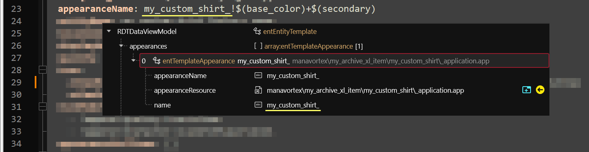

# Dynamic appearances: Understanding the process

## Summary

This page explains the files from [.](./ "mention") -> [#generated-files](./#generated-files "mention"), what they do, and how they do it.


You will be able to change the template project just by following the steps, but if you want to make your own mods, then you're going to want to understand this.

Depending on how you learn best, you can also fuck around and try to understand the connections yourself. In that case, check [#exercise-1-create-more-records](dynamic-appearances-understanding-the-process.md#exercise-1-create-more-records "mention") at the end of the section.



### The yaml

For a general explanation of what the yaml file does, check [#the-control-file-yourmodname.yaml](../archive-xl-item-structure-explained.md#the-control-file-yourmodname.yaml "mention"). This section will only cover the differences between a dynamic and a regular yaml.


This file contains the biggest part of the dynamic magic.


This is your dynamic project's yaml file, minus any properties that aren't influenced by the dynamic appearances:

```yaml
Items.manavortex_my_custom_shirt_$(base_color)_$(secondary):
  $base: Items.TShirt
  $instances:
    - {base_color: black, secondary: samurai}
    - {base_color: black, secondary: witcher}
    - {base_color: black, secondary: galaxy}
    - {base_color: white, secondary: samurai}
    - {base_color: white, secondary: witcher}
    - {base_color: white, secondary: galaxy}
    - {base_color: red, secondary: samurai}
    - {base_color: red, secondary: witcher}
    - {base_color: red, secondary: galaxy}
  appearanceName: my_custom_shirt_!$(base_color)+$(secondary)
  entityName: my_custom_shirt_factory_name
  localizedDescription: LocKey#my_custom_shirt_i18n_desc
  displayName: LocKey#my_custom_shirt_i18n_$(base_color)_$(secondary)
  quality: Quality.Legendary
  icon:
    atlasResourcePath: manavortex\my_archive_xl_item\my_custom_shirt\my_custom_shirt_icons.inkatlas
    atlasPartName: my_custom_shirt_$(base_color)_$(secondary)
  statModifiers:
    - !append Quality.IconicItem
    - !append Character.ScaleToPlayerLevel
  appearanceSuffixes: []
  statModifierGroups:
    - !append-once Items.IconicQualityRandomization
  placementSlots: OutfitSlots.TorsoInner


```

This section will explain how that works - except for the appearanceName, you will find that in [#the-root\_entity](dynamic-appearances-understanding-the-process.md#the-root_entity "mention").

#### Record names

TweakXL will generate one record per entry in `$instances`, according to the rules that you're using in the item name. This happens via **property interpolation**.

The example above will generate three item entries by **substituting** `$(property_name)` with the value of the property from the entry. If that isn't clear enough, check the example and the resulting item codes at the end of the line.

```yaml
Items.manavortex_my_custom_shirt_$(base_color)_$(secondary):
  $instances:
    - {base_color: black, secondary: samurai}  # Items.manavortex_my_custom_shirt_black_samurai
    - {base_color: black, secondary: witcher}  # Items.manavortex_my_custom_shirt_black_witcher
    - {base_color: black, secondary: galaxy}   # Items.manavortex_my_custom_shirt_black_galaxy
    - {base_color: white, secondary: samurai}  # Items.manavortex_my_custom_shirt_white_samurai
    - {base_color: white, secondary: witcher}  # Items.manavortex_my_custom_shirt_white_witcher
    - {base_color: white, secondary: galaxy}   # Items.manavortex_my_custom_shirt_white_galaxy
    - {base_color: red, secondary: samurai}    # Items.manavortex_my_custom_shirt_red_samurai
    - {base_color: red, secondary: witcher}    # Items.manavortex_my_custom_shirt_red_witcher
    - {base_color: red, secondary: galaxy}     # Items.manavortex_my_custom_shirt_red_galaxy
```

If you [install and launch](https://app.gitbook.com/s/-MP_ozZVx2gRZUPXkd4r/wolvenkit-app/menu/toolbar#install-and-launch) your project, you can immediately spawn them in Cyberpunk via Cyber Engine Tweaks:

```
Game.AddToInventory("Items.manavortex_my_custom_shirt_black_samurai")
Game.AddToInventory("Items.manavortex_my_custom_shirt_black_witcher")
Game.AddToInventory("Items.manavortex_my_custom_shirt_black_galaxy")
Game.AddToInventory("Items.manavortex_my_custom_shirt_white_samurai")
Game.AddToInventory("Items.manavortex_my_custom_shirt_white_witcher")
Game.AddToInventory("Items.manavortex_my_custom_shirt_white_galaxy")
Game.AddToInventory("Items.manavortex_my_custom_shirt_red_samurai")
Game.AddToInventory("Items.manavortex_my_custom_shirt_red_witcher")
Game.AddToInventory("Items.manavortex_my_custom_shirt_red_galaxy")
```

#### Display names

Like the record names, the `displayName` property is also generated for each entry:

```yaml
displayName: my_custom_shirt_i18n_$(base_color)_$(secondary)
$instances:
  - {base_color: black, secondary: samurai}  # my_custom_shirt_i18n_black_samurai
  - {base_color: black, secondary: witcher}  # my_custom_shirt_i18n_black_witcher
  - {base_color: black, secondary: galaxy}   # my_custom_shirt_i18n_black_galaxy
  - {base_color: white, secondary: samurai}  # my_custom_shirt_i18n_white_samurai
  - {base_color: white, secondary: witcher}  # my_custom_shirt_i18n_white_witcher
  - {base_color: white, secondary: galaxy}   # my_custom_shirt_i18n_white_galaxy
  - {base_color: red, secondary: samurai}    # my_custom_shirt_i18n_red_samurai
  - {base_color: red, secondary: witcher}    # my_custom_shirt_i18n_red_witcher
```

These entries have been auto-generated in your [localization file](../archive-xl-item-structure-explained.md#the-.json-file-custom-texts-i18n).

#### Icons

The icon name in the record is also generated for each entry. They are all using the same [inkatlas](../../../../for-mod-creators-theory/files-and-what-they-do/file-formats/game-icons-the-inkatlas-file.md), but you can generate that as well if you want - I've done it for the [Netrunner suits](https://www.nexusmods.com/cyberpunk2077/mods/9314), since I needed more than 100 icons.

```yaml
icon:
  atlasResourcePath: manavortex\my_archive_xl_item\my_custom_shirt\my_custom_shirt_icons.inkatlas
  atlasPartName: my_custom_shirt_$(base_color)_$(secondary)
$instances:
  - {base_color: black, secondary: samurai}  # my_custom_shirt_i18n_black_samurai
  - {base_color: black, secondary: witcher}  # my_custom_shirt_i18n_black_witcher
  - {base_color: black, secondary: galaxy}   # my_custom_shirt_i18n_black_galaxy
  - {base_color: white, secondary: samurai}  # my_custom_shirt_i18n_white_samurai
  - {base_color: white, secondary: witcher}  # my_custom_shirt_i18n_white_witcher
  - {base_color: white, secondary: galaxy}   # my_custom_shirt_i18n_white_galaxy
  - {base_color: red, secondary: samurai}    # my_custom_shirt_i18n_red_samurai
  - {base_color: red, secondary: witcher}    # my_custom_shirt_i18n_red_witcher
```

You can see that the generated names are identical to the ones in the section [#display-names](dynamic-appearances-understanding-the-process.md#display-names "mention") above. That is because the key to generate them (`atlasPartName`) has the same pattern as `displayName` .


If you want to make gendered icons, please check [gendered-preview-icons.md](../../../custom-icons-and-ui/adding-items-preview-images/gendered-preview-icons.md "mention") -> [#does-this-work-with-dynamic-variants](../../../custom-icons-and-ui/adding-items-preview-images/gendered-preview-icons.md#does-this-work-with-dynamic-variants "mention")


<details>

<summary>Exercise 1: Create more records</summary>


This is outdated and needs to be re-worked to consider the new generated structure


With clever hook-ups in the mesh entity, you can set up your items so that they can be changed **with a simple `.yaml` edit** — that means, the user can switch out the ribbon colour without ever starting Wolvenkit!

We'll use that here to enable "hidden" appearances.

I have hooked up the example project to support two base colours:

* black
* white

and three ribbon colors:

* red
* blue
* green

By editing the `$instances` block in the `.yaml`, you should be able to spawn 6 different shirt in the game without touching any of the additional files!

</details>

### The root\_entity

For a general explanation of the root entity, check [#root\_entity.ent](../archive-xl-item-structure-explained.md#root_entity.ent "mention"). This section will only cover the differences between a dynamic and a regular root entity.


This is where you **enable** the feature by adding the tag **`DynamicAppearance`** to the `visualTagsSchema` (the last entry in the file):


<figure><figcaption><p>It's <strong><code>DynamicAppearance</code>, without S.</strong></p></figcaption></figure>


For dynamic appearances, your `root_entity` file will contain **one entry**. You can give every item [its own root entity](../../../../for-mod-creators/files-and-what-they-do/entity-.ent-files#root-entity), or share a file across the mod.


The appearance name in the root entity corresponds to the `appearanceName` property in the `.yaml` without the variant:

<figure><figcaption></figcaption></figure>

You can leave the `appearanceName` blank. In that case, ArchiveXL will look for an appearance with the same name as the `name` attribute.

### The .app

For a general explanation of the .app file, check [#appearance.app](../archive-xl-item-structure-explained.md#appearance.app "mention"). This section will only cover the differences between a dynamic and a regular .app file.


For dynamic variants, components in the .app file will be **ignored**. You **have** to use a mesh entity.


#### .app file: Conditional switching


You can find more about this under [dynamic-appearances-fine-tuning-visibility-conditions.md](dynamic-appearances-fine-tuning-visibility-conditions.md "mention").


You can define appearances for different circumstances by changing the appearance names. This will let you influence the mesh entity even further by e.g. hiding parts of the mesh via [#chunkmask](../../../../for-mod-creators-theory/files-and-what-they-do/components/#chunkmask "mention"). And the best part is: you don't even need to touch your root entity.

In the context of our example project, this means that you can define your **appearances** like this:

<table><thead><tr><th width="450">Appearance name</th><th>Explanation</th></tr></thead><tbody><tr><td><code>app_file_dynamic_appearance</code></td><td>Your regular appearance. Is displayed when none of the conditional ones apply.</td></tr><tr><td><code>app_file_dynamic_appearance&#x26;camera=tpp</code></td><td>This is only active in third person perspective. The item will be completely invisible in first person.</td></tr><tr><td><code>app_file_dynamic_appearance&#x26;camera=fpp</code></td><td>This becomes active whenever you are in first person perspective. You'll usually want this to<a href="../../first-person-perspective-fixes.md#problem-2-its-in-your-face-juststormtrooperthings"> remove the mesh from your face</a> via <a href="../../../../for-mod-creators/files-and-what-they-do/appearance-.app-files#partsoverrides">partsOverrides</a>.</td></tr><tr><td><code>app_file_dynamic_appearance&#x26;gender=male</code></td><td>You shouldn't do this — instead, use <a data-mention href="dynamic-appearances-understanding-the-process.md#substitutions">#substitutions</a> in the mesh file path.</td></tr></tbody></table>

### The mesh\_entity

Unless you are using [#app-file-conditional-switching](dynamic-appearances-understanding-the-process.md#app-file-conditional-switching "mention"), this file contains **the entire magic**. This section will explain how you tell the .ent file to load different meshes.&#x20;

You can use either [#substitutions](dynamic-appearances-understanding-the-process.md#substitutions "mention") or (not recommended) [#ent-file-conditional-switching](dynamic-appearances-understanding-the-process.md#ent-file-conditional-switching "mention").

#### Wait, this is not what I want!

* For a picture of the difference between substitutions and conditional switching, check [#the-diagram](dynamic-appearances-understanding-the-process.md#the-diagram "mention") 's bottom left corner
* For a general explanation of the mesh entity, check [#mesh\_entity.ent](../archive-xl-item-structure-explained.md#mesh_entity.ent "mention")
* To learn more about dynamic appearances, check the [ArchiveXL documentation](../../../../for-mod-creators-theory/core-mods-explained/archivexl/#dynamic-appearances)

#### How it works

Per default, all components in the mesh entity are active and will be added to the player when you equip your item. Which parts of them are visible is determined by their [chunk masks](../../../../for-mod-creators-theory/files-and-what-they-do/file-formats/3d-objects-.mesh-files/submeshes-materials-and-chunks.md#chunkmasks-partially-hiding-meshes) (set everything to visible, then use the .app's [partsOverride](../../influencing-other-items.md#partsoverrides-changing-other-meshes) to hide parts of them).&#x20;

#### Substitutions


Check [#which-substitutions-exist](../../../../for-mod-creators/core-mods-explained/archivexl/archivexl-suffixes-and-substitutions.md#which-substitutions-exist "mention") for a full list of your options.


Substitutions in path names will be switched out by ArchiveXL at runtime. For example, `p{gender}a` becomes `pwa` if your V has a female body gender, and `pma` if they don't.

To enable substitution, your depot path must begin with an asterisk `*`. Each substitution needs to be enclosed in braces, e.g. `{gender}`.\
All generated paths will already be dynamic.

<figure><figcaption></figcaption></figure>


[File validation](https://app.gitbook.com/s/-MP_ozZVx2gRZUPXkd4r/wolvenkit-app/file-validation) can help you spot errors in your paths.


#### .ent file: conditional switching


This is only documented because it's possible, not because it's good practice: ArchiveXL will create **all** components, hiding those that aren't matched by your current conditions.&#x20;

If possible, use [#substitutions](dynamic-appearances-understanding-the-process.md#substitutions "mention") together with [#app-file-conditional-switching](dynamic-appearances-understanding-the-process.md#app-file-conditional-switching "mention") and [#partsoverrides-changing-other-meshes](../../influencing-other-items.md#partsoverrides-changing-other-meshes "mention").&#x20;


<details>

<summary>Click to expand (DO NOT USE THIS, check the box above)</summary>

Just like in the .app file, you can apply conditional switching to component names. It works exactly like [#app-file-conditional-switching](dynamic-appearances-understanding-the-process.md#app-file-conditional-switching "mention"):

<figure><figcaption></figcaption></figure>

Components can also be selected by variant, this currently cannot be broken down by variant parts (eg variant.1, variant.2 etc) but it uses the full variant after the ! in the yaml.

```yaml
$instances:
    - { base_color: white, ribbons: red  }
    - { base_color: black, ribbons: red  }
    - { base_color: black, ribbons: blue }
appearanceName: root_entity_dynamic_appearance_!$(base_color)+$(ribbons)
```

In this above example you can create filtered components by instance as follows. The one without the ! will be used by default if the variant is not in the list (eg black\_pink).

```
entSkinnedMeshComponent: MyJacketDecals!white_red
entSkinnedMeshComponent: MyJacketDecals!black_red
entSkinnedMeshComponent: MyJacketDecals!black_blue
entSkinnedMeshComponent: MyJacketDecals
```

This is what your compontent can look like; in this example a different light is used based on the variant.

<figure><figcaption></figcaption></figure>

</details>

## The diagram

Now let's look at what we just did and check the diagram. You'll see that the control files are almost identical to the[ vanilla variants](../archive-xl-item-structure-explained.md#the-final-result), but that the rest of the files has gotten a lot more manageable:

<figure><figcaption></figcaption></figure>
