# Standalone Weapon Appearance

## Summary <a href="#summary" id="summary"></a>

**Created:** May 27 2025 by [Leyllara](https://app.gitbook.com/u/pUrntle8kvWDruBZPiGQmYoBdcJ3 "mention") \
**Last documented update:** May 29 2025 by [Leyllara](https://app.gitbook.com/u/pUrntle8kvWDruBZPiGQmYoBdcJ3 "mention")

This is ~~supposedly meant to be~~ a comprehensive guide to how to create an entirely new weapon — independent of the game's own files. \
The approach guarantees full compatibility with whatever other modders do, as well as making it virtually time-proof.


For a working implementation, you can download the packed project from [Nexusmods](https://www.nexusmods.com/cyberpunk2077/mods/21776) (maybe you'd like more enlightening?).


Download the packed project from [here](https://www.nexusmods.com/cyberpunk2077/mods/21776) at Nexus Mods and take a look at the files yourself, if you feel like you need any more enlightening.

#### Wait, this is not what I want! <a href="#wait-this-is-not-what-i-want" id="wait-this-is-not-what-i-want"></a>

* What do you mean? Of course this is _exactly_ what you want.
* For an in-depth guide about weapon additions, check [new-iconic-weapon-tutorial-for-dummies.md](new-iconic-weapon-tutorial-for-dummies.md "mention")
* If you want to add clothes, check [..](../ "mention")
* To learn more about weapon properties, head to [cheat-sheet-weapon-basestats.md](../../../../for-mod-creators-theory/references-lists-and-overviews/cheat-sheet-tweak-ids/weapons/cheat-sheet-weapon-basestats.md "mention")

## Requirements <a href="#requirements" id="requirements"></a>

* [ ] For custom color variants, you should have [mlsetup-builder](../../../../for-mod-creators-theory/modding-tools/mlsetup-builder/ "mention") installed (you don't want to do this by hand)

To complete this guide, you need the following tools (and should know your way around them):



## Step 1: Gathering the files

I will base the tutorial weapon on an Ajax rifle, but you can use whatever you want. Our first step is...

### 1.1 Getting the control files

1. Search for the weapon you want, then filter by `.app` and `.ent`.\
   Example [search query](https://app.gitbook.com/s/-MP_ozZVx2gRZUPXkd4r/wolvenkit-app/usage/wolvenkit-search-finding-files):  `ajax > .app|.ent`
2. Add all `.app` files to your project
3. Add all `.ent` files that correspond to an `.app` file (ignore the ones that don't match).

<div align="left"><figure>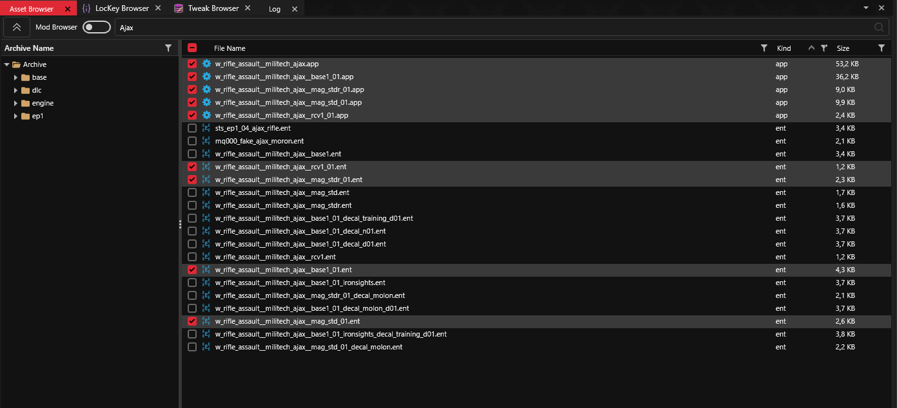<figcaption></figcaption></figure></div>

#### Explanation: What are these files?

* The `.app` file with the shortest name is the base file for your entire weapon (we'll call this "the lonely app file" thorugh the rest of the guide)
* The file ending in `_base1`  is your gun's **barrel**
* The file ending in `_mag_std` is the **loaded magazine**
* The file ending in `_mag_stdr` is the **empty magazine**
* The file ending in `_rcv1` is the **receiver**

Not all weapons support all parts - sometimes they're integrated (as for the Ajax, the receiver is part of the barrel).&#x20;

### 1.2 Getting the meshes

With those files in hand, we'll use them to gather our meshes and prepare them for use.&#x20;

1. Open the `.app` file without any suffixess
2. Expand `appearances` > `default` > `components`
3. Grab everything that's an entSkinnedMeshComponent

<div align="left"><figure>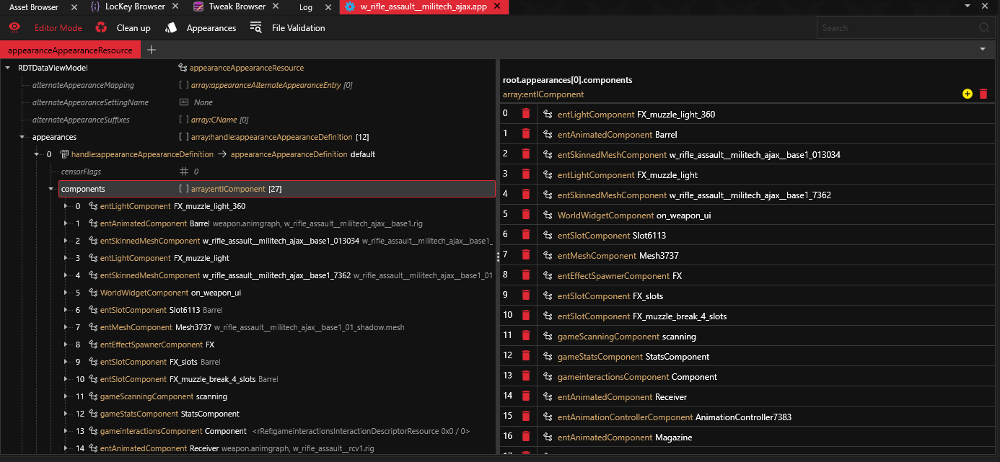<figcaption></figcaption></figure></div>

4. Depending on your gun, this should give you between 6 and 12 `.mesh` files.

#### Explanation: What are these files?

`.mesh` files contain your model's 3d data. As the `.app` and `.ent` files, they correspond to your weapon's parts.&#x20;

Anything with `_decal` in its name will be projected on top of the rest of the gun. We'll ignore these for now.

### 1.3 Adding the material files

1. Open the following mesh files:&#x20;
   1. base
   2. sight (`ironsights`)
   3. magazines (`mag_std` and `mag_stdr`)
   4. receiver (`rcv`, if you have)
2. For each of those files, open `localMaterialInstances.materials`
3. Find the material called default and open it
4. Open its `values` array
5. Find the property called MultilayerSetup and add it to your project:

<div align="left"><figure>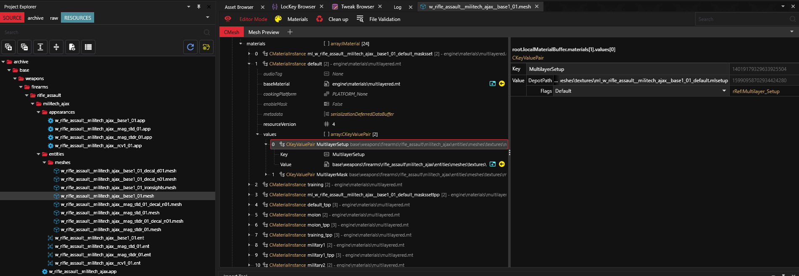<figcaption></figcaption></figure></div>

These are the magical files that make your weapon look awesome.

### 1.x: Summary

In this section, you identified the files used to give the base game gun its looks, and added them to your project. Right now, these would **overwrite** the original gun — in the next step, we'll take care of the standalone part.

## Step 2: Preparing the files

Now that we've got everything we need, time to prepare the files. First, rename all of your files with names of your own, being _**EXTRA SURE**_ to tick the "Update in project files?" box, so these get automatically renamed everywhere. If you don't, you're just gonna be doing it manually.

<div align="left"><figure>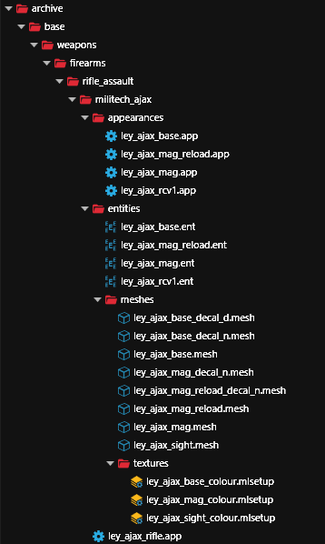<figcaption></figcaption></figure></div>

### 2.1 Preparing the .app files

1. Open the .app file and expand the `appearances` array
2. Delete every appearance **except** for the default one (which should be pointing at your own files, since you checked the box when  moving)
3. Give the remaining appearance a custom name
4. Inside the appearance, rename the `visualTag`  to your own (this will be used to select the appearance name later)
5. Inside the appearance's `components` array,  rename the `entSkinnedMeshComponent`s from the base weapon to your own
6. Set the `baseEntity` field to your own weapon's `.ent` file. If it is not visible, switch [Editor Mode](https://app.gitbook.com/s/-MP_ozZVx2gRZUPXkd4r/wolvenkit-app/editor/file-editor/editor-difficulty-mode) to Advanced.

This should be done for all .app files, except the lonely appfile, which will receive special treatment later on.

<div align="left"><figure>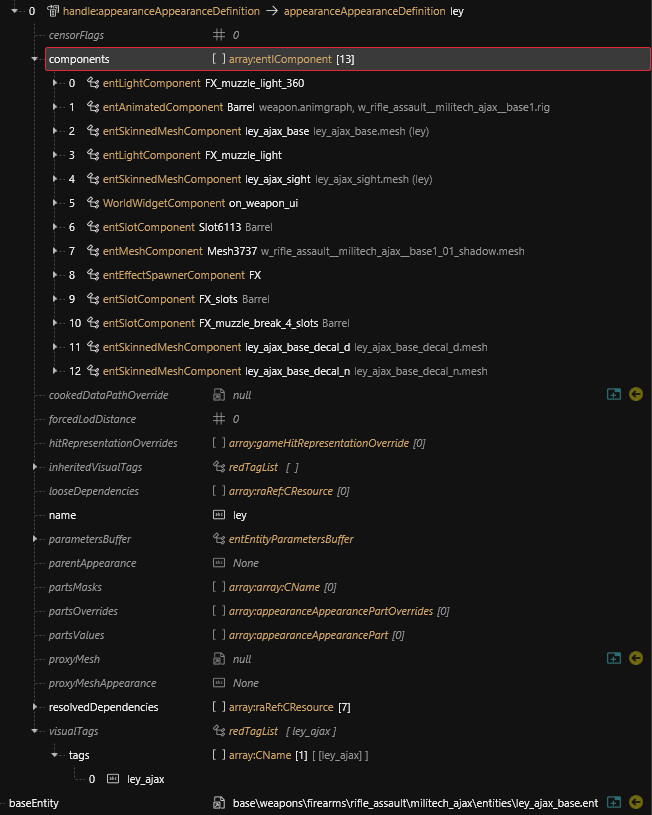<figcaption></figcaption></figure></div>

### 2.2 Preparing the .ent files

For the .ent files, we're gonna need to add a few stuff here and there. We start with the appearances array, which we add a new entry that points to the corresponding .app file. Then we change defaultAppearance to our own, and most importantly, the entity handle HAS to be changed into gameItemObject.

<div align="left"><figure>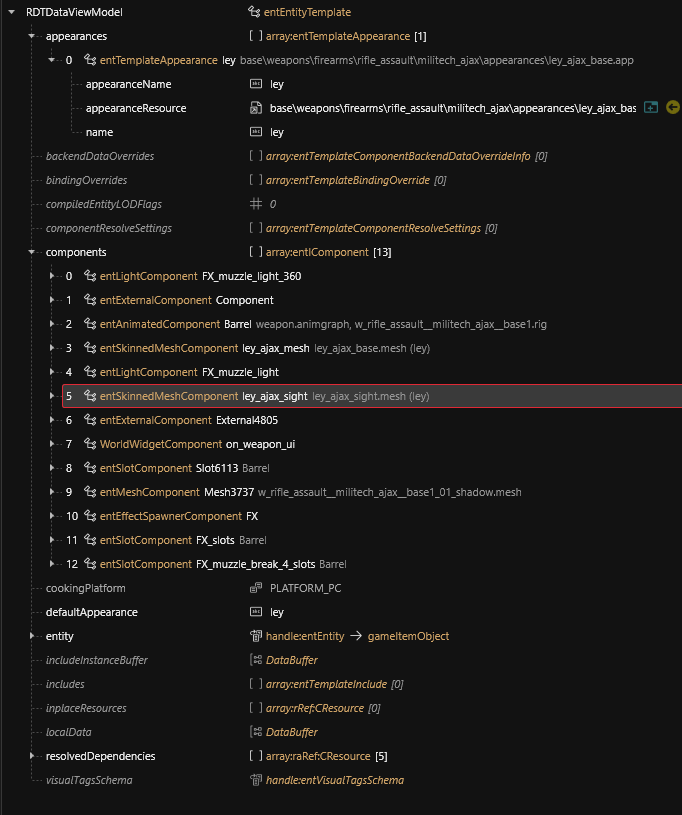<figcaption></figcaption></figure></div>

### 2.3 Preparing the .mesh files

In the appearances array, we're once again deleting all of them except for the default one. Then we go to the materials array, and once again delete everything except for default and default\_tpp. Be sure to delete them all in a single swipe, or else their names will change because we still haven't touched the materialEntries yet, which will cause some confusion. Then on the materialEntries array, delete all entries except default and default\_tpp, and then change their index to 0 and 1.

Now that the file is all cleaned up, on the materials array we right-click on the CMaterialInstance and click Rename Material, and give it an unique name. Then go back to the appearances array, and rename the meshMeshAppearance to your own name.

Once again, let's leave the decals for later on. They'll be one of the last things we're touching for now.

<div align="left"><figure>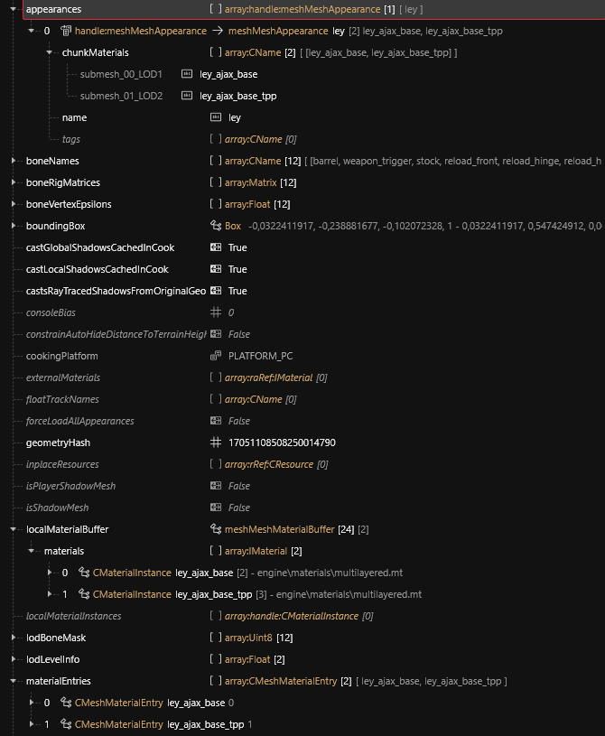<figcaption></figcaption></figure></div>

## Step 3: Your very own appearance

We'll now be dolling up our weapon to be the prettiest rifle in all of Night City. This is where you bring in the MLSetupBuilder and go play with it until you're satisfied. Go on, have some fun, you deserve it. Change your materials, splatter it with all the colours of the rainbow, play around with everything. You'll probably be coming back to this a few times to adjust details here and there.

After this, we go to our mesh, tab into Mesh Preview, and click Generate Materials, to have a rough preview of how our masterpiece looks like.

<div align="left"><figure>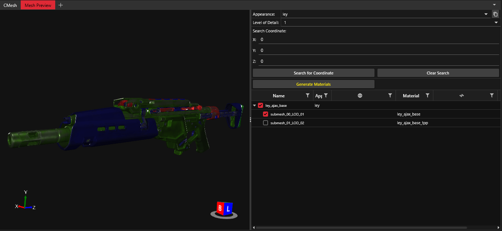<figcaption></figcaption></figure></div>

This also confirms the setup is working just fine, and that everything is as it should be. Time to bring it to Blender so you can have a better look at it, and then finally play with the decals. Go to the Export Tool tab, and export your base mesh, and the decal meshes associated with it.


While making the setups for your Sight, you'll notice a few different components. You can fiddle around them if you want, but that's likely to mess up with your actual aiming when in-game if you don't know what you're doing. But if you want to change the glass colour, change it on the ScopeInside value on the material for your glass. For this weapon, I made it green.


<div align="left"><figure>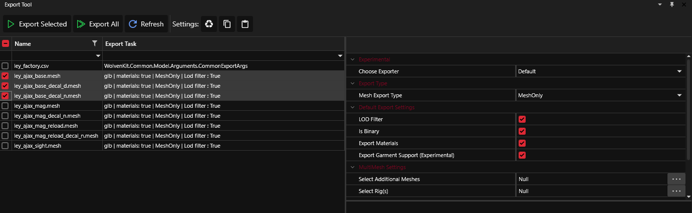<figcaption></figcaption></figure></div>

### Blender Preview and Decals

Here, I'm assuming you already know the basics of Blender. If you don't, feel free to ignore this step, or do the right thing and learn it.

<div align="left"><figure>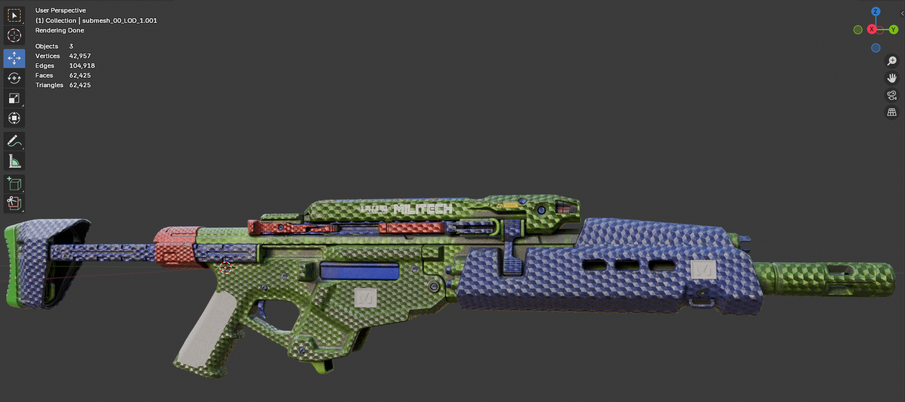<figcaption></figcaption></figure></div>

This here is a better preview of how my weapon will look in-game. The decals are additional meshes that are placed over your weapon, just like any sticker. As you can see, we got 2 types of decals in there.

#### Diffuse Decals

<div align="left"><figure>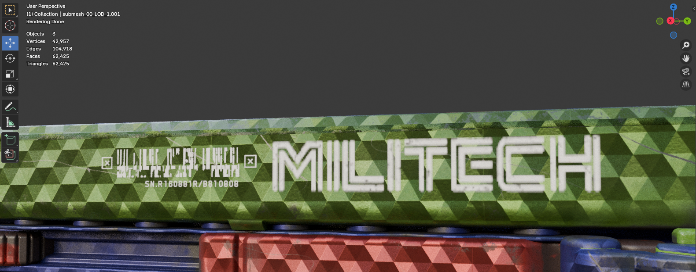<figcaption></figcaption></figure></div>

This type of decal is just your regular old image being imprinted, nothing special going on here.

#### Normal Decals

<div align="left"><figure>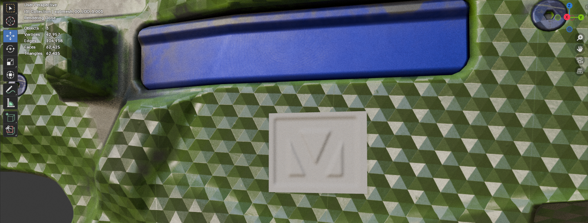<figcaption></figcaption></figure></div>

These don't use their actual colours, but rather the information stored within the image channels to give an illusion of a 3D imprint (kinda like those hexagons all over my rifle), so don't worry about them looking off. You can "fix" them for a more accurate view if you want, but we won't need that.

### Making your own decals

Yeah, we can put _anything_ as a decal, as long as it's an image. So let's get us some cool stuff. I'll just take mine from the base game (or will I?)

I've already got my own decals that I've put together from game files, and a few customizables. On Blender, we'll be using a .png file to preview and put everything together.

So on Blender, duplicate your base collection, and keep just the armature, to get stuff organized. Then select the part you want to put your decal, go into Edit Mode, duplicate the faces that are roughly where you want your decals, then separate them off the original mesh.


Taking the armature and duplicating from the original mesh will allow for an easier time making stickers on moving parts.


<div align="left"><figure>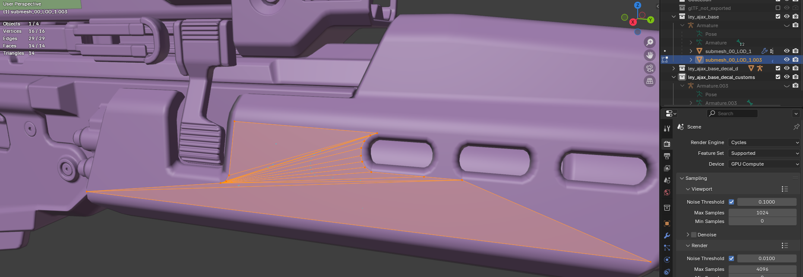<figcaption></figcaption></figure></div>

Then move that separated mesh into your custom decal collection, and bring it _slightly_ out of your mesh, and adjust your shape. Keep it triangulated for the export later. But you might have a question right now. Why don't we just make a plane and stick it there? Because we want the Vertex Groups data and the Weight Painting to carry on without having to do it ourselves.

<div align="left"><figure><figcaption></figcaption></figure></div>

After you're done, your mesh should look like this, or whatever shape you want it to be. Now add your .png texture on the materials for this mesh, go to UV editing, unwrap and position it on your decal. If the sizes are incorrect and picking up other stuff, just cut off whatever you don't need.

<div align="left"><figure>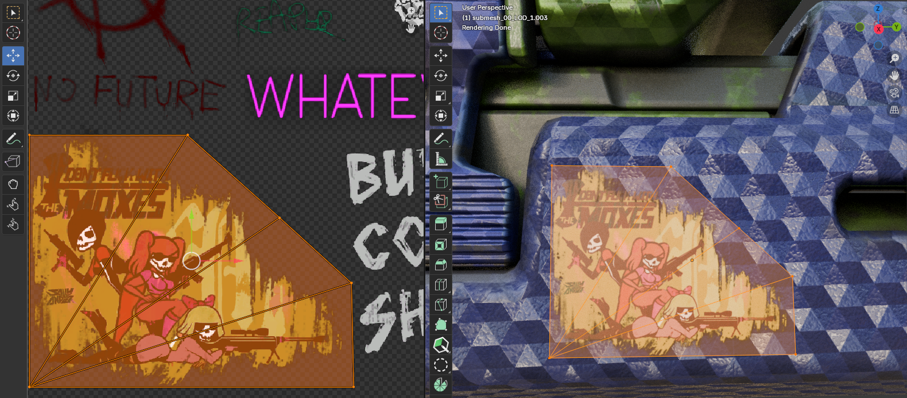<figcaption></figcaption></figure></div>

Do this as many times as you want. This is my favorite part. If there's a space somewhere, then I'll definitely want to put up some random sticker. Once you're done, export your decals as .glb, one for each set that uses any particular image, to keep them easier to keep track. If you fiddled around the topology too much, you'll need to check your Weight Paints to make sure everything's in order.


Don't forget about the normals of your decals. Make sure they're all correctly oriented and as smooth as possible, to avoid shading issues.


Now back on Wolvenkit, duplicate the Diffuse Decal mesh (in my example, named ley\_ajax\_base\_decal\_d), and rename it to the same name as the .glb you just exported from Blender. Then on the Import Tool, select your .glb and import it to an existing file.

<div align="left"><figure>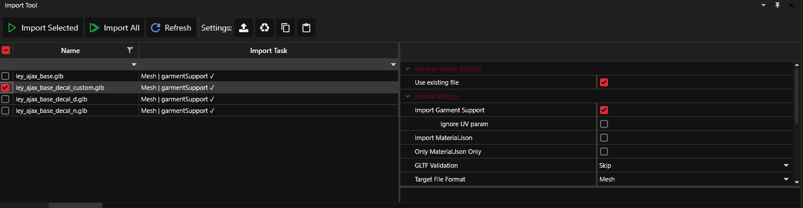<figcaption></figcaption></figure></div>

Open your newly made .mesh file, rename the material to another unique name, pick the DiffuseTexture value, and make it point to your .xbm texture file, which is just your decals.png file imported into Wolvenkit. Then delete the other values you won't be needing, and then your material should look like this.

<div align="left"><figure>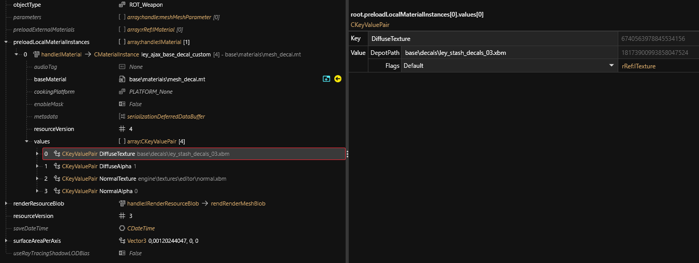<figcaption></figcaption></figure></div>

Save and close your mesh, then open it again, go into Mesh Preview, and hit the Generate Materials button. If you set up everything right, your decal will be there just like it was on Blender.

<div align="left"><figure>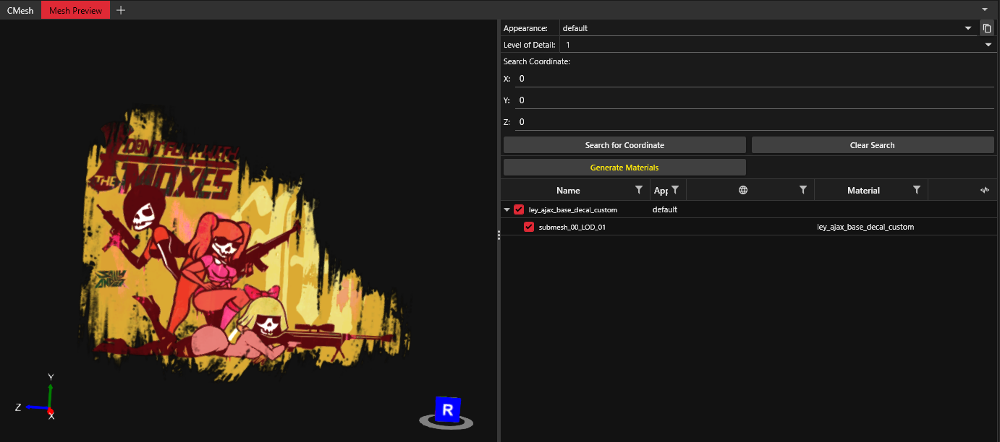<figcaption></figcaption></figure></div>


The workflow will be the exact same one if you want to reposition, add or remove any of the vanilla decals.


### Adding your decals to your weapon parts

Now, open up the .app file for your weapon part, in our case, the base one. Go into the componets Array and duplicate one of the decal entries, rename it and make it point to your decal mesh.

<div align="left"><figure>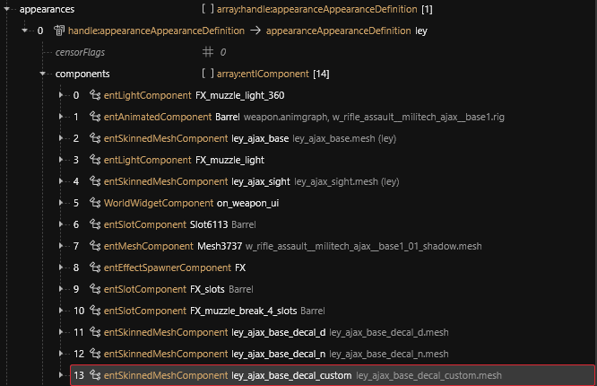<figcaption></figcaption></figure></div>

Then on the resolvedDependencies Array, create a new entry and point it to your mesh as well.

<div align="left"><figure>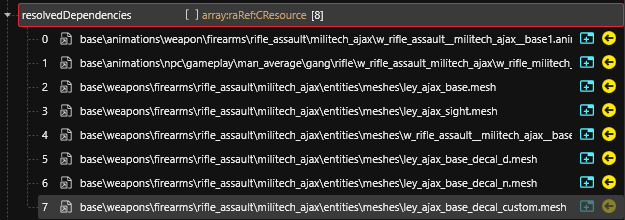<figcaption></figcaption></figure></div>

Now open your .ent file and go into Entity Preview. You should already see your custom decal mesh there on the list to the right, and among them, Mesh3737 (or something like that). That one is just a mesh for shadows, so leave it there, just uncheck the box to hide it. Click on Generate Materials, and if everything was set up correctly, you'll see your decal there on your weapon.

<div align="left"><figure>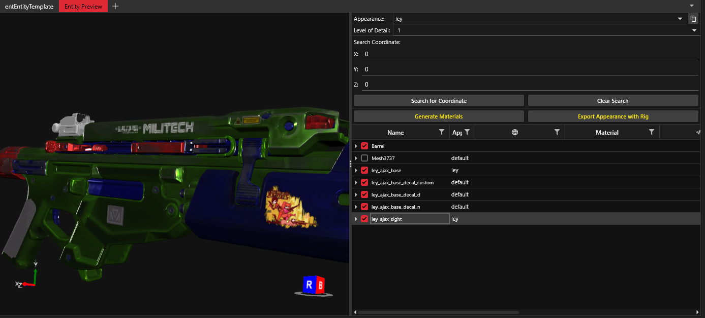<figcaption></figcaption></figure></div>

Now go take a breather, an energy drink, coffe, or whatever poison you fancy, young grasshopper, you've earned it. The next steps will require a bit more of focus. Trust me, all of this was the easy part. Don't give up, skeleton!

## Step 4: Setting up the structure

### The lonely appfile

We finally got back to it. This one is the appfile that contains the whole weapon, and isn't linked to any .ent file. This will be the one we'll be referencing on the .yaml tweak to make our weapon show up. If your weapon is composed of a single part, like a Katana, you'll only have a single .app file, and it will serve the same purpose as our lonely one here.

As before, delete every appearance that isn't the default one, rename the appearance to your own, and remember to set up your visualTag as well. Notice that it has a proxyMesh, and the resolvedDependencies have a bunch of animation files.

Right there on the `components` array, just as before, rename all of the entSkinnedMeshComponent entries to your own names, to better keep track of each one. Notice how it's got the components for every part of your weapon? If a component isn't there, it won't show up in-game.

Once again, duplicate one of the decal entries, rename it and make it point to your custom decal. Last, but not least, scroll down to preset, and rename it to the name of your item in the .yaml file.

<div align="left"><figure>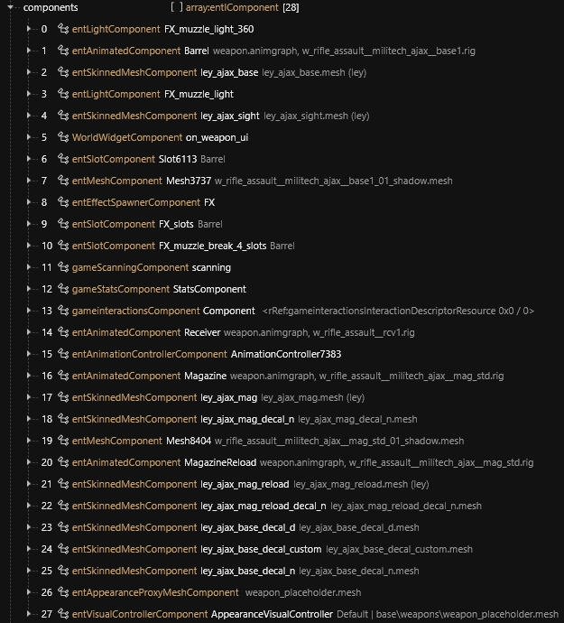<figcaption></figcaption></figure></div>

<div align="left"><figure>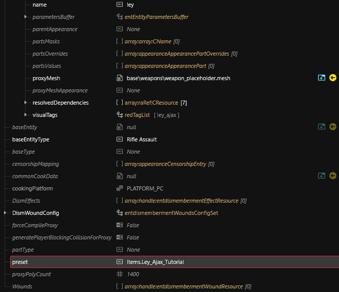<figcaption></figcaption></figure></div>

### Factory and xl files

Now you'll need a .csv file to be your factory. This is where you'll be registering your .app files so they can be referenced in the .yaml, as well any .ent file for your [throwing weapons](throwing-weapons-projectiles.md). Create an empty one, and set it up like this.

<div align="left"><figure>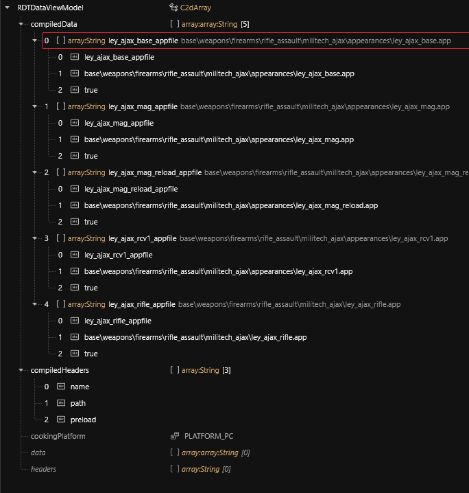<figcaption></figcaption></figure></div>

Then on the .xl file of your project, register your factory like this. Yeah, same file where you registered your localization file.

<div align="left"><figure>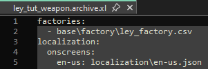<figcaption></figcaption></figure></div>

### Checking your files

First, make sure you have all the files you want. Those are all the ones in this guide.

<div align="left"><figure>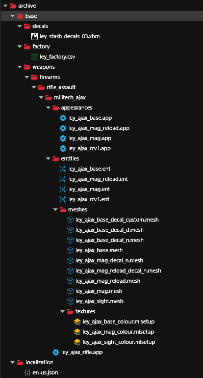<figcaption></figcaption></figure></div>

Scan your project for broken references, and validate everything, checking the Log for anything that's wrong, and if that's the case, check which file it is, backtrack and fix it. Make sure all of your .mesh and .ent files preview the correct materials for everything.&#x20;


A common "error" on the Log is when two materials seem to be the same. It doesn't matter. Another one, which will probably affect your weapon, is when a mesh has no materials assigne, which will just make them render invisible.


### Assembling your weapon

It's tweak time, yaaaaaay. With everything done properly in the previous steps, we can just mix them up on the gigantic sphagetti that is the coding part of Cyberpunk 2077. Truly a magnificent thing.

Start by opening your .yaml file and scrolling down to the bottom of it. There, you'll be coding the entries for both the slotPartList and the slotPartListPreset. You'll need to do one of these for each part of your weapon, including Scopes and Muzzle Breakers, if you want custom ones as well. A good example for these parts is the Overwatch, Panam's Grad Rifle.


This here is where a bunch of "stealthy" issues can happen, so pay close attention to what you're doing. A single typo and you can spend hours bashing your face on your desk trying to figure out what's happening, just for it to be a wrong identation, a missing definition, or whatever. If you're a dev, you already know this. Probably.



```yaml
# Base

Items.Ley_Ajax_Base:
  $base: Items.w_rifle_assault__militech_ajax__base1 # Tweak Record for the Barrel of the weapon
  appearanceResourceName: ley_ajax_base_appfile # Name of your .app file as registered at the factory.csv

Items.Ley_Ajax_inline4:
  $type: gamedataItemPartListElement_Record
  item: Items.Ley_Ajax_Base
  weight: 1
  statModifierWeight: []

Items.Ley_Ajax_inline3: # Barrel part to be appended to the slotPartList
  $type: gamedataSlotItemPartListElement_Record
  optionalProbabilityCurveName: ''
  slot: AttachmentSlots.Barrel
  itemPartList:
    - Items.Ley_Ajax_inline4
```


The other parts are coded the same way, but in different slots.

<details>

<summary>The remaining parts for this weapon</summary>


```yaml
# Mag

Items.Ley_Ajax_Mag:
  $base: Items.w_rifle_assault__militech_ajax__mag_std
  appearanceResourceName: ley_ajax_mag_appfile

Items.Ley_Ajax_inline6:
  $type: gamedataItemPartListElement_Record
  item: Items.Ley_Ajax_Mag
  weight: 1
  statModifierWeight: []

Items.Ley_Ajax_inline5:
  $type: gamedataSlotItemPartListElement_Record
  optionalProbabilityCurveName: ''
  slot: AttachmentSlots.Magazine
  itemPartList:
    - Items.Ley_Ajax_inline6

# Mag Reload

Items.Ley_Ajax_Mag_Reload:
  $base: Items.w_rifle_assault__militech_ajax__mag_stdr
  appearanceResourceName: ley_ajax_mag_reload_appfile

Items.Ley_Ajax_inline8:
  $type: gamedataItemPartListElement_Record
  item: Items.Ley_Ajax_Mag_Reload
  weight: 1
  statModifierWeight: []

Items.Ley_Ajax_inline7:
  $type: gamedataSlotItemPartListElement_Record
  optionalProbabilityCurveName: ''
  slot: AttachmentSlots.MagazineEmpty
  itemPartList:
    - Items.Ley_Ajax_inline8

# Receiver

Items.Ley_Ajax_Rcv1:
  $base: Items.w_rifle_assault__militech_ajax__rcv1
  appearanceResourceName: ley_ajax_rcv1_appfile

Items.Ley_Ajax_inline10:
  $type: gamedataItemPartListElement_Record
  item: Items.Ley_Ajax_Rcv1
  weight: 1
  statModifierWeight: []

Items.Ley_Ajax_inline9:
  $type: gamedataSlotItemPartListElement_Record
  optionalProbabilityCurveName: ''
  slot: AttachmentSlots.Receiver
  itemPartList:
    - Items.Ley_Ajax_inline10
```


</details>

Now for the presets for the slotPartListPreset.


```yaml
# Presets

Items.Preset_Ley_Ajax_inline0:
  $type: gamedataSlotItemPartPreset_Record
  itemPartPreset: Items.Ley_Ajax_Base
  slot: AttachmentSlots.Barrel
  itemPartList: []

Items.Preset_Ley_Ajax_inline1:
  $type: gamedataSlotItemPartPreset_Record
  itemPartPreset: Items.Ley_Ajax_Mag
  slot: AttachmentSlots.Magazine
  itemPartList: []

Items.Preset_Ley_Ajax_inline2:
  $type: gamedataSlotItemPartPreset_Record
  itemPartPreset: Items.Ley_Ajax_Mag_Reload
  slot: AttachmentSlots.MagazineEmpty
  itemPartList: []
  
Items.Preset_Ley_Ajax_inline3:
  $type: gamedataSlotItemPartPreset_Record
  itemPartPreset: Items.Ley_Ajax_Rcv1
  slot: AttachmentSlots.Receiver
  itemPartList: []
```


These entries will then be appended in their respective, uh, places.


```yaml
slotPartList: 
    - !append-once Items.Ley_Ajax_inline3 # Base
    - !append-once Items.Ley_Ajax_inline5 # Mag
    - !append-once Items.Ley_Ajax_inline7 # Mag Reload
    - !append-once Items.Ley_Ajax_inline9 # Receiver
slotPartListPreset: # Presets for each part of your weapon
    - !append-once Items.Preset_Ley_Ajax_inline0
    - !append-once Items.Preset_Ley_Ajax_inline1
    - !append-once Items.Preset_Ley_Ajax_inline2
    - !append-once Items.Preset_Ley_Ajax_inline3 
```


Now, all of those make your weapon function with your parts, whatever that means. But for your weapon to show up entirely with your stuff, you'll be coding these lines under your item's entry, right there at the top.


```yaml
  appearanceResourceName: ley_ajax_rifle_appfile
  appearanceName: ley
  visualTags: [ ley_ajax ]
```


And this here is how the whole thing looks, if you want to take a look, with some comments on where the stuff is coming from.

<details>

<summary>The full tweak for the weapon</summary>


```yaml
Items.Ley_Ajax_Tutorial:
  $base: Items.Preset_Ajax_Default
  appearanceResourceName: ley_ajax_rifle_appfile # Name of your lonely appfile as registered on the .csv
  appearanceName: ley # Name of your appearance
  visualTags: [ ley_ajax ] # The visualTag you've set up on the .app
  displayName: LocKey("Ley_Ajax_Name") # From your localization file
  localizedDescription: LocKey("Ley_Ajax_Description") # Also from localization, this is the text in the preview window in-game.
  slotPartList: 
    - !append-once Items.Ley_Ajax_inline3 # Base
    - !append-once Items.Ley_Ajax_inline5 # Mag
    - !append-once Items.Ley_Ajax_inline7 # Mag Reload
    - !append-once Items.Ley_Ajax_inline9 # Receiver
  slotPartListPreset: # Presets for each part of your weapon
    - !append-once Items.Preset_Ley_Ajax_inline0
    - !append-once Items.Preset_Ley_Ajax_inline1
    - !append-once Items.Preset_Ley_Ajax_inline2
    - !append-once Items.Preset_Ley_Ajax_inline3 
  tags:
    - !append-once IconicWeapon
  statModifierGroups:
    - !append-once Items.IconicQualityRandomization
  statModifiers:
    - !append-once Quality.IconicItem


# Base

Items.Ley_Ajax_Base:
  $base: Items.w_rifle_assault__militech_ajax__base1 # Tweak Record for the Barrel of the weapon
  appearanceResourceName: ley_ajax_base_appfile # Name of your .app file as registered at the factory.csv

Items.Ley_Ajax_inline4:
  $type: gamedataItemPartListElement_Record
  item: Items.Ley_Ajax_Base
  weight: 1
  statModifierWeight: []

Items.Ley_Ajax_inline3: # Barrel part to be appended to the slotPartList
  $type: gamedataSlotItemPartListElement_Record
  optionalProbabilityCurveName: ''
  slot: AttachmentSlots.Barrel
  itemPartList:
    - Items.Ley_Ajax_inline4

# Mag

Items.Ley_Ajax_Mag:
  $base: Items.w_rifle_assault__militech_ajax__mag_std
  appearanceResourceName: ley_ajax_mag_appfile

Items.Ley_Ajax_inline6:
  $type: gamedataItemPartListElement_Record
  item: Items.Ley_Ajax_Mag
  weight: 1
  statModifierWeight: []

Items.Ley_Ajax_inline5:
  $type: gamedataSlotItemPartListElement_Record
  optionalProbabilityCurveName: ''
  slot: AttachmentSlots.Magazine
  itemPartList:
    - Items.Ley_Ajax_inline6

# Mag Reload

Items.Ley_Ajax_Mag_Reload:
  $base: Items.w_rifle_assault__militech_ajax__mag_stdr
  appearanceResourceName: ley_ajax_mag_reload_appfile

Items.Ley_Ajax_inline8:
  $type: gamedataItemPartListElement_Record
  item: Items.Ley_Ajax_Mag_Reload
  weight: 1
  statModifierWeight: []

Items.Ley_Ajax_inline7:
  $type: gamedataSlotItemPartListElement_Record
  optionalProbabilityCurveName: ''
  slot: AttachmentSlots.MagazineEmpty
  itemPartList:
    - Items.Ley_Ajax_inline8

# Receiver

Items.Ley_Ajax_Rcv1:
  $base: Items.w_rifle_assault__militech_ajax__rcv1
  appearanceResourceName: ley_ajax_rcv1_appfile

Items.Ley_Ajax_inline10:
  $type: gamedataItemPartListElement_Record
  item: Items.Ley_Ajax_Rcv1
  weight: 1
  statModifierWeight: []

Items.Ley_Ajax_inline9:
  $type: gamedataSlotItemPartListElement_Record
  optionalProbabilityCurveName: ''
  slot: AttachmentSlots.Receiver
  itemPartList:
    - Items.Ley_Ajax_inline10

# Preset

Items.Preset_Ley_Ajax_inline0:
  $type: gamedataSlotItemPartPreset_Record
  itemPartPreset: Items.Ley_Ajax_Base
  slot: AttachmentSlots.Barrel
  itemPartList: []

Items.Preset_Ley_Ajax_inline1:
  $type: gamedataSlotItemPartPreset_Record
  itemPartPreset: Items.Ley_Ajax_Mag
  slot: AttachmentSlots.Magazine
  itemPartList: []

Items.Preset_Ley_Ajax_inline2:
  $type: gamedataSlotItemPartPreset_Record
  itemPartPreset: Items.Ley_Ajax_Mag_Reload
  slot: AttachmentSlots.MagazineEmpty
  itemPartList: []
  
Items.Preset_Ley_Ajax_inline3:
  $type: gamedataSlotItemPartPreset_Record
  itemPartPreset: Items.Ley_Ajax_Rcv1
  slot: AttachmentSlots.Receiver
  itemPartList: []
```


</details>

Note that the tweak doesn't include an Icon entry. You'll want one, and this is covered [here](../../../custom-icons-and-ui/custom-in-game-icons.md).

### How it should look in-game

Here's some in-game screenshots for the final looks of this masterpiece. IF you followed this guide to the letter, you'll have a similar result.

<div align="left"><figure><figcaption><p>Weapon Preview</p></figcaption></figure></div>

<div align="left"><figure><figcaption><p>Equipped on the Inventory</p></figcaption></figure></div>

<div align="left"><figure><figcaption><p>Icon and Stats</p></figcaption></figure></div>


Remember to make an icon and make your tweaks.


<details>

<summary>A few Photomode and First Person stills for a better look at the details</summary>

<figure>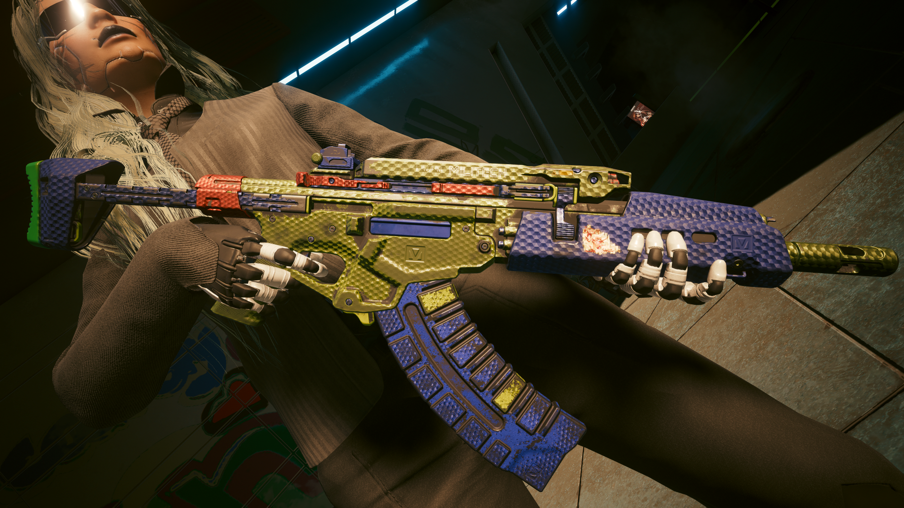<figcaption></figcaption></figure>

<figure>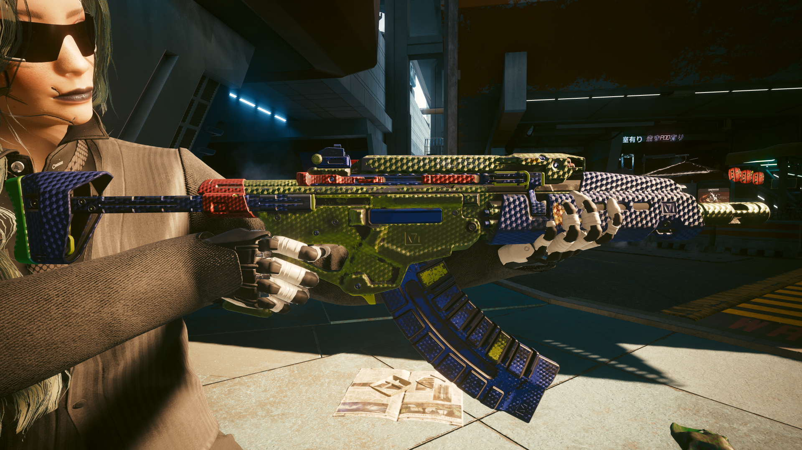<figcaption></figcaption></figure>

<figure>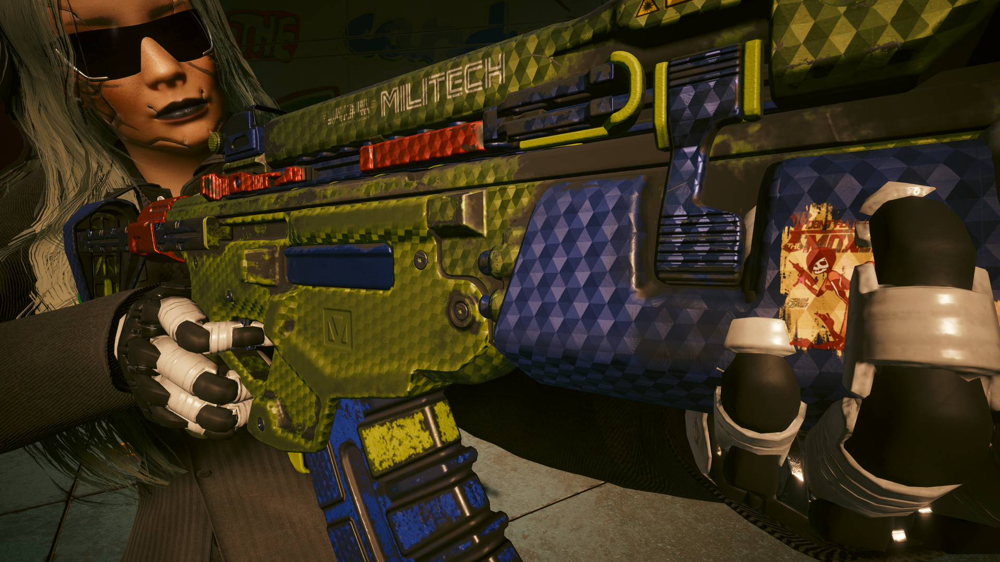<figcaption></figcaption></figure>

<figure>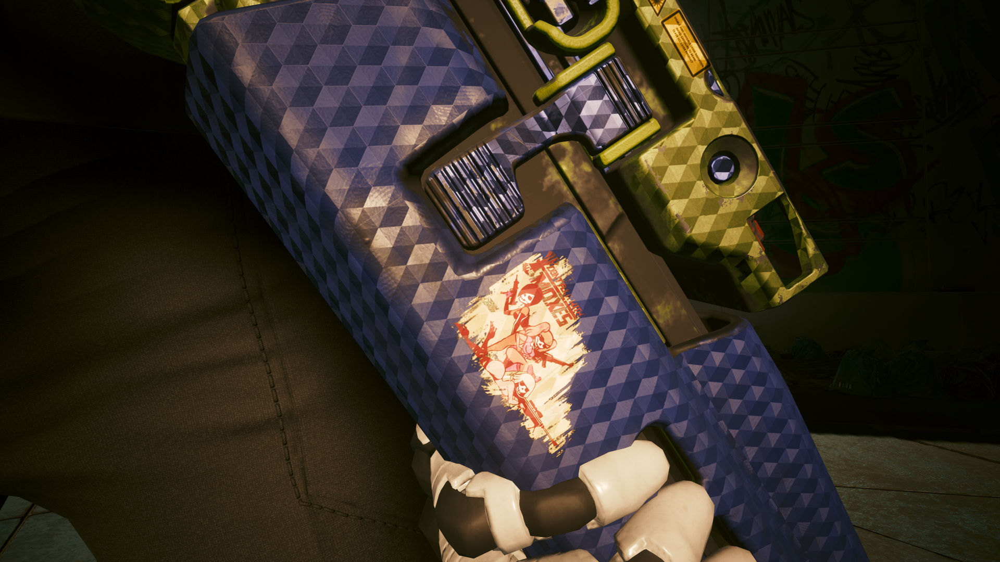<figcaption></figcaption></figure>

<figure>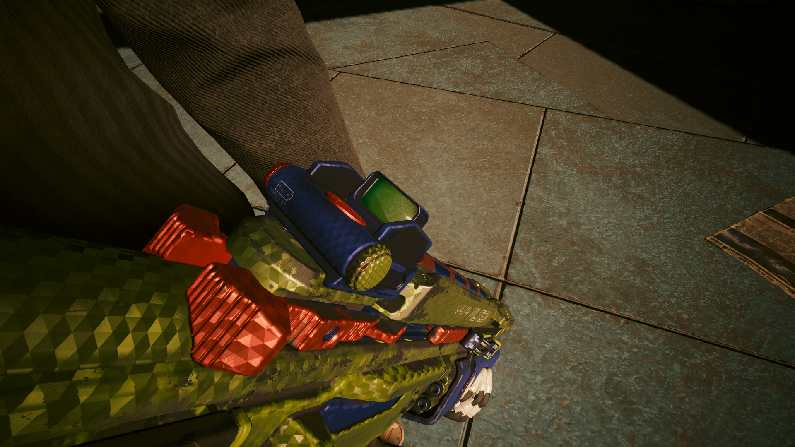<figcaption></figcaption></figure>

<figure>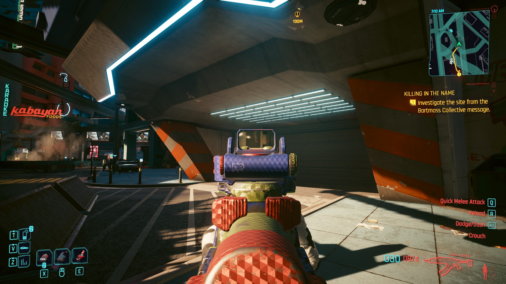<figcaption></figcaption></figure>

<figure>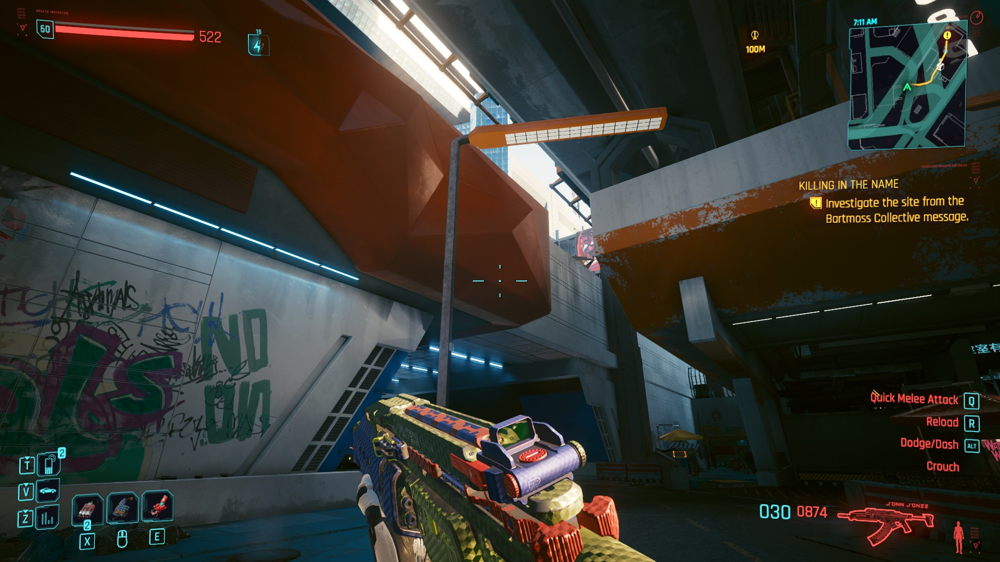<figcaption></figcaption></figure>

</details>

### Troubleshooting

* My weapon doesn't exist in the game!

That's likely a .yaml error. Check the [appropriate guide](./).


* My weapon exists, but is invisible!

Check your meshes, appearance and entity files for any wrong depots, visual tags, appearance names, materials, handles, and chunk materials, as per the [Preparing the files](standalone-weapon-appearance.md#preparing-the-files) section.


* Only a part of my weapon is rendering!

You're using the wrong appfile under your weapon appearance. You should be using [the lonely appfile](standalone-weapon-appearance.md#the-lonely-appfile).


* My weapon is rendering Vanilla stuff instead of mine!

Check the resolved dependencies on your files for any reference to a vanilla mesh (except proxy, placeholder and shadow meshes), and delete them. Your meshes should be there instead.


* My decals aren't showing up, or aren't moving when the moving part they're in move!


1. First, make sure that their normals are properly calculated in Blender, and that they're also properly Weight Painted. If you don't know what those things mean, you'll need to learn from a Blender tutorial first.
2. Then, check your decal meshes in wolvenkit, and doublecheck that they are loading the proper materials. Then you check if they are properly referenced in the components array of your .app files, and if they are pulling from the right appearance name that's on your mesh.


* How do I put those cool hexagon textures all over my weapon? There's no Material like it!\


Those are setup as microblends in the MLSetupBuilder. Check the appropriate [guide](../../../../for-mod-creators-theory/modding-tools/mlsetup-builder/).


* Animations, shadows, visual effects and \*insert any other similar issue\* are missing, wrong, or generally fucked!

You probably deleted more stuff than you had to. Apply the GETA (Gather Everything and Throw Away) method on the faulty files and redo them, it'll be easier than trying to fix what's missing.


* You never told me to test stuff every step. How will I know what's wrong and where?

That's the beauty of the XGH (X-treme Go Horse) method. You do everything in a single go. But the guide is discriminated step by step, so you can retrace your steps and check for any mistakes.


* I'm trying to make my own weapon, but cannot understand where it's going wrong!

Monkey See Monkey Do. Even if you want your own weapon, try making this Ajax the exact way it is in this guide. Same folders, same structure, same names, same everything.

### Wrapping up

Well, this _should_ be everything that needs to be done, yeah. All of this just so your weapon can look different. For further customizations, you can make and use your own [Mask Layers](../../../textures-and-luts/custom-multilayermasks.md), [Custom Microblends](../../../textures-and-luts/making-custom-microblends.md), [Emissive Materials](../../../../for-mod-creators-theory/materials/configuring-materials/emissive-material-properties.md), [Particle Effects](../../../../for-mod-creators-theory/files-and-what-they-do/effects-explained.md), and honestly, whatever else you can think of.

Now, if you want to use fully custom meshes, you'll have to fiddle around with [Rigging](../../../../for-mod-creators-theory/references-lists-and-overviews/cheat-sheet-rigs-and-animations.md). Basically, you'll take whatever rig matches your weapon the closest, and Weight Paint your meshes accordingly on Blender. You'll likely have to create your own Mask Layers if you want to use the MLSetup stuff, and if you don't, you'll play with regular textures, _kind of_ like the decals, but adding property maps as well.

Now, if your weapon is a Throwable one, you'll have to take [these](throwing-weapons-projectiles.md) extra steps. And if your weapon is a Melee one, you'll be following less steps. Honestly, making a Katana or something is probably the ideal first weapon, but teaching it here wouldn't make me feel that this is complete, because it wouldn't teach the specifics of weapon parts and all that

And as a "final" note, everything here has been made using the GETA (Gather Everything and Throw Away), XGH (X-treme Go Horse) and Monkey See Monkey Do methodologies. Some steps here may or may not be unnecessary, but through trial and error over days of pure stress, these are what ended up working for me.
