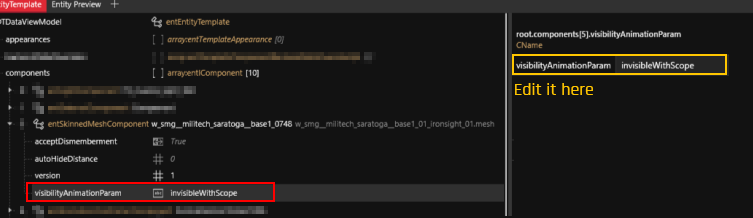

# Weapons: Attachments and Scopes

## Summary

**Created:** July 11 by @manavortex\
**Last documented update:** July 11 by @manavortex

This page will tell you how to mod weapon attachments and scopes.



## Component visibility

Component visibility is defined by the `visibilityAnimationParam`:

<figure><figcaption>
Displayed as in <code>w_smg__militech_saratogabase1_01.ent</code>
</figcaption></figure>

To always display a component, set the value to `None` (clear the field).


TODO: which values are allowed here? Where do we get them from?

