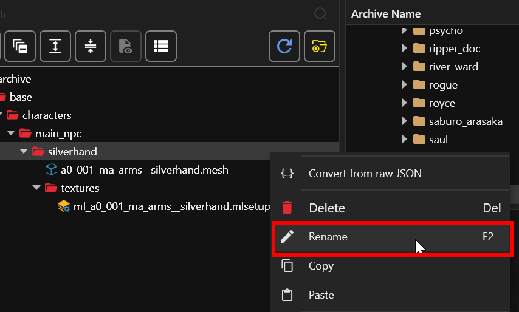
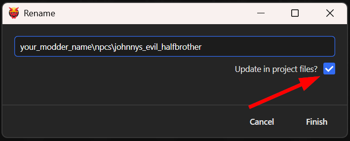
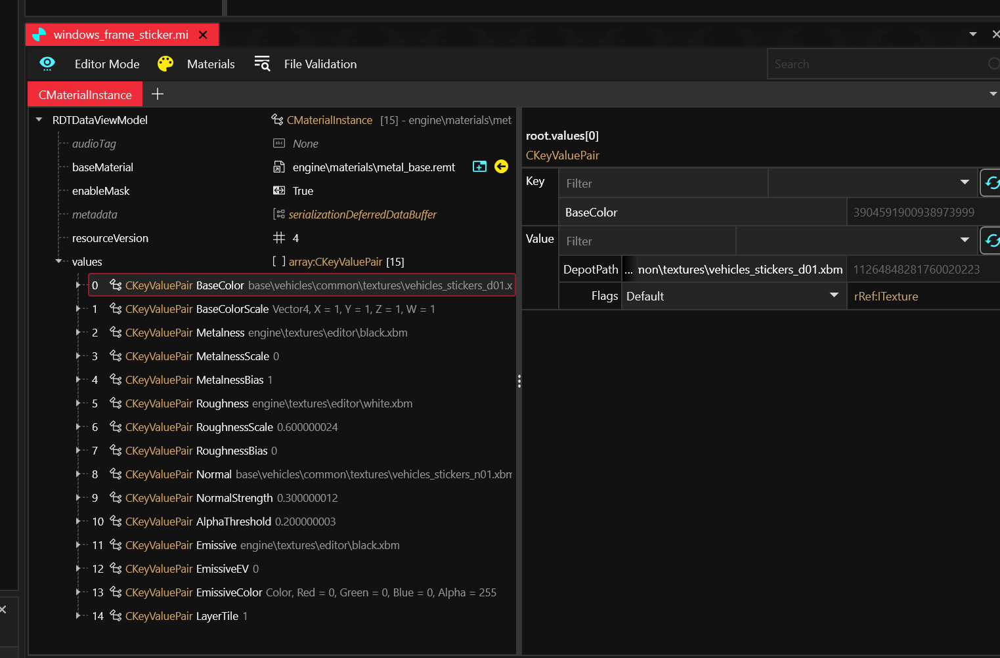

# Custompathing assets

**Published: January 16 2024 by @madmaximusjb**\
**Last documented edit: April 2026 by** [mana vortex](https://app.gitbook.com/u/NfZBoxGegfUqB33J9HXuCs6PVaC3 "mention")

This guide will teach you how to set game assets as new files. Don't worry, it's really simple!

## Why do I need this?

The game **identifies files** by their paths. For example, `base\characters\main_npc\silverhand\a0_001_ma_arms__silverhand.mesh` is Johnny's signature arm. The game will read that file whenever it spawns everyone's favourite terrorist — any changes you make will affect him.

If you want to use your own copy of that arm (for a custom NPC), the solution is **custompathing**.&#x20;

By moving the arm to e.g. `your_modder_name\npcs\johnnys_evil_halfbrother\a0_001_ma_arms__silverhand.mesh` , you can change whatever you want, and the original won't be affected.


Wolvenkit's [File Validation](https://app.gitbook.com/s/-MP_ozZVx2gRZUPXkd4r/wolvenkit-app/file-validation "mention") can help you find broken reference paths in your project, and the `full scan to log view` will check for many common issues.


## An exercise

You need a [Wolvenkit Project](https://app.gitbook.com/s/-MP_ozZVx2gRZUPXkd4r/wolvenkit-app/usage/wolvenkit-projects) with at least one file in it. If you don't have one yet, let's use Johnny's arm:

```
base\characters\main_npc\silverhand\a0_001_ma_arms__silverhand.mesh
base\characters\main_npc\silverhand\textures\ml_a0_001_ma_arms__silverhand.mlsetup
```

### Step 1: Renaming to target

The easiest (and recommended) way to do this is Wolvenkit's [Rename](https://app.gitbook.com/s/-MP_ozZVx2gRZUPXkd4r/wolvenkit-app/editor/project-explorer#rename) dialogue.&#x20;

With a file or folder selected in the project browser, click "Rename" in the context menu (or press f2):

<figure><figcaption></figcaption></figure>

In the box, put the full name of where you want your file/folder to go. In our example, that'll be \
`your_modder_name\npcs\johnnys_evil_halfbrother\` .

Make sure to check the box so that Wolvenkit can update all references across your project!

<figure><figcaption></figcaption></figure>

Now, click "Finish".

### Step 2: Success!

You now have your very own copy of Johnny's arm, with its own `.mlsetup` file. You can recolour the arm without the original being affected.

The blue text tells you which references have been updated:

<figure><figcaption></figcaption></figure>

## Until next time, chooms!
