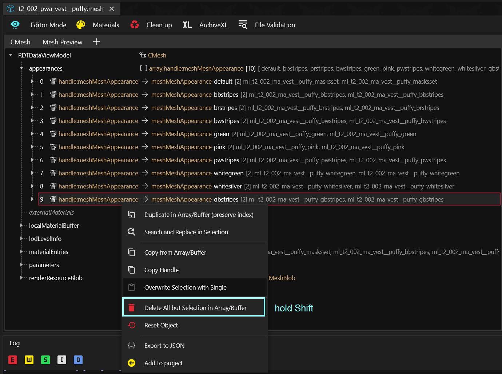
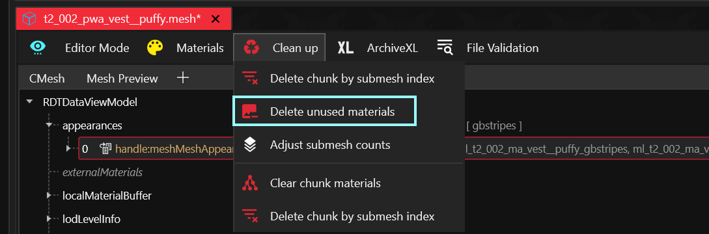
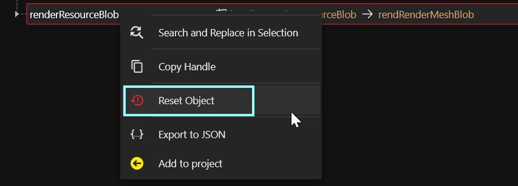
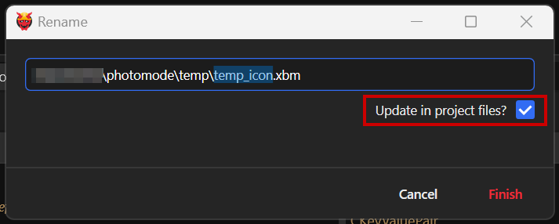

# ArchiveXL: Patching appearances

## Summary

**Published:** July 23 2024 by [Zhincore](https://app.gitbook.com/u/OsI9JXgCSSbt40hb327iBDif7Xv1 "mention")\
**Last documented update:** October 24 2025 by [mana vortex](https://app.gitbook.com/u/NfZBoxGegfUqB33J9HXuCs6PVaC3 "mention")

This guide will teach you how to use [archivexl-resource-patching](../../../for-mod-creators-theory/core-mods-explained/archivexl/archivexl-resource-patching/ "mention") to change or add appearances to existing meshes. By creating a **patch mesh**, your changes will not conflict with other mods, and be future-proof against game updates!


Concepts discussed here can be applied to many other areas in the game. See the general guide for more info: [archivexl-resource-patching](../../../for-mod-creators-theory/core-mods-explained/archivexl/archivexl-resource-patching/ "mention")


### Wait, this is not what I want!

* To learn how to recolour an item, check [changing-materials-colors-and-textures](changing-materials-colors-and-textures/ "mention")

## Prerequisites

* [ArchiveXL](https://www.nexusmods.com/cyberpunk2077/mods/4198) >= `1.14` — this will **not work** with older versions
* A [WolvenKit project](https://app.gitbook.com/s/-MP_ozZVx2gRZUPXkd4r/wolvenkit-app/usage/wolvenkit-projects#create-a-new-wolvenkit-mod-project)
* A text editor such as [Notepad++](https://notepad-plus-plus.org/downloads/)

## Step 0: Finding the correct file

1. Use [redhottools](../../../for-mod-creators-theory/modding-tools/redhottools/ "mention") -> [#world-inspector-watch-the-player](../../../for-mod-creators-theory/modding-tools/redhottools/rht-the-world-inspector.md#world-inspector-watch-the-player "mention") to find the correct mesh and appearance name on the player puppet.
   1. If the many components confuse you, you can use [Appearance Creator Mod](https://www.nexusmods.com/cyberpunk2077/mods/10795) — you can go through the list of components one by one and **toggle** them off until you have found the correct one. Use that name to find it in RedHotTools.
2. Find the mesh file in the [Asset Browser](https://app.gitbook.com/s/-MP_ozZVx2gRZUPXkd4r/wolvenkit-app/editor/asset-browser)
3. Add it to your project by double-clicking
4. Open it by double-clicking it in the [Project Explorer](https://app.gitbook.com/s/-MP_ozZVx2gRZUPXkd4r/wolvenkit-app/editor/project-explorer) - once we are done, this will be our patch mesh.


To add a whole new appearance, you have to edit the `.app` and `.ent` file as well:

Right-click on your mesh in the asset browser, then select "find files using this" and add them to your project. The steps below apply to these files as well, although we won't go into detail.


## Step 1: Delete everything that you aren't changing


The guide below shows this process for the `.mesh` file. If you are changing a different kind of file, the same principle applies!


1. In the `appearances` array at the top of the file, select those appearances that you want to keep
2. Right-click, then press the `shift` key and select `Delete All but Selection`
3. Optional: If you want to **add a new appearance**, rather than editing an existing one, re-name the entry (from e.g. `gbstripes` to `sammy_gbstripes`)

<figure><figcaption></figcaption></figure>

4. From the menu bar, select `Clean Up` -> `Delete unused materials`

<figure><figcaption></figcaption></figure>

5. Save your file (Hotkey: `Ctrl+S`)

### 1.2 Delete everything that you aren't changing

You are creating a **patch file**, which will be used to change data in the original file via ArchiveXL. To rule out side effects, you should delete everything that you aren't changing.

1. If you are changing an **appearance** in a `.mesh` file, you do not need
   * renderResourceBlob
   * parameters&#x20;
   * lodLevelInfo
2. Right-click each of them and select `Reset Object`.&#x20;
3. Save your file.

<figure><figcaption></figcaption></figure>

## Step 2: Custompath your patch files

If you install your mod right now, your item would be broken and the game might even crash. To avoid that, we need to **move your patch files**.


Moving any `.mlsetup` files that you edited will remove the dependency to [Material Texture Override](https://app.gitbook.com/s/-MP_ozZVx2gRZUPXkd4r/wolvenkit-app/error-codes#mto-requirement).&#x20;


1. Create a custom folder for your mod: keep it outside of `base` and `ep1`. The common pattern is `your_name\mod_name\` (e.g. `zhincore\new_gun_appearance`).&#x20;

<div align="center" data-full-width="false"><figure><figcaption><p>Example folder structure of my mod.</p></figcaption></figure></div>

2. Right-click your custom folder and select `Copy Relative Path`
3. In the Project Explorer, select each file, and use `Rename` (hotkey: `F2`) to move them. The `Update in Project Files` box must be ticked!

<figure><figcaption></figcaption></figure>

4. If you still have files open, Wolvenkit will want to reload these. Click "Yes" - the paths were updated for you.
5. Optional: Run [File Validation](https://app.gitbook.com/s/-MP_ozZVx2gRZUPXkd4r/wolvenkit-app/file-validation) from the menu bar (`Project` -> `Run File Validation on the entire project`) to check if there are any errors.

## Step 3: Configure ArchiveXL

Now we need to tell ArchiveXL about our patch file(s). We do that via an `.archive.xl` file in our `resources` folder — use any text editor, such as [Notepad++](https://notepad-plus-plus.org/downloads/).

1. Switch your Project Explorer to the `resources` or `source` tab
2. Create the file `your_mod_name.archive.xl`  (`File` -> `New File`, or via text editor)

<figure><figcaption><p>My .archive.xl file.</p></figcaption></figure>

3. Open the file in your favorite text editor and add the following lines. Mind the **indent** (the number of leading spaces)!&#x20;

```yaml
resource:
  patch:
    relative\path\to\your\file.mesh:
      - relative\path\to\original\game\file.mesh
    relative\path\to\your\file.app:
      - relative\path\to\original\game\file.app
```

<details>

<summary>Wait, how does this work?</summary>

You are creating a map with instructions for ArchiveXL.&#x20;

Each key (anything ending with a `:`) is a **patch file path**, while the array entries below (anything starting with a `-`) are the **destination files**.

AXL will take the data from the patch file, and add it to every file in the list.&#x20;

</details>

4. Replace the example file paths with the paths of your actual files


In WolvenKit's Project Explorer you can right-click a file and choose "Copy relative path" and just paste in into your `.xl` file. You don't have to write the paths manually


5. Delete any lines that you aren't using.

## Step 4: Test!

And you should be good to go! [Install your mod](https://app.gitbook.com/s/-MP_ozZVx2gRZUPXkd4r/wolvenkit-app/menu/toolbar#install-and-launch) and test it.
