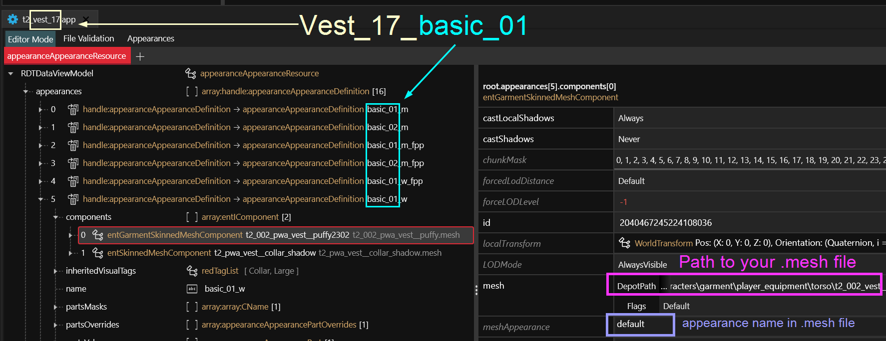
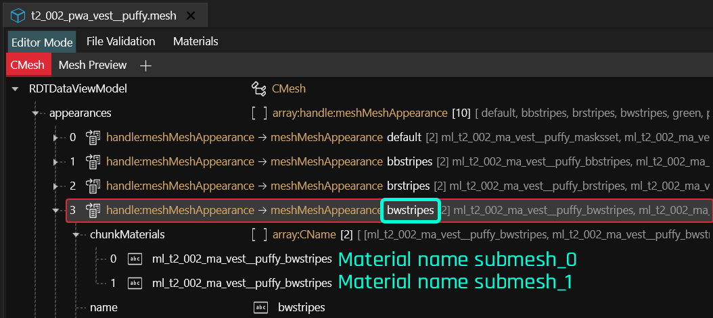
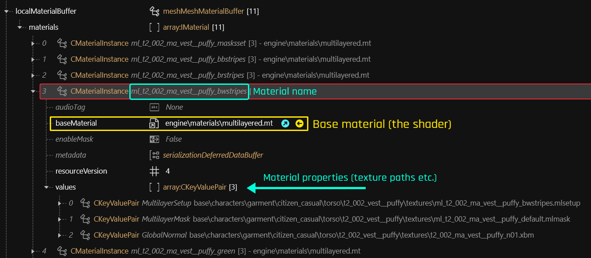
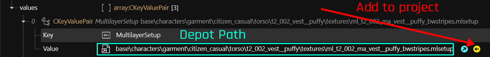
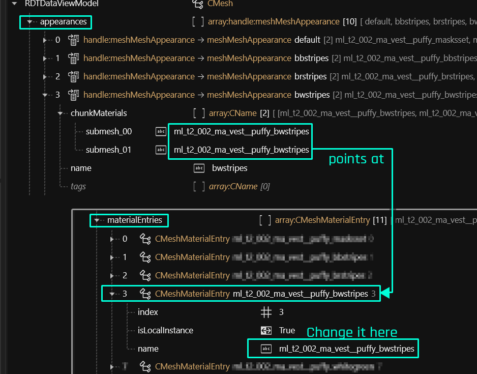
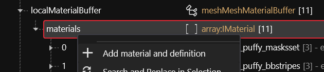
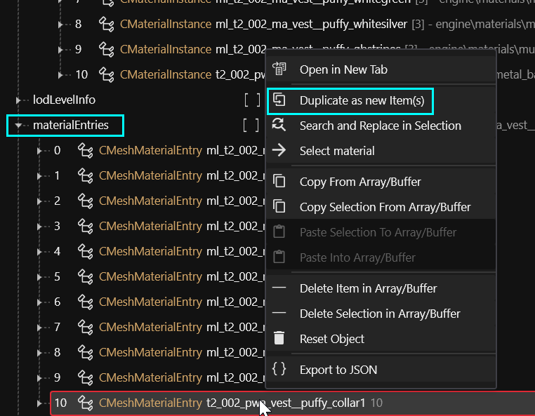

# Changing materials, colors and textures

## Summary 

**Published:** November 05 2022 by [manavortex](https://app.gitbook.com/u/NfZBoxGegfUqB33J9HXuCs6PVaC3 "mention")\
**Last documented edit:** Jun 29 by [manavortex](https://app.gitbook.com/u/NfZBoxGegfUqB33J9HXuCs6PVaC3 "mention")

This guide will teach you how to edit an item's material, changing its appearance.&#x20;

### Wait, this is not what I want!

* For a step-by-step walkthrough for a recolour of the Netrunner suit, check [r-and-r-colour-editing.md](../../recolours-and-refits/r-and-r-colour-editing.md "mention")
* If you want to edit emissive (glowing) material, check [r-and-r-emissive.md](../../recolours-and-refits/r-and-r-emissive.md "mention") -> [#changing-the-presets](../../recolours-and-refits/r-and-r-emissive.md#changing-the-presets "mention")
* For an overview of base materials and example files, you can check [here](../../../../for-mod-creators-theory/references-lists-and-overviews/cheat-sheet-materials.md).
* If you want to learn how mesh material assignment works in general, you can check the [corresponding page](../../../../for-mod-creators-theory/files-and-what-they-do/3d-objects-.mesh-files/#material-assignment).
* For details on changing materials, check [.](./ "mention").
  * If you just want to use a textured material, check [using-a-textured-material.md](using-a-textured-material.md "mention")
* You can find a video guide on [youtube](https://youtu.be/HLwjKM8YDlA) (It's also embedded below)

## Prerequisites

* Wolvenkit's most recent version  ([Nightly](https://github.com/WolvenKit/WolvenKit-nightly-releases/releases) | [Stable](https://github.com/WolvenKit/Wolvenkit/releases) — guide has been written with 8.11)
* A [Wolvenkit Project](https://app.gitbook.com/s/-MP_ozZVx2gRZUPXkd4r/wolvenkit-app/usage/wolvenkit-projects)
* Most likely [MLSetupBuilder](../../../../for-mod-creators-theory/modding-tools/mlsetup-builder/) >= 1.6.7 (get the [latest release](https://github.com/Neurolinked/MlsetupBuilder/releases/))
* If you are editing a basegame material, you need to install [Material and Texture Override](https://www.nexusmods.com/cyberpunk2077/mods/5266) from Nexus.

## Overview

#### Estimated time

For a complete noob, including setup of the tool(s): \~1h\
Once you know what you're doing: <5 minutes and as much time for fine tuning as you want

#### Steps

This guide will take you through the following steps:

## Video guide

Please keep in mind that video guides might be outdated, as they are much more difficult to update than a wiki page. Refer to the written guide below if you run into any troubles!



## **Step 0: Finding the .mesh and the appearance**

**Estimated time: \~5 minutes for total noobs**, unless you get side-tracked badly


This process is detailed under [spawn-codes-baseids-hashes.md](../../../../for-mod-creators-theory/references-lists-and-overviews/equipment/spawn-codes-baseids-hashes.md "mention") -> [#step-by-step](../../../../for-mod-creators-theory/references-lists-and-overviews/equipment/spawn-codes-baseids-hashes.md#step-by-step "mention").&#x20;

Make sure to follow it so you're editing the correct material!


### Find the item's **mesh file path** and **appearance** in the .app file:

<figure><figcaption>
This file picks the mesh appearance
</figcaption></figure>

#### mesh.DepotPath:

One per body gender (m/w), this is shared by all appearances (`basic_01`, `basic_02`, `rich_01`, `rich_02`). For the female vest, it's&#x20;

`base\characters\garment\player_equipment\torso\t2_002_vest__puffy\t2_002_pwa_vest__puffy.mesh`

#### meshAppearance:

This picks the **appearance** from the mesh file, which you'll need for the next step. Here's how they connect:

<table data-header-hidden><thead><tr><th width="188"></th><th></th></tr></thead><tbody><tr><td>basic_01</td><td>default</td></tr><tr><td>basic_02</td><td>bbstripes</td></tr><tr><td>rich_01</td><td>gbstripes</td></tr><tr><td>rich_02</td><td>pwstripes</td></tr></tbody></table>


Again, you can look these up in the .app file!


### Add the mesh to your project

1. Find the file from mesh.DepotPath in your [Asset Browser](https://app.gitbook.com/s/-MP_ozZVx2gRZUPXkd4r/wolvenkit-app/editor/asset-browser).&#x20;
2. Add it to your Wolvenkit Project (double-click or right-click -> Add to Project)

## Step 1: Finding the correct material name


To learn how appearances and materials connect, you can read [3d-objects-.mesh-files](../../../../for-mod-creators-theory/files-and-what-they-do/3d-objects-.mesh-files/ "mention"). \
This is not necessary for this guide.


1. Open your mesh file in Wolvenkit by double-clicking it.&#x20;
2. Find the array `appearances` at the very top, and expand it.
3. Find the appearance by the name that you found in Step 0 (example: `bwstripes`), and expand it
4. Find the chunk material names. These define the material:

<figure><figcaption></figcaption></figure>

5. Starting with Wolvenkit 8.15, you can right-click on a chunk and click on "Select Material" from the context menu. For earlier versions, you have to find the material yourself - proceed to the next step.

Wait, I don't know which material I'm supposed to edit!

To find the right appearance:

Go back to [#step-0-finding-the-.mesh-and-the-appearance](./#step-0-finding-the-.mesh-and-the-appearance "mention") and look it up in the .app file

**To find the right submesh:**

Click on the "Mesh Preview" tab directly above the editor. Here, you can toggle submeshes on and off to see which is which.

## Step 2: Finding the material instance

Depending on your mesh, the material instance will be in one of two places: either under `localMaterialBuffer.materials`, or under `preloadLocalMaterialInstances`.

(If you don't see preloadLocalMaterialInstances, that means it's empty and has been hidden.)

<figure><figcaption></figcaption></figure>

Inside the array, find your material by name:

<figure><figcaption></figcaption></figure>


If you see `multilayered.mt` as the `baseMaterial`, you have to edit this with [MLSetupBuilder](../../../../for-mod-creators-theory/modding-tools/mlsetup-builder/). Fortunately, it's not very difficult.

If you'd rather use a textured material, see the [using-a-textured-material.md](using-a-textured-material.md "mention") sub-page.



Most materials in Cyberpunk use `multilayered.mt` as base material — this is how everything looks so good without 100 GB of extra textures. It's slightly more complex than editing textures because you need an extra tool, but you will love it once you're over the worst shock.


## Step 4: Changing the material properties

You will (hopefully) see a material with three entries in `values` (order doesn't matter):

<table><thead><tr><th width="213">Key</th><th>Value (DepotPath)</th></tr></thead><tbody><tr><td><a data-footnote-ref href="#user-content-fn-1">MultilayerSetup</a></td><td><code>base\characters\garment\citizen_casual\torso\t2_002_vest__puffy\textures\ml_t2_002_ma_vest__puffy_bwstripes.mlsetup</code></td></tr><tr><td><a data-footnote-ref href="#user-content-fn-2">MultilayerMask</a></td><td><code>base\characters\garment\citizen_casual\torso\t2_002_vest__puffy\textures\ml_t2_002_ma_vest__puffy_default.mlmask</code></td></tr><tr><td><a data-footnote-ref href="#user-content-fn-3">GlobalNormal</a></td><td><code>base\characters\garment\citizen_casual\torso\t2_002_vest__puffy\textures\t2_002_ma_vest__puffy_n01.xbm</code></td></tr></tbody></table>

Do you want to know more?

In this guide, we'll focus on editing the MultilayerSetup.&#x20;

* For a detailed explanation of those properties, see [multilayered-material-properties.md](../../../../for-mod-creators-theory/materials/configuring-materials/multilayered-material-properties.md "mention")
* If you want an explanation of the Multilayered shader, check [here](../../../../for-mod-creators-theory/materials/multilayered/).
* To learn more about MultilayerMasks (or how to make your own), check [custom-multilayermasks.md](../../../textures-and-luts/custom-multilayermasks.md "mention")
* For more intel on normal maps, check [self-made-normal-maps](../../../textures-and-luts/self-made-normal-maps/ "mention")

### Exporting the .mlsetup

First, add the .mlsetup to your project. You can either expand the `CKeyValuePair` and click **the yellow button**, or **copy the depot path** and use the Asset Browser.

<figure><figcaption></figcaption></figure>

1. In the project explorer under Wolvenkit's `archive` folder, right-click on the `mlsetup` file\
   &#xNAN;_&#x54;his folder will only be visible in the "source" or "archive" tab of your_ [_project explorer_](https://app.gitbook.com/s/-MP_ozZVx2gRZUPXkd4r/wolvenkit-app/editor/project-explorer)
2. Select "[Convert to JSON](https://app.gitbook.com/s/-MP_ozZVx2gRZUPXkd4r/wolvenkit-app/usage/import-export/import-export-as-json#export-as-json)"

## Step 3: Editing the .mlsetup file


If you don't have MLSetupBuilder installed, you need to [do that now](../../../../for-mod-creators-theory/modding-tools/mlsetup-builder/#installation). If you don't know how to use it, please check [#using-mlsb](../../../../for-mod-creators-theory/modding-tools/mlsetup-builder/#using-mlsb "mention")


1. Optional: If you don't see an `mlsetup.json` in your project, switch the [Project Explorer](https://app.gitbook.com/s/-MP_ozZVx2gRZUPXkd4r/wolvenkit-app/editor/project-explorer) to `source` or `raw`.
2. Right-click on the file and [open it in MLSetupBuilder](https://app.gitbook.com/s/-MP_ozZVx2gRZUPXkd4r/wolvenkit-app/editor/project-explorer#open-in-mlsetupbuilder).

Optional: by hand

Open up MlSetupBuilder and load your .mlsetup.json file.

If you select WolvenKit's "Open in File Explorer" option, you can copy the path from the explorer's address bar and paste it into the MlSetupBuilder's address bar.


For a documentation of multilayer properties, see [here](../../../../for-mod-creators-theory/materials/configuring-materials/multilayered-material-properties-1.md). \
For a list of reference images, check [multilayered-previews.md](../../../../for-mod-creators-theory/materials/multilayered/multilayered-previews.md "mention")


3. [Draw the rest of the owl](https://knowyourmeme.com/memes/how-to-draw-an-owl) and [edit the mlsetup](../../../../for-mod-creators-theory/modding-tools/mlsetup-builder/#using-mlsb).&#x20;
4. Export the file, overwriting the original `.mlsetup.json`
5. Switch back to Wolvenkit
6. Right-click on the `.mlsetup.json` and [import it from json.](https://wiki.redmodding.org/wolvenkit/wolvenkit-app/usage/import-export/import-export-as-json)


This is already working. You can pack the project and see it in action!

If it doesn't work, you need to install [Material and Texture Override](https://www.nexusmods.com/cyberpunk2077/mods/5266) from Nexus.


<figure><figcaption></figcaption></figure>

## Step 4: Being done

Congratulations! You modded an item! If that's all you wanted, you can now go and do whatever you want. You can even delete the mesh from your mod and pack only the `.mlsetup`!

Of course you have only changed an in-game texture, which may cause side effects — especially if other mods do the same. \
To change that, keep reading!

## Step 5: Custompathing

Instead of changing an in-game file, you can also replace it with your own.

1. Rename your file to something nobody else will touch, e.g. `manavortex\mlsetups\my_custom_vest_appearance.mlsetup`&#x20;
2. Copy the new relative path (right-click), and update your mesh:\

<figure><figcaption></figcaption></figure>


Keep your folder and file names unique! If you have two mods adding a file at the same location, the second one **will be unable to overwrite it** and will use the first mod's file. That is, unless your mods are in REDmod format, which will be loaded even later and in order of their folder names.

Understood? No? That's fine. Just keep it unique. :D


## Step 6: Renaming materials

You can rename a material by changing the "name" property inside the `CMeshMaterialEntry` in the `materials` array:&#x20;

<figure><figcaption></figcaption></figure>


As of Wolvenkit 8.15, chunkmaterials will not auto-update, but you can use Search and Replace from the Context Menu to rename everything at once.


## Step 6 (optional): adding new materials

To add a new material to a mesh, you can simply right-click on the `materials` array:&#x20;

<figure><figcaption></figcaption></figure>


Consider converting your mod to use [archivexl-patching-appearances.md](../archivexl-patching-appearances.md "mention")for much better compatibility and smaller mod size!


By hand

First, create a new entry in MaterialEntries by duplicating the latest item as a new entry:

Change its name to something unique.

Now, add an entry in the `localMaterialBuffer`.`materials` (or `preloadLocalMaterialInstances`):

You can now use your new material just like the regular, old materials.

[^1]: Defines the material's colours

[^2]: defines which colours go where (a stack of cutout masks)

[^3]: Bump (height) map
