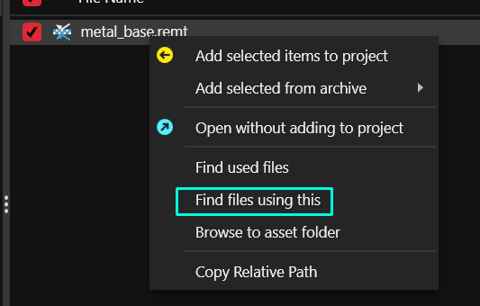
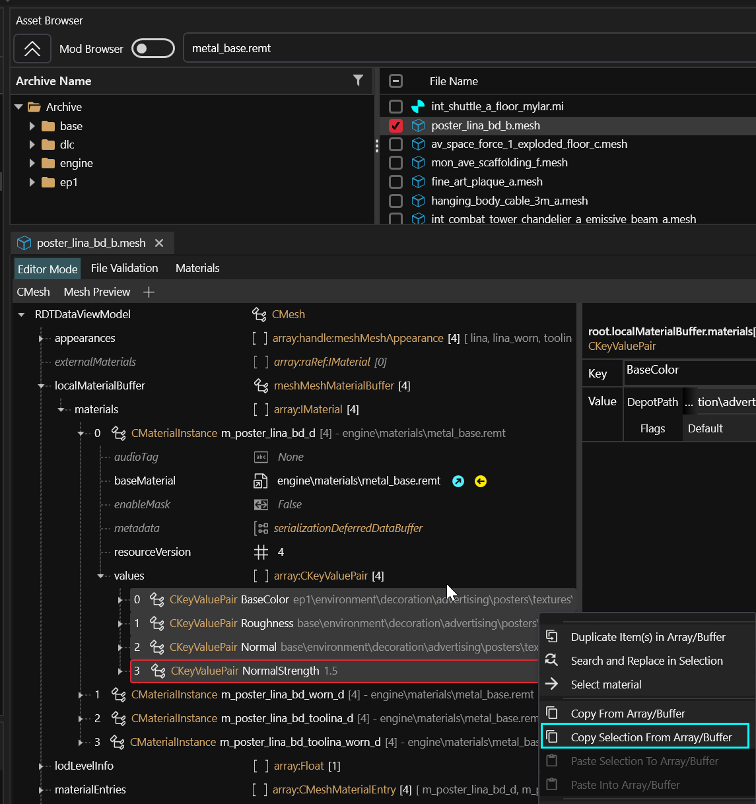

# Using a textured material

## Summary <a href="#summary" id="summary"></a>

**Published:** Jun 29 2022 by [manavortex](https://app.gitbook.com/u/NfZBoxGegfUqB33J9HXuCs6PVaC3 "mention")\
**Last documented edit:** Jun 29 by [manavortex](https://app.gitbook.com/u/NfZBoxGegfUqB33J9HXuCs6PVaC3 "mention")

This guide will teach you how to use a textured (also called `PBR`, which is a subtype of textured and will work) material in Cyberpunk. It is a part of [changing-materials-colors-and-textures.md](../../../../for-mod-creators/modding-guides/items-equipment/editing-existing-items/changing-materials-colors-and-textures.md "mention") — if you are missing information, check the parent page.

## Prerequisite

You have a `CMaterialInstance` that can use your textured material.&#x20;

If you don't have one yet, follow the steps under [changing-materials-colors-and-textures.md](../../../../for-mod-creators/modding-guides/items-equipment/editing-existing-items/changing-materials-colors-and-textures.md "mention"), or skip to [#finding-example-material-configurations](using-a-textured-material.md#finding-example-material-configurations "mention") and copy the entire material.

## The textures material

The default textured material in Cyberpunk can be found under

```
engine\materials\metal_base.remt
```

By setting it as the `baseMaterial`, you're telling your item to load anything you configure under the `values` array.

### Which properties can I use?


`metal_base`'s full properties are documented under [textured-material-properties.md](../../../../for-mod-creators-theory/materials/configuring-materials/textured-material-properties.md "mention"). \
For a full list with explanations, see [configuring-materials](../../../../for-mod-creators-theory/materials/configuring-materials/ "mention")


Some of the most common properties for metal\_base are:

<table><thead><tr><th width="170">Name</th><th width="151">Type</th><th>Description</th></tr></thead><tbody><tr><td>BaseColor</td><td>Texture</td><td>The base texture of your item</td></tr><tr><td>BaseColorScale</td><td>Vector4 / Color</td><td>If you re-select it after setting the name, Wolvenkit will show you a colour editor. This tint will be applied over your BaseColor for easy creation of variants!</td></tr><tr><td>Metalness</td><td>Texture</td><td>How <a href="../../../../for-mod-creators-theory/materials/configuring-materials/#roughness-metalness">metallic</a>/shiny your material is</td></tr><tr><td>Roughness</td><td>Texture</td><td>How <a href="../../../../for-mod-creators-theory/materials/configuring-materials/#roughness-metalness">shiny</a>/rough your material is</td></tr><tr><td>Normal</td><td>Texture</td><td>Path to your normal (bump) map texture</td></tr><tr><td>AlphaThreshold</td><td>Scalar (number)</td><td>Transparency threshold. Only works if the material <code>IsMasked</code> </td></tr><tr><td>Emissive</td><td>Texture</td><td>Texture for glow (with transparency and<code>IsMasked</code>  or black/white, you can control which parts of the item glow)</td></tr><tr><td>EmissiveUV</td><td>Scalar (number)</td><td>Brightness of the glow. 3 is a good neon lamp, 6 might cause loss of vision, 12 will kill vampires immediately</td></tr><tr><td>EmissiveColor</td><td>Color</td><td>What it says. This defaults to white.</td></tr><tr><td>LayerTile</td><td>Scalar (number)</td><td>Seamless tiling factor</td></tr></tbody></table>

### But I have a texture for...

Tough luck, this is the only textured shader we have. Time to get converting :)

### Finding example material configurations

Search for metal\_base in your asset browser:

```
engine\materials\metal_base.remt
```

Right-click on the entry, and select "find files using this". That will get you every base item with a textured material.

With what you now know, you can dig through their material instances and find example parameters.

<figure><figcaption></figcaption></figure>

<figure><figcaption></figcaption></figure>
