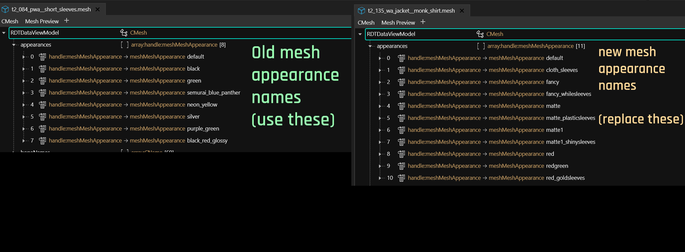

# Replace a player item with an NPC item

### Summary 

**Created & Published**: November 05 2022 by **@manavortex**\
**Last documented edit**: Feb 28 2024 by **@manavortex**

This tutorial will teach you how to switch a player mesh for an NPC garment and map its variants to the existing colours.

Other relevant know-how for this process (you don't need to read them if you already know which item you want to replace):&#x20;

* [Finding an item's spawn code and mesh](../../../../for-mod-creators-theory/references-lists-and-overviews/equipment/spawn-codes-baseids-hashes.md#from-a-baseid-to-an-items-materials)

For a guide how to import meshes into Cyberpunk, check [here](../../../../for-mod-creators-theory/3d-modelling/exporting-and-importing-meshes/).


Make sure that you replace an item that you can actually spawn — not all items in V's folder are actually spawn-able =>[spawn-codes-baseids-hashes.md](../../../../for-mod-creators-theory/references-lists-and-overviews/equipment/spawn-codes-baseids-hashes.md "mention")&#x20;


## Step 1: Replace the mesh

**Perquisite:** You need a Wolvenkit project.

Find the mesh that you want to use ("the old mesh") and replace it with the one that you want to switch in ("the new mesh").


Example: Replacing the short-sleeved poser jacket with the monk shirt with the tied-back sleeves.​ For the male variant, replace `_pwa_` with `_pma`\_ and `_wa_` with `_ma_`.


| the old mesh | `base\characters\garment\player_equipment\torso\t2_084_jacket__short_sleeves\t2_084_pwa__short_sleeves.mesh`                |
| ------------ | --------------------------------------------------------------------------------------------------------------------------- |
| the new mesh | 
<code>base\characters\garment\gang_monk\torso\t2_135_jacket__monk_shirt\t2_135_wa_jacket__monk_shirt.mesh</code> 
 |

1. Find both files in the Asset Browser and add them to your project.&#x20;
2. Move the replacement mesh to the original mesh's folder.
3. Rename the old mesh (e.g. "`t2_084_pwa__short_sleeves.mesh`" -> "`original.mesh`").&#x20;
4. Rename the new mesh to **replace** the old mesh (e.g. "`t2_135_wa_jacket__monk_shirt.mesh`" -> "`t2_084_pwa__short_sleeves.mesh`")
5. Open both meshes in WolvenKit by double-clicking them in the Project Explorer — we will now transfer the appearance names to enable **variants**.

<figure><figcaption>
See Step 2 for more intel on this
</figcaption></figure>

## Step 2: Enabling variants

The game looks up appearances in a mesh file **by name**. If none can be found, then game meshes will fall back to the `default` appearance, which is how the early replacers worked — every variant (base\_01, old\_01, rich\_01) would simply spawn the default appearance.&#x20;

We can simply transfer the names from the old mesh to the new mesh by renaming the entries in the appearances array.&#x20;


If there are more entries than variants available, or if you're just curious which spawn code corresponds to which appearance, go [here](../../../../for-mod-creators-theory/references-lists-and-overviews/equipment/spawn-codes-baseids-hashes.md#from-a-baseid-to-an-items-materials) for a guide how to find out.


Now that we have done that, we can start recolouring.

## Step 3 (optional): Find the .mlsetups

Each appearance in the appearances array has a list of chunkMask entries (one per submesh), which are assigned a material by name.


For a full guide on [Editing mesh appearances](../changing-materials-colors-and-textures.md), follow the link (you don't have to).


&#x20;For a more detailed explanation, you can check [this page](../../../../for-mod-creators-theory/files-and-what-they-do/3d-objects-.mesh-files/#chunkmaterials), but all we care about right now is this lookup chain:

<figure><figcaption></figcaption></figure>

## Step 4: Success!

You can now save your mesh, then **install your mod** by clicking on the green arrow in Wolvenkit's toolbar. Once you have started up the game, the old item will now look like your new mesh — including its variants.


For a guide on how to edit an .mlsetup file (or to change an item's appearance in general), see [here](../changing-materials-colors-and-textures.md#exporting-the-.mlsetup).&#x20;


Enjoy!
