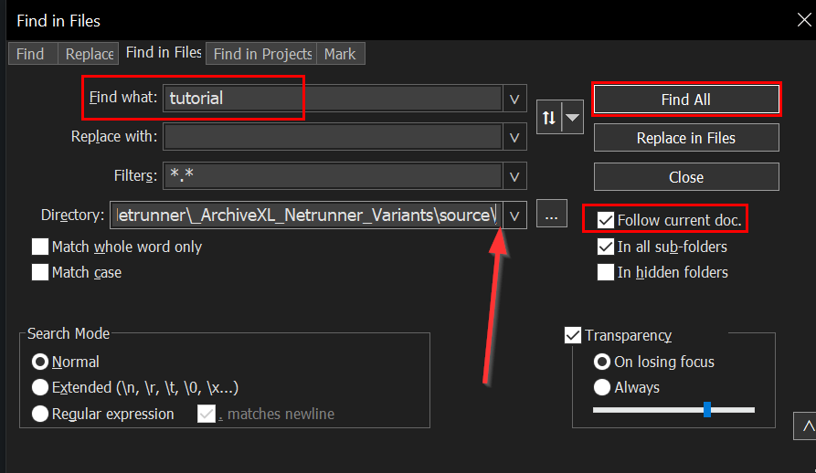
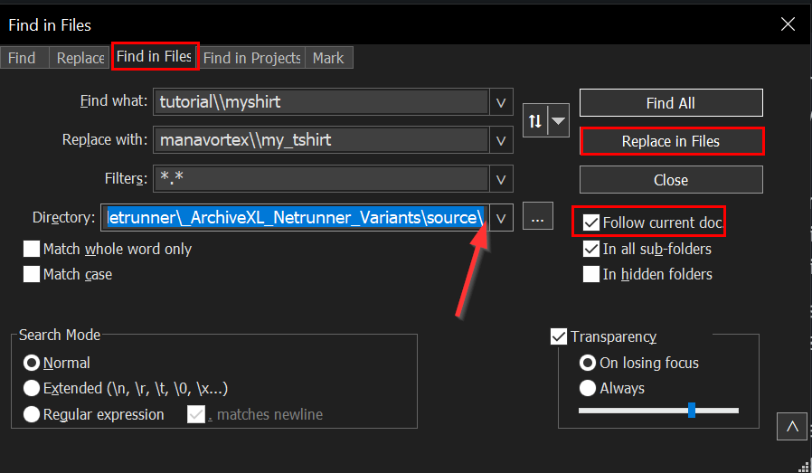

# Moving and renaming in existing projects

## With Wolvenkit

Since 18.5, Wolvenkit's Rename dialog lets you [update references](https://app.gitbook.com/s/-MP_ozZVx2gRZUPXkd4r/wolvenkit-app/editor/project-explorer#rename) inside your project:&#x20;

<figure><figcaption></figcaption></figure>

Moving a file this way will update all references inside Wolvenkit.&#x20;


Moving a folder this way will replace the **folder path** inside your project files, so use it with care for base game folders.


## Manually:

Check the following steps:

* [Exporting the files to JSON](moving-and-renaming-in-existing-projects.md#exporting-the-files-to-json)
* [Changing the file paths](moving-and-renaming-in-existing-projects.md#changing-the-file-paths)
* [Importing back](moving-and-renaming-in-existing-projects.md#importing-back)

## Exporting the files to JSON

1. In Wolvenkit, save all your open tabs and close them. You don't want any files to be open in Wolvenkit for what comes next.
2. Move and rename your files and folders, e.g. `tutorial\myshirt` to `your_modder_name\my_tshirt`. (If Wolvenkit doesn't let you, you can use the Windows Explorer.)


Make sure that you stick to lower case letters and use \_ instead of spaces!

Good: `your_modder_name\my_tshirt`\
Bad: `yourModderName\myShirt`\
Horrible: `your modder name\My Shirt`&#x20;


3. In Wolvenkit, right-click on the top level folder under **archive** and select "Convert to JSON"

## Changing the file paths

We will use [Notepad++](https://notepad-plus-plus.org/downloads/) to adjust the file paths in all files in your project. For that, we need to find and replace the following entries. If you aren't sure about that, see [the next section](moving-and-renaming-in-existing-projects.md#preparation-what-do-i-replace-again).

| What kind of file:                         | Find What (your old path) | Replace with (your new path)  |
| ------------------------------------------ | ------------------------- | ----------------------------- |
| Inside the .archive (with double slashes)  | `tutorial\\myshirt`       | `your_modder_name\\my_tshirt` |
| in resource files (e.g. .xl)               | `tutorial\myshirt`        | `your_modder_name\my_tshirt`  |
| in script files (e.g. reds)                | `tutorial/myshirt`        | `your_modder_name/my_tshirt`  |


If you already know what to do, you can skip forward to [Importing Back](moving-and-renaming-in-existing-projects.md#importing-back).


### Preparation: what do I replace again?

1. Switch Wolvenkit's project browser to `raw`, then open one of the created `.json` files in Notepad++.&#x20;
2. Use "Search: Find in Files..." (`Ctrl+Shift+F`)
3. In `Find What`, enter the name of your old folder (e.g. `tutorial`)
4. Click `Find All` - that will give you all the entries you have to replace.&#x20;


Make sure that you are using the same kind of slashes. If the old path has double backslashes, the new path must have them as well.


<figure><figcaption></figcaption></figure>

### We goin' in

You know what to replace now. For every type of entry, do the following:

1. Use "Search: Find in Files..." (`Ctrl+Shift+F`)
   1. Check the `Follow Current Doc.` checkbox.
   2. Click into the `Directory` field. It now has the path to the file you've just opened
   3. Cut off the subdirectories: you'll want to search and replace directly under `source`
   4. For `Find what` put the name of your old folder that you copied in step 6
   5. For `Replace with` put the name of your new folder. Make sure that you have double backslashes!
   6. Click on `Replace in Files`

<figure><figcaption></figcaption></figure>

## Importing back

Now that we have changed the paths, we need to get those changes back into our Wolvenkit project. In the project's `raw` view, right-click on the toplevel folder and select "[Convert from JSON](https://app.gitbook.com/s/-MP_ozZVx2gRZUPXkd4r/wolvenkit-app/usage/import-export/import-export-as-json#import-as-json)" (however it is named, there's just one item that will let you import your json files)

## Deleting leftover files

If you have packed any tutorial projects before renaming files or folders, make sure to **delete leftover files** from your Cyberpunk 2077 directory. It's easiest to search the root folder for `tutorial` and delete everything that looks like your old stuff — if it's from your project, the next install will put it back.

That's it! Have fun!
