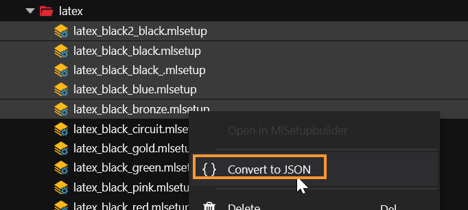
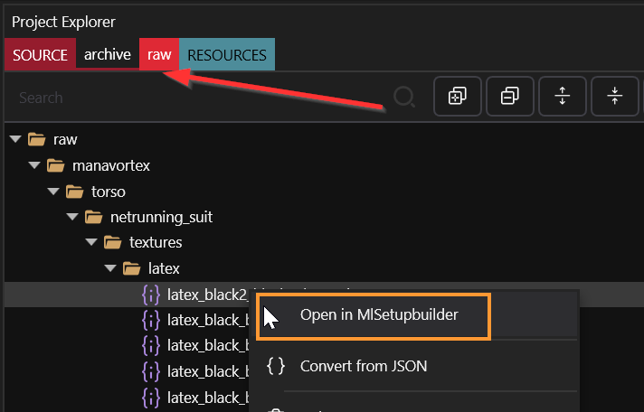
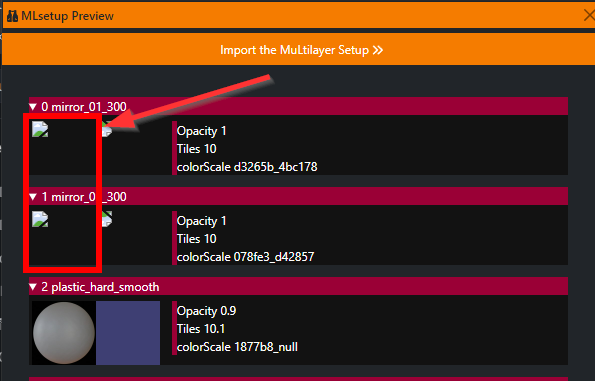
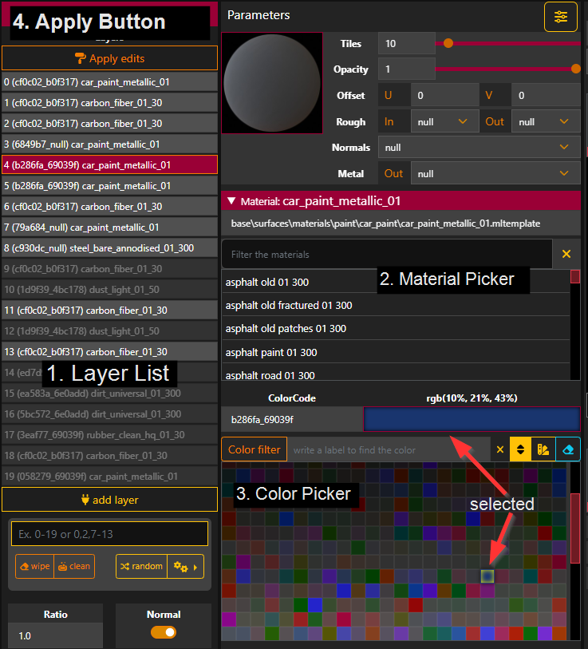
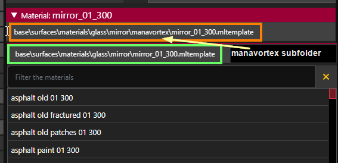

# R\&R: Colour Editing

This page is a subsection of the [Netrunning Suit guide](./). It will teach you how to recolour Cyberpunk items via MLSetupBuilder.

#### Other resources

None of this is required for completing this guide, but if you're curious, you can poke around the wiki and learn a lot more about materials! Just follow the links and get lost... :)

* Another guide: [changing-materials-colors-and-textures.md](../editing-existing-items/changing-materials-colors-and-textures.md "mention")
* Theory: [multilayered](../../../for-mod-creators-theory/materials/multilayered/ "mention")
* Theory: [configuring-materials](../../../for-mod-creators-theory/materials/configuring-materials/ "mention")&#x20;

#### **Assumed level of skill**:&#x20;

You know how to read — if you can read and struggle with this guide, then it's not yet good enough. Please reach out to [manavortex](https://app.gitbook.com/u/NfZBoxGegfUqB33J9HXuCs6PVaC3 "mention") on the [redModding Discord](https://discord.gg/redmodding) so that I can improve it.&#x20;

#### **Time to complete:**&#x20;

* <1h for the tutorial
* < 5 minutes once you know how it works

## Prerequisites:&#x20;

* [ ] You have either decided against a preview, or [configured MLSetupBuilder](./#netrunner-suit-preview) for the preview
* [ ] You have a [Wolvenkit project](r-and-r-your-own-wolvenkit-project.md)
* [ ] You have [extracted the .mlsetup files](r-and-r-your-own-wolvenkit-project.md#selected-files-recolour) from the original mod's .archive and added them to your project

If you can check all those boxes, let's go.

## Overview

MLSetupBuilder can't directly edit game files. For that reason, we need to&#x20;

1. **export** our `.mlsetup` to an `.mlsetup.json`
2. edit that file via MLSetupBuilder
3. import it back

You can't skip any steps in this section that don't say otherwise.


Do not move any of the files. Wolvenkit will lose track of them if you move them around.


## Step 1: Loading the file into MLSetupBuilder


Getting the file into the tool, and opening the right preview


Now that you have added the right file(s) to your project, right-click on them or on their folder and select the option to export them as json:

<figure><figcaption></figcaption></figure>

Once you have done that, switch to your project browser's `raw` tab, right-click on the first file, and select the option to open it in MLSetupBuilder:

<figure><figcaption></figcaption></figure>

This will open MLSB with the correct file already loaded.


Alternatively, you can also open MLSetupBuilder by hand, then press `Ctrl+I` or select `Import` from the menu.



If your material list is saying \[object object], check the [MLSB troubleshooting page.](../../../for-mod-creators-theory/modding-tools/mlsetup-builder/#help-my-layer-config-list-says-object-object)


## (Optional) Step 2: Preview and Layer Masks


If you don't care for this, you can skip to [#step-3-recolouring](r-and-r-colour-editing.md#step-3-recolouring "mention")


#### Enable preview

1. Switch to MLSetupBuilder's [Library tab](../../../for-mod-creators-theory/modding-tools/mlsetup-builder/#mlsb-library).
2. Check if the .mlsetup that you want to edit is in a subfolder `layer_mask_2`
   * No: Search for `t0_005_pwa_body__t_bug`
   * Yes: Search for `t0_001_wa_body__t_bug`
3. Click on the entry that has no suffixes (`_cuff` or `_tight`) to load the model into the 3d viewport.
4. Close the library tab again.


Songbird's suit has a custom mlmask, which I've been too lazy to set up. Future MLSetupBuilder updates will support dynamic switching.


<details>

<summary>What's going on here? </summary>

This is an optional theory block. You can skip this box.

An `.mlsetup` is a list of 20 material definitions, which are projected on the 3d object like layers of paint. The [layer mask](../../../for-mod-creators-theory/materials/multilayered/#what-is-the-mlmask) is a list of 20 cut-out stencils, which block out parts of the layer. (You can see a live example by clicking through the list of layers in MLSB!)

The layers will be applied in order: first Layer 0, then Layer 1, then Layer 2. This is how we can colour the arm stripes separately on `t0_001_wa_body__t_bug`.

If you want to know more, you can read up on the [multilayered](../../../for-mod-creators-theory/materials/multilayered/ "mention") shader.

* Layer 0 will always be applied to the entire suit.&#x20;

</details>

## Step 3: Recolouring

### Prerequisites

* [ ] You have [exported your .mlsetup to json](r-and-r-colour-editing.md#step-1-loading-the-file-into-mlsetupbuilder)
* [ ] It's open in MLSetupBuilder (if it's not, import it now — you can press `Ctrl+I` to open the file picker)


There will be a bunch of links in this section, which you **can absolutely ignore**. \
They'll lead you to **look-up tables** or extra theory.


### Potential breaking point


If you are here to edit other mlsetups, you can skip this section



Some suits are using custom materials, which MLSB isn't yet equipped to handle. You can identify them by the missing icon in the preview (see the screenshot below). \
For details on how to handle those, check [#custom-material-paths](r-and-r-colour-editing.md#custom-material-paths "mention") below.


<figure><figcaption><p>This is how you identify a custom material. Read <a href="r-and-r-colour-editing.md#custom-material-paths">custom material paths</a> on what to do.</p></figcaption></figure>

### Change the colours

1. Click through the **layer list** on the left (1).
2. The `Material` value (2) changes based on your layer selection, as will the available options
3. Change the colour by clicking on it in the Color Picker (3)
4. Click "Apply Edits", Hotkey: `Ctrl+Shift+A`  (4)

<figure><figcaption></figcaption></figure>

5. Repeat the process until you're satisfied
6. Now export the `.mlsetup` (shortcut: `Ctrl+E`).&#x20;
7. Overwrite the file you imported (e.g. `mirror_hex_black.mlsetup.json`)
8. Change more .mlsetup files, or head to [#step-4-importing-into-wolvenkit](r-and-r-colour-editing.md#step-4-importing-into-wolvenkit "mention")

### Custom material paths


This section tells you how to deal with custom materials. You can identify them by their broken preview icon.

If you don't have any of those in your .mlsetup or if you are just recolouring MlSetups independently from the Netrunner guide, then you can skip to [#step-4-importing-into-wolvenkit](r-and-r-colour-editing.md#step-4-importing-into-wolvenkit "mention")



<figure><figcaption><p>This is how custom materials currently look in the preview. (MLSB 1.6.7)</p></figcaption></figure>

Since I knew that I was going to share this, I've moved custom materials into a subfolder `manavortex` in their original path.

To get the original color picker back, we'll need to change the path while you're editing the material, then put the original back when it's time for export. You do it like this:

1. Click into the material path (orange box)

<figure><figcaption></figcaption></figure>

2. Press `Ctrl+A` to select the path.
3. Press `Ctrl+C` to copy it. Paste it into a text document so that you can restore it later.
4. Find the subfolder `manavortex\` in the path and delete it
   * If the name of the material is `mirror_01_300`, change it to `mirror_01_100`

```
before: base\surfaces\materials\glass\mirror\manavortex\mirror_01_300.mltemplate
after: base\surfaces\materials\glass\mirror\mirror_01_100.mltemplate
```

5. You now have a working colour palette and can edit the material.&#x20;
6. When you're done, click into the material path again and restore the original value.&#x20;
7. You can now export (ctrl+E)

## Step 4: Importing into Wolvenkit

Switch back to Wolvenkit.

1. Make sure that the Project Explorer shows either of the tabs `source` or `raw`
2. Find the file that you just edited
3. Right-click on it and select the option to convert it from JSON:&#x20;

<figure><figcaption></figcaption></figure>

## Step 5: Testing

Time to test! Install and launch your Wolvenkit project:

<figure><figcaption></figcaption></figure>

If you did everything right, your recolour will now be active.&#x20;

Otherwise, check [r-and-r-troubleshooting.md](r-and-r-troubleshooting.md "mention").
