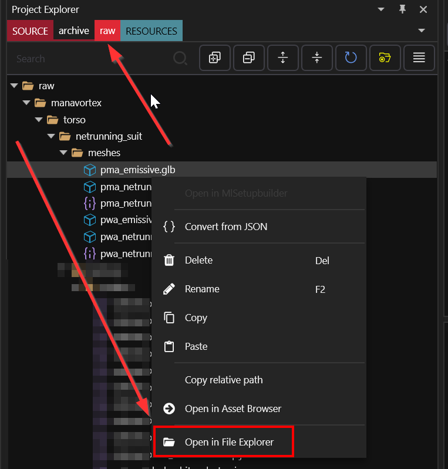
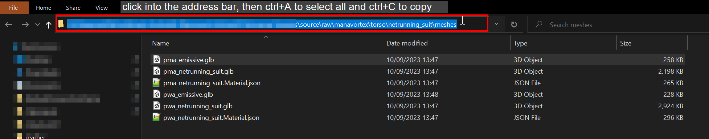
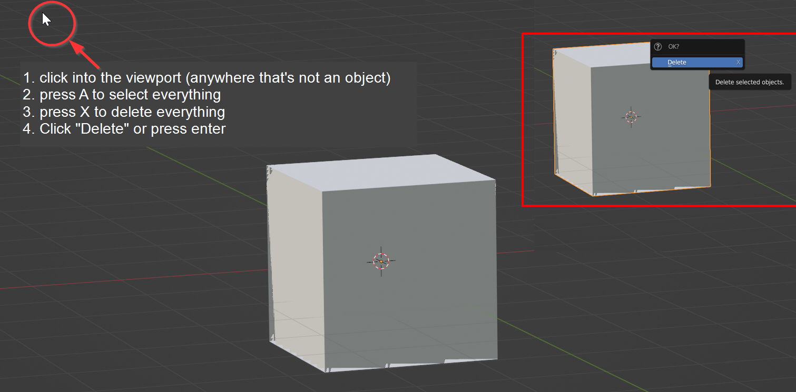
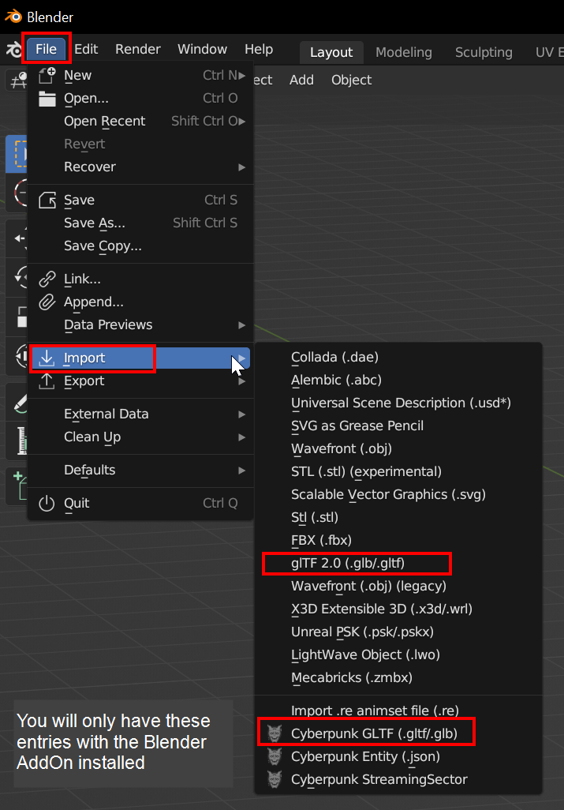
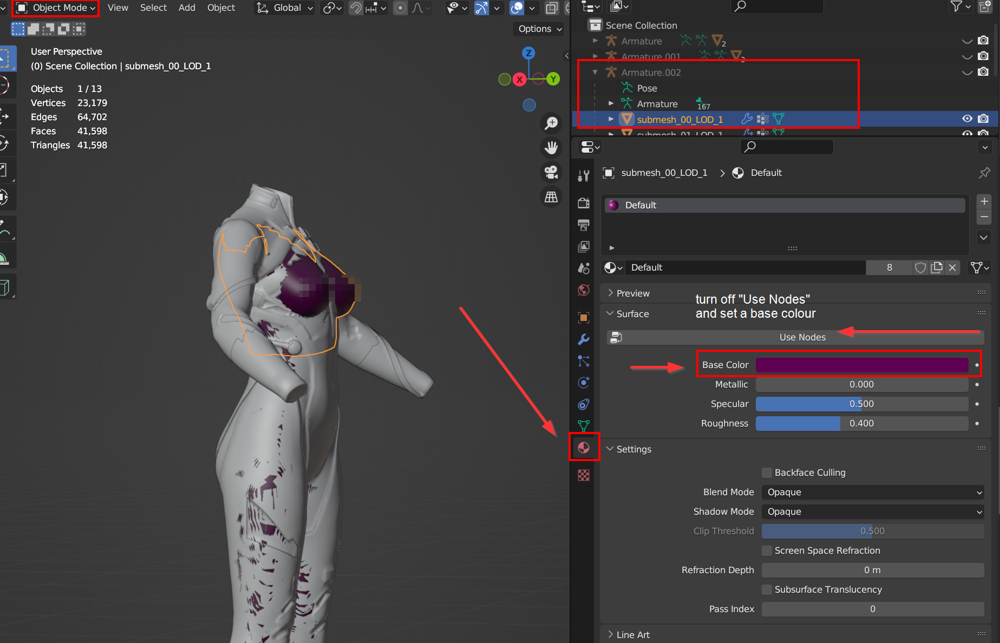
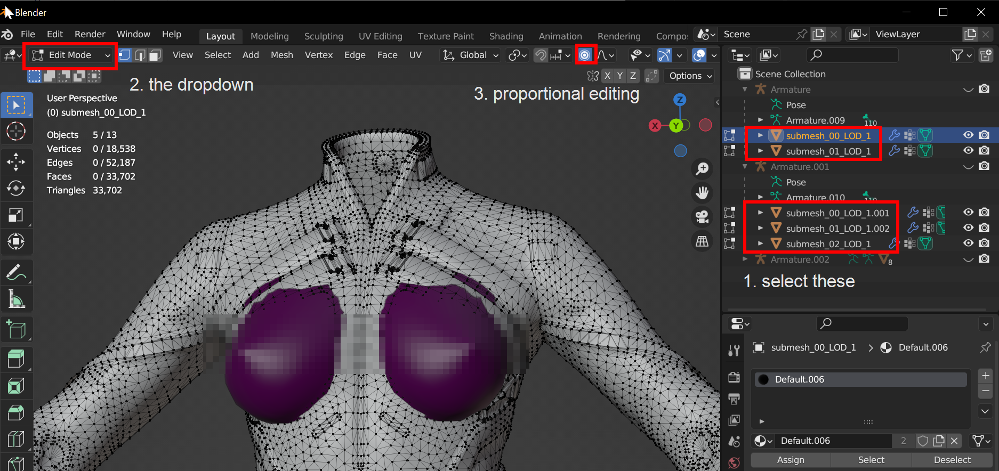
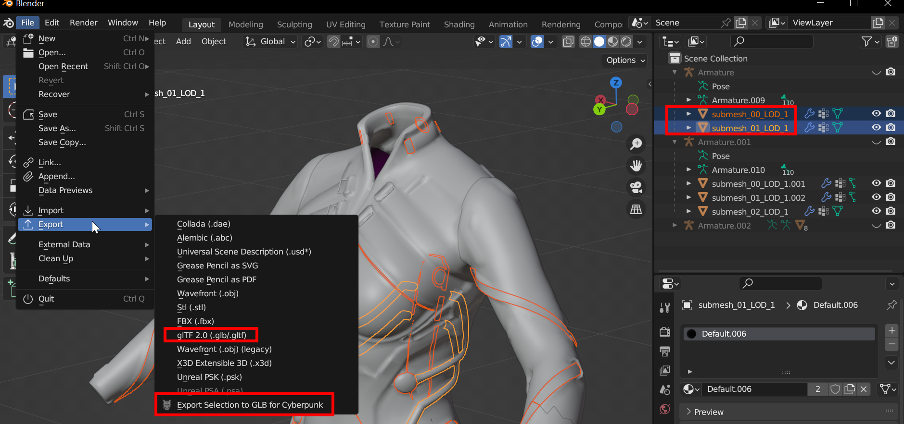
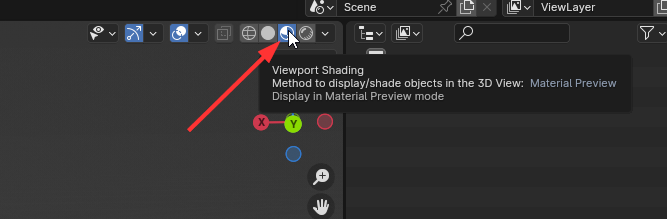

# R\&R: Refitting (step by step)

This page is a subsection of the [Netrunning Suit guide](./). It will teach you how to do custom refits in Blender.


If you're totally new and totally lost in Blender, you can read [blender-getting-started](../../../for-mod-creators-theory/3d-modelling/blender-getting-started/ "mention"). This is not necessary for the purpose of this guide!


#### **Assumed level of skill**:&#x20;

You know how to read — if you can read and struggle with this guide, then it's not yet good enough. Please reach out to [manavortex](https://app.gitbook.com/u/NfZBoxGegfUqB33J9HXuCs6PVaC3 "mention") on [Discord](https://discord.gg/redmodding) so that I can improve it.&#x20;

#### **Time to complete:**&#x20;

* < 1h for import, export and setup (< 5 min once you know how it works)
* as long as you want on the actual editing&#x20;

## Prerequisites:

* [ ] The [Wolvenkit Blender I](https://github.com/WolvenKit/Cyberpunk-Blender-add-on)[O Suite](../../../for-mod-creators-theory/modding-tools/wolvenkit-blender-io-suite/) is installed and working with Blender
* [ ] Your [Wolvenkit Project](r-and-r-your-own-wolvenkit-project.md) is named correctly to load before or overwrite the original mod


You can check out the [auto-refitter](../../../for-mod-creators-theory/modding-tools/wolvenkit-blender-io-suite/wkit-blender-plugin-akl-autofitter.md), which might render all of this obsolete.


## Step 1: Adding the meshes to your project

You're already supposed to have a project. If you don't, check [r-and-r-your-own-wolvenkit-project.md](r-and-r-your-own-wolvenkit-project.md "mention")

### The body

First, you need the mesh of the body that you want to refit for. (Technically speaking, you could do without, so if you like suffering, go ahead and skip this step.)

There are two ways of acquiring the body mesh:

#### From Nexus

Check the Nexus page of the body mod you're using — there's a good chance that the modder is simply offering a resource that you cna import into Blender.

#### From the mod itself

It might be easier and faster to simply export the base body.&#x20;

1. Switch to the [Mod Browser](../../analysing-other-mods/#step-1-switch-to-mod-browser)
2. In the Wolvenkit search bar, find the base body mesh:
   * Female body gender: `base\characters\common\player_base_bodies\player_female_average\t0_000_pwa_base__full.mesh`
   * Male body gender: `base\characters\common\player_base_bodies\player_man_average\t0_000_pma_base__full.mesh`
   * Anything else: Check [this list ](../../../for-mod-creators-theory/references-lists-and-overviews/cheat-sheet-body.md#player-base-body)or go hunting - here's the [Wolvenkit search documentation](https://app.gitbook.com/s/-MP\_ozZVx2gRZUPXkd4r/wolvenkit-app/usage/wolvenkit-search-finding-files)!
3. Check the preview to make sure that you're grabbing the right mesh, then [add it to your project](https://app.gitbook.com/s/-MP\_ozZVx2gRZUPXkd4r/wolvenkit-app/editor/asset-browser#adding-files-to-projects).

### The suit

1. In the [Mod Browser](https://app.gitbook.com/s/-MP\_ozZVx2gRZUPXkd4r/wolvenkit-app/editor/asset-browser#mod-browser), now search for the following files:
   * female body gender:\
     `manavortex\torso\netrunning_suit\meshes\pwa_netrunning_suit.mesh`\
     `manavortex\torso\netrunning_suit\meshes\pwa_emissive.mesh`
   * male body gender:\
     `manavortex\torso\netrunning_suit\meshes\pma_netrunning_suit.mesh`\
     `manavortex\torso\netrunning_suit\meshes\pma_emissive.mesh`
2. Add them to your project by double-clicking or via context menu.
3. If you don't want to use the emissive mesh, you can delete it now.

## Step 2: Exporting the meshes from WKit

The whole process is explained [here](../../../for-mod-creators-theory/3d-modelling/exporting-and-importing-meshes/#gltf-binary-.glb).&#x20;

TL;DR:&#x20;

* Find the "Export Tool"
* Select the mesh(es) you want
  * Body
  * Netrunning Suit
  * _optional: emissive submesh_
* Click **Export** button

Export failed: Error while finding file

If you failed to export because of error messages like this one:

`Message: Error while finding the file: manavortex\torso\netrunning_suit\textures_netrunning_suit.mi`

then you need to uncheck [Export Materials (default)](https://app.gitbook.com/s/-MP\_ozZVx2gRZUPXkd4r/wolvenkit-app/usage/import-export/models#export-materials-default "mention") in the export tool's settings panel

In Wolvenkit, switch to the `raw` folder (or scroll all the way down). Right-click on the glb file, and select "Open in File Explorer":

<figure><figcaption></figcaption></figure>

#### Windows Explorer Path

You will now see a Windows Explorer window. Copy the file path like this:

<figure><figcaption>
Alternatively, you can also navigate Blend
</figcaption></figure>

## Step 3: Importing to Blender


You might see the submesh and armature numbers changing through the guide. That is ~~to keep you on your toes~~ because I didn't take them in one setting, and also because they don't matter - any number from `.001` to .`999` will be removed on reimport with Wolvenkit.


Open Blender and create a new file. You will probably be greeted by a bunch of standard objects that we need to get rid of:

<figure><figcaption></figcaption></figure>

Now, let's import our meshes.&#x20;

From the "File" menu, select "Import" and then one of the entries for "gltf":

<figure><figcaption></figcaption></figure>

You will now see a file picker.&#x20;

<figure><figcaption></figcaption></figure>

1. In the path bar at the top, paste the path from the [previous step](r-and-r-refitting-step-by-step.md#windows-explorer-path).
2. Select the mesh(es) that you want to refit, and import them
3. Now, repeat the process with the body mesh. If you don't know where it is, you can find it here (`..` means that you need to co up a directory from the one with the netrunning suits):\
   `..\..\..\..\base\characters\common\player_base_bodies\player_female_average\t0_000_pwa_base__full.glb`
4. If you have imported without the plugin, you will see something like this and need to hide the armatures. If you have imported with the plugin, it will already have done that for you.

<figure><figcaption></figcaption></figure>


You are currently in Object Mode, which will let you select whole objects.


5.  **Optional, but recommended**: change the colour of the body mesh to better see clipping (see the next screenshot for details):

    1. Click on the body mesh, or find it in the Scene Collection under its armature parent, and select it there.
    2. Select the "Material Properties" tab in the right sidebar (a round red icon near the bottom at the list)
    3. Click on "Use Nodes" to uncheck it
    4. Set a base colour that is not white to see clipping

    <figure><figcaption></figcaption></figure>

## Step 4: Refitting


Starting in version 1.5.0, the [wolvenkit-blender-io-suite](../../../for-mod-creators-theory/modding-tools/wolvenkit-blender-io-suite/ "mention") features an [auto-refitter](../../../for-mod-creators-theory/modding-tools/wolvenkit-blender-io-suite/wkit-blender-plugin-akl-autofitter.md), which supports many custom bodies and will be expanded in the future.&#x20;

If you want to use the plugin instead of refitting by hand, make sure to select all meshes (Step 1 on the list below) before following the instructions under[wkit-blender-plugin-akl-autofitter.md](../../../for-mod-creators-theory/modding-tools/wolvenkit-blender-io-suite/wkit-blender-plugin-akl-autofitter.md "mention").


We will use the Proportional Editing mode here, which leaves garment supports intact and prevents the risk of [string cheese](../../../for-mod-creators-theory/3d-modelling/troubleshooting-your-mesh-edits.md#my-mesh-is-string-cheese-exploding-vertices-a-puddle-on-the-floor). If you don't vibe with that, you can read up [here](../../../for-mod-creators-theory/3d-modelling/mesh-sculpting-techniques.md#sculpting) on other approaches for refitting, or refer to the [community guides](../../community-guides/) section.

1. While still in `Object Mode`, expand both armatures (not the one with the body) and select all included meshes.
2. Switch into Edit Mode by hitting Tab or selecting it from the dropdown at the topleft
3. Turn on "Proportional Editing" by checking the round button at the top of the viewport and select a low Proportional Size like 0.1m at the bottom of the drop-down menu next to it.

<figure><figcaption></figcaption></figure>

4. Hide the body mesh by shift-clicking on the body armature's eye icon twice: it's in the way, and we need to select some vertices.

<figure><figcaption>
Shift-click will hide the entire armature and its children.
</figcaption></figure>

5. Make a selection — somewhere close to the future highest point.

<figure><figcaption></figcaption></figure>

5. Show the body mesh again:&#x20;
   1. Shift-click on the eye icon next to the body armature to show everything
   2. left-click on the eye icon (no shift, just a regular click) to hide only the armature)

### The tools

We will use scaling (shortcut: `S`) and movement (shortcut: `G`). &#x20;

* You can lock the axis on which you are moving by pressing `X`, `Y` or `Z`
* You can scale the strength of the proportional modifier by using the mouse wheel — but only after you have a tool selected.

I'm afraid that this is where you [draw the rest of the owl](https://knowyourmeme.com/memes/how-to-draw-an-owl) - you need to refit the suit. Try playing around with the settings. For example, you can start by pressing `G` - `Y` to let out the chest, then try scaling.&#x20;

Do this until you have covered all skin that you don't want exposed. Now it's time to export our edited meshes, and import them back.


**Pro tip:** Keep the .blend file open until you have seen the refit in action. It's quite likely that it still clips somewhere and that you'll have to get active again.


## Step 5: Exporting

1. Switch back to Object mode by pressing `Tab`&#x20;
2. select all meshes under one armature (e.g. the emissive meshes)
   * If you  are exporting without the Wolvenkit Plugin, select the armature as well.&#x20;
3. From the menu, select File -> Export&#x20;

<figure><figcaption>
If you  are exporting without the Wolvenkit Plugin, find the correct settings in the <a href="../../../for-mod-creators-theory/3d-modelling/exporting-and-importing-meshes/#gltf-binary-.glb-1">import/export guide</a>, then check <code>Selected Only</code>.
</figcaption></figure>

4. **Overwrite** the file you originally imported from (`pwa_emissive.glb`)
5. Repeat the process with the other armature.

## Step 6: Importing into Wolvenkit


As of 8.9.1, Garment Support is still experimental. If your meshes look like string cheese or twitch all over the place, you can [delete the parameters](../../../for-mod-creators-theory/3d-modelling/troubleshooting-your-mesh-edits.md#my-mesh-is-string-cheese-exploding-vertices-a-puddle-on-the-floor). That will destroy the automatic deform when you put a jacket on, but at least your mesh will work.


1. In the Import Tool, select the first file that you want to import, then check the `Import Garment Support` box.
2. Do the same for the second mesh and the emissive components.
3. Import both glb files.

## OK, what now?

Time to test! Install and launch your Wolvenkit project:

<figure><figcaption></figcaption></figure>

If you did everything right, your refit will now be active. If not, it's troubleshooting time.&#x20;

* Check the [Export/Import](../../../for-mod-creators-theory/3d-modelling/exporting-and-importing-meshes/) guide for step-by-step instructions
* If anything is wrong with your mesh, head to [troubleshooting-your-mesh-edits.md](../../../for-mod-creators-theory/3d-modelling/troubleshooting-your-mesh-edits.md "mention")
* Check [r-and-r-troubleshooting.md](r-and-r-troubleshooting.md "mention") for tutorial-specific issues

Otherwise:


Happy modding, choomba!


## Troubleshooting

You can find the general troubleshooting for 3d edits and -imports under [troubleshooting-your-mesh-edits.md](../../../for-mod-creators-theory/3d-modelling/troubleshooting-your-mesh-edits.md "mention").

### My mesh refuses to show any colours!

Make sure that you switch the Viewport in Blender to **Viewport Shading** (the third globe in the topright corner)

<figure><figcaption></figcaption></figure>
