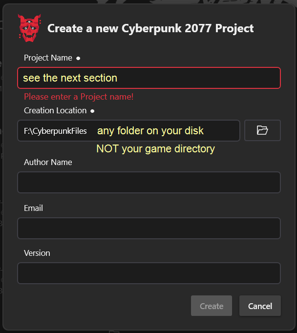
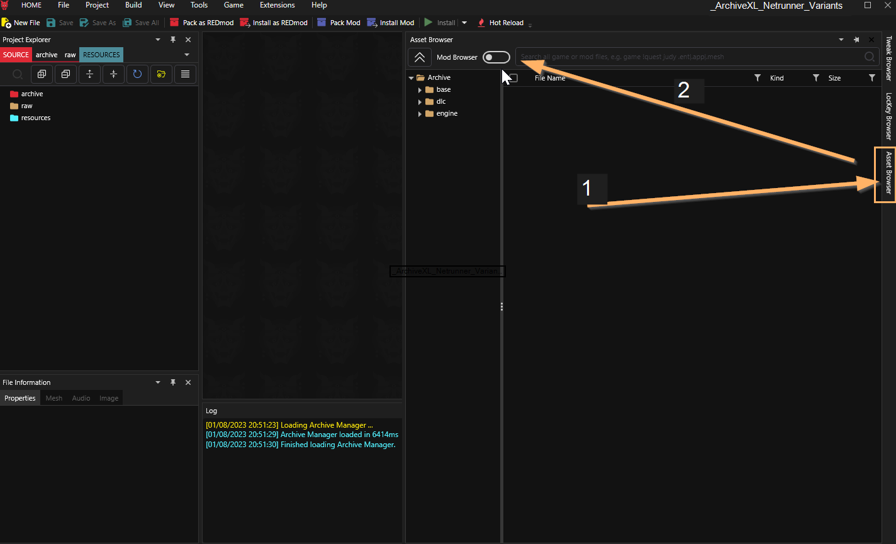
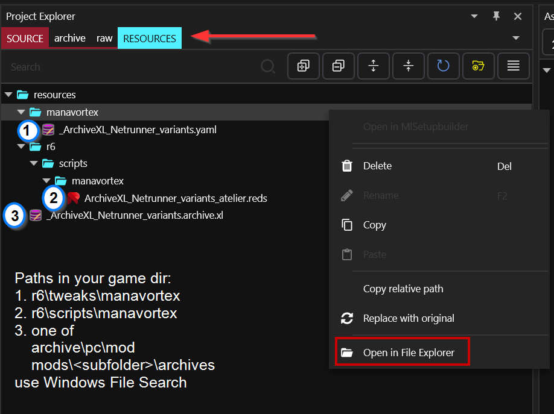
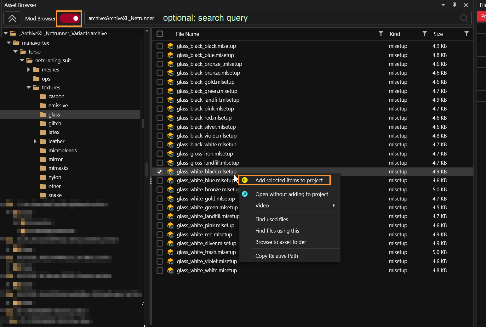
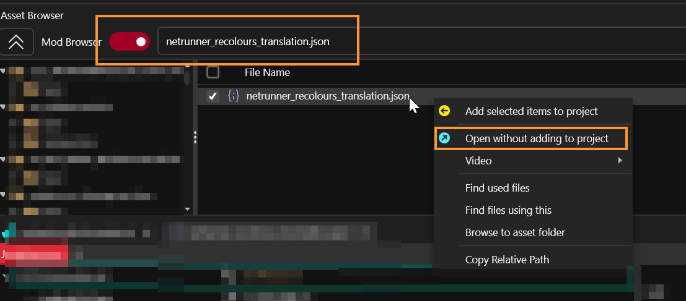
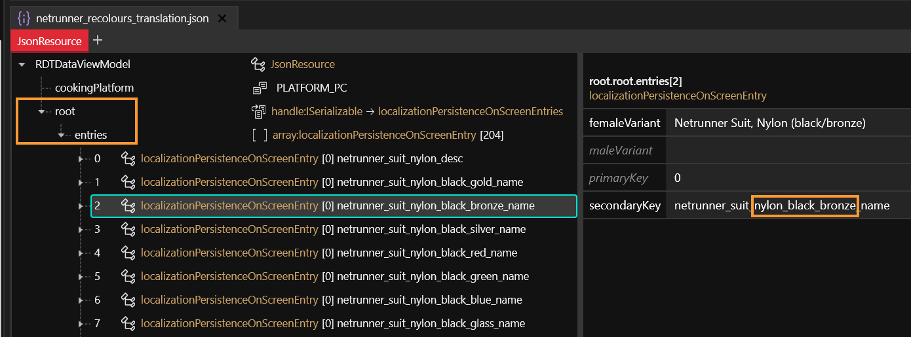
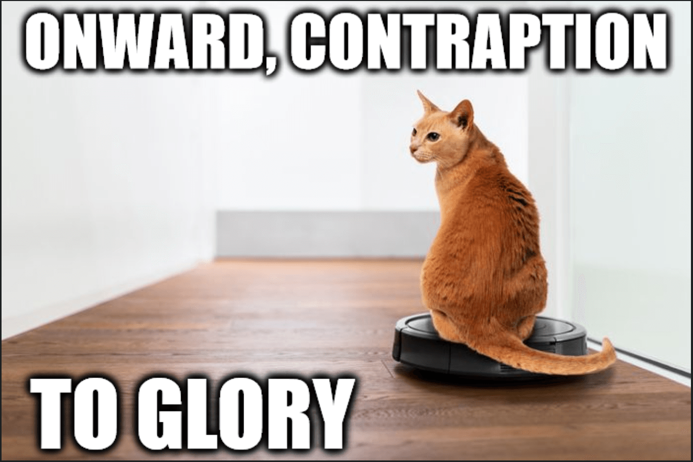

# R\&R: Your own Wolvenkit project

## Summary <a href="#summary" id="summary"></a>

**Created & Published**: September 30 2023 by **@manavortex**

This page is a part of the [.](./ "mention") guide and will walk you through the process of creating your own Wolvenkit project. Here, we will:

* create our project
* solve load order via **project name**
* get the files from the mod that we want to change

**Time to complete:**&#x20;

* \~30 minutes for the tutorial
* once you know how it works: < 5 minutes to create a project and add the correct files from a mod

### Skipping and skimming

his guide contains the minimal amount of fluff and will **link** background information rather than giving it. Any links will tell you which parts you're supposed to read — if they don't, you're free to ignore them.

For that reason, _**you shouldn't skip or skim**_ unless the section tells you that it's optional.

<figure><figcaption></figcaption></figure>


The principles you learn here are universal. Once you have understood how this works, you can recolour and refit **any Cyberpunk item**.



If you are editing modded items, you should **seek permission** first. For your personal use, you can (legally) do what you want, but making mods takes **time and effort**.&#x20;

Please respect mod creators' wishes in that regard.&#x20;

You can check find the standard permissions on a mod's Nexus page, `Description` tab, under the **Permissions and Credit** header right next to the requirements.


### Prerequisites

The checklist below will make sure that you're ready to go for the tutorial. The links in the description will tell you how to complete each step if you can't do it on your own yet.

* [ ] You have [Wolvenkit installed](https://app.gitbook.com/s/-MP\_ozZVx2gRZUPXkd4r/getting-started/download) and configured
* [ ] You have [installed the mod](./#install-the-mod)
* [ ] For **recoloring**: you have [MLSetupBuilder installed](../../../for-mod-creators-theory/modding-tools/mlsetup-builder/#installation) and [configured](./#netrunner-suit-preview)

## Why do I want a Wolvenkit project?

To edit an appearance, you need to **make a mod**. For that, you need a Wolvenkit project.


Normally, you get an example project to download — but you already have all the necessary files, since you downloaded them from Nexus.&#x20;

This guide will teach you how to change stuff without the original creator's help. It's easy!

Once you have a Wolvenkit project, you can [install your mod](https://app.gitbook.com/s/-MP\_ozZVx2gRZUPXkd4r/wolvenkit-app/menu/toolbar#install-and-launch) and see any changes you made become active right away.


There are two ways you can go about the process: do either a **full repack** of my mod, or **create a compatibility archive**. This section will explain the differences, the [next one](r-and-r-your-own-wolvenkit-project.md#creating-your-wolvenkit-project) will walk you through the process of setting things up for either of those options.

|                                                                                        | Full Repack                            | Compatibility Archive                  |
| -------------------------------------------------------------------------------------- | -------------------------------------- | -------------------------------------- |
| Needs original mod?                                                                    | no, is a full replacement              | yes                                    |
| Can update original mod?                                                               | no — doing that will nuke your changes | yes                                    |
| Needs[ load order](../../../for-mod-users/users-modding-cyberpunk-2077/load-order.md)? | No, replaces original mod              | yes, needs to load before original mod |


Once you've made your decision, you can proceed to the next section and [create your Wolvenkit project](r-and-r-your-own-wolvenkit-project.md#creating-your-wolvenkit-project). If you aren't certain yet, you can keep reading to find the pros and cons listed more clearly.


### A full repack

Your mod completely **overwrites** the original mod, creating your own local copy.&#x20;


I do this with mods for my own personal use — I don't care if the original mod is updated, my character will only ever wear that one custom variant.


#### Pros:&#x20;

* Anything I do to the mod in the future won't affect you

#### Cons:&#x20;

* Anything I do to the mod in the future won't affect you
* If you update or reinstall the original mod, you will overwrite your changes
* If you're anything like me, you'll lose track of which files you have or haven't modified

### A patch

You'll create a compatibility mod that will exist **together** with the original.


I do this with mods where I only want to change little things, e.g. removing a submesh. When the original mod updates, I can update my compatibility mod in <5 minutes.


#### Pros:&#x20;

* You can still update and reinstall the original without overwriting your changes
* Your mod has only exactly those files that you've actually changed

#### Cons:

* You have to keep the original installed
* Only works together with the original
* Updates on the original mod **might** necessitate an update on your part
* Your mod has to load **before** the original, so you need to fix [load order](../../../for-mod-users/users-modding-cyberpunk-2077/load-order.md). (This guide will tell you how)

This is where you **decide** for one of those options.

## Creating your Wolvenkit project


The .archive that Wolvenkit packs for you will have the same name as your project. Stick to the recommendations in Step 4, or read the expandable box to learn more.


1. From Wolvenkit's menu bar, select File -> New Project
2.  Fill the fields in the dialogue:\


    <figure><figcaption></figcaption></figure>
3. `Creation Location`: This is where your loose files are going to live. From here, Wkit can pack it as a mod and install it to your game directory. \
   Select any folder outside of your game directory.
4. `Project Name`:  The name of your project, and subsequently, the name of your .archive file.&#x20;
   * If you want to **overwrite**: Name it the same as the original mod's `.archive` (`_ArchiveXL_Netrunner_Variants`)
   *   If you want to **patch**: To maintain [load-order.md](../../../for-mod-users/users-modding-cyberpunk-2077/load-order.md "mention"), your project needs to come before the original in [ascii sort order](https://theasciicode.com.ar/). Pick any of the following:

       * `_00_ArchiveXL_Netrunner_Variants`
       * `_ArchiveXL_00_Netrunner_Refit`
       * `_ArchiveXL_Netrunner_00_Variants`

       My personal preference is 2 and 3, as that will put the files next to the original mod.

<details>

<summary>Why do we name it like that?</summary>

In Cyberpunk, any file can only **be modded once**. When something has altered a texture or mesh, everyone else can get lost.

At some point during start-up, Cyberpunk 2077 will open up the mod directory, grab a list of all mods, and load them. Naturally, it will start at the top of that list, so your mod needs to be **further up** than the original.

We achieve that via **file name** - hence #4 on the above list.&#x20;

</details>

## Add files from the mod to your project

This part will show you how to add files to your project (you can't change them if you don't).&#x20;

### Prerequisites&#x20;

You have installed the mod from [Nexus](https://www.nexusmods.com/cyberpunk2077/mods/9314).

### Why are we doing this?


Skip to [#how-to-export-files](r-and-r-your-own-wolvenkit-project.md#how-to-export-files "mention") if you don't care.


To alter an existing item, you need to **create a mod** that will overwrite the original resource. This mod must modify that file **first** - which is where the load order comes in.


Do not move or rename any of those files, they need to be exactly where Wolvenkit puts them.


The section&#x20;

1. describes the process of [#how-to-export-files](r-and-r-your-own-wolvenkit-project.md#how-to-export-files "mention")
2. tells you which files to use it on for \
   [#selected-files-recolour](r-and-r-your-own-wolvenkit-project.md#selected-files-recolour "mention")\
   [#selected-files-refit](r-and-r-your-own-wolvenkit-project.md#selected-files-refit "mention")


For the general documentation on adding files to your project, see [here](../../analysing-other-mods/#step-1-switch-to-mod-browser).&#x20;


### How to export files

1. In Wolvenkit, open the Asset Browser (pinned at the right-hand side by default), and toggle the switch to "Mod Browser".

<figure><figcaption></figcaption></figure>

2. Find `_ArchiveXL_Netrunner_Variants`, then click on it. It will be near the bottom of the list, together with your other mods starting with `_`
3. You can now **browse the archive**, or use [Wolvenkit's search bar](https://app.gitbook.com/s/-MP\_ozZVx2gRZUPXkd4r/wolvenkit-app/usage/wolvenkit-search-finding-files) (next to the big red toggle button) to find files inside the archive by searching for `archive:ArchiveXL_Netrunner`.
4. Once you have found the correct items (for [recolour](r-and-r-your-own-wolvenkit-project.md#selected-files-recolour) or [refit](r-and-r-your-own-wolvenkit-project.md#selected-files-refit)), this is how you add them to the project:

<figure><figcaption></figcaption></figure>

### Selected files: full repack

If you want to overwrite the complete mod, run this query in Wolvenkit's Mod Browser:&#x20;

```
archive:ArchiveXL_Netrunner
```

1. Add all files to the project — everything.
2. Now, switch the Project Explorer to `Resources`. It will be empty; you have to create the following folder structure:

```
resources                       << you are here
  - manavortex
  - r6
    - scripts
      - manavortex
```

Find and copy the following files from your **game directory** into the subfolders of `resources` (there'll be a screenshot in a minute)

#### \_ArchiveXL\_Netrunner\_variants.yaml

From: `Cyberpunk 2077\r6\tweaks\manavortex`\
To: `resources\manavortex`

#### ArchiveXL\_Netrunner\_variants\_atelier.reds

From: `Cyberpunk 2077\r6\scripts\manavortex`\
To: `resources\r6\scripts\manavortex`

#### \_ArchiveXL\_Netrunner\_variants.archive.xl

From:  either\
&#x20;   vanilla install: `Cyberpunk 2077\archive\pc\mod`\
&#x20;   REDmod: `Cyberpunk 2077\mods\RANDOMNUMBER_ArchiveXL_Netrunner_variants\archives`\
To: `resources`

<figure><figcaption></figcaption></figure>

### Selected files: Emissive

#### **TL;DR: via search browser query**

```
archive:ArchiveXL_Netrunner > emissive > .mi
```

Add all those files to your project, then skip the rest of this page and go to [r-and-r-emissive.md](r-and-r-emissive.md "mention")

### Selected files: Recolour

All material colour definitions are stored in `.mlsetup` files, which we'll be editing in [r-and-r-colour-editing.md](r-and-r-colour-editing.md "mention").


If you want to edit a file that is not part of [High Fashion Netrunning Suits](https://www.nexusmods.com/cyberpunk2077/mods/9314), you need to find it first.&#x20;

If it is part of a different mod, see [analysing-other-mods](../../analysing-other-mods/ "mention") and use **that** archive. You just need to adjust your search queries below.

&#x20;If you want to modify base game items, you need to find their mesh (check [spawn-codes-baseids-hashes.md](../../../for-mod-creators-theory/references-lists-and-overviews/equipment/spawn-codes-baseids-hashes.md "mention")). Once you have that, you can use "find used files" from the Asset Browser's context menu to find all .mlsetups, or you open the mesh in Wolvenkit to follow the [material definition chain](../../../for-mod-creators-theory/files-and-what-they-do/3d-objects-.mesh-files/#step-1-appearances).&#x20;


#### **TL;DR: via search browser query**

<pre><code><strong>find all .mlsetup files in the mod:
</strong>archive:ArchiveXL_Netrunner > .mlsetup

<strong>or more targeted:
</strong><strong>archive:ArchiveXL_Netrunner > .mlsetup > material > colour
</strong>
e.g.
archive:ArchiveXL_Netrunner > .mlsetup > snake > blue
archive:ArchiveXL_Netrunner > .mlsetup > carbon > bronze
archive:ArchiveXL_Netrunner > .mlsetup > carbon > white > bronze
</code></pre>

<figure><figcaption></figcaption></figure>

#### File structure explained

* All material definitions in this mod are in the folder `manavortex\torso\netrunning_suit\textures`
* The first level subfolders group the `.mlsetup` files by material (e.g. `nylon`, `snake`, `other`)
* The texture files inside the folders are named like `material_baseColor_accentColor`. Base colour and accent colour **should** correspond with the in-game suit name.&#x20;
* If there is a subfolder inside the material folder, the `mlsetup`s inside are using the **secondary `mlmask`**. That's not going to mean anything to you, but we'll get back to it on [r-and-r-colour-editing.md](r-and-r-colour-editing.md "mention").


If the names aren't clear enough or if you can't guess which file you have to take, you can open `netrunner_recolours_translation.json` in Wolvenkit:

<figure><figcaption></figcaption></figure>

Expand the `root` node and then the `entries` node. By selecting a node, you can see the translation text. The field for `secondaryKey` contains the colour variant, which corresponds to the mlsetup file name:

<figure><figcaption></figcaption></figure>

### Selected files: Refit

For a refit, you only need two files (one if you don't care about the emissive properties):

#### female body gender

<table><thead><tr><th width="200">mesh</th><th>path in files</th></tr></thead><tbody><tr><td>suit</td><td><code>manavortex\torso\netrunning_suit\meshes\pwa_netrunning_suit.mesh</code></td></tr><tr><td>emissive</td><td><code>manavortex\torso\netrunning_suit\meshes\pwa_emissive.mesh</code></td></tr></tbody></table>

#### male body gender

<table><thead><tr><th width="200">mesh</th><th>path in files</th></tr></thead><tbody><tr><td>suit</td><td><code>manavortex\torso\netrunning_suit\meshes\pma_netrunning_suit.mesh</code></td></tr><tr><td>emissive</td><td><code>manavortex\torso\netrunning_suit\meshes\pma_emissive.mesh</code></td></tr></tbody></table>

Simply add both files to your project, then hit up the [r-and-r-refitting-step-by-step.md](r-and-r-refitting-step-by-step.md "mention") section to get them fixed.

## OK, what now?

Depending on which files you added, you now proceed to the next guide:&#x20;

[r-and-r-colour-editing.md](r-and-r-colour-editing.md "mention") / [r-and-r-emissive.md](r-and-r-emissive.md "mention")

[r-and-r-refitting-step-by-step.md](r-and-r-refitting-step-by-step.md "mention")

<figure><figcaption><p>Source: Steve Gorton and Tim Ridley, Alexander Hafemann/Getty Images</p></figcaption></figure>
