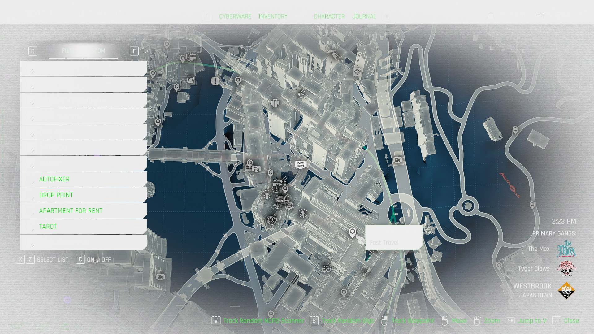
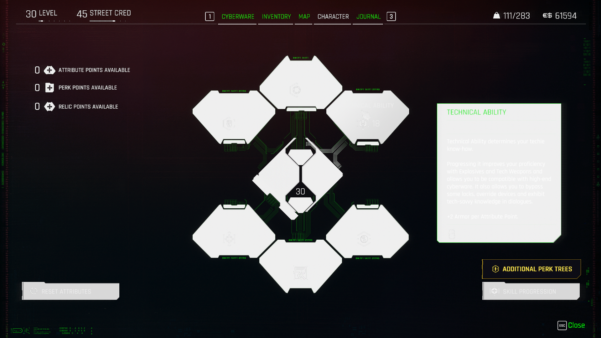
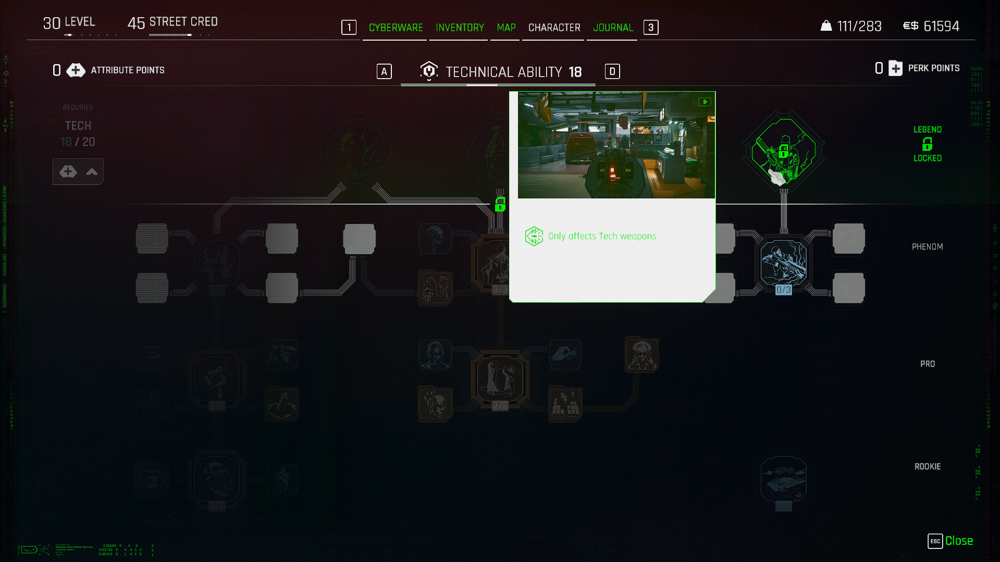
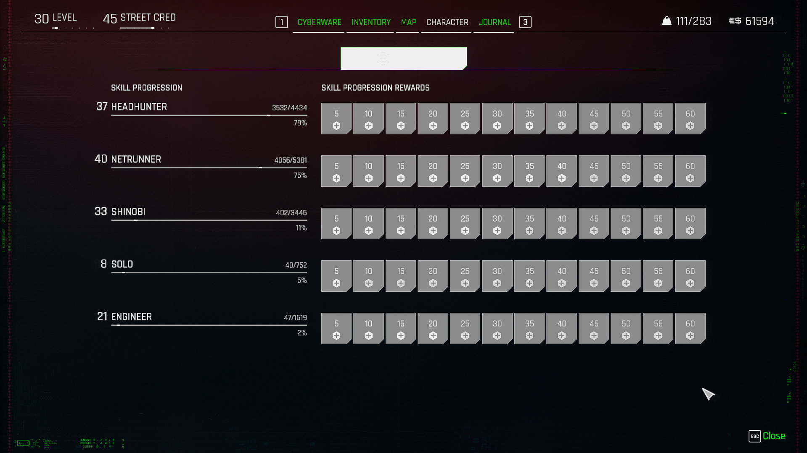
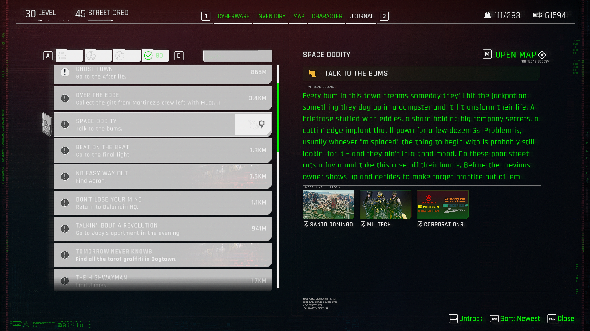
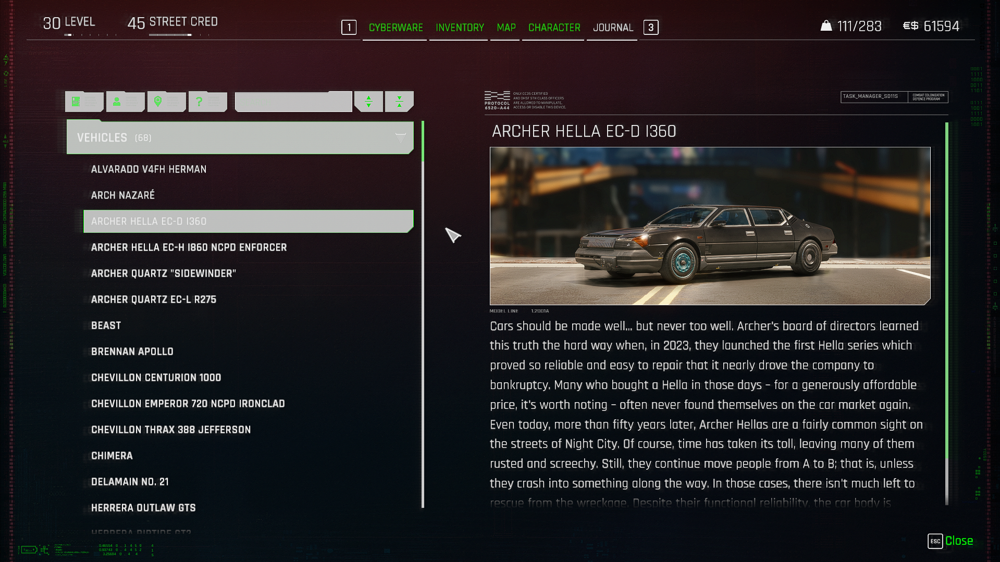
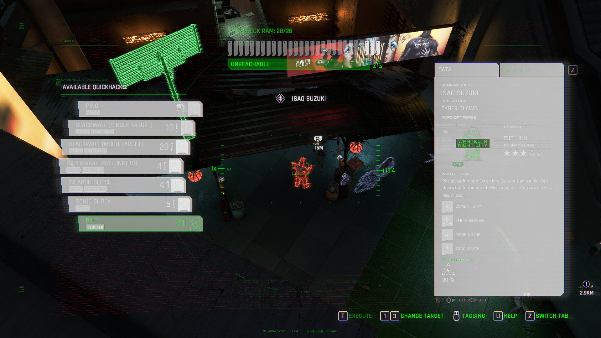

# Refitting for flat chest

**Created by ratstick. Last update 10/21/2024**

None of this would have been possible without [wanderingaldecaldo](https://next.nexusmods.com/profile/wanderingaldecaldo/about-me?gameId=3333) litcherally coming over to my house to hang and then showing me how to refit. I love you bestie.

If you have questions or need some help refitting for flat chest, you can [DM me on Nexus](https://next.nexusmods.com/profile/ratstick) or find me in the official modding Discord server and KS server under ratstick.

### What you need 

* [Latest version of WolvenKit Nightly ](https://github.com/WolvenKit/WolvenKit-nightly-releases/releases)(yes, the nightly version, it has the latest fixes and QOL features)
* [Latest version of the WolvenKit blender plugin](https://wiki.redmodding.org/cyberpunk-2077-modding/for-mod-creators-theory/modding-tools/wolvenkit-blender-io-suite/installing-the-wolvenkit-blender-plugin#step-1-install-the-plugin)
* [Blender 4.0](https://download.blender.org/release/Blender4.0/) (or 3.6 but things may look different for you than in these screenshots)
* The flat chest body or this KS Body Refitting workspace .blend file you can find on the KS Discord server. [Here is a direct link to the post.](https://discord.com/channels/939996226173173760/1250076294499274842)
* A sense of humor, dedication to accessibility in modding, and patience. Maybe some Dramamine, zooming around Blender can make me a little motion sick sometimes.

#### Modder's Resource - Flat chest refit project

I created a[ project you can download on Nexus ](https://www.nexusmods.com/cyberpunk2077/mods/17342?tab=files)with a few vanilla files including the one you see in the screenshots. The main file is not refitted and so has the vanilla meshes and the exported glb files. In the optional files, you can find a source folder with the same meshes and glb files refitted for reference.

Feel free to upload pics of your own refits in game or in Blender!

I’m working on refitting all vanilla t1 and t2 for the flat chest body, so that's what you’re gonna see in the screenshots.


&#x20;You can make your clothing item dynamic for the flat chest body! Just use the tag `flat`


### Step 1: Export your meshes 

Two guides already explain how to add the meshes to your project and import/export using the Blender plugin.&#x20;


[r-and-r-refitting-step-by-step.md](r-and-r-refitting-step-by-step.md)



[wkit-blender-plugin-import-export.md](../../../for-mod-creators-theory/modding-tools/wolvenkit-blender-io-suite/wkit-blender-plugin-import-export.md)


### Step 2: Import to blender 

#### Make the meshes colorful

This will help you see mesh clipping a lot better.

At the top click, the little down arrow next to the balls (ha):

.png>)

Ignore my badly drawn arrow and click on "Object" then "Random",

<figure><figcaption></figcaption></figure>

Now, when you import meshes, they'll all be a different color.

#### Follow the above linked guide again to import the meshes.

I use a custom .blend file with multiple bodies in it. Your workspace should have the body and the clothing item in the viewport.

.png>)

This specific mesh has three submeshes. However, one of them is on the back so we won't need to refit that one, only the two that cover the chest.

.png>)

### Step 3: Remove shape keys 

You will get an error if you try to apply the script to a mesh that has shape keys. We need to remove these so we can apply the changes. We'll add them back later when we add garment support back.

Select one of the submeshes and hit the little green button here. I am sure it has an actual name if you hover over it.

.png>)

Remove GarmentSupport by clicking on it and then clicking the minus button. Then click on Basis and click the minus button again.


You **must** do it in this order. GarmentSupport, then Basis.


The shape keys section should now be completely blank.

.png>)

I’m gonna do this for the other submesh brb.

### Step 4: Apply the script 

k im back

Theoretically, you should see this menu if you have the I/O tool properly installed:

.png>)

The CP77 Modding tab has everything we need. You’re going to expand the Mesh Tools section if it isn’t already.

Go to the AKL refitter section and select flat chest from the drop-down.

.png>)

You don’t have to do this step one by one, you can select all the meshes that need to be refitted. This has pros and cons.&#x20;

**Pros:** Sometimes waiting for the script to run can take a bit. You can see the mesh change all at once.&#x20;

**Cons:** Might not be able to see how some finer details don’t need to be refit or could be refit manually for better results.


**Rule of thumb:** If it goes across the chest, it needs to be refit. You can also learn a bit about how things are sculpted by comparing the meshes before and after. Seeing what gets smushed down, what doesn't, and how it gets smushed down is a good opportunity to observe and analyze the refits and find any manual edits you may want to make instead.


As I mentioned, this mesh specifically has two meshes that cover the breasts and one that doesn’t.

.png>)

I selected the other two meshes and clicked "refit the selected mesh." This is the output.

.png>)

Well, looks like there’s some stuff we gotta manually adjust! This happens most often with bras and the like. Not to worry! These small adjustments are relatively easy.

### Step 5: Apply the script 

Before we can adjust, we have to apply the modifier. Since we removed the shape keys, we shouldn't see any error when we do this.

.png>)

Click the down arrow next to the script modifier and click apply (or CTRL A on your keyboard).

If you don’t do this first, then the mesh will revert to its original shape when you go into edit mode.

### Step 6: Edit the mesh 

Let’s go into edit mode. Click the little drop-down on the top left and click “Edit mode”.

<figure><figcaption></figcaption></figure>

Ignore my badly drawn arrow again. This is what you should see. All of the vertices selected. Don’t worry about it. Also, select the little compass arrow button on the left. We only need to move the mesh left, right, in, or out right now.

We’re going to click somewhere else in the viewport to deselect the vertices. What we’re going to do, instead, is only select a handful of vertices in the area we need to refit. Also, we’re going to use proportional mode.

This button. Start small, like 0.01 or something. Check out [step four of the R\&R: Refitting guide](https://wiki.redmodding.org/cyberpunk-2077-modding/modding-guides/items-equipment/recolours-and-refits/r-and-r-refitting-step-by-step#step-4-refitting) for more info.


**COOL TRICK to impress your friends and family:** When you click on one of the lil arrows (we’ll get to that in a sec), scroll your mouse wheel to change the proportional size on the fly. This is useful to see how big or small that needs to be to save you some headache. Instead of refitting every vertice little by little, you can adjust the proportional size depending on the area and shape you’re refitting. You can also hold down shift and click the scroll wheel to move the camera view in the viewport.


Unfortunately, this part of the refit process is kinda partly vibes-based.

I’m going to start in this part. You can select a couple vertices by holding down CTRL and clicking the vertex next to it. You can also click and drag to create a box, but sometimes that selects the vertices behind the body, so use with caution!

Generally, if the mesh is clipping into the front or back of the body, you’ll use the green arrow to move it in or out. If it’s clipping into the sides, use the red arrow. If it’s clipping into the shoulders, use the blue arrow. Sometimes you might need to get a lil weird with it and do a couple back and forth, but that’s what proportional mode is for.

Sometimes you get lucky and can pull bigger sections out. But WATCH OUT! It can make lumpy any places you moved with a smaller proportional size. Like I said, sometimes this part is vibes-based.

Nice!

I forgot to refit those tiny little things in the center, I fixed it off-screen.

Alright! Good enough. Eventually, I want to sculpt these a bit better. But for now, this should be good enough.

### Step 7: Garment Support 

Switch back to object mode and go to that funky lil green icon again. Click the plus button to add the Basis back.

Next, we’re gonna go back to the top of this menu, where we applied the script (the wrench icon).

Add modifier:

Deform > Shrinkwrap

<figure><figcaption></figcaption></figure>

Click on target and select the name of the body in your project.

<figure><figcaption></figcaption></figure>

The mesh is gonna look hella funky.

<figure><figcaption></figcaption></figure>

Don’t worry!

<figure><figcaption></figcaption></figure>

Change the offset until the clipping is mostly gone. Start small, like 0.01. It’s useful to make a note of the number you used so you can replicate it on any of the other submeshes you need to add GS to. Because I didn’t need to refit that little mesh on the back, I won’t need to re-add garment support for that.

<figure><figcaption></figcaption></figure>

That’s better! I ended up going with an offset of 0.062 When I do this for the other mesh, I’ll be able to enter that number and then adjust further since that mesh lies on top of the other one.

Now, similar to the script, we’re going to apply this but select “Apply as shape key.”

<figure><figcaption></figcaption></figure>

There! Back to normal. Now to the second submesh.

To make sure it matches up, we can change the first mesh’s shrinkwrap shape key to 1, that will make it visible.

<figure><figcaption></figcaption></figure>

<figure><figcaption></figcaption></figure>

As I mentioned, this is that second mesh at 0.062 offset. I can now increase it gradually again so it lies on top of the other mesh.

<figure><figcaption></figcaption></figure>

There we go. I ended up going with 0.15 for this one.

Once again, we’re going to apply it as a shape key.

Now, back to the first mesh to set up everything so that the game reads that shape key as garment support. It is…literally as easy as renaming stuff.

<figure><figcaption></figcaption></figure>

**Rename “Shrinkwrap” to “GarmentSupport”**

**Rename the color attributes to:**

**\_GarmentSupportWeight**

**\_GarmentSupportCap**

Yeah, it’s just changing the case. Also, make sure to do this for any submesh you didn’t refit, too.

To double-check your garment support, switch into vertex paint mode.

<figure><figcaption></figcaption></figure>

Those garment support entries at the bottom should be FaceCorners, it should show as red and black when you switch that little dropdown at the top.

Now that we’ve confirmed garment support is good, we can export back into WKit!


**Select ALL submeshes for the clothing item.** Make sure the name of the .glb is the same as what you imported. We want it to **overwrite** the existing .glb so that when we re-import, our mesh changes are applied.


And then…that’s it! Pack and go.

I mean, unless there’s more stuff you gotta do. This is mostly just if you’re making a mesh replacer. You may need to tweak weights if there's clipping, but the mesh in blender looks good, and I am still learning all that so.

### Congrats! You made a mesh replacer with garment support! 
